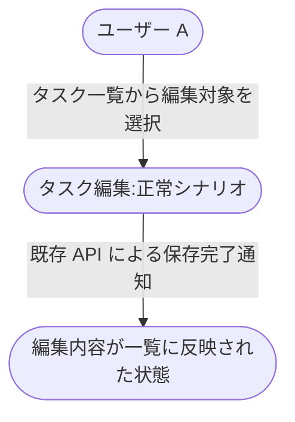
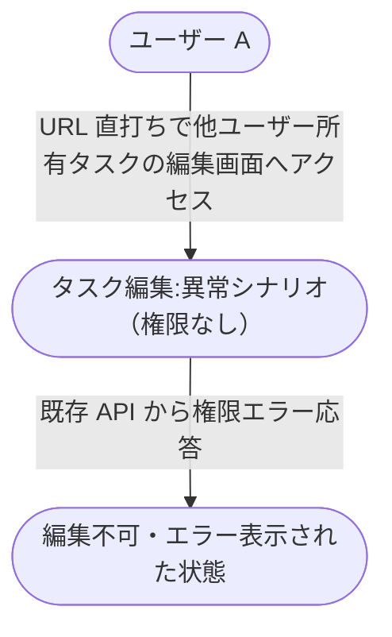

# タスク編集機能

既存タスクを一覧から選択して編集し、既存 API で保存する業務フロー（複合ユースケース）。
epic #94 のユースケース一覧に沿って「タスク編集」UC を軸に、正常シナリオと権限起因の異常シナリオを 1 本ずつ束ねる。

- 対応 epic: [#94 タスク編集機能](https://github.com/shuhei1101/ai-monitor-e2e/issues/94)
- 対応テストファイル: `tests/e2e/複合ユースケース/タスク編集機能.spec.ts`

## 正常シナリオ

### セットアップ

| セットアップ | 説明 | 補足 |
| --- | --- | --- |
| Mock | なし（実環境で実行） | - |
| `createUser` | ログイン中ユーザー A | - |
| `createTask` | userA が所有する既存タスク | `title: 初期タイトル` |

### フロー

### 期待値

- タスク一覧に編集後のタイトル・内容が表示されている
- DB の該当タスクレコードが編集後の値になっている（保存経路は横断要件どおり既存 API を利用）

## 異常シナリオ（他ユーザー所有タスクの編集を試行）

### セットアップ

| セットアップ | 説明 | 補足 |
| --- | --- | --- |
| Mock | なし（実環境で実行） | - |
| `createUser` | ログイン中ユーザー A | - |
| `createUser` | 他ユーザー B | - |
| `createTask` | userB が所有するタスク | - |

### フロー

### 期待値

- 権限エラーメッセージが表示され、編集内容は保存されない
- DB の該当タスクレコード（userB 所有）は変更されていない
