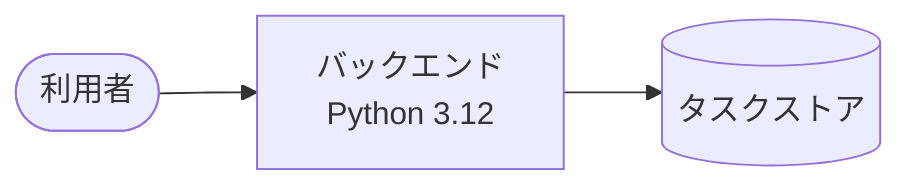

# タスク管理ツール

タスクを登録して編集・一覧できる個人向けのタスク管理ツール。

## 概要

紙とメモアプリに散らばったタスクを 1 か所にまとめ、未着手のものを見失わないようにする。
タスクの登録・編集・一覧を通して、いま何が残っているかをその場で確認できる状態を目指す。
想定利用者は個人での利用を前提とする（複数人での同時利用は未確定）。

## 機能

未確定

## システム構成



| サブシステム | 役割 | 補足 |
| --- | --- | --- |
| バックエンド | タスクの登録・編集・一覧の業務ロジックと永続化 | - |

詳細は [設計図/アーキテクチャ図](./docs/wiki/設計図/アーキテクチャ図.md) を参照。

## ディレクトリ構成

```
ai-monitor-e2e/
├── src/               # バックエンド（Python 3.12）
├── tests/             # テストコード
├── docs/wiki/         # 設計ドキュメント
└── README.md
```

## セットアップ

**前提:**

- Python 3.12 以上（標準ライブラリのみで動くため外部パッケージのインストールは不要）

**手順:**

```bash
git clone https://github.com/shuhei1101/ai-monitor-e2e.git
cd ai-monitor-e2e
```

## 開発

**起動:**

未確定

**テスト:**

実行コマンドは [テスト/テスト実行方法](./docs/wiki/テスト/テスト実行方法.md) を参照。

## ドキュメント

| リソース | 内容 |
| --- | --- |
| [設計ドキュメント](./docs/wiki/) | シナリオ / 設計図 / 規約の全体 |
| [設計図/アーキテクチャ図](./docs/wiki/設計図/アーキテクチャ図.md) | システム全体の構成と外部システム連携 |
| [外部API](./docs/wiki/外部API/) | 連携している外部 API の一覧 |
| [外部ライブラリ](./docs/wiki/外部ライブラリ/) | 採用ライブラリと選定理由の一覧 |
