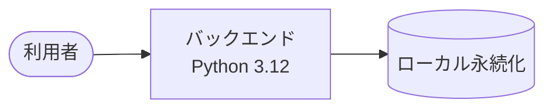

# タスク管理ツール

散らばったタスクを 1 箇所に集めて、未着手のものを見失わないようにする個人向けのタスク管理ツール。

## 概要

紙とメモアプリに分散しているタスクを 1 つの置き場所にまとめ、登録・編集・一覧を同じ場所で完結できるようにする。
どのタスクが未着手のまま残っているかを、探し回らずに確認できる状態を目指す。

想定利用者は個人 1 名。

## 機能

未確定。

## システム構成



| サブシステム | 役割 | 補足 |
| --- | --- | --- |
| バックエンド | タスクの登録・編集・一覧と永続化 | - |

詳細は [設計図/アーキテクチャ図](./docs/wiki/設計図/アーキテクチャ図.md) を参照。

## ディレクトリ構成

```
ai-monitor-e2e/
├── backend/           # バックエンド（Python 3.12）
├── docs/wiki/         # 設計ドキュメント
└── README.md
```

## セットアップ

未確定。

## 開発

未確定。

## ドキュメント

| リソース | 内容 |
| --- | --- |
| [設計ドキュメント](./docs/wiki/) | シナリオ / 設計図 / 規約の全体 |
| [設計図/アーキテクチャ図](./docs/wiki/設計図/アーキテクチャ図.md) | システム全体の構成と外部システム連携 |
| [設計図/非機能要件](./docs/wiki/設計図/非機能要件.md) | 外部制約から決めたアプリの決定値 |
| [テスト](./docs/wiki/テスト/) | テスト種別ごとの実行方法 |
| [外部API](./docs/wiki/外部API/) | 連携している外部 API の一覧 |
| [外部ライブラリ](./docs/wiki/外部ライブラリ/) | 採用ライブラリと選定理由の一覧 |
