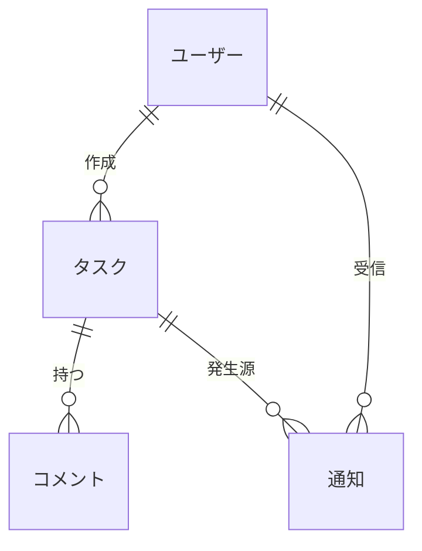
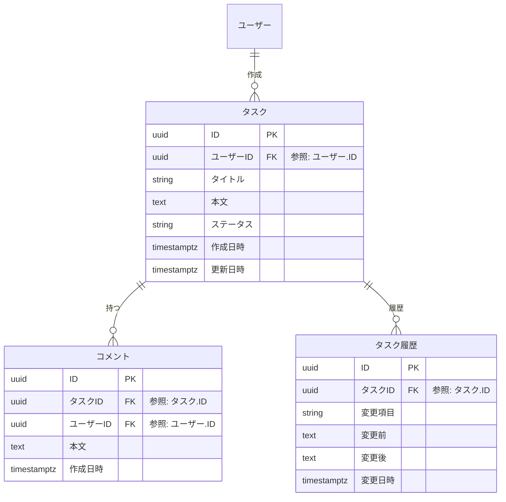

# ai-monitor テンプレート: ER 図

プロジェクトの **データストア構造**（DB スキーマ / JSON / YAML 等）を業務ドメイン分類でグループ化してまとめる書式。
分類ごとに 1 ファイルでフラットに並べる。

**DB に限定しない**: PostgreSQL / MySQL 等のリレーショナル DB のほか、**ローカル JSON / YAML ファイル** で持つデータ構造も同じ書式で扱う。
「データ構造の SoT」として使う。

## ファイル構成

| 種類 | ファイル | 役割 | 補足 |
| --- | --- | --- | --- |
| インデックス | `設計図/ER図/README.md` | 全データストア概要 + 全テーブル一覧 + 各分類ファイルへのリンク | 1 プロジェクト 1 ファイル |
| 分類別 | `設計図/ER図/{分類名}.md` | 当該分類の ER 図 + テーブル詳細 | 分類ごとに 1 ファイル、フラット並列 |

分類は **業務ドメイン軸**（例: `ユーザー` / `認証` / `タスク` / `通知`）。
実装パターン軸（マスター / トランザクション / 履歴 等）の分類は禁止。

中心となるテーブルと、その関連テーブル（履歴 / 中間テーブル / Enum マスター 等）は **同じ分類** に入れる。

**他分類のテーブルを参照する場合**:
- 当該分類のファイル内では **テーブル名のみ書く**
- 詳細は参照先分類のファイルへのリンクで案内

## セクション一覧

| 対象ファイル | セクション | サブセクション | 必須or条件 | 担当 | 補足 |
| --- | --- | --- | --- | --- | --- |
| インデックス | `## 概要` | - | 必須 | architect | DBMS / データストア種別 / 共通カラム 等 |
| インデックス | `## 全体図` | - | テーブル総数 20 以下なら任意必須 | architect | 全テーブルを 1 枚の `erDiagram` で |
| インデックス | `## テーブル一覧` | - | 必須 | architect | 分類列付きの全テーブル早見表 |
| インデックス | `## 分類一覧` | - | 必須 | architect | 各分類別ファイルへの入口リンク |
| 分類別 | `## 一覧` | - | 必須 | architect | 当該分類のみの早見表 |
| 分類別 | `## ER 図` | - | 当該分類のテーブルが 2 つ以上 | architect | Mermaid `erDiagram` 1 枚 |
| 分類別 | `## {テーブル名}` | `### カラム` / `### インデックス` / `### 補足` | テーブルごとに 1 つ | architect | 論理名 + 物理名併記 |

## `冒頭リード`（インデックスファイル）

### 記述例

```markdown
# ER 図

プロジェクトのデータストア構造の索引ページ。
詳細は各分類別ファイルへ。

論理名（業務語彙）はドキュメント・口頭で、物理名（snake_case / ファイル名）は実装で使う。
両者の対応は本ページと各分類別ファイルでのみ正規化して管理する。
```

### 補足

- 「詳細は分類別ファイル」と必ず案内
- DB / JSON / YAML 等の **データストア種別** を概要セクションで明示

## `冒頭リード`（分類別ファイル）

### 記述例

```markdown
# ER 図: {分類名}

`{分類名}` ドメインに属するデータストア構造詳細。
```

### 補足

- 当該分類のスコープを 1 行で（必要なら）

## `## 概要`（インデックスファイル）

### 記述例

```markdown
## 概要

主データストア:
- **PostgreSQL 16**: ユーザー / 認証 / タスク ドメイン
- **JSON ファイル**（`data/notification_templates.json`）: 通知テンプレート

論理名は日本語、物理名は `snake_case` で統一。
全テーブルに `id` (UUID v7) / `created_at` / `updated_at` の共通カラムを持つ。
```

### 補足

- データストア種別とバージョン（PostgreSQL 16 / MySQL 8 / JSON / YAML 等）
- 物理名の命名規則（snake_case / lowerCamelCase など）
- 全テーブル共通カラム（id / created_at / updated_at / deleted_at など）

## `## 全体図`（インデックスファイル）

全分類をまたぐ大まかなリレーションを 1 枚で示す。

### 記述例

````markdown
## 全体図


````

### 補足

- **テーブル総数が 20 を超えたら省略可**（分類別ファイルの `## ER 図` で個別に図示）
- 全体図はテーブル名 + リレーションのみ
- 細かい属性は分類別ファイルの `## ER 図` で表現する

## `## テーブル一覧`（インデックスファイル）

### 記述例

```markdown
## テーブル一覧

| 分類 | データストア | 論理名 | 物理名 | 概要 | 主キー | レコード規模 | 補足 |
| --- | --- | --- | --- | --- | --- | --- | --- |
| ユーザー | PostgreSQL | ユーザー | `users` | 認証単位のアカウント | `id` | ～10 万 | - |
| 認証 | PostgreSQL | セッション | `sessions` | ログインセッション | `id` | ～100 万 | - |
| タスク | PostgreSQL | タスク | `tasks` | ユーザーが管理するタスク | `id` | ～500 万 | - |
| タスク | PostgreSQL | コメント | `comments` | タスクへのコメント | `id` | ～1000 万 | - |
| 通知 | PostgreSQL | 通知 | `notifications` | ユーザー向け通知 | `id` | ～1000 万 | - |
| 通知 | JSON | 通知テンプレート | `notification_templates.json` | 通知メッセージのひな型 | `id` | ～100 | ファイル |
```

### 補足

**分類列:**
- 業務ドメイン軸でグルーピング

**データストア列:**
- `PostgreSQL` / `MySQL` / `SQLite` / `JSON` / `YAML` 等
- ファイル系は物理名にパスを書く

**論理名列 / 物理名列:**
- 論理名: 日本語、業務語彙
- 物理名: snake_case（DB の場合）/ ファイル名（JSON / YAML の場合）

**主キー列:**
- カラム名。
  複合キーなら `(col_a, col_b)`

**レコード規模列:**
- 想定行数のオーダー（`～10 万` / `～100 万`）
- インデックス戦略・パーティショニング判断の材料

**補足:**
- 順序は分類でまとめ、分類内は依存の上流から下流の順
- 廃止テーブルは削除し、履歴は git log に任せる

## `## 分類一覧`（インデックスファイル）

### 記述例

```markdown
## 分類一覧

| 分類名 | ファイル | 概要 | 補足 |
| --- | --- | --- | --- |
| ユーザー | [ユーザー](./ユーザー.md) | アカウント情報 | - |
| 認証 | [認証](./認証.md) | セッション / OAuth 関連 | - |
| タスク | [タスク](./タスク.md) | タスク本体 + コメント + 履歴 | - |
| 通知 | [通知](./通知.md) | 通知本体 + JSON テンプレート | - |
```

### 補足

**ファイル列:**
- `[表示名](./{分類名}.md)` 形式の内部リンク

**概要列:**
- 当該分類が何を担うかを 1 行で

**補足:**
- 順序は `## テーブル一覧` の分類順と揃える
- 新規分類追加時は本ページに 1 行追加 + 該当分類別ファイルを新規作成

## `## 一覧`（分類別ファイル）

当該分類のテーブルを統合した早見表。

### 記述例

```markdown
## 一覧

| データストア | 論理名 | 物理名 | 概要 | 主キー | レコード規模 | 補足 |
| --- | --- | --- | --- | --- | --- | --- |
| PostgreSQL | 通知 | `notifications` | ユーザー向け通知 | `id` | ～1000 万 | - |
| JSON | 通知テンプレート | `notification_templates.json` | 通知メッセージのひな型 | `id` | ～100 | ファイル |
```

### 補足

- カラム: `データストア / 論理名 / 物理名 / 概要 / 主キー / レコード規模 / 補足`（7 列）
- インデックスの `## テーブル一覧` から **当該分類の行だけ抜き出した形**（`分類` 列は不要）

## `## ER 図`（分類別ファイル）

当該分類のテーブル間リレーションを 1 枚で示す。

### 記述例

````markdown
## ER 図


````

### 補足

- **当該分類のテーブルだけ** 詳細を書く
- **他分類のテーブルを参照する場合は名前のみ**
  - 例: `ユーザー ||--o{ タスク` のリレーションで `ユーザー` 側は名前のみ
- リレーション記号: `||--o{` = 1:N / `||--||` = 1:1 / `}o--o{` = N:M
- **論理名（日本語）で記述する** — テーブル名・カラム名ともに
- **外部キーカラムは `{参照先テーブル名}ID` 形式** で書く（Mermaid `erDiagram` はカラム名にピリオド `.` を使えないため連結）
  - 例: `ユーザーID` / `タスクID`
  - 参照先の明示は **カラム末尾のダブルクォート内コメント** に書く: `uuid ユーザーID FK "参照: ユーザー.ID"`

## `## {テーブル名}`（分類別ファイル）

実テーブル 1 つにつき 1 つの H2。
論理名 + 物理名を見出しに併記する。

### 記述例

````markdown
## タスク (`tasks`)

ユーザーが管理するタスク本体。

### カラム

| 論理名 | 物理名 | 型 | NOT NULL | 既定 | 説明 | 例 | 補足 |
| --- | --- | --- | --- | --- | --- | --- | --- |
| ID | `id` | `uuid` | ◯ | `gen_random_uuid()` | 主キー (UUID v7) | `018f8a...` | PK |
| ユーザー ID | `user_id` | `uuid` | ◯ | - | 所有ユーザー | `018f8b...` | FK → `ユーザー.ID` |
| タイトル | `title` | `varchar(200)` | ◯ | - | タスクのタイトル | `週次レポート作成` | 1〜200 文字 |
| 本文 | `body` | `text` | - | - | 詳細説明 | `〇〇を完了させる` | - |
| ステータス | `status` | `text` | ◯ | `'open'` | タスク状態 | `"open"` | `open` / `in_progress` / `done` / `archived` |
| 作成日時 | `created_at` | `timestamptz` | ◯ | `now()` | レコード作成日時 (UTC) | `2026-06-30T05:00:00Z` | - |
| 更新日時 | `updated_at` | `timestamptz` | ◯ | `now()` | レコード更新日時 (UTC) | `2026-06-30T05:00:00Z` | trigger で自動更新 |

### インデックス

| 名前 | カラム | 種別 | 補足 |
| --- | --- | --- | --- |
| `tasks_user_id_ix` | `user_id` | BTREE | ユーザー別タスク一覧用 |
| `tasks_status_ix` | `status` | BTREE | ステータス別フィルタ用 |

### 補足

- 物理削除は禁止。`status='archived'` で論理削除し、90 日後に別バッチで物理削除
- 楽観的ロックは `updated_at` 比較で検知（別カラムでバージョン番号は持たない）
````

### 補足

**カラム表のカラム:**
`論理名 / 物理名 / 型 / NOT NULL / 既定 / 説明 / 例 / 補足`（8 列）

**型列:**
- DB の場合: DBMS のネイティブ型（`uuid` / `varchar(N)` / `timestamptz` / `jsonb` 等）
- JSON / YAML の場合: 言語非依存型（`string` / `number` / `boolean` / `object` / `array`）

**NOT NULL 列:**
- 必須なら `◯`、NULL 許容なら `-`

**既定列:**
- `gen_random_uuid()` / `now()` / リテラル値。
  なしは `-`

**説明列:**
- そのカラムの業務的な意味を 1 行で

**例列:**
- 代表的な値の例（実データに近いもの）

**補足列:**
- 制約（PK / FK / UK / CHECK）、enum 値の選択肢、計算ロジック、関連 trigger など
- FK は `FK → {分類}/{テーブル名}.ID` 形式（他分類なら分類名も併記）

**Enum 値の書き方:**
- 型列は `text` のままで、補足列に `'a' / 'b' / 'c'` 形式で列挙し各値の意味も併記

**インデックス表のカラム:**
`名前 / カラム / 種別 / 補足`（4 列）
- PK / UK はカラム表の補足列で表現する
- 検索クエリで使う追加インデックスのみ列挙
- 名前は実 DB と一致させる（`{table}_{column}_{kind}` 形式）

**サブセクションの省略:**
- インデックスがカラム表の制約だけで十分なら `### インデックス` は省略可
- 業務的な特殊運用がないテーブルは `### 補足` も省略可

**JSON / YAML ファイルの場合:**
- 物理名はファイルパス（例: `data/notification_templates.json`）
- カラム表の各行 = JSON 配列要素 1 件の各プロパティ
- `### インデックス` は不要（ファイル全件走査 or キーで lookup する想定）
- 補足セクションでアクセス方式（全件 / キー lookup）を明記

**運用ルール:**
- 論理名 / 物理名はこのページが唯一の SoT。
  他 Wiki / コードコメントから「定義はここ」と参照する
- 物理名のリネームは破壊的変更扱い → マイグレーション計画とセットで本ページも同時更新
- 全 DB テーブルに `id` / `created_at` / `updated_at` の 3 共通カラムを **極力含める**
  - 状況によっては サロゲートキー（`id`）ではなく **自然キー** で運用しても可
    - 例: 業務コードが安定して外部システムと参照される場合（ISO 3166 国コード / JIS 都道府県コード / 決済プロバイダの transaction_id 等）
  - 中間テーブル（多対多）は **サロゲートキー `id` + UNIQUE 制約** を推奨（複合キーは避ける）
  - サロゲートキー一律強制で運用しづらいケースは臨機応変に判断する
