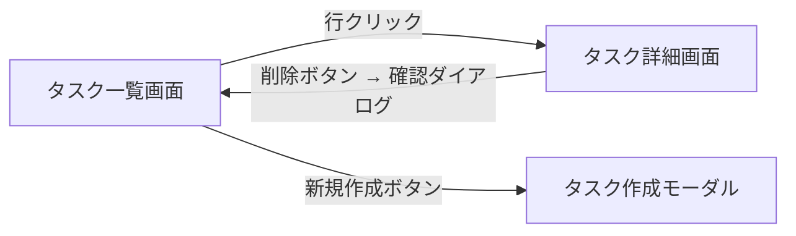

# ai-monitor テンプレート: PR 本文 / エピック

`layer:epic` が付いた PR の本文書式。

epic PR は **複合ユースケースシナリオと画面の方向性（UI 全体設計）を確定するための PR**。
親 epic Issue の `## ユースケース一覧` + `## 横断要件` を元に、`docs/wiki/設計図/シナリオ/複合ユースケース/*.md` を作成 / 更新し、画面の新規作成 / レイアウト変更を含む場合は `## UI 設計` で画面の方向性を確定する。

## セクション一覧

| セクション | サブセクション | 必須or条件 | 補足 |
| --- | --- | --- | --- |
| `## 紐づく Issue` | - | 必須 | 親 epic Issue 番号 |
| `## タスク一覧` | - | 必須 | Wiki 修正・複合ユースケースシナリオテスト実行の To Do |
| `## UI 設計` | `### 画面一覧` / `### 画面遷移` / `### モック` | 画面の新規作成 / レイアウト変更を含む epic | mock-designer が記入 |
| `## 複合ユースケースシナリオテスト結果` | - | 必須 | 作成 / 変更した複合 UC E2E テストの結果 |

## `## 紐づく Issue`

### 記述例

```markdown
## 紐づく Issue

- #90 プロフィール自己管理エピック
```

### 補足

- 親 epic Issue 番号を必須で書く
- 依存する他 epic があれば追加行で書く

## `## タスク一覧`

### 記述例

```markdown
## タスク一覧

- [ ] `設計図/シナリオ/複合ユースケース/新規登録から初回タスク作成.md` を新規作成
- [ ] `設計図/シナリオ/複合ユースケース/タスク作成から他ユーザー編集.md` を新規作成
- [ ] `設計図/シナリオ/README.md` の `## 一覧` に該当行を追加
- [ ] 複合ユースケース E2E テストを実行
```

### 補足

- チェックボックス形式で **やることリスト**を列挙
- 各タスクは 1 行 = 1 To Do
- Wiki 修正・テスト実行の 2 種類に分けて書く
- 完了項目に `[x]` を入れて、全てチェックしてからマージ

## `## UI 設計`

### 記述例

````markdown
## UI 設計

### 画面一覧

| 画面 | 新規/変更 | 対応 UC | 概要 | 補足 |
| --- | --- | --- | --- | --- |
| タスク詳細画面 | 新規 | タスク編集 / タスク削除 | タスクの閲覧・編集・削除を 1 画面に集約 | - |
| タスク一覧画面 | 変更 | タスク作成 | 新規作成ボタンをヘッダーに追加 | - |

### 画面遷移



### モック

| 画面 | 案 | URL | 補足 |
| --- | --- | --- | --- |
| タスク詳細画面 | a-two-column | https://raw.githack.com/{owner}/{repo}/epic/task-detail/docs/mock/pages/task-detail/issues/90/a-two-column/index.html | 採用 |
| タスク詳細画面 | b-tab-layout | https://raw.githack.com/{owner}/{repo}/epic/task-detail/docs/mock/pages/task-detail/issues/90/b-tab-layout/index.html | - |
````

### 補足

- **画面一覧**: 対応 UC 列は親 epic の `## ユースケース一覧` の UC 名と一致させる（1 画面 : N UC）
- **画面遷移**: 画面をまたぐ全体像を 1 枚で（各 UC 内の詳細遷移は subsystem 側の `## UI 設計` に委譲）
- **モック**: 配置は `docs/mock/pages/{画面名}/issues/{epic番号}/{案名}/`（書式は `規約/モック画面構成.md`）。
  採用案の補足列に `採用` と記す

## `## 複合ユースケースシナリオテスト結果`

### 記述例

```markdown
## 複合ユースケースシナリオテスト結果

| ファイル | メソッド | 結果 | 補足 |
| --- | --- | --- | --- |
| `tests/e2e/onboarding/signup-to-first-task.spec.ts` | 全実行 | ✅ | 対応シナリオ: `新規登録から初回タスク作成` |
| `tests/e2e/tasks/create-then-edit-by-other.spec.ts` | 全実行 | ✅ | 対応シナリオ: `タスク作成から他ユーザー編集` |
```

### 補足

- 本 epic で作成 / 変更した複合 UC E2E テストを全て実行して結果を記録
- 結果列: `✅`（pass）/ `❌`（fail）
- 補足列に対応シナリオ名を明記（`docs/wiki/設計図/シナリオ/複合ユースケース/{論理名}.md` と 1:1 対応）
- 複合ユースケースシナリオが無い epic の場合も本セクションは残し、本文に「なし」と記載
