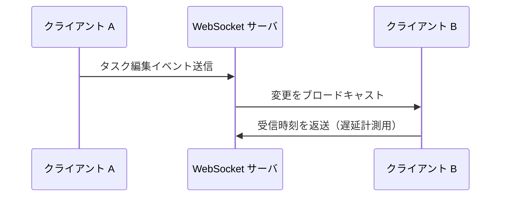

# ai-monitor テンプレート: PR 本文 / エピックPoC

epic の実現可能性 PoC 用 Draft PR（`poc/epic/{ドメイン}/{テーマ}`、base=master・マージせず close）の本文書式。
PR タイトルは `PoC: {検証テーマ}（epic #{番号}）`（例: `PoC: WebSocket リアルタイム同期の成立検証（epic #90）`）。

## セクション一覧

| セクション | サブセクション | 必須or条件 | 担当 |
| --- | --- | --- | --- |
| `## 紐づく Issue` | - | 必須（PR 作成時） | epic-conductor（PR 作成者） |
| `## リスク仮説` | - | 必須（PR 作成時に草案 → ユーザー承認で確定） | epic-conductor（PR 作成者） |
| `## 検証構成` | - | 必須（PR 作成時に草案 → ユーザー承認で確定） | epic-conductor（PR 作成者） |
| `## 成功条件` | - | 必須（PR 作成時に草案 → ユーザー承認で確定） | epic-conductor（PR 作成者） |
| `## 検証結果` | - | 必須（検証実行後に記入。PR 作成時は空のまま） | epic-conductor（PR 作成者） |
| `## 最小再現コード` | - | 必須（検証実行後に記入。PR 作成時は空のまま） | epic-conductor（PR 作成者） |

## `## 紐づく Issue`

### 記述例

```markdown
## 紐づく Issue

- #90 タスク同時編集エピック
```

### 補足

- 親 epic Issue 番号を書く

## `## リスク仮説`

### 記述例

```markdown
## リスク仮説

WebSocket による複数クライアント間のリアルタイム反映が成立しなければ、
タスクの同時編集がポーリング頼みになり、本 epic の「編集が即座に他ユーザーへ反映される」体験が成立しない。
```

### 補足

- 「{機構} が成立しなければ {epic への影響}」の形で 1〜3 文
- epic 本文の `## 概要` / `## 横断要件` から epic-poc-runner が抽出した仮説を書く

## `## 検証構成`

### 記述例

````markdown
## 検証構成



| ライブラリ / ツール | バージョン | 用途 | 補足 |
| --- | --- | --- | --- |
| ws | 8.18 | WebSocket サーバ | 代表選定（銘柄比較はしない） |
| Node.js | 22 | 実行環境 | - |
````

### 補足

- 構成図は Mermaid（sequenceDiagram or flowchart）で **最安直構成** を示す
- 検証で使った重要パラメータ（ポート・タイムアウト値・オプション）は補足列に書く

## `## 成功条件`

### 記述例

```markdown
## 成功条件

| 条件 | 基準 | 補足 |
| --- | --- | --- |
| 反映遅延 | 送信から他クライアント反映まで 500ms 以内 | 検証の主目的 |
| 再接続復元 | 切断 → 再接続後に編集内容が失われない | - |
```

### 補足

- **数値 or 観測可能な基準**で書く

## `## 検証結果`

### 記述例

```markdown
## 検証結果

| 検証項目 | 実測値 | 判定 | 補足 |
| --- | --- | --- | --- |
| 反映遅延 | 120ms | ✅ | 基準 500ms 以内 |
| 再接続復元 | 復元成功 | ✅ | - |

**所感:**
- 同一ルーム 10 クライアントまでは遅延の劣化なし
- モバイル回線ではハートビート間隔 30 秒だと切断検知が遅い。実装時は 10 秒への短縮を検討
```

### 補足

- 判定列: `✅` / `❌`（成功条件の行と 1:1 対応）
- 所感には **後続フェーズへの申し送り**（ハマりどころ・副作用・制約）を箇条書きで残す

## `## 最小再現コード`

### 記述例

````markdown
## 最小再現コード

```js
// ws_server.js — ブロードキャストの核心部（全体は PR diff 参照）
wss.on("connection", (ws) => {
  ws.on("message", (data) => {
    for (const client of wss.clients) {
      if (client !== ws && client.readyState === WebSocket.OPEN) client.send(data);
    }
  });
});
```

```bash
# サーバ起動 + 2 クライアントで遅延計測
node ws_server.js &
node measure_latency.js --clients 2
```

**diff の見どころ:** `ws_server.js`（中継側）と `measure_latency.js`（計測側）の 2 ファイルだけ。他は補助スクリプト。
````

### 補足

- **10〜30 行の核心部だけ**抜粋（全文は PR diff で見られるので重複させない）
- 末尾に **diff の見どころ**（どのファイルが本体か）を 1〜2 行で案内
