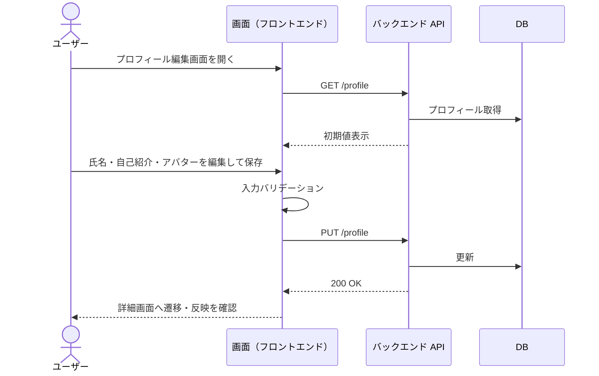
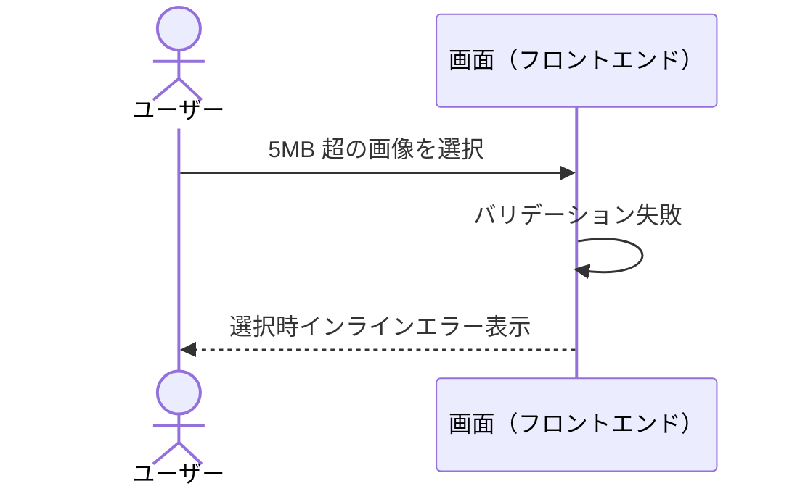
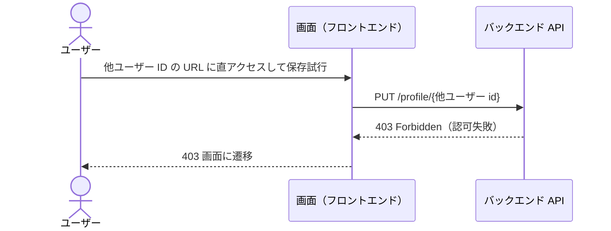
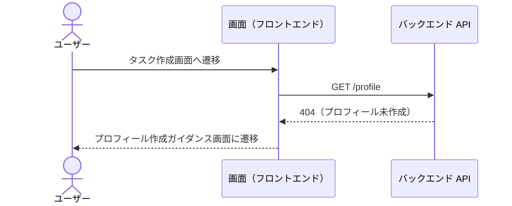
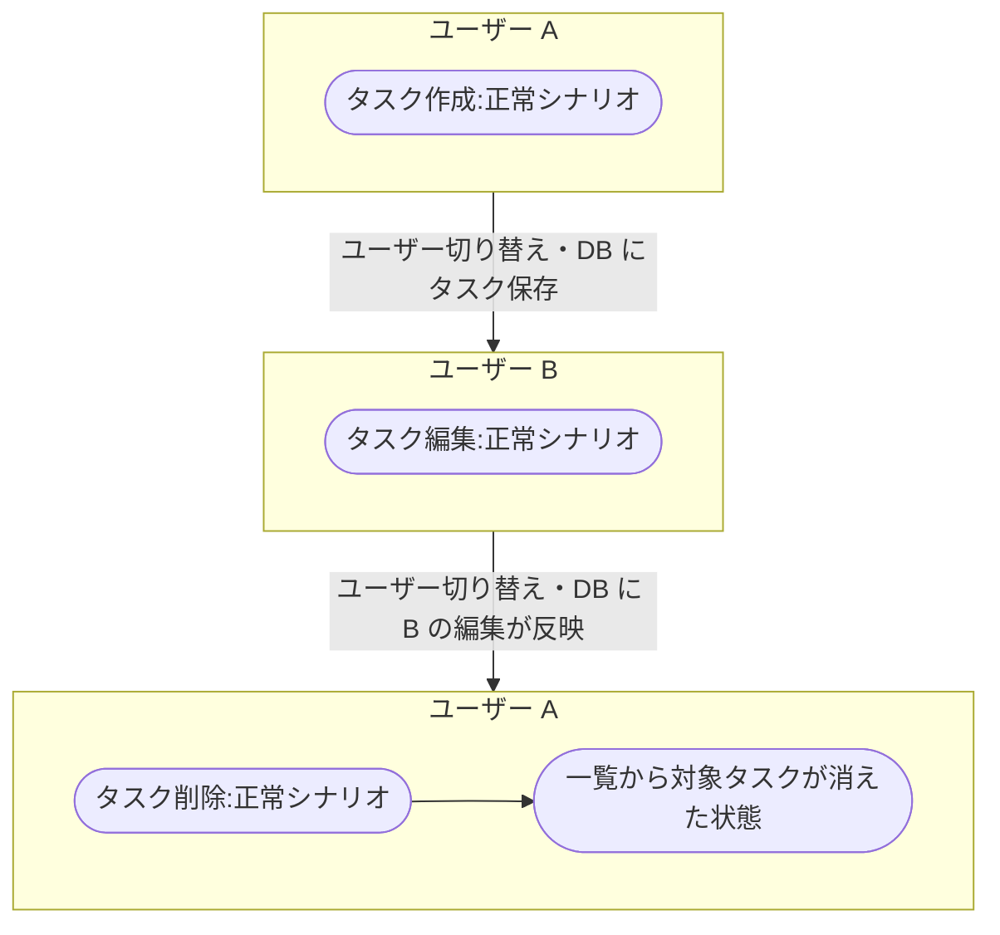
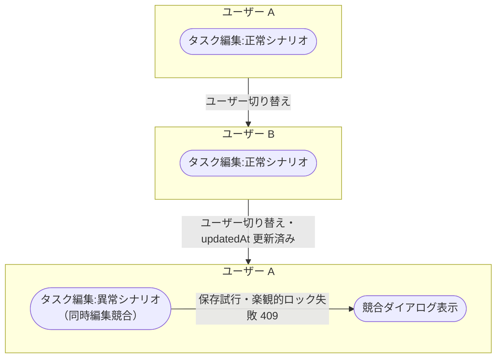

# ai-monitor テンプレート: シナリオ

シナリオは **単一ユースケース** と **複合ユースケース** の 2 種類に分ける。

| 種別 | 扱う範囲 | 1 ファイル = 何 | 担当（Layer / 対応 docs task） |
| --- | --- | --- | --- |
| 単一ユースケース | **ユーザーの 1 操作**（ファイル登録・編集・削除 等）の正常系 + 異常系。結合をサブシステム単位で繋いだもの | 1 操作 = 1 ファイル（正常系 + 異常系を集約） | `layer:story` 側の docs task が生成 |
| 複合ユースケース | 複数の単一 UC を連鎖させた業務フロー（画面 / ユーザーをまたぐ） | 1 シナリオ = 1 ファイル（正常系 + 異常系を集約） | `layer:epic` 直下の docs task が生成 |

粒度の階層: **複合 UC ⊃ 単一 UC（ユーザーの 1 操作、サブシステム貫通）⊃ 結合（サブシステムごとに区切ったもの。BE 結合 = 1 エンドポイント / FE 結合 = 1 画面操作）⊃ 単体（モジュールごと）**。
単一 UC より細かい「1 エンドポイントの中身」はシナリオではなく結合ドキュメントの領分。

- 対応は 1:1 ではなく 1:N / N:M（1 UC が同一サブシステムの結合を複数含むことがあり、共通エンドポイントは複数 UC から共有される）
- 「1 操作」= 1 クリックではなく「1 つのまとまったゴール（終わったらユーザーが満足して離れられる単位）」
- 命名テスト: 単一 UC は「{対象}を{動詞}する」の 1 動詞句で表せる粒度。
  1 動詞句で意味が消えるなら細かすぎ、複数動詞に分解できるなら粗すぎ（= 複合 UC 行き）

外部 API は **Mock 前提**（実通信は外部疎通テストで別途）。
シナリオは「自プロジェクト内のフロー結合確認」が主眼。

## ファイル構成

`docs/wiki/設計図/シナリオ/` 配下にサブフォルダ 2 個を切り、親 `README.md` で **単一 / 複合を横断した 1 つの索引** を提供する。
サブフォルダ配下には README を置かない（親 README で全ファイル索引済み、Wiki 管理ルールの例外）。

```
docs/wiki/設計図/シナリオ/
├── README.md                                     ← 全シナリオの索引（種別カラム付き）
├── 単一ユースケース/
│   ├── プロフィール編集.md                       ← 1 機能 = 1 ファイル、正常系 + 異常系を集約
│   └── タスク作成.md
└── 複合ユースケース/
    ├── 新規ユーザー登録から初回タスク作成.md      ← 1 シナリオ = 1 ファイル、正常系 + 異常系を集約
    └── タスク作成から他ユーザー編集.md            ← 同時編集競合 等の例外系も本ファイル内に集約
```

ファイル命名:
- 単一ユースケース: **機能名だけ**（例: `プロフィール編集.md` / `タスク作成.md`）
- 複合ユースケース: **業務シナリオの論理名**（例: `新規ユーザー登録から初回タスク作成.md`）

ファイル分割（複合ユースケース）:
- **1 ファイル = 1 複合シナリオ**を基本とする（正常シナリオ + その異常シナリオで 1 ファイル）
- 同一シナリオの条件分岐や差分が小さい派生は同一ファイル内の `## 正常シナリオ（{条件}）` / `## 異常シナリオ（{条件}）` にまとめる。
  読み替えで同型になるレベル差（story / epic 等）は 1 本の図 + 読み替え表にまとめてよい
- 扱うレイヤーが異なるシナリオ（subsystem 内のレビューループと統合テストのレビューループ 等）はファイルを分ける

## セクション一覧

| 対象ファイル | セクション | サブセクション | 必須or条件 | 担当 | 補足 |
| --- | --- | --- | --- | --- | --- |
| インデックス | 冒頭リード | - | 必須 | `layer:epic` 起票時に issue-triage が骨組み | 索引の説明 |
| インデックス | `## 一覧` | - | 必須 | 単一 / 複合 追加時に随時追記 | 種別カラム付きの単一表 |
| シナリオ詳細 | 冒頭リード | - | 必須 | `layer:story` / `layer:epic` 側の docs task | 対応 Issue + テストファイル参照 |
| シナリオ詳細 | `## 正常シナリオ（{条件}）` | `### セットアップ` / `### フロー` / `### 期待値` | 必須（1 本だけなら条件なしの `## 正常シナリオ`） | `layer:story` / `layer:epic` 側の docs task | 正常フロー + セットアップ表。正常な結末が条件で分かれる場合は条件付き H2 を複数並べる |
| シナリオ詳細 | `## 異常シナリオ（{条件}）` | `### セットアップ` / `### フロー` / `### 期待値` | 例外パターンごとに 1 | `layer:story` / `layer:epic` 側の docs task | 1 異常 = 1 H2 セクション。H2 見出しに条件を括弧書きで含める |

- 正常 / 異常はすべて **H2 で並列**
- 単一 UC と複合 UC で **セクション構造は共通**。
  違いは冒頭リードと図の粒度のみ（下記「複合ユースケースの粒度ルール」参照）

**複合ユースケースの粒度ルール:**

複合ユースケースの図は **単一ユースケースを「箱」として連鎖**させる。
UC の内部には踏み込まない。

- 中間ノード名は **`{UC名}:{シナリオ見出し}`** 形式（例: `Issue分解と子起票:正常シナリオ` / `epic要件確定:正常シナリオ（PoC 不要・画面変更あり）`）。
  UC 名は `単一ユースケース/{UC名}.md` のファイル名と、シナリオ見出しは対応する H2 見出しと 1:1
- 各 UC ノードには図の末尾に `click {ノードID} "../単一ユースケース/{UC名}.md#{アンカー}"` を並べて対応シナリオセクションへのリンクを付ける。
  アンカーは見出しを **小文字化 + 空白を `-` に置換 + 記号（括弧・中黒 等）除去** した文字列（Pages の見出し ID 規則）
- このシナリオが検証したい **UC 間のつなぎ目**を構成する UC 群は `subgraph FOCUS["検証対象: {つなぎ目の要約}"]` で囲んで強調する（起点アクター・終端状態・回復後の通常工程は枠外）。
  つなぎ目が複数あれば `FOCUS1` / `FOCUS2` と枠を分ける。
  検証対象が図全体に及ぶ場合・枠内の UC が 1 個になる場合は枠なしでよい
- UC 内部のステップ（画面操作・コメント・承認・ラベル操作 等）は複合側に書かない（単一 UC 側の責務）
- 矢印ラベルには **UC 間の受け渡し**（生成物 + 次の UC の起動トリガー）だけを書く
- 目的: 単一 UC の修正が複合側に波及しない（DRY）+ 複合図が「epic → story 分割マップ」として機能する
- epic シナリオ設計時点では対応する単一 UC ファイルは未作成でよい。
  **epic 本文のユースケース一覧の UC 名**をノード名に使い、後続 story の単一シナリオ設計が同名でファイルを作る

## `冒頭リード`（インデックスファイル）

### 記述例

```markdown
# シナリオ

単一ユースケース / 複合ユースケース の 2 種類を扱う。
1 ファイル = 1 テストファイル（または手動シナリオテストの 1 ケース）に対応する。
```

### 補足

- シナリオの 2 種類の役割を 1〜2 行で明示

## `## 一覧`（インデックスファイル）

種別カラム付きの単一表で全シナリオを索引化する。

### 記述例

```markdown
## 一覧

| 種別 | シナリオ / 機能名 | 概要 | リンク | 補足 |
| --- | --- | --- | --- | --- |
| 単一ユースケース | プロフィール編集 | 編集フォーム / バリデーション / 保存 | [プロフィール編集](./単一ユースケース/プロフィール編集.md) | - |
| 単一ユースケース | タスク作成 | 新規タスク登録 + 入力エラー | [タスク作成](./単一ユースケース/タスク作成.md) | - |
| 複合ユースケース | 新規ユーザー登録から初回タスク作成 | サインアップ → メール認証 → 初回サインイン → タスク作成 | [新規ユーザー登録から初回タスク作成](./複合ユースケース/新規ユーザー登録から初回タスク作成.md) | オンボーディング |
| 複合ユースケース | タスク作成から他ユーザー編集 | ユーザー A がタスク作成 → ユーザー B が編集 → A の一覧に反映（同時編集競合等の例外系含む） | [タスク作成から他ユーザー編集](./複合ユースケース/タスク作成から他ユーザー編集.md) | - |
```

### 補足

**種別列:**
- `単一ユースケース` / `複合ユースケース` のいずれか

**シナリオ / 機能名列:**
- 単一ユースケースは **機能名だけ**（`プロフィール編集` / `タスク作成` 等）
- 複合ユースケースは **業務シナリオの論理名**（`新規ユーザー登録から初回タスク作成` 等）

**概要列:**
- 1 行で中身を要約（主要ステップは `→` で繋ぐ）

**リンク列:**
- `[表示](./{サブフォルダ}/{ファイル名}.md)` 形式

**補足:**
- 種別ごとにまとめて並べる（単一を先に、複合を後に）
- 新規追加時は **必ずこの索引にも 1 行追加**（手動更新）

## `冒頭リード`（単一ユースケース詳細ファイル）

### 記述例

```markdown
# プロフィール編集

ログイン中ユーザーが自身のプロフィール（氏名・自己紹介・アバター画像）を編集する単一ユースケース。

- 対応テストファイル: `tests/e2e/profile_edit.spec.ts`
```

### 補足

- 1 行目は **機能名**（ファイル名と一致）
- 対応テストファイルへの相対参照を書く（1 ファイル = 1 テストファイル対応の証跡）

## `## 正常シナリオ`（単一 / 複合 UC 共通）

**成功フロー**を Mermaid で示す。
正常な結末が条件で分かれる場合は `## 正常シナリオ（{条件}）` の H2 を複数並べる（各シナリオは一本道、`{条件}` は簡潔な日本語）。
1 本だけなら条件なしの `## 正常シナリオ`。

### 記述例

````markdown
## 正常シナリオ

### セットアップ

| セットアップ | 説明 | 補足 |
| --- | --- | --- |
| Mock | なし（実環境で実行） | - |
| `createUser` | ログイン中ユーザー A | - |
| `createProfile` | userA に紐づくプロフィール | `visible: true` |

### フロー



### 期待値

- プロフィール表示画面に編集後の氏名・自己紹介・アバターが表示されている
- DB の該当プロフィールレコードが編集後の値になっている

### 補足（任意）

- セッション Cookie は全リクエストに含まれる前提
````

### 補足

**`### セットアップ`:**
- **表形式**: `セットアップ / 説明 / 補足`
- **セットアップ列**: 前提を作る Factory 関数名 or 状態セットアップの名前。
  同じセットアップを複数使う場合は行を分ける
- **説明列**: そのオブジェクトの意味・役割・依存関係を日本語で書く（例: `userA に紐づくプロフィール` で依存が読み取れる）
- **補足列**: 引数に指定する重要な値・オプションだけ書く（`visible: true` / `expiresAt: 過去日時` など）。
  無ければ `-`
- **打ち消し表現の 2 パターン**:
  - セットアップを **書かない**（プロフィール未作成でエラー確認 等）
  - **補足列にバグらせ値**（`expiresAt: 過去日時` で期限切れ 等）
- **Mock 行を必ず置く**: セットアップ列に `Mock`、説明列に差し替える依存を書く（E2E は原則 `なし（実環境で実行）`。実装側がどれを Mock にするかの宣言）
- 前提が他にない場合も Mock 行だけの表を置く

**`### フロー`:**
- 図種別は固定: **単一 UC = `sequenceDiagram`** / **複合 UC = `flowchart TD`**（UC 箱チェーン、粒度ルール参照）
  - 単一 UC はアクター間のやり取りそのものなのでシーケンス図
- **ユーザー視点で書く**（観測可能な境界まで）
- **1 図 = 結末 1 本の一本道**で書く（1 シナリオ = 1 テストケース = 1 期待値。全分岐がいずれかのシナリオでカバーされた状態を保つ）
- テスト関数名はシナリオ名と機械対応させる（`正常シナリオ` → `test_normal` / `正常シナリオ（{条件}）` → `test_normal_when_{条件}` / `異常シナリオ（{条件}）` → `test_error_when_{条件}`）
  - 結末が分かれる条件分岐は別シナリオに切り出し、分岐ごとにセットアップ（分岐を決定的に誘発する値を仕込む）+ 期待値を持たせる
  - 切り出し先は結末の性質で選ぶ: 正常な結末なら `## 正常シナリオ（{条件}）`、失敗・例外なら `## 異常シナリオ（{条件}）`
  - 分岐の存在を図に残す場合は `alt` を使い、切り出した側の枝には `Note over {対象}: {正常 / 異常}シナリオ（{条件}）参照` の 1 行だけを置く
  - `loop`（応答ループ）は結末を変えない繰り返しなので一本道に含めてよい
- flowchart の場合: 起点は **アクターのノード**（`([ユーザー])` / `([tester])` 等。特定できない場合は `([誰か])`）から始め、行った操作は**書き込み先も含めて**直後の矢印ラベルに書き（例: `subsystem PR に 確認:architect + 完了報告コメントを付与`）、最初の UC 箱へ直接つなぐ。
  終点ノードは `([{結果}状態])`。
  中間ノードは UC 箱（複合ユースケースの粒度ルール参照）
- flowchart のエッジは **インライン形式**（`UC1([登場人物A]) -->|何をするのか| UC2([登場人物B])`）で統一する。
  ノード定義は初出のエッジに埋め込み、2 回目以降は ID だけで参照する
- flowchart も**一本道**で書く（矢印は起点から終点へ一方向に進める）。
  UC 内部で完結する往復・呼び出し元への復帰は矢印ラベルや終点ノードに畳み、一本道にならない流れは別シナリオに切り出す
- sequenceDiagram の場合: `actor` = 人間、`participant` = 観測可能なシステム境界（画面 / バックエンド API / DB / 外部サービス 等）。
  participant の表示名はシナリオ間で統一し、操作対象の詳細はメッセージ側に書く。
  前提状態は `Note over`、応答ループは `loop` で表現
- sequenceDiagram のメッセージ内で `#` を使うときは `#35;` とエスケープする（`#` はエンティティ参照の開始文字のため描画が壊れる。例: `epic #35;N` → `epic #N` と表示）
- メッセージが全角 24 文字相当を超える場合は `<br>` で折り返す（横に長いと図全体が縮小されるため）。
  折り返し位置は文の切れ目・`（` の手前・`・` の直後
- sequenceDiagram の矢印使い分け:
  - **読み取り（ポーリング・参照）は点線 `-->>`、書き込み・操作は実線 `->>`** で描く。
    あるアクターが動き出す契機になった読み取りは省略せず 1 本入れる（「なぜ動き出すのか」を図から読めるようにする）
  - 参加者の配置順はシナリオ間で統一する（`create participant` で途中生成する参加者より右に置きたい固定参加者は、生成メッセージの後に宣言する）
- sequenceDiagram のライフライン表現（生成〜解放のある参加者の可視化）:
  - **生成** = `create participant {名前}` を生成メッセージの直前に書く（ライフラインが途中から始まり「生成の瞬間」が分かる）
  - **処理中 / 待機中** = `activate` / `deactivate` で処理ブロックを囲む（バーあり = 処理中、バーなし = 待機中）
  - **解放** = `destroy {名前}` を解放メッセージの直前に書く（ライフラインが X で終わる）
  - シナリオ終了後も生存し続ける参加者は末尾に `Note over {名前}: {解放条件}まで常駐` を書く（解放は本シナリオの責務外であることを明示）

**`### 期待値`（フローの直下）:**
- フローの直後に `### 期待値` を書く（テストアサートの元）
- **シナリオが最後まで終わった時点で観測できる値**（DOM / DB / API レスポンス等の最終状態）を書く。
  中間地点の値も、終了時点で同じ値のまま観測できるならそのまま書いてよい
- 中間地点でしか確認できない値をアサートしたくなったら、シナリオの粒度が粗いサイン（そこで 2 つのシナリオに分ける）

**`### 補足`（任意）:**
- 図に書ききれない前提（セッション / DB シード / Mock の振る舞い 等）を箇条書きで

## `## 異常シナリオ（{条件}）`（単一 / 複合 UC 共通）

異常パターンごとに **H2 見出し** で並列に並べる（`## 異常系` の下に H3 で束ねる形は取らない）。
見出しに `（{条件}）` を括弧書きで含める。
中身の構造は `## 正常シナリオ` と同じ（セットアップ表 → フロー → 期待値）。

### 記述例

````markdown
## 異常シナリオ（5MB 超の画像アップロード）

### セットアップ

| セットアップ | 説明 | 補足 |
| --- | --- | --- |
| Mock | なし（実環境で実行） | - |
| `createUser` | ログイン中ユーザー A | - |
| `createProfile` | userA に紐づくプロフィール | - |

### フロー



### 期待値

- インラインエラーが表示され、画像が未選択のまま

## 異常シナリオ（他ユーザーのプロフィール編集を試みる）

### セットアップ

| セットアップ | 説明 | 補足 |
| --- | --- | --- |
| Mock | なし（実環境で実行） | - |
| `createUser` | ログイン中ユーザー A | - |
| `createUser` | 他人ユーザー B | - |
| `createProfile` | userB に紐づくプロフィール | - |

### フロー



### 期待値

- 403 画面が表示されている
- DB の userB のプロフィールレコードが変更されていない

## 異常シナリオ（プロフィール未作成でタスク作成を試みる）

### セットアップ

| セットアップ | 説明 | 補足 |
| --- | --- | --- |
| Mock | なし（実環境で実行） | - |
| `createUser` | ログイン中ユーザー A | プロフィールは作らない |

### フロー



### 期待値

- プロフィール作成ガイダンス画面が表示されている
````

### 補足

**H2 見出し:**
- `## 異常シナリオ（{条件}）` の形式
- `{条件}` は **簡潔な日本語** で書く（`5MB 超の画像アップロード` / `他ユーザーの編集を試みる` 等）
- 1 異常 = 1 H2 セクション

**内部構造:**
- `## 正常シナリオ` と同じ（セットアップ表 → フロー → 期待値）
- **セットアップ・図・期待値の書き方は `## 正常シナリオ` と同様** — 詳細は正常シナリオ節参照

**補足:**
- 異常パターンがない機能でも `## 異常シナリオ` セクションを 1 つ残して本文に「なし」とだけ記載する（H2 自体は削除しない）
- 正常フローの条件分岐から切り出したシナリオは、セットアップに分岐を決定的に誘発する値（矛盾データ・バグらせ値・判定材料）を仕込んで再現する
- 個別 API のバリデーションエラー（400 系）は結合ドキュメント側でカバーされるので、シナリオ側では **業務的に意味のある異常だけ** 書く（バリデーション NG / 認可失敗 / 楽観的ロック競合 等）

## `冒頭リード`（複合ユースケース詳細ファイル）

### 記述例

```markdown
# 新規ユーザー登録から初回タスク作成

新規ユーザーがサインアップ → メール認証 → 初回サインイン → 初回タスクを作成するまでの業務シナリオ。

- 対応テストファイル: `tests/e2e/signup_to_first_task.spec.ts`

```

### 補足

- 1 行目は **業務シナリオの論理名**（ファイル名と一致）

## 複数ユーザー版の記述例（複合ユースケース向け）

複合ユースケースで複数ユーザーがアクションを取るシナリオは、`## 正常シナリオ` / `## 異常シナリオ（{条件}）` の中身を **1 つの Mermaid 内で `subgraph` で区切る** 形で書く。
ユーザーごとに subgraph を作り、**subgraph 間は実線矢印で時系列（ユーザー切り替え）を示す**（E2E テストは実際には順次実行なので「同時」ではなく順番に並ぶ）。
セクション構造（セットアップ表 → フロー → 期待値）は単一ユーザー版と同じ。

### 記述例（複数ユーザーの正常シナリオ）

例: A がタスク作成 → B が編集 → A が削除（タスク 1 件のライフサイクルを 2 ユーザーで往復）

````markdown
## 正常シナリオ

### セットアップ

| セットアップ | 説明 | 補足 |
| --- | --- | --- |
| Mock | なし（実環境で実行） | - |
| `createUser` | ログイン中ユーザー A | - |
| `createUser` | ログイン中ユーザー B | - |

### フロー



### 期待値

- ユーザー A の一覧画面から対象タスクが消えている
- ユーザー B の履歴に「A が削除」のログが残っている

### 補足（任意）

- 各ノードは `単一ユースケース/{UC名}.md` と 1:1（粒度ルール参照）。タスク作成の中の画面遷移・入力・保存手順は `単一ユースケース/タスク作成.md` 側に書く
- ユーザー A / B はそれぞれ別ブラウザコンテキスト（Playwright `context.newPage()`）で操作
- 各 subgraph = E2E テスト内の 1 フェーズ（`test.step('ユーザー A: タスク作成', ...)`）
- subgraph 間の実線矢印 = ユーザー切り替え + DB を介したデータ伝播（直接呼び出しではない）
````

### 記述例（複数ユーザーの異常シナリオ）

````markdown
## 異常シナリオ（同時編集競合）

### セットアップ

| セットアップ | 説明 | 補足 |
| --- | --- | --- |
| Mock | なし（実環境で実行） | - |
| `createUser` | ユーザー A | - |
| `createUser` | ユーザー B | - |
| `createTask` | userA が所有し両者で編集する対象タスク | 編集対象タスク |

### フロー



### 期待値

- ユーザー A に競合ダイアログ（B の更新内容 + リトライ導線）が表示されている
- DB のタスクレコードが B の更新内容のまま（A の変更は保存されていない）
````

### 補足

**`subgraph` の書き方:**
- ユーザーが 2 人以上登場する場合は **`subgraph` で「ユーザー単位」のフェーズに区切り、中身は UC 箱のみ置く**（粒度ルール参照）
- subgraph 名は `"ユーザー {名前}"` 形式。
  同じユーザーが再登場しても表示名は同じでよい（subgraph の ID `PHASE1` / `PHASE3` で区別されるため）
- 同じユーザーが複数回登場する場合も **登場ごとに別 subgraph**（時系列順に並べる）
- subgraph 間は **実線矢印 `-->|{切り替え内容}|` で繋ぐ**（E2E テストは実際には順次実行なので「同時」ではなく「時系列」として表現）
  - 矢印ラベルには `ユーザー切り替え` を必ず入れ、必要に応じて `・DB に {内容} が反映` `・{セッション/通知} を介して伝播` などを続ける
- 「並列実行を強調したい」特殊ケースだけ点線 `-.{伝播内容}.->` を使う（デフォルトは実線）
- 縦に長くなって OK（1 シナリオ = 1 図を維持）
- 異常系の結末ノード（エラー表示等）だけは UC 箱の直後に置いてよい（そこが検証ポイントのため）

**E2E テストとの対応:**
- 図の入口（上のユーザー）= テスト開始（ブラウザ起動 + 画面アクセス）
- 図の出口（下のユーザー / エラー状態）= 最終状態確認（DOM アサート / DB 検証）
- 各 UC 箱 = 対応する単一 UC テストの操作手順を再利用する 1 ブロック
- 各 subgraph = `test.step('ユーザー A: タスク作成', ...)` の 1 ステップ
