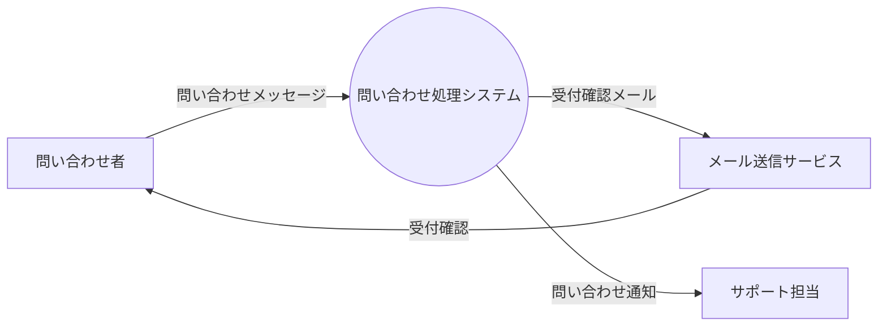
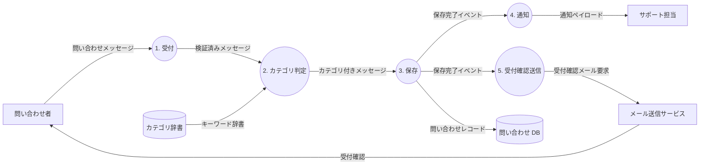
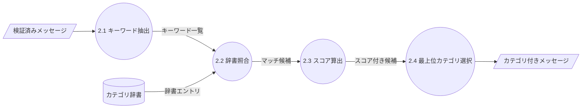

# ai-monitor テンプレート: データフロー

**1 つのデータが、システムをどう流れるか** を可視化する書式（DFD: Data Flow Diagram）。
「そのデータはどこから来て、どこで加工され、どこに保存され、どこへ送り出されるか」を 4 種類の記号だけで描く。

## セクション一覧

| セクション | 必須or条件 | 補足 |
| --- | --- | --- |
| `## Level 0` | 必須 | データの外部境界（発生源 → システム → 出口）を俯瞰 |
| `## Level 1` | 必須 | システム内の主要プロセスと データストア |
| `## Level 2` | Level 1 のプロセスが複雑なときのみ | 特定プロセスを更に分解 |
| `## データ辞書` | ペイロード構造を明確にしたい場合 | 主要データフローの型定義 |

## `冒頭リード`

### 記述例

```markdown
# データフロー: {データ名}

`{データ名}` がシステムを流れる過程。

- 発生源: {外部エンティティ or システム内プロセス}
- 出口: {外部エンティティ or データストア}
- 実装関数と 1:1 では対応しない（実装は モジュール構成 側を参照）
```

## `## Context (Level 0)`

**そのデータが システムに入り、システムから出ていくまで** を 1 プロセスで俯瞰する。
主役データが辿る両端（発生源と最終出口）を明示する。

### 記述例

````markdown
## Context (Level 0)


````

### 補足

- プロセスは 1 個（システム全体）
- データストアは書かない（内部詳細なので Level 1 以降）
- **主役のデータ**（このページのタイトル）が矢印ラベルに必ず 1 本は現れる

## `## Level 1`

システムを **主要プロセスに分解** する。
データストアもここから登場する。
主役データが辿るパスがこの図の中心線になる。

### 記述例

````markdown
## Level 1


````

### 補足

- プロセス番号 `1. 〜 5.` は Level 0 の 1 プロセスを分解したもの
- データストアは名詞で（動詞や状態を混ぜない）
- 矢印には**必ずラベル**（何のデータか）を書く
- 主役データ（問い合わせメッセージ）が入口から中心を貫くように配置すると読みやすい

## `## Level 2 以降`

Level 1 のプロセスが複雑（内部に更に処理分岐がある）なとき、そのプロセスだけを更に分解する。

### 記述例

````markdown
## Level 2: `2. カテゴリ判定` の分解


````

### 補足

- 番号は親プロセスの子として `2.1 / 2.2 / 2.3` と付ける
- 上位図で外部エンティティ / データストア扱いだったものが Level 2 では **入出力ポート**（斜め四角 `[/名前/]`）に見えることが多い
- 基本 Level 2 で止める（それ以上はコード読んだ方が早い）

## `## データ辞書`

主要データフローの **ペイロード構造** を型で定義する。
省略可（型定義は モジュール構成 / スキーマページに委譲してもよい）。

### 記述例

```markdown
## データ辞書

| データフロー名 | 発生元 | 到達先 | 構造 | 補足 |
| --- | --- | --- | --- | --- |
| 問い合わせメッセージ | 問い合わせ者 | `1. 受付` | `{name, email, subject, body}` | Web フォーム経由 |
| 検証済みメッセージ | `1. 受付` | `2. カテゴリ判定` | `{name, email, subject, body, received_at}` | サーバー時刻付与 |
| カテゴリ付きメッセージ | `2. カテゴリ判定` | `3. 保存` | `{...検証済みメッセージ, category, confidence}` | - |
| 問い合わせレコード | `3. 保存` | `問い合わせ DB` | `{id, name, email, subject, body, category, ...}` | 主キー付き |
```

### 補足

- カラム: `データフロー名 / 発生元 / 到達先 / 構造 / 補足`（5 列）
- 図の全矢印を書く必要はない。
  **プロセス境界を跨ぐ主要データフローだけ**
- 詳細な型定義は モジュール構成 の データモデル にリンクで委譲可

## 描き方のコツ

- **プロセスは動詞句**（`受付` / `カテゴリ判定`）で書く。
  名詞（`受付サービス`）だと何をしてるか分からなくなる
- **データフローのラベルは名詞**（`検証済みメッセージ`）
- 1 図あたりプロセスは **3〜7 個** が目安。
  それ以上は Level を切る
- 主役のデータが**入口から出口まで貫くように**配置する（左→右）
- `flowchart LR` が基本

## データ一覧（設計図/データフロー/README.md）との関係

`設計図/データフロー/README.md` に全データの索引 + DFD 作成状況を集約する。
判定は `docs/wiki/チェックシート/データフロー作成判定.md` に沿う。

README の推奨書式:

```markdown
## データ一覧

| データ名 | 発生源 | 出口 | DFD | 補足 |
| --- | --- | --- | --- | --- |
| 問い合わせメッセージ | 問い合わせ者（Web フォーム） | 問い合わせ DB + 担当者 | ✅ [link](...) | - |
| 設定ファイル | ローカル config.yaml | 内部使用のみ | - | 内部完結、DFD 対象外 |
```

## 表のルール（全テンプレ共通）

`docs/wiki/テンプレート/テンプレート.md` の「表のルール」に従う。
- 補足列: 最右に必須
- 連続同値: 省略せず実値を書く
- 該当なし: `-`
