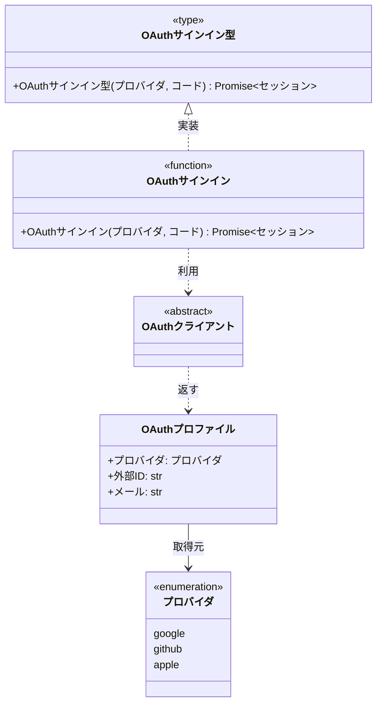
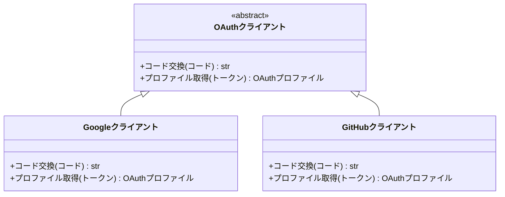

# ai-monitor テンプレート: モジュール構成

プロジェクトの **データモデル / クラス / 関数 / 関数型 / 定数 / UI コンポーネント / フック / ストア / 画面** を業務ドメイン分類でグループ化してまとめる書式。
サブシステムごとにフォルダを切り、分類ごとに 1 ファイルで並べる（中間「モジュール」概念は持たない）。

**フロント / バック共通で 1 テンプレ運用**。
同ドメインの BE 構成要素（`UserService` 等）と FE 構成要素（`UserProfileScreen` / `useUpdateProfile` 等）は、それぞれのサブシステムフォルダ側のファイルに書く。

**「データモデル」は言語横断の上位概念名**として扱う。
TS の `type` / `interface`（プロパティ主体）/ Python の `@dataclass` / Pydantic の `BaseModel` / Zod スキーマ / Java の record など、「プロパティ主体のデータ構造」を全て「データモデル」種別で表現する。

**データモデルとストアの違い**:
- **データモデル** = そのデータの**型 / 構造の定義**（例: `User`, `OAuthProfile`）
- **ストア** = **データモデルのインスタンスを保持し変更 action を提供する状態管理オブジェクト**（例: Zustand の `useUserStore`）
- API から取得したデータを画面に一時表示するだけならモジュール構成に**別枠で載せない**（データモデル定義 1 箇所を参照するだけ）。
  - ストアや Custom Element プロパティで**永続的に保持する場合**にストア枠 or コンポーネント枠に現れる

## ファイル構成

| 種類 | ファイル | 役割 | 補足 |
| --- | --- | --- | --- |
| インデックス | `設計図/モジュール構成/README.md` | サブシステム × 分類の索引 | 1 プロジェクト 1 ファイル |
| 分類別 | `設計図/モジュール構成/{サブシステム名}/{分類名}.md` | 当該サブシステム × 分類の詳細（一覧 / 構成図 / 各クラス / 各ファイル） | サブシステムごとにフォルダを切り、分類ごとに 1 ファイル |

サブシステム名（フォルダ名）はプロジェクト構成に応じて命名（例: `バックエンド` / `フロントエンド` / `AI サーバー` / `モニター` / `MCP` など）。
分類は **業務ドメイン軸**（例: `ユーザー` / `認証` / `OAuth` / `投稿` / `通知` / `LLM` / `ダッシュボード` / `プロフィール`）。
実装パターン軸（データモデル / リポジトリ / クライアント / コンポーネント等）の分類は禁止。

中心となるエンティティと、その関連クラス / 関数 / コンポーネント / フック（Repository / Service / Factory / 継承クラス / 画面 / カスタムフック / ストア 等）は **同じ分類** に入れる。

## セクション一覧

関数 / メソッドを横断で 1 表に並べるのは `## 一覧` の 1 箇所だけで、詳細は **1 関数 / 1 メソッド = 1 サブセクション**に小分けする。

| 対象ファイル | セクション | サブセクション | 必須or条件 | 担当 | 補足 |
| --- | --- | --- | --- | --- | --- |
| インデックス | `## 分類一覧` | - | 必須 | issue-arch | サブシステム × 分類の索引。**README は目次のみ**（構成要素の全列挙は分類別ファイル側の責務） |
| 分類別 | `## 一覧` | - | 必須 | issue-arch | 当該ファイルの構成要素早見表（ユースケース別。横断の表はここだけ） |
| 分類別 | `## ディレクトリ構成` | - | 必須 | issue-arch | 当該分類に属するファイルのツリー |
| 分類別 | `## 構成図` | 矢印で繋がらない塊・インターフェースの実装群は `### {論理名}` で図を分割 | 構成要素が 2 つ以上ある場合は必須 | issue-arch | Mermaid classDiagram |
| 分類別 | `## {論理名}`（クラス / データモデル） | `### プロパティ` / `### {メソッド論理名}`（1 メソッド = 1 サブセクション） / `### 補足` | クラス / データモデルごとに 1 つ | issue-arch | 見出しは論理名。物理名は見出し直下の引用行に書く。Enum は `### プロパティ` の代わりに `### 値一覧`。データモデルは `### メソッド` を「なし」表記 |
| 分類別 | `## {ファイル名}` | `### {関数論理名}`（1 関数 = 1 サブセクション） / `### 関数型` / `### 補足` | 関数 / 関数型 / フック / ストアを含むファイルごとに 1 つ | issue-arch | - |
| 分類別 | `## {画面 / コンポーネント名}` | `### props` / `### state` / `### 単体テスト` / `### 補足` | 画面 / コンポーネントごとに 1 つ | issue-arch | Custom Element は `### props` の代わりに `### attributes` / `### properties` / `### events` |

## `冒頭リード`（インデックスファイル）

### 記述例

```markdown
# モジュール構成

プロジェクトの構成要素（クラス / 関数 / 関数型）の索引ページ。
詳細は各分類別ファイルへ。

論理名（業務語彙）はドキュメント・口頭で、実名（クラス名 / 関数名 / 型名）はソースコードで使う。
両者の対応は本ページと各分類別ファイルでのみ正規化して管理する。
```

### 補足

- 「詳細は分類別ファイル」と必ず案内（クラス / 関数の中身は別ファイル）

## `冒頭リード`（分類別ファイル）

### 記述例

```markdown
# モジュール構成: {サブシステム名} / {分類名}

`{分類名}` ドメイン（{サブシステム名} 側）に属する構成要素詳細。
```

### 補足

- 1 行目のタイトルは `{サブシステム名} / {分類名}`（フォルダ / ファイル名と一致）
- 当該分類のスコープを 1 行で（必要なら）


## `分類一覧`（インデックスファイル）

### 記述例

```markdown
## 分類一覧

| サブシステム | 分類名 | ファイル | 概要 | 補足 |
| --- | --- | --- | --- | --- |
| バックエンド | ユーザー | [ユーザー](./バックエンド/ユーザー.md) | User とユーザー周辺の関数 | - |
| バックエンド | 認証 | [認証](./バックエンド/認証.md) | Session・サインイン / サインアウト処理 | - |
| バックエンド | OAuth | [OAuth](./バックエンド/OAuth.md) | OAuth プロバイダ連携 | - |
| フロントエンド | ユーザー | [ユーザー](./フロントエンド/ユーザー.md) | ユーザー画面とフック | - |
```

### 補足

**サブシステム列:**
- フォルダ名と一致させる。
  順序はデータフロー上流 → 下流（例: `バックエンド → フロントエンド`）

**ファイル列:**
- `[表示名](./{サブシステム名}/{分類名}.md)` 形式の内部リンク

**概要列:**
- 当該分類が何を担うかを 1 行で（構成要素一覧の概要欄と内容を揃えてもよい）

**補足:**
- サブシステム内の並び順は業務ドメイン中心のもの（`ユーザー` / `認証`）から派生・関連ドメイン（`OAuth` / `プロフィール`）へ
- 新規分類追加時は本ページに 1 行追加 + 該当分類別ファイルを新規作成

## `## 一覧`

当該ファイルの全構成要素の早見表。
ユースケース軸で並び順を整える。

### 記述例

```markdown
## 一覧

| ユースケース | 役割 | コンテナ | 種別 | 名前 | 概要 | 補足 |
| --- | --- | --- | --- | --- | --- | --- |
| 共通 | ドメインモデル | `oauth/models.ts` | データモデル | [`OAuthProfile`](#oauthプロファイル) | 外部プロバイダから取得した属性 | - |
| 共通 | 列挙 | `oauth/models.ts` | Enum | [`Provider`](#プロバイダ) | 対応プロバイダの列挙 | - |
| 共通 | プロバイダ契約 | `oauth/client.ts` | 抽象クラス | [`OAuthClient`](#oauthクライアント) | OAuth プロバイダ共通インタフェース | - |
| 共通 | 定数辞書 | `oauth/constants.ts` | 定数 | [`PROVIDER_LABELS`](#プロバイダ表示名) | プロバイダ表示名の辞書 | - |
| 共通 | 定数配列 | `oauth/constants.ts` | 定数 | [`PROVIDERS`](#サポート対象プロバイダ) | サポート対象プロバイダ一覧 | - |
| 共通 | バリデータ | `oauth/validators.ts` | 関数 | [`validateOAuthProfile`](#プロファイル検証) | プロフィール検証 | 失敗時 `ValidationError` |
| OAuth サインイン | プロバイダ実装 | `oauth/clients/google.ts` | クラス | [`GoogleOAuthClient`](#googleクライアント) | `OAuthClient` の Google 実装 | - |
| OAuth サインイン | サービス | `oauth/service.ts` | 関数 | [`signInViaOAuth`](#oauth-サインイン) | OAuth プロバイダ経由でサインイン | - |
| OAuth サインイン | サービス型（DI） | `oauth/types.ts` | 関数型 | [`SignInViaOAuth`](#関数型) | `signInViaOAuth` のシグネチャ型 | DI / Mock 差し替え用 |
```

### 補足

**カラム:**
`ユースケース / 役割 / コンテナ / 種別 / 名前 / 概要 / 補足`（7 列）

**ユースケース列:**
- 当該構成要素が属する**ユースケース名**（例: `プロフィール編集` / `ユーザー削除` / `OAuth サインイン`）
- ユースケースは `設計図/シナリオ/{論理名}.md` / `設計図/バックエンド結合/{論理名}.md` / `設計図/フロントエンド結合/{論理名}.md` の論理名と一致させる（1:1 対応）
- 複数ユースケースで共用する構成要素（`User` データモデル・共通ヘルパー関数等）は `共通` と記載
- **並び順**: 「共通」を先頭にし、その後に個別ユースケースをまとめて並べる

**役割列:**
- その構成要素の**設計上のパターン / ロール**を短いラベルで書く（`種別` とは別軸）
- 例: `ドメインモデル` / `DTO` / `列挙` / `バリデータ` / `プロバイダ契約` / `プロバイダ実装` / `リポジトリ` / `サービス` / `サービス型（DI）` / `ファクトリ` / `定数` / `定数辞書` / `定数配列` / `ハンドラ` / `ガード` / `パーサ` / `フォーマッタ`（プロジェクトで自由に決めてよい）
- 「役割」が明確に決まらない要素は `-` で可
- 上位の「業務ドメイン分類」（ファイル分割の軸）とは別概念。
  ここは**行単位のパターンラベル**

**種別列:**
- 共通: `データモデル` / `Enum` / `関数` / `関数型` / `定数`
- BE 中心: `クラス` / `抽象クラス` / `インタフェース`（メソッド契約主体のもの）
- FE 中心: `コンポーネント`（React 関数コンポーネント / Custom Element）/ `フック`（React カスタムフック）/ `ストア`（Zustand / Redux / Pinia などの状態管理オブジェクト）/ `画面`（`pages/{feature}/{Screen}.tsx` 等の画面本体）
- Vanilla TS プロジェクトでは基本 `ストア` は使わない（状態は Custom Element プロパティ or URL クエリに寄せる方針）
- **定数の下位区分**は 役割列 で表現（`定数` / `定数辞書` / `定数配列`）。
  種別は `定数` 一本で統一

※ 「データモデル」種別の指す範囲:
- TS: `type` オブジェクト型 / プロパティ主体の `interface` / Zod スキーマの推論型
- Python: `@dataclass` / Pydantic `BaseModel` / `TypedDict`
- Java / Kotlin: `record` / `data class`
- **判断基準**: メソッドを (ほぼ) 持たず、プロパティで構成される **型** ならデータモデル。
  - メソッドを持つ振る舞い付きなら `クラス`、契約だけなら `インタフェース`

**名前列:**
- ソースコード上の実名を詳細セクションへのリンクで書く（`[\`物理名\`](#{アンカー})`。クラス / データモデル / 画面は論理名セクションへ、関数は所属ファイル配下の関数サブセクションへ。アンカー = 見出しを小文字化 + 空白を `-` に置換 + 記号除去）
- 詳細セクションを持たない要素（単純即値の定数 等）はリンクなしの実名

**コンテナ列:**
- **全種別で必須**: 所属ファイル名を書く（例: `oauth/service.ts` / `hooks/useUpdateProfile.ts` / `models/oauth.ts` / `components/AvatarCropModal.tsx`）
- 「どこにあるか」が一目で分かり、省略ルールを覚える必要もなくなる

**概要列:**
- その構成要素が何を担うかを 1 行で

**補足:**
- 並び順は `ユースケース（共通 → 個別）→ 依存の上流から下流`（データモデル → ルート → サービス → リポジトリ / 画面 → フック → API ラッパー）
- 廃止要素は削除し、履歴は git log に任せる

## `## ディレクトリ構成`

当該分類に属するファイルの配置をツリーで示す。
一覧の直後・構成図の前に置く。

### 記述例

````markdown
## ディレクトリ構成

```
oauth/
├── models.ts        # OAuthProfile / Provider
├── client.ts        # OAuthClient（プロバイダ共通インタフェース）
├── clients/
│   └── google.ts    # Google 実装
├── constants.ts     # 定数
├── validators.ts    # 検証関数
├── service.ts       # サインインのドメインロジック
└── types.ts         # 関数型エイリアス
```
````

### 補足

- 一覧のコンテナ列に現れるファイルだけでツリーを構成する（当該分類の担当範囲がディレクトリ上のどこかを一目で示す）
- 各ファイルの右に 1 行コメントで主な中身（代表の物理名 or 役割）を書く
- 起点はリポジトリ内の配置が分かる階層から書く（例: `plugins/ai-monitor/mcp/` / `src/{pkg}/`）

## `## 構成図`

矢印で繋がらない塊が複数ある場合は H3 で図を分ける。

### 記述例

````markdown
## 構成図

### OAuthサインイン



---

### OAuthクライアント


````

### 補足

- Mermaid `classDiagram` は**矢印で繋がっているグラフ 1 塊 = 1 枚**。
  当該ファイルの全要素をいずれかの図に載せる
  - 繋がらない塊が複数ある場合は `### {塊の論理名}` の H3 見出しで図を分ける（例: `### 監視対象` / `### ポーリングとセッション管理`）。
    1 塊に収まるなら H3 なしの 1 枚
  - **抽象クラス / インターフェース / 関数型を介したアクセスは実装群を `### {親の論理名}` の別図に切り出す**（親の完全定義 + `<|..` の実装クラス群はそちらが持つ）。
    利用側の図では親をステレオタイプ + 名前だけのノード（`class {論理名} { <<type>> }` 等）で置く。
    別図から他の図の要素を参照するときも名前だけのノードで書く
  - 各ノードには `click {論理名} href "#{アンカー}"` で詳細セクションへのリンクを付ける（クラス / データモデル / 画面は論理名セクションへ・関数は所属ファイル配下の関数サブセクションへ・名前だけのインターフェースノードは実装群の図セクションへ）。
    アンカー = 見出しを小文字化 + 空白を `-` に置換 + 記号除去
  - H3 で分けた図セクションの間は `---` で区切る
- **図中の名前（クラス / プロパティ / メソッド / 引数）は論理名で書く**。
  物理名との対応は `## 一覧` と各詳細セクションの表が持つ。
  図中で定義した要素同士の型参照も論理名で書き、プリミティブ型（`str` / `int` 等）はそのまま
- BE 系: クラス / 抽象クラス / データモデル / Enum / 関数 / 関数型
  - 関数: `class {論理名} { <<function>> +{論理名}(引数) 戻り値 }`
  - 関数型: `class {論理名} { <<type>> +{論理名}(引数) 戻り値 }`
- FE 系: コンポーネント / 画面 / フック / ストア
  - コンポーネント: `class {論理名} { <<component>> +{論理名}(props) ReactNode }`
  - 画面: `class {論理名} { <<screen>> +{論理名}(props) ReactNode }`
  - フック: `class {論理名} { <<hook>> +{論理名}(引数) 戻り値 }`
  - ストア: `class {論理名} { <<store>> +{フィールド論理名}: 型 ... }`
- 依存関係の目安（FE 図）:
  - 画面 `..>` フック（画面がフックを利用）
  - フック `..>` ストア（フックがストアを購読）
  - コンポーネント `..>` フック / ストア（コンポーネントがフックを利用）
  - 画面 `-->` コンポーネント（画面が子コンポーネントを構造的に含む）
- 分類をまたぐ参照（他分類の要素）は外部矢印で名前だけ書く
- 要素数が 15 を超えると読みづらい → 分類を細分化

**リレーション記号:**

| 記号 | 意味 | 補足 |
| --- | --- | --- |
| `<\|--` | 継承（is-a） | 親 `<\|--` 子（**左が親**） |
| `<\|..` | インタフェース実装 | 親（インタフェース）`<\|..` 子（**左が親**） |
| `*--` | コンポジション（強い所有・ライフサイクル一致） | 全体 `*--` 部分 |
| `o--` | 集約（弱い所有） | 全体 `o--` 部分 |
| `-->` | 関連（has-a / 参照） | 矢印元が参照側 |
| `..>` | 依存（短期的に使う） | 引数で受ける / 内部で new するなど |

## `## {論理名}`（クラス / データモデル）

各クラス / データモデルの詳細。
**見出しは論理名**で立て、見出しの直下に `> 物理名: \`{物理名}\`<br>` / `> 種別: {種別}<br>` / `> コンテナ: \`{ファイルパス}\`` の引用 3 行を置く（引用内の改行は `<br>` が必要。値は `一覧` の各列と一致させる）。
プロジェクト内で定義された親（抽象クラス / インタフェース / 関数型）を継承・実装する場合は最終行に `> 継承元: {親}` を続ける（複数あれば ` / ` で並べ、定義セクションがある親はセクションリンク（別の分類ファイルは相対パス + アンカー）で書く）。
メソッドは **1 メソッド = 1 サブセクション**（`### {メソッド論理名}`。書式は「`### {関数 / メソッド論理名}`」参照）。
メソッドを持たないデータモデルは `### プロパティ` のみを持ち、`### メソッド` に「なし」と記載する。

### 記述例

````markdown
## OAuthプロファイル
> 物理名: `OAuthProfile`<br>
> 種別: データモデル<br>
> コンテナ: `oauth/models.ts`

外部プロバイダから取得したユーザー属性。

### プロパティ

| 論理名 | プロパティ名 | 型 | 可視性 | デフォルト | 説明 | 例 | 補足 |
| --- | --- | --- | --- | --- | --- | --- | --- |
| プロバイダ | `provider` | `Provider` | public | - | どのプロバイダから取得したか | `"google"` | - |
| 外部 ID | `externalId` | `string` | public | - | プロバイダ側の一意 ID | `"1099abcdef..."` | - |
| メール | `email` | `string` | public | - | プロバイダ側で確認済みメール | `"taro@example.com"` | - |

### メソッド

なし

### 単体テスト

なし

### 補足

- 自プロジェクトの `User` にマップする際は `(provider, externalId)` の組で照合する
````

### 補足

**`### プロパティ` 表のカラム:**
`論理名 / プロパティ名 / 型 / 可視性 / デフォルト / 説明 / 例 / 補足`（8 列）

**型列:**
- 取りうる値が有限の文字列は `str` で逃げず、リテラル型で列挙する（Python: `Literal["open", "closed"]` / TS: `"open" | "closed"`）
- 同一ファイル内に定義セクションがある型はセルごとリンクで書く（例: `[\`list[Label]\`](#ラベル)`。複合型でも要素型のセクションへ）。
  別の分類ファイルに定義セクションがある型は相対パス + アンカー（`[\`User\`](../バックエンド/ユーザー.md#ユーザー)` 等）でリンクする

**デフォルト列:**
- 生成時のデフォルト値を書く（`[]` / `False` / `"open"` / `生成時刻` 等）。
  デフォルトなしの必須プロパティは `-`

**`### {メソッド論理名}`（1 メソッド = 1 サブセクション）:**
- 書式は「`### {関数 / メソッド論理名}`」参照（引数 / 戻り値 / 処理 / 例外 / 単体テストを各メソッドが持つ）
- メソッドサブセクションの間（および後続の `### 補足` の前）に区切り線 `---` を置く

**Enum の場合:**
- `### プロパティ` の代わりに `### 値一覧` を使う
- カラム: `値 / 論理名 / 説明 / 補足`（4 列）

**定数の場合:**
- 単純即値（`MAX_RETRY = 3` 等）は詳細セクションを立てず、一覧の行だけで表現する
- 辞書 / 配列など内容の一覧化が必要な複合定数は詳細セクションを立て、`### プロパティ` の代わりに `### 値` を使う
- `### 値` のカラム: `キー / 値 / 説明 / 補足`（4 列。配列は キー列を index に読み替える）
- `### メソッド` / `### 単体テスト` は基本「なし」（定数の値は実装コードで担保）
- 設定値（`.env` / `settings.yaml` / `config.ini` に置く値）はここではなく `テンプレート/設定.md` に集約する

**サブセクションの省略ルール:**
- メソッド無しのデータモデルは `### メソッド` に「なし」と記載（サブセクションを立てない）

**可視性表記:**
- `public` / `protected` / `private`
- 言語に可視性概念がない場合（Python 等）は `公開` / `内部 (_)` / `非公開 (__)`

**引数 / 戻り値表記:**
- 引数: `name: 型, name2: 型`。
  引数なしは `-`
- 戻り値: 言語の型表記。
  void / None / Unit は言語慣習に合わせて

## `### {関数 / メソッド論理名}`（クラス / ファイル共通）

関数 / メソッド / フックの詳細。
**1 関数 = 1 サブセクション**で、親（クラス / ファイル）セクションの 1 レベル下に置く。
見出しは論理名。
直下に `> 物理名: \`{物理名}\`<br>` と `> 種別: {関数 / メソッド / フック}` の引用 2 行 + 説明 1 行を置き、内部は `#### 引数` / `#### 戻り値` / `#### 処理` / `#### 例外` / `#### 単体テスト` のセクションで構成する（引数・戻り値は表 + 例のコードブロック、処理は番号付きステップ）。
実装する関数型・インタフェースがある場合は種別の後に `> 継承元: {親}` の行を続ける（書き方はクラスの継承元と同じ）。

### 記述例

````markdown
### OAuth サインイン
> 物理名: `signInViaOAuth`<br>
> 種別: 関数<br>
> 継承元: [`SignInViaOAuth`](#関数型)

OAuth プロバイダ経由でサインインする。

#### 引数

| 論理名 | 引数名 | 型 | 必須 | デフォルト | 説明 | 補足 |
| --- | --- | --- | --- | --- | --- | --- |
| プロバイダ | `provider` | `Provider` | ✅ | - | 認可コードの発行元 | - |
| 認可コード | `code` | `string` | ✅ | - | OAuth 認可コード | - |

引数例:

```ts
await signInViaOAuth("google", "4/0AfJohXn...");
```

#### 戻り値

| 型 | 説明 | 補足 |
| --- | --- | --- |
| `Promise<Session>` | 発行したセッション | - |

戻り値例:

```ts
{ id: "sess_01", userId: "user_01", expiresAt: "2026-08-17T00:00:00Z" }
```

#### 処理

1. `provider` に対応する `OAuthClient` 実装を取得する
2. `code` をアクセストークンに交換する（応答が 4xx なら `OAuthError`）
3. トークンでプロバイダからプロフィールを取得する（応答が 4xx / 5xx なら `OAuthError`）
4. User を取得 / 新規作成する（[OAuth ユーザー解決](#oauth-ユーザー解決)）
5. User が `suspended` なら `AuthError` を投げる
6. セッションを発行して返す

#### 例外

| 例外名 | 発生条件 | メッセージ | 補足 |
| --- | --- | --- | --- |
| `OAuthError` | プロバイダから認可コードの exchange 応答が 4xx | `"OAuth code exchange failed: {code}"` | - |
| `OAuthError` | プロバイダからのプロフィール取得応答が 4xx / 5xx | `"Failed to fetch profile: {status}"` | 同じ例外の別発生箇所 |
| `AuthError` | 解決した User が `suspended` | `"User is suspended: {userId}"` | - |

#### 単体テスト

| テスト名 | 正常/異常 | 概要 | 条件 | Mock | 期待値 | 補足 |
| --- | --- | --- | --- | --- | --- | --- |
| `test_sign_in_via_oauth` | 正常 | 有効なコードでサインイン成功 | プロバイダから有効な `OAuthProfile` を返す | プロバイダ | `Session` を返す | - |
| `test_sign_in_via_oauth_when_invalid_code` | 異常 | 認可コード無効 | プロバイダから 400 エラー | プロバイダ | `OAuthError` を throw | 例外表「exchange 応答が 4xx」に対応 |
| `test_sign_in_via_oauth_when_profile_fetch_fails` | 異常 | プロフィール取得失敗 | プロバイダから 500 エラー | プロバイダ | `OAuthError` を throw | 例外表「プロフィール取得応答が 4xx / 5xx」に対応 |
| `test_sign_in_via_oauth_when_user_suspended` | 異常 | ユーザーが suspended | 既存 User の `status` が `suspended` | プロバイダ + Repository | `AuthError` を throw | 例外表「User が suspended」に対応 |
````

### 補足

**説明行:**
- 関数の役割を 1 行で要約する（呼び出す関数の列挙は `#### 処理` 側に書く。全関数が共通で通るものはファイルセクションのリード文に 1 回書く）
- 同一設計書内に詳細セクションがある要素は論理名のセクションリンクで参照する（例: `[定型ブロック組立](#定型ブロック組立)`）。
  別の分類ファイルに詳細セクションがある要素は相対パス + アンカー（`[ポーリング](../モニター/エージェント管理.md#ポーリング)` 等）でリンクし、設計書群に無いものだけ物理名で書く

**引数表のカラム:**
`論理名 / 引数名 / 型 / 必須 / デフォルト / 説明 / 補足`（7 列）
- 引数なしの関数は表を出さず「なし」と記載
- 型は実装言語の型名。
  取りうる値が限定される場合はリテラルの列挙で書く
- 同一ファイル内に定義セクションがある型はセルごとリンクで書く（例: `[\`list[Question]\`](#質問)`。戻り値表も同様）。
  別の分類ファイルに定義セクションがある型は相対パス + アンカーでリンクする
- 表の直後に `引数例:`（呼び出しコード 1〜数行）を置く

**戻り値表のカラム:**
`型 / 説明 / 補足`（3 列）
- void / None / Unit も 1 行書く
- 表の直後に `戻り値例:`（返り値の実形）を置く（`void` / `None` は省略）

**`#### 処理`:**
- 関数の中身を番号付きステップで書く（戻り値の後・例外の前）。
  1 ステップ = 意味のある処理単位で、行単位のコード翻訳にしない
- 主文には何をするかだけを書き、呼び出す関数・ヘルパーは文末の括弧内に論理名のセクションリンクで添える（例: `ヘッダーを付ける（[定型ブロック組立](#定型ブロック組立)）`。別の分類ファイルの関数は相対パス + アンカー）
- ステップ番号は実行順を表す。
  結末や値が分かれる択一の分岐は 1 つの番号ステップにまとめ、枝を配下にインデントした `- {条件}の場合、{内容}` の箇条書きで並べる（短い条件の注記は文中の括弧でもよい）。
  raise する分岐は例外表の発生条件と対応させる
- 1 行で書ききれない補足もステップ配下にインデントした `- ` の箇条書きで書く
- 複数の関数の処理に同じステップ（同じ取得・同じ組み立て・同じ送信）が現れる場合は、共通のヘルパー関数として切り出して一覧と詳細セクションに載せる（共通化は実装時ではなく設計時点で確定させる。全関数の処理を書き終えたら重複ステップがないか見直す）
- 実装側は各ステップの主文をコメントとして関数内に必ず入れる（コメントに番号は付けない。括弧内の呼び出し先はコード上の関数呼び出しが対応物。実装レビューは主文コメントとの突き合わせで照合する）

**例外表のカラム:**
`例外名 / 発生条件 / メッセージ / 補足`（4 列）
- 同じ例外を複数箇所から投げる場合は箇所ごとに別行
- 投げない関数は表を出さず「なし」と記載
- 例外階層 / エラーコード / ハンドリング方針は `実装リファレンス/エラーコード・例外定義一覧.md` に集約する（本表からは例外名で参照するのみ）

**単体テスト表のカラム:**
`テスト名 / 正常/異常 / 概要 / 条件 / Mock / 期待値 / 補足`（7 列）
- テスト名は実装側のテスト関数の物理名
- テスト名は `test_{関数物理名}_when_{条件}` とし、期待値は名前に入れない（期待値が変わるたびに名前が変わるため）。
  条件分岐のない唯一のケースは `test_{関数物理名}` のみ。
  先頭が `_` の関数は `_` を外す
- 複数のテスト行が共有する準備（一時リポジトリ / 一時ファイル等の fixture）は、表の前に `セットアップ:` のラベル行 + `セットアップ / 説明 / 補足` の 3 列表で書く（fixture の物理名は補足列。共有の準備が無い関数では置かない）
- **Mock 列に書くのはファイル外・プロセス外の依存だけ**（別モジュールの関数・ネットワーク・別プロセス・ファイルシステム・時刻等）。
  同一ファイル内のヘルパーは Mock せず実物のまま検証する（単体の単位 = 1 ファイル）
- 引数で受けるデータ（DTO・設定値）は Mock ではなくセットアップ / 条件でテスト値を与える（Mock は振る舞いを持つ依存の差し替え。テスト用インスタンスの組み立ては fixture に集約する）
- **Mock 列は全行必須**: 差し替える対象物だけを書く（例: `githubkit` / `fetch` / `なし（テスト用に一時作成した git リポジトリを実操作）`）。
  応答の設定は条件列・呼び出し検証は期待値列に書く。
  差し替えない場合も「なし」と明記する（実サービスへ通信しないテストであることの宣言）
- **期待値には Mock への呼び出し検証も書く**: 戻り値・raise に加えて、Mock に渡った引数・呼び出しの有無も期待値に含める
- **条件分岐単位で設計する**: 分岐（if / フラグ・省略時の切り替え / バリデーション / フォールバック）ごとに 1 行以上置き、分岐カバレッジを極力 100% にする
- 自関数で raise する例外（バリデーション等）は分岐なので異常行としてテストし、補足列に `例外表「{発生条件の要旨}」に対応` と明記
- キャッチせずそのまま伝播する例外は分岐を持たないため行を置かない（共通の伝播経路だけ代表 1 関数で確認する）

**疎通テスト表のカラム（外部 API ラッパー関数のみ）:**
`テスト名 / 対象 API / 概要 / 確認内容 / 補足`（5 列）
- テスト名は `test_ext_{関数物理名}_when_{パラメータ値}`（バリエーションが 1 つだけなら `test_ext_{関数物理名}` のみ）
- 実 API を叩くラッパー関数（`integrations/**` 等）のサブセクションにのみ、`#### 単体テスト` の後に `#### 疎通テスト` として置く
- 確認内容列は 認証 / エンドポイント / **使用パラメータ値** / レスポンス構造 等の確認観点
- 補足列に **料金 / 副作用を必ず書く**（`料金: $0.01/回` / `副作用: 実メール送信` 等）
- **プロジェクトで実際に使うリクエストパラメータ値のバリエーションを 1 バリエーション = 1 テストで網羅**する（1 テスト = 1 リクエスト送信 = 200 OK + 想定レスポンス形状の確認。目的は「本番で使う各パラメータ値が実 API で通ること」の 1 回きり網羅確認）

## `## {ファイル名}`

関数 / 関数型 / フック / ストア を含むファイルの詳細。
見出しはファイル名で立て、直下に `> 種別: ファイル` の引用行 + 説明 1 行を置く。
配下に **1 関数 = 1 サブセクション**（`### {関数論理名}`。書式は「`### {関数 / メソッド論理名}`」参照）を並べ、関数型はまとめて `### 関数型` の表に置く。

### 記述例

````markdown
## `oauth/service.ts`
> 種別: ファイル

OAuth サインインのドメインロジックを束ねる関数ファイル。

---

### OAuth ユーザー解決
> 物理名: `findOrCreateUserFromOAuth`<br>
> 種別: 関数

既存 User を取得し、なければ新規作成する。

#### 引数

| 論理名 | 引数名 | 型 | 必須 | デフォルト | 説明 | 補足 |
| --- | --- | --- | --- | --- | --- | --- |
| プロファイル | `profile` | `OAuthProfile` | ✅ | - | 照合に使う外部プロバイダの属性 | `(provider, externalId)` で照合 |

引数例:

```ts
await findOrCreateUserFromOAuth({ provider: "google", externalId: "1099abc", email: "taro@example.com" });
```

#### 戻り値

| 型 | 説明 | 補足 |
| --- | --- | --- |
| `Promise<User>` | 取得または新規作成した User | - |

戻り値例:

```ts
{ id: "user_01", provider: "google", externalId: "1099abc", status: "active" }
```

#### 処理

1. `(provider, externalId)` の組で既存 User を検索する
2. 検索結果で返す User を確定する
   - 見つかった場合、その User を返す
   - 見つからない場合、新規 User を作成して返す

#### 例外

| 例外名 | 発生条件 | メッセージ | 補足 |
| --- | --- | --- | --- |
| `DatabaseError` | Repository の insert / update で SQL 例外 | `"DB write failure: {op}"` | 監視アラート対象 |

#### 単体テスト

| テスト名 | 正常/異常 | 概要 | 条件 | Mock | 期待値 | 補足 |
| --- | --- | --- | --- | --- | --- | --- |
| `test_find_or_create_user_from_oauth` | 正常 | 既存ユーザーを取得 | `(provider, externalId)` 一致の User あり | Repository | 既存 `User` を返す | 新規作成しない |
| `test_find_or_create_user_from_oauth_when_user_missing` | 正常 | 新規ユーザーを作成 | 一致する User なし | Repository | 新規 `User` を作成して返す | - |
| `test_find_or_create_user_from_oauth_when_db_write_fails` | 異常 | DB 書き込み失敗 | Repository が `DatabaseError` を throw | Repository | `DatabaseError` をそのまま再 throw | 例外表「insert / update で SQL 例外」に対応 |

---

### 関数型

| 論理名 | 型名 | 引数 | 戻り値 | 説明 | 補足 |
| --- | --- | --- | --- | --- | --- |
| OAuth サインイン型 | `SignInViaOAuth` | `provider: Provider, code: string` | `Promise<Session>` | `signInViaOAuth` のシグネチャを表す型エイリアス | DI / Mock 差し替え用 |

### 補足

- トランザクション境界はこのファイル内の関数で集約（複数 Repository を 1 トランザクションでまとめる）
- 外部プロバイダ追加時は本ファイルではなく `OAuthClient` 派生実装の追加で対応（OCP）
````

### 補足

**`### {関数論理名}`（1 関数 = 1 サブセクション）:**
- 書式は「`### {関数 / メソッド論理名}`」参照。
  ヘルパー等の内部関数も同様に 1 関数 = 1 サブセクション
- 区切り線 `---` を、ファイルセクションのリード文と最初のサブセクションの間・関数サブセクションの間・後続の `### 関数型` / `### 補足` の前に置く

**`### 関数型` 表のカラム:**
`論理名 / 型名 / 引数 / 戻り値 / 説明 / 補足`（6 列。関数型は **関数のシグネチャを表す型エイリアス** で例外を型に含めないため例外列は無し）

**サブセクションの省略ルール:**
- 関数型が無いファイルは `### 関数型` を省略

**ファイル名の書き方:**
- `名前空間/ファイル名.拡張子` 形式（例: `oauth/service.ts` / `users/repository.py`）
- リポジトリルートからの相対パスでも可（プロジェクトの慣習に合わせる）

### 記述例（外部 API ラッパーファイル）

外部 API を叩くラッパー関数ファイル（疎通テスト表を含む）の記述例:

````markdown
## `integrations/clients.ts`
> 種別: ファイル

各外部 API の **薄いラッパー関数** を集約するファイル。
実 API と話す境界層 → 疎通テストの対象。

---

### OpenAI チャット
> 物理名: `openaiChat`<br>
> 種別: 関数

Chat Completion を呼び出す。

#### 引数

| 論理名 | 引数名 | 型 | 必須 | デフォルト | 説明 | 補足 |
| --- | --- | --- | --- | --- | --- | --- |
| プロンプト | `prompt` | `string` | ✅ | - | ユーザープロンプト | - |

引数例:

```ts
await openaiChat("次の文章を 3 行で要約して: ...");
```

#### 戻り値

| 型 | 説明 | 補足 |
| --- | --- | --- |
| `Promise<string>` | 応答テキスト | - |

戻り値例:

```ts
"要約: ..."
```

#### 処理

1. `prompt` を Chat Completion リクエストに組み立てて送信する（応答が 4xx / 5xx なら `OpenAIError`）
2. 応答から本文テキストを取り出して返す

#### 例外

| 例外名 | 発生条件 | メッセージ | 補足 |
| --- | --- | --- | --- |
| `OpenAIError` | API 応答が 4xx / 5xx | `"OpenAI request failed: {status}"` | - |

#### 単体テスト

| テスト名 | 正常/異常 | 概要 | 条件 | Mock | 期待値 | 補足 |
| --- | --- | --- | --- | --- | --- | --- |
| `test_openai_chat` | 正常 | Mock で正常応答 | fetch を stub して 200 + 応答テキスト返却 | fetch | 応答テキストを返す | - |
| `test_openai_chat_when_500` | 異常 | 500 エラー | fetch を stub して 500 | fetch | `OpenAIError` を throw | 例外表「API 応答が 4xx / 5xx」に対応 |

#### 疎通テスト

| テスト名 | 対象 API | 概要 | 確認内容 | 補足 |
| --- | --- | --- | --- | --- |
| `test_ext_openai_chat_when_gpt41` | OpenAI | model=gpt-4.1 で疎通 | model=`gpt-4.1` / 認証 / レスポンス JSON | 料金: $0.005/回 |
| `test_ext_openai_chat_when_gpt5` | OpenAI | model=gpt-5 で疎通 | model=`gpt-5` | 料金: $0.01/回 |
| `test_ext_openai_chat_when_temperature_02` | OpenAI | temperature=0.2（決定的用途） | temperature=`0.2` | 料金: $0.01/回 |
| `test_ext_openai_chat_when_temperature_10` | OpenAI | temperature=1.0（多様性用途） | temperature=`1.0` | 料金: $0.01/回 |

---

### Slack 通知
> 物理名: `slackNotify`<br>
> 種別: 関数

Webhook でメッセージを送信する（Bot Token 認証）。

#### 引数

| 論理名 | 引数名 | 型 | 必須 | デフォルト | 説明 | 補足 |
| --- | --- | --- | --- | --- | --- | --- |
| メッセージ | `message` | `string` | ✅ | - | 送信本文 | - |
| チャンネル | `channel` | `string` | ✅ | - | 送信先チャンネル | - |

引数例:

```ts
await slackNotify("デプロイが完了しました", "#dev-notify");
```

#### 戻り値

| 型 | 説明 | 補足 |
| --- | --- | --- |
| `Promise<void>` | なし | - |

#### 処理

1. `message` / `channel` から Webhook リクエストを組み立てて送信する（応答が 4xx / 5xx なら `SlackError`）

#### 例外

| 例外名 | 発生条件 | メッセージ | 補足 |
| --- | --- | --- | --- |
| `SlackError` | Webhook 応答が 4xx / 5xx | `"Slack notify failed: {status}"` | - |

#### 単体テスト

| テスト名 | 正常/異常 | 概要 | 条件 | Mock | 期待値 | 補足 |
| --- | --- | --- | --- | --- | --- | --- |
| `test_slack_notify` | 正常 | Mock で正常投稿 | fetch を stub して 200 | fetch | 例外を投げない | - |
| `test_slack_notify_when_400` | 異常 | Webhook エラー | fetch を stub して 400 | fetch | `SlackError` を throw | 例外表「Webhook 応答が 4xx / 5xx」に対応 |

#### 疎通テスト

| テスト名 | 対象 API | 概要 | 確認内容 | 補足 |
| --- | --- | --- | --- | --- |
| `test_ext_slack_notify_when_default_channel` | Slack | 通常チャンネル投稿 | channel=`#test-notify` / Bot Token / 200 | 副作用: `#test-notify` に投稿 |
| `test_ext_slack_notify_when_thread_reply` | Slack | スレッド返信 | `thread_ts` 指定 | 副作用: `#test-notify` にスレッド返信 |

---

### 補足

- 各関数は **薄いラッパー**（HTTP トランスポート / 認証ヘッダー付与のみ）。ビジネスロジックは呼び出し側に置く
- 疎通テストは料金 / 副作用があるため CI では実行しない（`--run-external` フラグ付きで手動実行のみ）
- 外部 API 追加時は本ファイルに関数を追加し、`外部API/{API名}.md` に詳細を書く
````

## `## {画面 / コンポーネント名}`

React の関数コンポーネント / 画面 / Custom Element の詳細。
原則として画面 / コンポーネントを持つサブシステムのフォルダ（`フロントエンド/` / `モバイル/` など）側のファイルに置く。
**見出しは論理名**で立て、見出しの直下に `> 物理名: \`{物理名}\`<br>` / `> 種別: {種別}<br>` / `> コンテナ: \`{ファイルパス}\`` の引用 3 行を置く（種別は `画面` / `コンポーネント` 等）。
1 定義 = 1 ファイル前提。

### 記述例

````markdown
## プロフィール編集画面
> 物理名: `ProfileEditScreen`<br>
> 種別: 画面<br>
> コンテナ: `pages/profile/ProfileEditScreen.tsx`

自己紹介・氏名・アバターを編集する画面本体。`useUpdateProfile` フックで更新を呼ぶ。

### props

| 論理名 | プロパティ名 | 型 | 必須 | デフォルト | 説明 | 補足 |
| --- | --- | --- | --- | --- | --- | --- |
| ユーザー | `user` | `User` | ○ | - | 編集対象のユーザー | 初期値として使う |

### state

| 論理名 | 状態名 | 型 | 初期値 | 説明 | 補足 |
| --- | --- | --- | --- | --- | --- |
| フォーム値 | `values` | `{ name, bio, avatar }` | `props.user` | フォーム全体の値 | `useForm` で管理 |
| 送信中 | `submitting` | `boolean` | `false` | 保存ボタンの loading 制御 | `useTransition` で取得 |

### 単体テスト

| テスト名 | 正常/異常 | 概要 | 条件 | Mock | 期待値 | 補足 |
| --- | --- | --- | --- | --- | --- | --- |
| `test_profile_edit_screen` | 正常 | 初期表示に user 情報が反映される | `<ProfileEditScreen user={...} />` | なし | 各入力欄に初期値が入る | Testing Library |
| `test_profile_edit_screen_when_submit` | 正常 | 保存ボタンで useUpdateProfile 呼び出し | 保存ボタンクリック | `useUpdateProfile` フック | `useUpdateProfile.mutate` が呼ばれる | - |

### 補足

- 内部で `useUpdateProfile` を使う（更新ロジックはフック側に集約）
- 画面固有の副作用（トースト表示など）はここに置き、汎用のトースト UI は共通コンポーネント側に置く
````

### 補足

**`### props` 表のカラム:**
`論理名 / プロパティ名 / 型 / 必須 / デフォルト / 説明 / 補足`（7 列）

- Custom Element の場合は `attribute / property / event` の 3 種があるため、必要なら小分けの表にする

**`### state` 表のカラム:**
`論理名 / 状態名 / 型 / 初期値 / 説明 / 補足`（6 列）

- 表現手段（`useState` / `useForm` / `useTransition` / `useReducer` / `useAtom` 等）は補足列で明示
- ローカル state を持たない Server Component / 表示専用 コンポーネントは `### state` を省略

**`### 単体テスト` 表のカラム:**
- クラスの `### 単体テスト` 表と同様（メソッド名列は不要）
- テストは Vitest + Testing Library（React）/ Playwright Component Test（Vanilla）などを想定

**Custom Element の場合:**
- `### props` の代わりに `### attributes` / `### properties` / `### events` を使う
- ライフサイクル（`connectedCallback` 等）に副作用があれば `### 補足` に明示

**サブセクションの省略ルール:**
- ローカル state を持たない場合は `### state` を省略
- 単体テストが単純描画確認のみで書くまでもない場合は「なし」と記載

## `## {フック名 / ストアファイル}`

React カスタムフックとストア（Zustand / Redux 等）は **ファイル型セクション**（`## `hooks/useUpdateProfile.ts``）として扱う。
中身の書き方は BE の「関数」ファイルと同じ枠組み:

- カスタムフック → 1 関数 = 1 サブセクション（`> 種別: フック`。書式は「`### {関数 / メソッド論理名}`」参照）
- ストア → 下記の `### state` で構造を書き、action は 1 関数 = 1 サブセクションで列挙

**ストア専用セクション** `### state`:

| 論理名 | フィールド名 | 型 | 初期値 | 説明 | 補足 |

- Zustand / Redux のストア構造を state と action に分けて記述

**Vanilla TS プロジェクトの場合:**
- ストアはほぼ使わない。
  共有状態は URL クエリ or Custom Element のプロパティに寄せる
- 「ストア」種別を無理に使わず、`関数` / `クラス` 種別で表現する

## 表のルール（全テンプレ共通）

`docs/wiki/テンプレート/テンプレート.md` の「表のルール」に従う。
- 補足列: 最右に必須
- 連続同値: 省略せず実値を書く
- 表外の詳細: `※n`
- 該当なし: `-`
