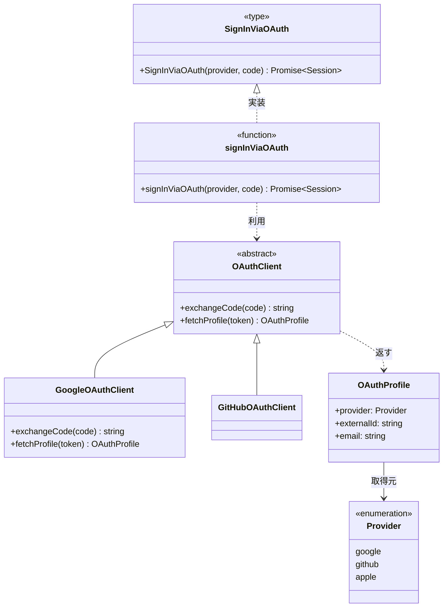

# ai-monitor テンプレート: モジュール構成

プロジェクトの **データモデル / クラス / 関数 / 関数型 / 定数 / UI コンポーネント / フック / ストア / 画面** を業務ドメイン分類でグループ化してまとめる書式。
分類ごとに 1 ファイルでフラットに並べる（中間「モジュール」概念は持たない）。

**フロント / バック共通で 1 テンプレ運用**。
同ドメインの BE 構成要素（`UserService` 等）と FE 構成要素（`UserProfileScreen` / `useUpdateProfile` 等）を同一分類ファイルに横断で並べる（設計変更時の影響範囲把握が効くため分割しない）。

**「データモデル」は言語横断の上位概念名**として扱う。
TS の `type` / `interface`（プロパティ主体）/ Python の `@dataclass` / Pydantic の `BaseModel` / Zod スキーマ / Java の record など、「プロパティ主体のデータ構造」を全て「データモデル」種別で表現する。

**データモデルとストアの違い**:
- **データモデル** = そのデータの**型 / 構造の定義**（例: `User`, `OAuthProfile`）
- **ストア** = **データモデルのインスタンスを保持し変更 action を提供する状態管理オブジェクト**（例: Zustand の `useUserStore`）
- API から取得したデータを画面に一時表示するだけならモジュール構成に**別枠で載せない**（データモデル定義 1 箇所を参照するだけ）。
  - ストアや Custom Element プロパティで**永続的に保持する場合**にストア枠 or コンポーネント枠に現れる

## ファイル構成

| No | 種類 | ファイル | 役割 | 補足 |
| --- | --- | --- | --- | --- |
| 1 | インデックス | `設計図/モジュール構成/README.md` | 全分類網羅の構成要素一覧 + 各分類ファイルへのリンク | 1 プロジェクト 1 ファイル |
| 2 | 分類別 | `設計図/モジュール構成/{分類名}.md` | 当該分類の詳細（一覧 / 構成図 / 各クラス / 各ファイル / 例外） | 分類ごとに 1 ファイル、フラット並列 |

分類は **業務ドメイン軸**（例: `ユーザー` / `認証` / `OAuth` / `投稿` / `通知` / `LLM` / `ダッシュボード` / `プロフィール`）。
実装パターン軸（データモデル / リポジトリ / クライアント / コンポーネント等）の分類は禁止。

中心となるエンティティと、その関連クラス / 関数 / コンポーネント / フック（Repository / Service / Factory / 継承クラス / 画面 / カスタムフック / ストア 等）は **同じ分類** に入れる。同分類ファイル内で BE と FE の構成要素が並ぶのが正常な状態。

## 担当セクション一覧

分類別ファイルは **H2 でサブシステム分割**（`## {サブシステム名}`）し、その配下に H3 でセクションを並べる構造。
サブシステム名はプロジェクト構成に応じて命名（例: `バックエンド` / `フロントエンド` / `AI サーバー` / `ワーカー` / `モバイル` / `CLI` など）。
関数名 / ファイル名衝突は H2 が違うことで自然に解決する。プロパティ / メソッド等の細分は **H4**（`#### プロパティ` など）で表現する。

| No | 対象ファイル | 見出しレベル | セクション | サブセクション | 必須or条件 | 担当 | 補足 |
| --- | --- | --- | --- | --- | --- | --- | --- |
| 1 | インデックス | H2 | `## 分類一覧` | - | 必須 | issue-arch | 各分類別ファイルへの入口リンク。**README は目次のみ**（構成要素の全列挙は分類別ファイル側の責務） |
| 2 | 分類別 | H2 | `## {サブシステム名}` | 下記 3〜7 を H3 として配下に配置 | 当該サブシステムに構成要素がある場合は必須 | 〃 | プロジェクトが持つサブシステム分だけ H2 を並べる |
| 3 | 分類別 | H3（各 H2 配下） | `### 一覧` | - | 必須 | 〃 | 当該サブシステムの構成要素早見表（ユースケース別に並べる） |
| 4 | 分類別 | H3（各 H2 配下） | `### 構成図` | - | 構成要素が 2 つ以上ある場合は必須 | 〃 | Mermaid classDiagram（サブシステムごとに 1 枚） |
| 5 | 分類別 | H3（各 H2 配下） | `### {クラス名 / データモデル名}` | `#### プロパティ` / `#### メソッド` / `#### 単体テスト` / `#### 補足` | クラス / データモデルごとに 1 つ | 〃 | Enum は `#### プロパティ` の代わりに `#### 値一覧`。データモデルは `#### メソッド` を「なし」表記 |
| 6 | 分類別 | H3（各 H2 配下） | `### {ファイル名}` | `#### 関数` / `#### 関数型` / `#### 単体テスト` / `#### 疎通テスト` / `#### 補足` | 関数 / 関数型 / フック / ストアを含むファイルごとに 1 つ | 〃 | `#### 疎通テスト` は外部 API ラッパーのみ |
| 7 | 分類別 | H3（各 H2 配下） | `### {画面 / コンポーネント名}` | `#### props` / `#### state` / `#### 単体テスト` / `#### 補足` | 画面 / コンポーネントごとに 1 つ | 〃 | Custom Element は `#### props` の代わりに `#### attributes` / `#### properties` / `#### events` |

## `冒頭リード`（インデックスファイル）

### 記述例

```markdown
# モジュール構成

プロジェクトの構成要素（クラス / 関数 / 関数型）の索引ページ。
詳細は各分類別ファイルへ。

論理名（業務語彙）はドキュメント・口頭で、実名（クラス名 / 関数名 / 型名）はソースコードで使う。
両者の対応は本ページと各分類別ファイルでのみ正規化して管理する。
```

### 補足

- 「詳細は分類別ファイル」と必ず案内（クラス / 関数の中身は別ファイル）

## `冒頭リード`（分類別ファイル）

### 記述例

```markdown
# モジュール構成: {分類名}

`{分類名}` ドメインに属する構成要素詳細。

索引: [モジュール構成](./README.md)

## {サブシステム名A}

（当該サブシステム側の一覧・構成図・詳細を並べる）

## {サブシステム名B}

（当該サブシステム側の一覧・構成図・詳細を並べる）
```

### 補足

- 親（インデックス）への戻りリンクを必ず置く
- 当該分類のスコープを 1 行で（必要なら）
- **`## {サブシステム名}` の H2 セクションで分割**する。プロジェクトが持つサブシステム分だけ H2 を並べる
- サブシステム名はプロジェクトの構成に合わせて自由に命名（例: `バックエンド` / `フロントエンド` / `AI サーバー` / `ワーカー` / `モバイル` / `CLI` など）
- 当該分類に構成要素を持たないサブシステムでも `## {サブシステム名}` セクション自体は残し、配下の各セクションに「なし」と記載する
- 順序は原則 **データフロー上流 → 下流**（例: `バックエンド → フロントエンド`、`AI サーバー → バックエンド → フロントエンド`）


## `分類一覧`（インデックスファイル）

### 記述例

```markdown
## 分類一覧

| No | 分類名 | ファイル | 概要 | 補足 |
| --- | --- | --- | --- | --- |
| 1 | ユーザー | [ユーザー](./ユーザー.md) | User とユーザー周辺の関数 | - |
| 2 | 認証 | [認証](./認証.md) | Session・サインイン / サインアウト処理 | - |
| 3 | OAuth | [OAuth](./OAuth.md) | OAuth プロバイダ連携 | - |
| 4 | 投稿 | [投稿](./投稿.md) | 投稿とその関連処理 | - |
```

### 補足

**ファイル列:**
- `[表示名](./{分類名}.md)` 形式の内部リンク（同ディレクトリ内なので相対パス）

**概要列:**
- 当該分類が何を担うかを 1 行で（構成要素一覧の概要欄と内容を揃えてもよい）

**補足:**
- 並び順は業務ドメイン中心のもの（`ユーザー` / `認証`）から派生・関連ドメイン（`OAuth` / `プロフィール`）へ
- 新規分類追加時は本ページに 1 行追加 + 該当分類別ファイルを新規作成

## `### 一覧`（各サブシステム H2 配下）

当該サブシステムの全構成要素の早見表。
**サブシステムはページ内で H2 分割済み**なのでこの表にサブシステム列は不要。
ユースケース軸で並び順を整える。

### 記述例

```markdown
## バックエンド

### 一覧

| No | ユースケース | 役割 | コンテナ | 種別 | 名前 | シグネチャ / 概要 | 補足 |
| --- | --- | --- | --- | --- | --- | --- | --- |
| 1 | 共通 | ドメインモデル | `oauth/models.ts` | データモデル | `OAuthProfile` | 外部プロバイダから取得した属性 | - |
| 2 | 〃 | 列挙 | 〃 | Enum | `Provider` | `"google"` / `"github"` / `"apple"` | - |
| 3 | 〃 | プロバイダ契約 | `oauth/client.ts` | 抽象クラス | `OAuthClient` | OAuth プロバイダ共通インタフェース | - |
| 4 | 〃 | 定数辞書 | `oauth/constants.ts` | 定数 | `PROVIDER_LABELS` | `Record<Provider, string>` 表示名の辞書 | - |
| 5 | 〃 | 定数配列 | 〃 | 定数 | `PROVIDERS` | `readonly Provider[]` サポート対象一覧 | - |
| 6 | 〃 | バリデータ | `oauth/validators.ts` | 関数 | `validateOAuthProfile` | `(p: OAuthProfile) => void` プロフィール検証 | 失敗時 `ValidationError` |
| 7 | OAuth サインイン | プロバイダ実装 | `oauth/clients/google.ts` | クラス | `GoogleOAuthClient` | `OAuthClient` の Google 実装 | - |
| 8 | 〃 | サービス | `oauth/service.ts` | 関数 | `signInViaOAuth` | `(provider, code) => Promise<Session>` サインイン | - |
| 9 | 〃 | サービス型（DI） | `oauth/types.ts` | 関数型 | `SignInViaOAuth` | `(provider, code) => Promise<Session>` DI 用型 | `signInViaOAuth` の型 |
```

### 補足

**カラム:**
`No / ユースケース / 役割 / コンテナ / 種別 / 名前 / シグネチャ / 概要 / 補足`（9 列）

**ユースケース列:**
- 当該構成要素が属する**ユースケース名**（例: `プロフィール編集` / `ユーザー削除` / `OAuth サインイン`）
- ユースケースは `設計図/シナリオ/{論理名}.md` / `設計図/バックエンド結合/{論理名}.md` / `設計図/フロントエンド結合/{論理名}.md` の論理名と一致させる（1:1 対応）
- 複数ユースケースで共用する構成要素（`User` データモデル・共通ヘルパー関数等）は `共通` と記載
- **並び順**: 「共通」を先頭にし、その後に個別ユースケースをまとめて並べる

**役割列:**
- その構成要素の**設計上のパターン / ロール**を短いラベルで書く（`種別` とは別軸）
- 例: `ドメインモデル` / `DTO` / `列挙` / `バリデータ` / `プロバイダ契約` / `プロバイダ実装` / `リポジトリ` / `サービス` / `サービス型（DI）` / `ファクトリ` / `定数` / `定数辞書` / `定数配列` / `ハンドラ` / `ガード` / `パーサ` / `フォーマッタ`（プロジェクトで自由に決めてよい）
- 「役割」が明確に決まらない要素は `-` で可
- 上位の「業務ドメイン分類」（ファイル分割の軸）とは別概念。ここは**行単位のパターンラベル**

**種別列:**
- 共通: `データモデル` / `Enum` / `関数` / `関数型` / `定数`
- BE 中心: `クラス` / `抽象クラス` / `インタフェース`（メソッド契約主体のもの）
- FE 中心: `コンポーネント`（React 関数コンポーネント / Custom Element）/ `フック`（React カスタムフック）/ `ストア`（Zustand / Redux / Pinia などの状態管理オブジェクト）/ `画面`（`pages/{feature}/{Screen}.tsx` 等の画面本体）
- Vanilla TS プロジェクトでは基本 `ストア` は使わない（状態は Custom Element プロパティ or URL クエリに寄せる方針）
- **定数の下位区分**は 役割列 で表現（`定数` / `定数辞書` / `定数配列`）。種別は `定数` 一本で統一

※ 「データモデル」種別の指す範囲:
- TS: `type` オブジェクト型 / プロパティ主体の `interface` / Zod スキーマの推論型
- Python: `@dataclass` / Pydantic `BaseModel` / `TypedDict`
- Java / Kotlin: `record` / `data class`
- **判断基準**: メソッドを (ほぼ) 持たず、プロパティで構成される **型** ならデータモデル。
  - メソッドを持つ振る舞い付きなら `クラス`、契約だけなら `インタフェース`

**名前列:**
- ソースコード上の実名。

**コンテナ列:**
- **全種別で必須**: 所属ファイル名を書く（例: `oauth/service.ts` / `hooks/useUpdateProfile.ts` / `models/oauth.ts` / `components/AvatarCropModal.tsx`）
- 「どこにあるか」が一目で分かり、省略ルールを覚える必要もなくなる

**シグネチャ列:**
- 関数 / 関数型 / フック: `(引数) => 戻り値` 形式
- コンポーネント / 画面: `(props) => ReactNode` 形式（React）/ 概要 1 行のみ（Custom Element）
- ストア: `型` を 1 行で（例: `{ filter: Filter, setFilter: (f) => void }`）
- クラス / データモデル / Enum: 概要 1 行のみ

**概要列:**
- その構成要素が何を担うかを 1 行で

**補足:**
- 並び順は `ユースケース（共通 → 個別）→ 依存の上流から下流`（データモデル → ルート → サービス → リポジトリ / 画面 → フック → API ラッパー）
- 同一ファイル / 同一ユースケース が連続する行は `〃` で省略
- 廃止要素は削除し、履歴は git log に任せる

## `### 構成図`（各サブシステム H2 配下）

サブシステムごとに 1 枚。BE と FE で別々の Mermaid classDiagram を持つ。

### 記述例

````markdown
### 構成図


````

### 補足

- Mermaid `classDiagram` **1 サブシステム 1 枚**。
  - 当該サブシステムに属する全要素を載せる
- BE 系: クラス / 抽象クラス / データモデル / Enum / 関数 / 関数型
  - 関数: `class {関数名} { <<function>> +{関数名}(引数) 戻り値 }`
  - 関数型: `class {型名} { <<type>> +{型名}(引数) 戻り値 }`
- FE 系: コンポーネント / 画面 / フック / ストア
  - コンポーネント: `class {コンポーネント名} { <<component>> +{コンポーネント名}(props) ReactNode }`
  - 画面: `class {画面名} { <<screen>> +{画面名}(props) ReactNode }`
  - フック: `class {フック名} { <<hook>> +{フック名}(引数) 戻り値 }`
  - ストア: `class {ストア名} { <<store>> +{フィールド名}: 型 ... }`
- 依存関係の目安（FE 図）:
  - 画面 `..>` フック（画面がフックを利用）
  - フック `..>` ストア（フックがストアを購読）
  - コンポーネント `..>` フック / ストア（コンポーネントがフックを利用）
  - 画面 `-->` コンポーネント（画面が子コンポーネントを構造的に含む）
- 分類をまたぐ参照（他分類の要素）は外部矢印で名前だけ書く
- 要素数が 15 を超えると読みづらい → 分類を細分化

**リレーション記号:**

| No | 記号 | 意味 | 補足 |
| --- | --- | --- | --- |
| 1 | `<\|--` | 継承（is-a） | 親 `<\|--` 子（**左が親**） |
| 2 | `<\|..` | インタフェース実装 | 親（インタフェース）`<\|..` 子（**左が親**） |
| 3 | `*--` | コンポジション（強い所有・ライフサイクル一致） | 全体 `*--` 部分 |
| 4 | `o--` | 集約（弱い所有） | 全体 `o--` 部分 |
| 5 | `-->` | 関連（has-a / 参照） | 矢印元が参照側 |
| 6 | `..>` | 依存（短期的に使う） | 引数で受ける / 内部で new するなど |

## `### {クラス名 / データモデル名}`（各サブシステム H2 配下）

各クラス / データモデルの詳細。H3 で見出しを立て、内部の細分は太字ラベルで表現（H4 を使わない）。
データモデルは `#### プロパティ` のみを持ち、`#### メソッド` は「なし」と記載する（メソッドを持たない前提）。

### 記述例

````markdown
### `OAuthProfile`

外部プロバイダから取得したユーザー属性。

#### プロパティ

| No | 論理名 | プロパティ名 | 型 | 可視性 | 既定 | 説明 | 例 | 補足 |
| --- | --- | --- | --- | --- | --- | --- | --- | --- |
| 1 | プロバイダ | `provider` | `Provider` | public | - | どのプロバイダから取得したか | `"google"` | - |
| 2 | 外部 ID | `externalId` | `string` | public | - | プロバイダ側の一意 ID | `"1099abcdef..."` | - |
| 3 | メール | `email` | `string` | public | - | プロバイダ側で確認済みメール | `"taro@example.com"` | - |

#### メソッド

なし

#### 単体テスト

なし

#### 補足

- 自プロジェクトの `User` にマップする際は `(provider, externalId)` の組で照合する
````

### 補足

**`#### プロパティ` 表のカラム:**
`No / 論理名 / プロパティ名 / 型 / 可視性 / 既定 / 説明 / 例 / 補足`（9 列）

**`#### メソッド` 表のカラム:**
`No / 論理名 / メソッド名 / 引数 / 戻り値 / 可視性 / 例外 / 説明 / 補足`（9 列）

**メソッド表の `例外` 列:**
- 投げる可能性のある例外名をカンマ区切り（例: `OAuthError, AuthError`）
- 投げないメソッドは `-`
- **発生条件は書かない**（列が横に広がるため）。代わりに `#### 例外` サブセクションを立て、発生関数 × 発生条件を 1 行 1 発生箇所で列挙する
- 例外階層 / エラーコード / ハンドリング方針は Wiki 別ページ `実装リファレンス/エラーコード・例外定義一覧.md` に集約する（本ページからは例外名で参照するのみ）

**例外 × 単体テスト の対応ルール:**
- `例外` 列に書いた各例外は、必ず `#### 例外` 表に発生条件を書く（同じ例外を複数箇所から投げるなら箇所ごとに別行）
- さらに `#### 単体テスト` 表の「異常」行で 例外表 と 1:N 対応でテストを網羅する
- モジュール構成を読む人は「例外列 → 例外表で発生条件 → 単体テスト表でテスト」の順に辿れる

**`#### 単体テスト` 表のカラム:**
`No / メソッド名 / テスト名 / 正常/異常 / 概要 / 条件 / 期待値 / 補足`（8 列）

- **メソッド名列**: 対象メソッド名。同じメソッドが連続する行は `〃` で省略
- **テスト名列**: 実装側の **テスト関数の物理名**（例: `test_signin_valid_code_returns_session`）
- **正常/異常列**: `正常` / `異常` のいずれか
- **概要列**: 1 行日本語でテストの中身を要約（例: `有効なコードでサインイン成功`）
- **条件列**: 入力値 / 前提状態を 1 行で
- **期待値列**: 戻り値 / 例外 / 副作用の期待
- **運用**: メソッドが無い / 単体テスト対象がない場合は太字ラベルの直下に「なし」と 1 行だけ記載（表を出さない）

**Enum の場合:**
- `#### プロパティ` の代わりに `#### 値一覧` を使う
- カラム: `No / 値 / 論理名 / 説明 / 補足`（5 列）

**定数の場合:**
- 単純即値（`MAX_RETRY = 3` 等）は H3 セクションを立てず、一覧行のシグネチャ列だけで表現する
- 辞書 / 配列など内容の一覧化が必要な複合定数は H3 セクションを立て、`#### プロパティ` の代わりに `#### 値` を使う
- `#### 値` のカラム: `No / キー / 値 / 説明 / 補足`（5 列。配列は キー列を index に読み替える）
- `#### メソッド` / `#### 単体テスト` は基本「なし」（定数の値は実装コードで担保）
- 設定値（`.env` / `settings.yaml` / `config.ini` に置く値）はここではなく `テンプレート/設定.md` に集約する

**サブセクションの省略ルール:**
- メソッド無しのデータモデルは `### メソッド` を省略

**可視性表記:**
- `public` / `protected` / `private`
- 言語に可視性概念がない場合（Python 等）は `公開` / `内部 (_)` / `非公開 (__)`

**引数 / 戻り値表記:**
- 引数: `name: 型, name2: 型`。引数なしは `-`
- 戻り値: 言語の型表記。void / None / Unit は言語慣習に合わせて

## `### {ファイル名}`（各サブシステム H2 配下）

関数 / 関数型 / フック / ストア を含むファイルの詳細。
H3 で見出しを立て、内部の細分は太字ラベルで表現。

### 記述例

````markdown
### `oauth/service.ts`

OAuth サインインのドメインロジックを束ねる関数ファイル。

#### 関数

| No | 論理名 | 関数名 | 引数 | 戻り値 | 例外 | 説明 | 補足 |
| --- | --- | --- | --- | --- | --- | --- | --- |
| 1 | OAuth サインイン | `signInViaOAuth` | `provider: Provider, code: string` | `Promise<Session>` | `OAuthError` / `AuthError` | OAuth プロバイダ経由でサインイン | `SignInViaOAuth` 型を実装 |
| 2 | OAuth ユーザー解決 | `findOrCreateUserFromOAuth` | `profile: OAuthProfile` | `Promise<User>` | `DatabaseError` | 既存 User を取得、なければ新規作成 | `(provider, externalId)` で照合 |

#### 関数型

| No | 論理名 | 型名 | 引数 | 戻り値 | 説明 | 補足 |
| --- | --- | --- | --- | --- | --- | --- |
| 1 | OAuth サインイン型 | `SignInViaOAuth` | `provider: Provider, code: string` | `Promise<Session>` | `signInViaOAuth` のシグネチャを表す型エイリアス | DI / Mock 差し替え用 |

#### 例外

| No | 発生関数名 | 例外名 | 発生条件 | メッセージ | 補足 |
| --- | --- | --- | --- | --- | --- |
| 1 | `signInViaOAuth` | `OAuthError` | プロバイダから認可コードの exchange 応答が 4xx | `"OAuth code exchange failed: {code}"` | - |
| 2 | 〃 | `OAuthError` | プロバイダからのプロフィール取得応答が 4xx / 5xx | `"Failed to fetch profile: {status}"` | 上と同じ例外の別発生箇所 |
| 3 | 〃 | `AuthError` | `findOrCreateUserFromOAuth` が返す User が `suspended` | `"User is suspended: {userId}"` | - |
| 4 | `findOrCreateUserFromOAuth` | `DatabaseError` | Repository の insert / update で SQL 例外 | `"DB write failure: {op}"` | 監視アラート対象 |

#### 単体テスト

| No | 関数名 | テスト名 | 正常/異常 | 概要 | 条件 | 期待値 | 補足 |
| --- | --- | --- | --- | --- | --- | --- | --- |
| 1 | `signInViaOAuth` | `test_signin_valid_code_returns_session` | 正常 | 有効なコードでサインイン成功 | プロバイダから有効な `OAuthProfile` を返す | `Session` を返す | - |
| 2 | 〃 | `test_signin_invalid_code_throws` | 異常 | 認可コード無効 | プロバイダから 400 エラー | `OAuthError` を throw | 例外表 No.1 対応 |
| 3 | 〃 | `test_signin_profile_fetch_fails_throws` | 異常 | プロフィール取得失敗 | プロバイダから 500 エラー | `OAuthError` を throw | 例外表 No.2 対応 |
| 4 | 〃 | `test_signin_suspended_user_throws` | 異常 | ユーザーが suspended | 既存 User の `status` が `suspended` | `AuthError` を throw | 例外表 No.3 対応 |
| 5 | `findOrCreateUserFromOAuth` | `test_resolve_existing_user_found` | 正常 | 既存ユーザーを取得 | `(provider, externalId)` 一致の User あり | 既存 `User` を返す | 新規作成しない |
| 6 | 〃 | `test_resolve_new_user_created` | 正常 | 新規ユーザーを作成 | 一致する User なし | 新規 `User` を作成して返す | - |
| 7 | 〃 | `test_resolve_db_write_failure_rethrows` | 異常 | DB 書き込み失敗 | Repository が `DatabaseError` を throw | `DatabaseError` をそのまま再 throw | 例外表 No.4 対応 |

#### 補足

- トランザクション境界はこのファイル内の関数で集約（複数 Repository を 1 トランザクションでまとめる）
- 外部プロバイダ追加時は本ファイルではなく `OAuthClient` 派生実装の追加で対応（OCP）
````

### 補足

**`#### 関数` 表のカラム:**
- クラスの `#### メソッド` 表と同様（メソッド名 → 関数名、**可視性列のみ無し**）

**`#### 関数型` 表のカラム:**
`No / 論理名 / 型名 / 引数 / 戻り値 / 説明 / 補足`（7 列。関数型は **関数のシグネチャを表す型エイリアス** で例外を型に含めないため例外列は無し）

**`例外` 列の書き方:**
- クラスの `#### メソッド` 表の `例外` 列と同様

**`#### 例外`（関数表の `例外` 列に値がある場合は必須）:**
- ファイル配下の関数で発生する **全例外の発生条件** を 1 行 = 1 発生箇所 で列挙する
- 同じ例外を同じ関数の複数箇所から投げる場合は **箇所ごとに別行** で書く（`if` が 2 つあって両方で `AppError` を投げるなら 2 行）
- カラム: `No / 発生関数名 / 例外名 / 発生条件 / メッセージ / 補足`（6 列）
- 単体テストの「異常」行は本表と 1:N 対応（1 例外行に対して 1 テスト以上）。`補足` 列で `例外表 No.X 対応` と明記

**`#### 単体テスト` 表のカラム:**
- クラスの `#### 単体テスト` 表と同様（メソッド名 → 関数名）
- `補足` 列に `例外表 No.X 対応` を書いて、例外表との対応を明示する（異常行のみ）

**`#### 疎通テスト`（外部 API ラッパーファイルのみ必須）:**
- 実 API を叩くラッパー関数を含むファイル（`integrations/**` 等）にのみ書く
- 通常のドメインロジックファイル / データモデルには不要 → 省略

**`#### 疎通テスト` 表のカラム:**
`No / 関数名 / テスト名 / 対象 API / 概要 / 確認内容 / 補足`（7 列）

- **関数名列**: 対象ラッパー関数名
- **テスト名列**: テスト関数の物理名（例: `test_openai_chat_gpt41`）
- **対象 API 列**: 疎通確認する外部 API 名（`OpenAI` / `Slack` / `SendGrid` 等）
- **概要列**: 1 行日本語（例: `model=gpt-4.1 で疎通`）
- **確認内容列**: 認証 / エンドポイント / **使用パラメータ値** / レスポンス構造 等の確認観点
- **補足列**: **料金 / 副作用を必ず書く**（`料金: $0.01/回` / `副作用: 実メール送信` 等）

**疎通テストのバリエーション網羅ルール:**
- **プロジェクトで実際に使うリクエストパラメータ値のバリエーションを 1 バリエーション = 1 テストで網羅**
- 例: 使うモデルが `gpt-4.1` / `gpt-5` の 2 種なら 2 テスト、使う `reasoning_effort` が `low` / `medium` / `high` の 3 種なら 3 テスト
- **使わない値の網羅は不要**（例: `temperature` 0〜2 を 0.1 刻みで全部 → 過剰。実際に使う `0.2` と `1.0` の 2 値だけで OK）
- 1 テスト = 1 リクエスト送信 = 200 OK + 想定レスポンス形状の確認
- 目的は「本番で使う各パラメータ値が実 API で通ること」の 1 回きり網羅確認

**サブセクション（太字ラベル）の省略ルール:**
- 関数型が無いファイルは `#### 関数型` を省略
- 外部 API ラッパーでないファイルは `#### 疎通テスト` を省略
- 例外を投げる関数が無いファイルは `#### 例外` を「なし」明記（省略しない）

**ファイル名の書き方:**
- `名前空間/ファイル名.拡張子` 形式（例: `oauth/service.ts` / `users/repository.py`）
- リポジトリルートからの相対パスでも可（プロジェクトの慣習に合わせる）

### 記述例（外部 API ラッパーファイル）

外部 API を叩くラッパー関数ファイル（`#### 疎通テスト` を含む）の記述例:

````markdown
### `integrations/clients.ts`

各外部 API の **薄いラッパー関数** を集約するファイル。
実 API と話す境界層 → 疎通テストの対象。

#### 関数

| No | 論理名 | 関数名 | 引数 | 戻り値 | 例外 | 説明 | 補足 |
| --- | --- | --- | --- | --- | --- | --- | --- |
| 1 | OpenAI チャット | `openaiChat` | `prompt: string` | `Promise<string>` | `OpenAIError` | Chat Completion 呼び出し | `gpt-4o` 固定 |
| 2 | Slack 通知 | `slackNotify` | `message: string, channel: string` | `Promise<void>` | `SlackError` | Webhook でメッセージ送信 | Bot Token 認証 |
| 3 | メール送信 | `sendgridSend` | `to: string, subject: string, body: string` | `Promise<void>` | `SendGridError` | トランザクションメール送信 | - |

#### 関数型

なし

#### 単体テスト

| No | 関数名 | テスト名 | 正常/異常 | 概要 | 条件 | 期待値 | 補足 |
| --- | --- | --- | --- | --- | --- | --- | --- |
| 1 | `openaiChat` | `test_openai_chat_success` | 正常 | Mock で正常応答 | fetch を stub して 200 + 応答テキスト返却 | 応答テキストを返す | pytest-httpx で Mock |
| 2 | 〃 | `test_openai_chat_throws_on_500` | 異常 | 500 エラー | fetch を stub して 500 | `OpenAIError` を throw | - |
| 3 | `slackNotify` | `test_slack_notify_success` | 正常 | Mock で正常投稿 | fetch を stub して 200 | 例外を投げない | - |
| 4 | 〃 | `test_slack_notify_throws_on_error` | 異常 | Webhook エラー | fetch を stub して 400 | `SlackError` を throw | - |
| 5 | `sendgridSend` | `test_sendgrid_send_success` | 正常 | Mock で正常送信 | fetch を stub して 202 | 例外を投げない | - |

#### 疎通テスト

**プロジェクトで実際に使うパラメータ値のバリエーションを 1 バリエーション = 1 テスト で網羅** する。
1 テスト = 1 リクエスト送信 = 200 OK + 想定レスポンス形状の確認。

| No | 関数名 | テスト名 | 対象 API | 概要 | 確認内容 | 補足 |
| --- | --- | --- | --- | --- | --- | --- |
| 1 | `openaiChat` | `test_openai_chat_gpt41` | OpenAI | model=gpt-4.1 で疎通 | model=`gpt-4.1` / 認証 / レスポンス JSON | 料金: $0.005/回 |
| 2 | 〃 | `test_openai_chat_gpt5` | 〃 | model=gpt-5 で疎通 | model=`gpt-5` | 料金: $0.01/回 |
| 3 | 〃 | `test_openai_chat_reasoning_low` | 〃 | reasoning_effort=low | reasoning_effort=`low` | 料金: $0.01/回 |
| 4 | 〃 | `test_openai_chat_reasoning_medium` | 〃 | reasoning_effort=medium | reasoning_effort=`medium` | 料金: $0.03/回 |
| 5 | 〃 | `test_openai_chat_reasoning_high` | 〃 | reasoning_effort=high | reasoning_effort=`high` | 料金: $0.10/回 |
| 6 | 〃 | `test_openai_chat_temperature_02` | 〃 | temperature=0.2（決定的用途） | temperature=`0.2` | 料金: $0.01/回 |
| 7 | 〃 | `test_openai_chat_temperature_10` | 〃 | temperature=1.0（多様性用途） | temperature=`1.0` | 料金: $0.01/回 |
| 8 | `slackNotify` | `test_slack_notify_default_channel` | Slack | 通常チャンネル投稿 | channel=`#test-notify` / Bot Token / 200 | 副作用: `#test-notify` に投稿 |
| 9 | 〃 | `test_slack_notify_thread_reply` | 〃 | スレッド返信 | `thread_ts` 指定 | 副作用: `#test-notify` にスレッド返信 |
| 10 | `sendgridSend` | `test_sendgrid_send_plaintext` | SendGrid | プレーンテキストメール | content-type=`text/plain` / from/to / 202 | 副作用: テスト用 inbox に実送信 |
| 11 | 〃 | `test_sendgrid_send_html` | 〃 | HTML メール | content-type=`text/html` | 副作用: 〃 |

#### 補足

- 各関数は **薄いラッパー**（HTTP トランスポート / 認証ヘッダー付与のみ）。ビジネスロジックは呼び出し側に置く
- 疎通テストは料金 / 副作用があるため CI では実行しない（`--run-external` フラグ付きで手動実行のみ）
- 外部 API 追加時は本ファイルに関数を追加し、`外部API/{API名}.md` に詳細を書く
````

## `### {画面 / コンポーネント名}`（該当サブシステム H2 配下）

React の関数コンポーネント / 画面 / Custom Element の詳細。
原則として画面 / コンポーネントを持つサブシステム（`## フロントエンド` / `## モバイル` など）の H2 配下に置く。
H3 で見出しを立て、内部の細分は太字ラベルで表現（H4 を使わない）。
1 定義 = 1 ファイル前提で、見出しは **定義名**（コンポーネント名 / 画面名）で書く。

### 記述例

````markdown
### `ProfileEditScreen`

自己紹介・氏名・アバターを編集する画面本体。`useUpdateProfile` フックで更新を呼ぶ。

#### props

| No | 論理名 | プロパティ名 | 型 | 必須 | 既定 | 説明 | 補足 |
| --- | --- | --- | --- | --- | --- | --- | --- |
| 1 | ユーザー | `user` | `User` | ○ | - | 編集対象のユーザー | 初期値として使う |

#### state

| No | 論理名 | 状態名 | 型 | 初期値 | 説明 | 補足 |
| --- | --- | --- | --- | --- | --- | --- |
| 1 | フォーム値 | `values` | `{ name, bio, avatar }` | `props.user` | フォーム全体の値 | `useForm` で管理 |
| 2 | 送信中 | `submitting` | `boolean` | `false` | 保存ボタンの loading 制御 | `useTransition` で取得 |

#### 単体テスト

| No | テスト名 | 正常/異常 | 概要 | 条件 | 期待値 | 補足 |
| --- | --- | --- | --- | --- | --- | --- |
| 1 | `test_render_with_initial_user` | 正常 | 初期表示に user 情報が反映される | `<ProfileEditScreen user={...} />` | 各入力欄に初期値が入る | Testing Library |
| 2 | `test_submit_calls_update` | 正常 | 保存ボタンで useUpdateProfile 呼び出し | 保存ボタンクリック | `useUpdateProfile.mutate` が呼ばれる | - |

#### 補足

- 内部で `useUpdateProfile` を使う（更新ロジックはフック側に集約）
- 画面固有の副作用（トースト表示など）はここに置き、汎用のトースト UI は共通コンポーネント側に置く
````

### 補足

**`#### props` 表のカラム:**
`No / 論理名 / プロパティ名 / 型 / 必須 / 既定 / 説明 / 補足`（8 列）

- Custom Element の場合は `attribute / property / event` の 3 種があるため、必要なら小分けの表にする

**`#### state` 表のカラム:**
`No / 論理名 / 状態名 / 型 / 初期値 / 説明 / 補足`（7 列）

- 表現手段（`useState` / `useForm` / `useTransition` / `useReducer` / `useAtom` 等）は補足列で明示
- ローカル state を持たない Server Component / 表示専用 コンポーネントは `#### state` を省略

**`#### 単体テスト` 表のカラム:**
- クラスの `#### 単体テスト` 表と同様（メソッド名列は不要）
- テストは Vitest + Testing Library（React）/ Playwright Component Test（Vanilla）などを想定

**Custom Element の場合:**
- `#### props` の代わりに `#### attributes` / `#### properties` / `#### events` を使う
- ライフサイクル（`connectedCallback` 等）に副作用があれば `#### 補足` に明示

**サブセクションの省略ルール:**
- ローカル state を持たない場合は `#### state` を省略
- 単体テストが単純描画確認のみで書くまでもない場合は「なし」と記載

## `### {フック名 / ストアファイル}`（`## フロントエンド` H2 配下）

React カスタムフックとストア（Zustand / Redux 等）は **ファイル型セクション**（`### `hooks/useUpdateProfile.ts``）として扱う。
中身の書き方は BE の「関数」ファイルと同じ枠組み:

- カスタムフック → `#### 関数` 表に 1 行（種別「フック」、シグネチャは `(引数) => 戻り値`）
- ストア → `#### 関数` 表にストア構造を書くか、下記の `#### state` を代わりに使う

**ストア専用ラベル** `#### state`:

| No | 論理名 | フィールド名 | 型 | 初期値 | 説明 | 補足 |

- Zustand / Redux のストア構造を state と action に分けて記述
- action は `#### 関数` 表に別途列挙

**Vanilla TS プロジェクトの場合:**
- ストアはほぼ使わない。共有状態は URL クエリ or Custom Element のプロパティに寄せる
- 「ストア」種別を無理に使わず、`関数` / `クラス` 種別で表現する

## 表のルール（全テンプレ共通）

`docs/wiki/テンプレート/テンプレート.md` の「表のルール」に従う。
- No 列: 最左に必須
- 補足列: 最右に必須
- 連続同値の省略: `〃`
- 表外の詳細: `※n`
- 該当なし: `-`
