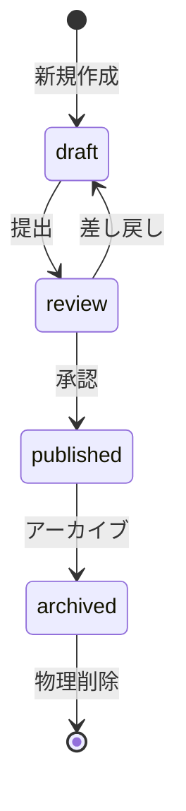

# ai-monitor テンプレート: 状態遷移

**特定エンティティが取りうる状態と、許可された状態遷移** を集約する書式。
シナリオが「1 つの操作フローを時系列で書く」のに対し、状態遷移図は「そのエンティティが持ちうる全状態と、どの操作でどこに移動できるかのマトリクス」を静的に定義する。

## 配置

**1 エンティティ 1 ファイル**。

- 起点フォルダ: `設計図/状態遷移/`
- 各ファイル: `設計図/状態遷移/{エンティティ名}.md`（例: `設計図/状態遷移/記事.md`）

## 担当セクション一覧

| No | セクション | 必須or条件 | 補足 |
| --- | --- | --- | --- |
| 1 | `## 状態一覧` | 必須 | 全状態のラベル + assignee 等の識別子表 |
| 2 | `## 状態遷移図` | 必須 | Mermaid stateDiagram-v2 で図示 |

## `冒頭リード`

### 記述例

```markdown
# 状態遷移: {エンティティ名}

`{エンティティ名}` が取りうる状態と許可された遷移の一覧。
```

### 補足

- 1〜2 行で対象エンティティを説明する
- 詳細（副作用 / トランザクション境界 / 実装関数）は本ページではなく別ドキュメントに書く

## `## 状態一覧`

### 記述例

```markdown
## 状態一覧

| No | 状態名 | 識別子（値 / ラベル / フラグ） | 備考識別子 |
| --- | --- | --- | --- |
| 1 | 下書き | `status = draft` | - |
| 2 | レビュー中 | `status = review` | - |
| 3 | 公開 | `status = published` | - |
| 4 | アーカイブ | `status = archived` | - |
```

### 補足

**カラム構成:**
- 状態名（業務用語）
- 識別子（実装上の値 / ラベル / フラグ）
- 備考識別子（assignee / 補助ラベル 等、複数の識別子で状態を表す場合）

**カラム名は対象エンティティに合わせて自由に変えてよい**:
- DB エンティティなら `status` カラム値
- GitHub Issue なら `ラベル` + `assignee`
- ワークフローなら `フェーズラベル` + `フラグ`

## `## 状態遷移図`

Mermaid `stateDiagram-v2` で図示する。

### 記述例

````markdown
## 状態遷移図


````
