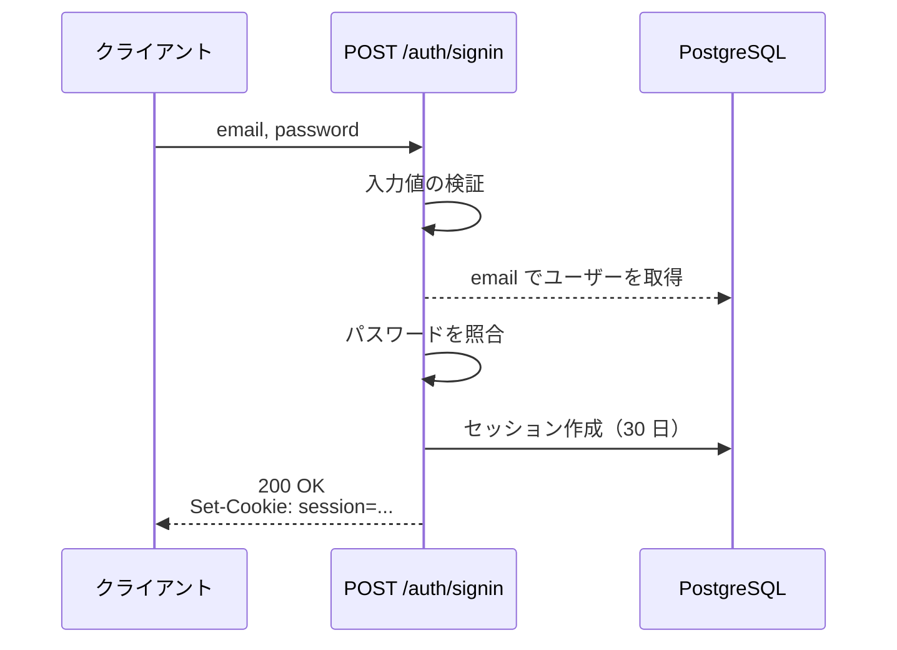
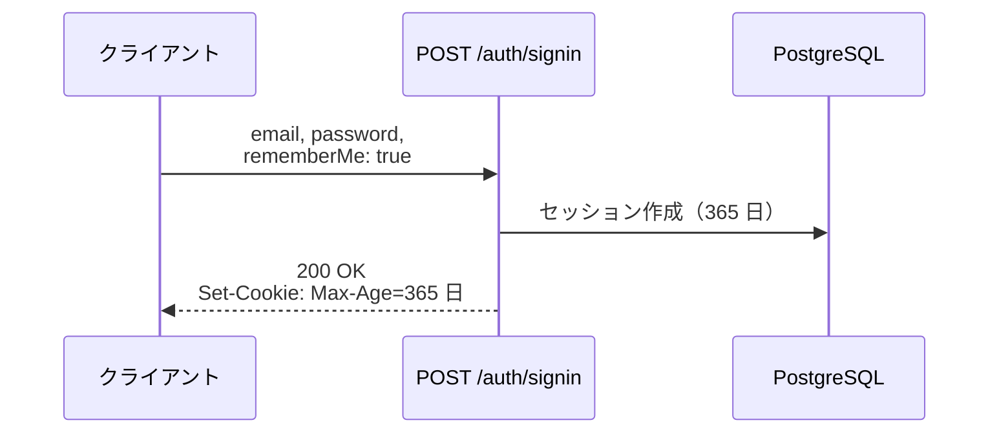
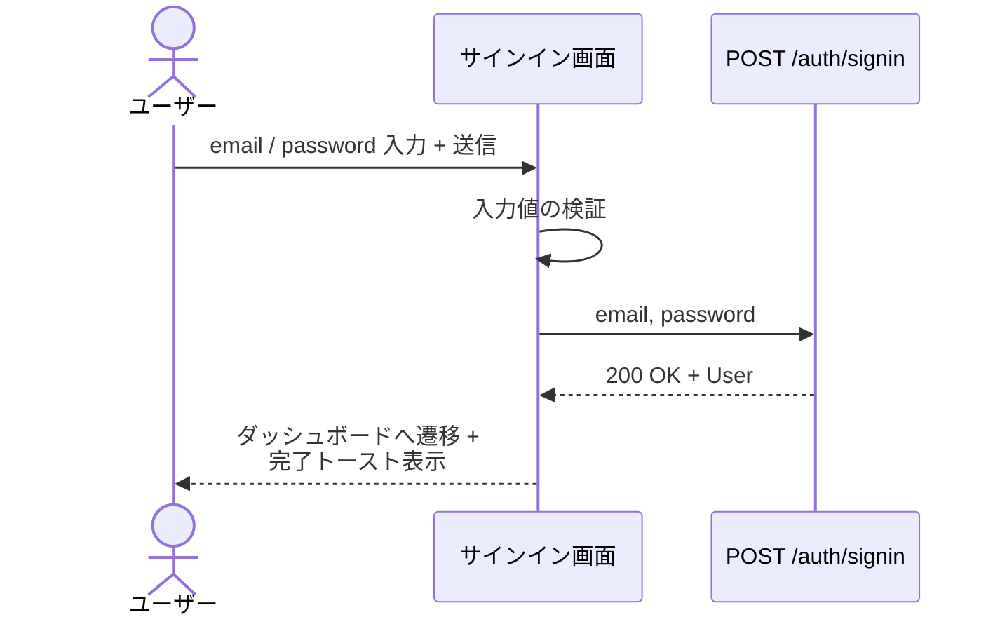
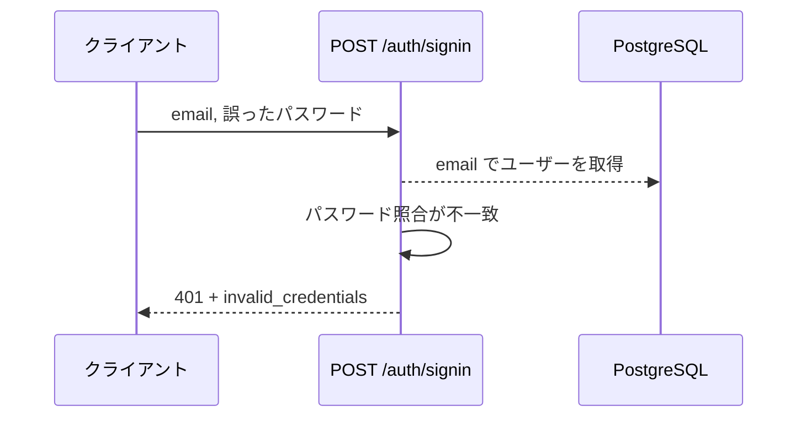
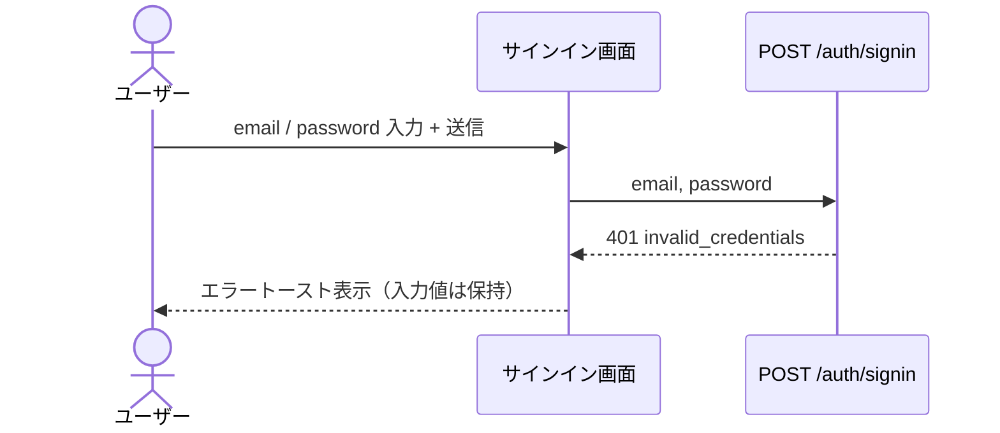

# ai-monitor テンプレート: 結合

**バックエンド結合 / フロントエンド結合** どちらの結合テストにも使う共通テンプレ。
**結合テスト 1 ファイル = 1 操作（API エンドポイント or 画面操作）= 本ドキュメント 1 ファイル**（1:1 対応）。

## 対象別の差分

両者でテンプレ構造は同じ。
違うのは起点 / 終点・Mock 対象・配置先のみ（担当エージェントはどちらも architect）。

| 観点 | バックエンド結合 | フロントエンド結合 |
| --- | --- | --- |
| 呼び出し元の参加者 | `participant クライアント` | `actor ユーザー` |
| Mock 対象 | 外部 DB / 外部 API | バックエンド API |
| 配置フォルダ | `設計図/バックエンド結合/` | `設計図/フロントエンド結合/` |
| ファイル名例 | `サインイン.md`（POST /auth/signin） | `サインイン.md`（画面操作） |
| 対応テストファイル | `tests/integration/api/...` | `tests/integration/screens/...` |

外部依存（DB / 外部 API / バックエンド API）は **Mock 前提**。
実通信は外部疎通テストで別途。

## ファイル構成

`docs/wiki/設計図/{バックエンド結合 or フロントエンド結合}/` 配下に **操作単位の .md をフラットに並べる**（サブフォルダは原則なし）。
README.md でカテゴリー別に分類して索引。

| ファイル | 役割 |
| --- | --- |
| `README.md` | カテゴリー別の索引 |
| `{論理名}.md` | 1 操作の全フロー（正常系 + 異常系） |

ファイル名は **日本語の論理名**（例: `サインイン.md` / `タスク作成.md` / `ユーザー詳細取得.md`）。
業務的な名前で。

配置例（バックエンド結合）:
```
docs/wiki/設計図/バックエンド結合/
├── README.md
├── サインイン.md
├── サインアウト.md
└── ユーザー詳細取得.md
```

配置例（フロントエンド結合）:
```
docs/wiki/設計図/フロントエンド結合/
├── README.md
├── サインイン.md
├── タスク作成.md
└── タスク一覧表示.md
```

ファイル数が多くなったらドメイン別サブフォルダ（例: `認証/` `タスク/`）に分けても可（必須ではない、運用者判断）。

## セクション一覧

| 対象ファイル | セクション | サブセクション | 必須or条件 | 担当 | 補足 |
| --- | --- | --- | --- | --- | --- |
| インデックス | 冒頭リード | - | 必須 | architect | カテゴリー別索引の説明 |
| インデックス | `## {カテゴリ名}` | - | 必須 | architect | カテゴリーごとの操作一覧 |
| 詳細 | 冒頭リード | - | 必須 | architect | 操作概要 + テスト対応 |
| 詳細 | `## インターフェース` | `### リクエスト` / `### レスポンス` / `### ステータスコード` | リクエスト / レスポンスを機械的に検証したい操作（MCP ツール / 公開 API 等） | architect | ステータスコードは HTTP ステータスコードを返す操作のみ |
| 詳細 | `## 入力マッピング` | - | 送信を伴う画面操作（フロントエンド結合のみ） | architect | 画面の入力値と送信リクエストの対応 |
| 詳細 | `## 制約` | - | 必須 | architect | 操作全体にかかる制約（タイムアウト・認可・許可値の定義 等）。関連する項目は「制限なし」でも明記 |
| 詳細 | `## フロー一覧` | - | 必須 | architect | ファイル内の全フローを分類別に索引 |
| 詳細 | `## 正常系` | - | 必須 | architect | 成功フロー（`### セットアップ` → `### フロー` → `### 期待値`）。結末が条件で分かれる場合は `## 正常系（{条件}）` を並べる |
| 詳細 | `## 異常系（{条件}）` | - | 例外パターンごとに 1 | architect | エラー系（API エラー / バリデーション 等）。無ければ `## 異常系` に「なし」とだけ記載 |

## `冒頭リード`（インデックスファイル）

### 記述例

```markdown
# バックエンド結合

バックエンド内 1 エンドポイントごとの処理フロー集。
1 ファイル = 1 エンドポイント = 結合テスト 1 ファイル。
```

### 補足

- 1 行目は `# バックエンド結合` or `# フロントエンド結合`
- カテゴリーは業務ドメイン軸（`認証` / `ユーザー` / `タスク` 等）

## `## {カテゴリ名}`（インデックスファイル）

### 記述例（バックエンド結合）

```markdown
## 認証

| エンドポイント | リンク | 概要 | 補足 |
| --- | --- | --- | --- |
| POST /auth/signin | [サインイン](./サインイン.md) | サインイン | - |
| GET /auth/session | [セッション取得](./セッション取得.md) | セッション取得 | - |
| POST /auth/signout | [サインアウト](./サインアウト.md) | サインアウト | - |
```

### 記述例（フロントエンド結合）

```markdown
## 認証

| 操作 | リンク | 概要 | 補足 |
| --- | --- | --- | --- |
| サインイン | [サインイン](./サインイン.md) | フォーム送信 → サインイン | - |
| サインアウト | [サインアウト](./サインアウト.md) | ヘッダーメニュー → サインアウト | - |
```

### 補足

**カテゴリ列（H2 見出し）:**
- 業務ドメイン軸（`認証` / `ユーザー` / `タスク` / `通知` 等）
- 実装パターン軸（CRUD / フォーム 等）の分類は禁止

**エンドポイント / 操作列:**
- バックエンド: `{METHOD} {パス}` 形式
- フロントエンド: 日本語の業務名

**リンク列:**
- `[表示](./{ファイル名}.md)` 形式

**概要列:**
- 1 行で操作の中身を要約

### 補足
- カテゴリ内は依存の上流から下流の順
- 新規操作追加時は **必ずこの索引にも 1 行追加**（手動更新）

## `冒頭リード`（詳細ファイル）

### 記述例（バックエンド結合）

```markdown
# サインイン

エンドポイント: POST /auth/signin

メール + パスワードでサインインし、セッション Cookie を発行する。

- 対応テストファイル: `tests/integration/auth/signin.spec.ts`
```

### 記述例（フロントエンド結合）

```markdown
# サインイン

画面: `app/(auth)/signin/page.tsx`
呼び出し API: POST `/auth/signin`（Mock）

サインインフォームでメール / パスワードを入力 → API 呼出 → セッション Cookie 取得 → ダッシュボードへ遷移する操作。

- 対応テストファイル: `tests/integration/screens/signin.spec.tsx`
```

### 補足

- 1 行目は **日本語の論理名**（ファイル名と一致）
- メタ情報（バック: `エンドポイント:` / フロント: `画面:` + `呼び出し API:`）を 2 行目以降に併記
- 対応する結合テストファイルへの相対参照を書く（1:1 対応の証跡）

## `## インターフェース`（詳細ファイル）

操作のリクエスト / レスポンスを表で確定する。
冒頭リードの直後・フロー一覧の前に置く。

### 記述例

````markdown
## インターフェース

### リクエスト

| パラメータ | 型 | 必須 | デフォルト | 説明 | 制限 | 補足 |
| --- | --- | --- | --- | --- | --- | --- |
| `title` | string | ✅ | - | タスク名 | 100 文字以内 | - |
| `priority` | `"low"` \| `"medium"` \| `"high"` | - | `"medium"` | 優先度 | - | - |
| `dueDate` | string | - | なし（期限なしで作成） | 期限（ISO 8601） | - | - |
| `tags` | string[] | - | `[]` | 分類タグ | 10 件以内 | - |
| `subtasks` | object[] | - | `[]` | サブタスクの配列 | - | - |
| `subtasks[].title` | string | ✅ | - | サブタスク名 | 100 文字以内 | - |
| `subtasks[].assigneeId` | string | - | なし（未割り当て） | 担当ユーザー ID | - | - |

リクエスト例:

```json
{
  "title": "決算資料の作成",
  "priority": "high",
  "tags": ["経理", "四半期"],
  "subtasks": [
    { "title": "売上集計", "assigneeId": "user_01" },
    { "title": "レビュー依頼" }
  ]
}
```

### レスポンス

| フィールド | 型 | 説明 | 制限 | 補足 |
| --- | --- | --- | --- | --- |
| `task` | object | 作成されたタスク | - | - |
| `task.id` | string | タスク ID | - | UUID |
| `task.status` | `"todo"` \| `"doing"` \| `"done"` | 状態 | - | 作成直後は `"todo"` |
| `task.subtasks` | object[] | 採番済みサブタスク | - | - |
| `task.subtasks[].id` | string | サブタスク ID | - | UUID |
| `task.subtasks[].title` | string | サブタスク名 | - | - |

レスポンス例:

```json
{
  "task": {
    "id": "3f2b1c88-...",
    "status": "todo",
    "subtasks": [
      { "id": "9a1c4e02-...", "title": "売上集計" },
      { "id": "b24d7f56-...", "title": "レビュー依頼" }
    ]
  }
}
```

### ステータスコード

| ステータスコード | 発生条件 | 補足 |
| --- | --- | --- |
| `201` | 作成成功 | - |
| `400` | リクエストのバリデーション失敗 | - |
| `401` | 未認証 | - |
| `500` | DB 書き込み失敗 | - |

````

### 補足

**採用条件:**
- リクエスト / レスポンスを機械的に検証したい操作（MCP ツール / 公開 API 等）に付ける

**`### リクエスト` / `### レスポンス`:**
- 本セクションがインターフェース定義の SoT（一覧ページ側は概要のみ）
- 型は実装言語の型名で書く。
  取りうる値が限定される場合はリテラルの列挙で書く（`"low"` \| `"medium"` \| `"high"`）
- ネストしたオブジェクト / 配列はパス表記で 1 フィールド = 1 行に展開する（オブジェクトの子は `task.status`、配列要素の子は `subtasks[].title`）
- デフォルト列は省略時に適用される値。
  必須パラメータは `-`、省略可能でデフォルト値が無いものは `なし（{省略時の挙動}）`
- 制限列は当該フィールド単体にかかる上限・形式（`100 文字以内` / `5MB 以内` / `先頭 100 件` 等）。
  無ければ `-`。
  複数フィールドにまたがる制約・操作全体の制約は `## 制約` に書く
- 表の直後に `リクエスト例:` / `レスポンス例:` を JSON コードブロックで書く（ネスト構造の実形が分かる代表 1 ケース）
- レスポンスの表・例の直下には `**補足:**` の太字ラベル + 箇条書きを置いてよい（冪等性など表に載らない挙動。補足を置けるのはここだけ）
- 認可等の操作全体の制約は `## 制約` で定義し、違反時の挙動を `## 異常系` のフローで表現する

**`### ステータスコード`:**
- HTTP ステータスコードを返す操作（REST API・Webhook 等）に付ける。
  レスポンスの直後に置く
- 操作が返しうるコードを正常・異常とも網羅する（`ステータスコード / 発生条件 / 補足` の 3 列）
- 異常のコードは対応する `## 異常系（{原因}・{コード}）` の H2 と整合させる

## `## 入力マッピング`（詳細ファイル・フロントエンド結合のみ）

画面の入力値が送信リクエストのどのフィールドに入るかを表で確定する。
冒頭リードの直後・フロー一覧の前に置く。

### 記述例

```markdown
## 入力マッピング

| 画面要素 | 送信先 | 加工 | 補足 |
| --- | --- | --- | --- |
| タスク名入力欄 | `タスク作成.title` | - | - |
| 優先度選択 | `タスク作成.priority` | - | - |
| 期限入力欄 | `タスク作成.dueDate` | ISO 8601 文字列に変換 | - |
| サブタスク入力行 | `タスク作成.subtasks[].title` | 空行を除外して配列化 | - |
```

### 補足

**採用条件:**
- 送信（作成・更新・削除のリクエスト発行）を伴う画面操作に付ける

**画面要素列:**
- `設計図/画面構成/{画面名}.md` の要素一覧の要素名と一致させる

**送信先列:**
- `{バックエンド結合の論理名}.{フィールドパス}` 形式（例: `タスク作成.subtasks[].title`）

**加工列:**
- 入力値をそのまま送る場合は `-`、変換・合成・除外がある場合にその内容を書く

## `## 制約`（詳細ファイル）

操作全体にかかる制約（単一のパラメータに閉じない項目）を表で確定する。
インターフェース / 入力マッピングの直後・フロー一覧の前に置く。

### 記述例

```markdown
## 制約

| 項目 | 制約 | 補足 |
| --- | --- | --- |
| タイムアウト | 制限なし | - |
| 認可 | サインイン済みユーザーのみ作成可 | 違反時は 異常系（未認証・401） |
| 添付合計サイズ | 20MB 以内 | 個別ファイルの上限はリクエスト表の制限列 |
```

### 補足

**項目列:**
- タイムアウト / 認可（ロール・権限）/ レート制限 / 合計サイズ / 許可値の定義 など、操作全体として表現する制約
- **その操作に関連する項目は、制約を設けない場合も 1 行置いて「制限なし」と明記する**
- 単一パラメータに閉じる上限（文字数・ファイルサイズ 等）はリクエスト / レスポンス表の制限列に書く

**制約列:**
- 制約を設ける目的は「処理が深く進んでから下流（ライブラリ / 外部 API）でエラーになる入力を、インターフェース境界で弾いてリソースの浪費を防ぐ」こと。
  下流に該当する制約がない・実際に起こり得ない場合は無理に数値を決めず「制限なし」と書く
- 違反時の挙動は対応する `## 異常系（{条件}）` のフローで表現する

## `## フロー一覧`（詳細ファイル）

ファイル内の全フローを分類別に索引化。
インターフェース / 入力マッピング（ない場合は冒頭リード）の直後に置く。

### 記述例

```markdown
## フロー一覧

| 分類 | フロー名 | 概要 | 補足 |
| --- | --- | --- | --- |
| 正常 | 正常系 | 成功時のサインイン処理 | - |
| 正常 | 正常系（Remember Me 有効時） | 365 日 cookie に切り替え | - |
| 異常 | 異常系（パスワード不一致・401） | bcrypt 照合失敗 → 401 返却 | - |
| 異常 | 異常系（DB 書き込み失敗・500） | セッション作成失敗 → 500 返却 | 監視対象 |
```

### 補足

**分類列:**
- `正常` / `異常` の 2 種類のみ
- 成功フローの `正常系` は正常分類で **1 つだけ**

**フロー名列:**
- メインの成功フローは `正常系` 固定
- 正常分類の派生フローは `正常系（{条件}）`（例: `正常系（Remember Me 有効時）`）
- 異常分類は `異常系（{原因}）`（例: `異常系（パスワード不一致・401）`）
- 後段の H2 見出しと完全一致させる

**概要列:**
- 1 行でフローの中身を要約

### 補足
- 順序は `正常（正常系 → 正常系（{条件}））→ 異常` のカテゴリ順
- 結合テストの 1 ケース = 1 フロー（1 行）に対応
- ファイル内のフロー数が一目で分かるため、テストカバレッジの俯瞰用にも使える

## `## 正常系`（詳細ファイル）

成功フロー。
**1 操作 = 1 つの `## 正常系`** が原則で、正常な結末が条件で分かれる場合は `## 正常系（{条件}）` の H2 を並べる。
中身はシナリオと同じ構造（`### セットアップ` → `### フロー` → `### 期待値`）。
**フローセクション（正常系 / 異常系）に補足セクション（`### 補足` / `**補足:**`）を勝手に作らない** — 期待値として確認できることは期待値に書き、それ以外は書かない。

### 記述例（バックエンド結合）

````markdown
## 正常系

### セットアップ

| セットアップ | 説明 | 補足 |
| --- | --- | --- |
| Mock | `PostgreSQL` を DB stub に差し替え | - |
| ユーザー | `taro@example.com` のユーザーを登録済み | パスワードは bcrypt ハッシュで保存 |

### フロー



### 期待値

- `200 OK` + `Set-Cookie: session=...` が返る
- sessions テーブルに TTL 30 日のセッションレコードが作成されている

## 正常系（Remember Me 有効時）

### セットアップ

| セットアップ | 説明 | 補足 |
| --- | --- | --- |
| Mock | `PostgreSQL` を DB stub に差し替え | - |
| ユーザー | `taro@example.com` のユーザーを登録済み | - |
| 入力 | `rememberMe: true` を含めて送信 | 分岐を決定的に誘発 |

### フロー



### 期待値

- `Set-Cookie` の `Max-Age` が 365 日相当になっている
````

### 記述例（フロントエンド結合）

````markdown
## 正常系

### セットアップ

| セットアップ | 説明 | 補足 |
| --- | --- | --- |
| Mock | `POST /auth/signin` が 200 OK + User を返す | MSW |

### フロー



### 期待値

- ダッシュボードへ遷移し、完了トーストが表示されている
````

### 補足

**`{条件}` の付け方（正常系の派生）:**
- 業務的な分岐条件を日本語で（`Remember Me 有効時` / `初回ログイン時` 等）

**`### セットアップ`:**
- シナリオと同じ **セットアップ / 説明 / 補足 の 3 列表**
- 事前に必要なデータ・状態と、分岐 / 異常を決定的に誘発する入力を仕込む
- **Mock 行を必ず置く**: セットアップ名 `Mock` の行で、差し替える依存とその応答を書く（差し替えないフローも `Mock | なし` を置く。実装側がどれを Mock にするかの宣言）
- 前提が他にない場合も Mock 行だけの表を置く

**`### フロー`:**
- **Mermaid `sequenceDiagram`** で書く（単一 UC シナリオと同じ文法・規約）
- 呼び出し元: バックエンド = `participant クライアント` / フロントエンド = `actor ユーザー`（`actor` = 人間、`participant` = 観測可能なシステム境界）
- **登場人物は 呼び出し元 / インターフェース（エンドポイント・ツール名・画面名）/ 外部システム境界（DB・外部 API 等）のみ**。
  内部処理はインターフェースの自己メッセージ（`IF->>IF: 入力値の検証`）で表現し、何をするかはメッセージに書く（関数名・ファイル名・クラス名などの物理名はモジュール構成の領分）
- **読み取り（参照・再取得）と応答は点線 `-->>`、書き込み・操作は実線 `->>`** で描く
- **1 図 = 結末 1 本の一本道**で書く。
  結末が分かれる条件分岐は別フロー（`## 正常系（{条件}）` / `## 異常系（{条件}）`）に切り出し、セットアップに分岐を決定的に誘発する入力・状態を仕込む。
  分岐の存在を図に残す場合は `alt` を使い、切り出した側の枝には `Note over {対象}: {フロー名}参照` の 1 行だけを置く
- メッセージが全角 24 文字相当を超える場合は `<br>` で折り返す。
  メッセージ内の `#` は `#35;` とエスケープする

**`### 期待値`（フローの直下）:**
- フローの直後に `### 期待値` を書く（結合テストのアサートの元）
- フロー終了時点で外部から観測できる状態・戻り値を書く（バック: レスポンス + DB / GitHub の状態、フロント: DOM / 遷移 / 表示）

**結合テストとの対応:**
- 各 H2 = 結合テストの 1 ケース（セットアップ = 事前準備・フロー = 操作・期待値 = assert）
- テスト関数名はフロー名と機械対応させる（`正常系` → `test_normal` / `正常系（{条件}）` → `test_normal_when_{条件}` / `異常系（{条件}）` → `test_error_when_{条件}`）
- Mock 対象の参加者はテストで MSW / fetch stub / DB stub に置換

## `## 異常系（{条件}）`（詳細ファイル）

例外発生時のフロー（バリデーション / 認証失敗 / API エラー / ネットワーク 等）。
例外パターンごとに H2 を並べ、中身は正常系と同じ構造（`### セットアップ` → `### フロー` → `### 期待値`）。
セットアップに失敗を決定的に誘発する入力・状態を仕込む。
異常が無い操作でも `## 異常系` を 1 つ残して本文に「なし」とだけ記載する。

### 記述例（バックエンド結合）

````markdown
## 異常系（パスワード不一致・401）

### セットアップ

| セットアップ | 説明 | 補足 |
| --- | --- | --- |
| Mock | `PostgreSQL` を DB stub に差し替え | - |
| ユーザー | `taro@example.com` のユーザーを登録済み | - |
| 入力 | 誤ったパスワードで送信 | 照合失敗を決定的に誘発 |

### フロー



### 期待値

- `401` + `invalid_credentials` が返る
- セッションレコードは作成されていない
````

### 記述例（フロントエンド結合）

````markdown
## 異常系（サインイン失敗・API 401）

### セットアップ

| セットアップ | 説明 | 補足 |
| --- | --- | --- |
| Mock | `POST /auth/signin` が 401 を返す | MSW |

### フロー



### 期待値

- エラートースト「メールまたはパスワードが違います」が表示されている
- フォームの入力値は保持されている
````

### 補足

**`{条件}` の付け方:**
- バックエンド: 原因 + ステータスコード（`パスワード不一致・401` / `DB 書き込み失敗・500`）
- フロントエンド: 業務 + 種別（`サインイン失敗・API 401` / `入力エラー・バリデーション` / `ネットワークエラー`）

**書くべき内容:**
- どこで例外が発生し、出口に何が出るかを図で示す（バック: ステータス + ボディ / フロント: toast / インラインエラー / リダイレクト）
- 期待値には副作用が起きていないこと（DB 未作成・状態不変 等）も含める
- フロントはネットワークエラー（fetch reject）も別 H2 で記述する
- リトライ / リダイレクト等の副作用は図に含める
