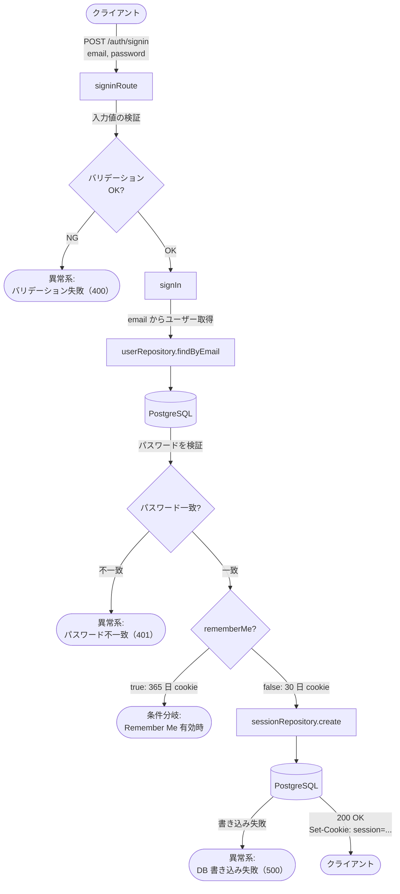
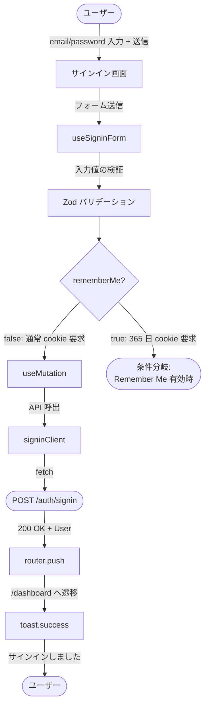
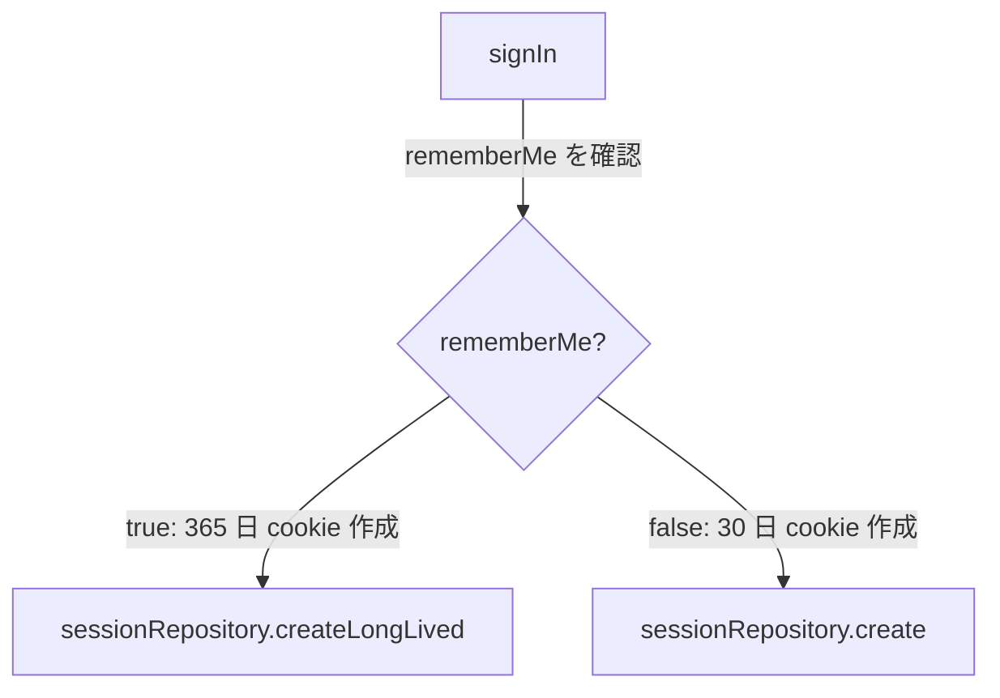
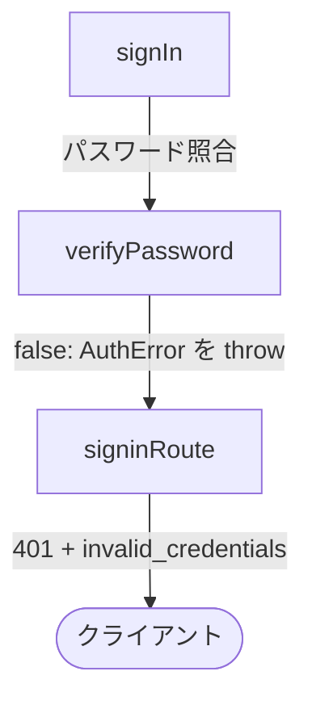
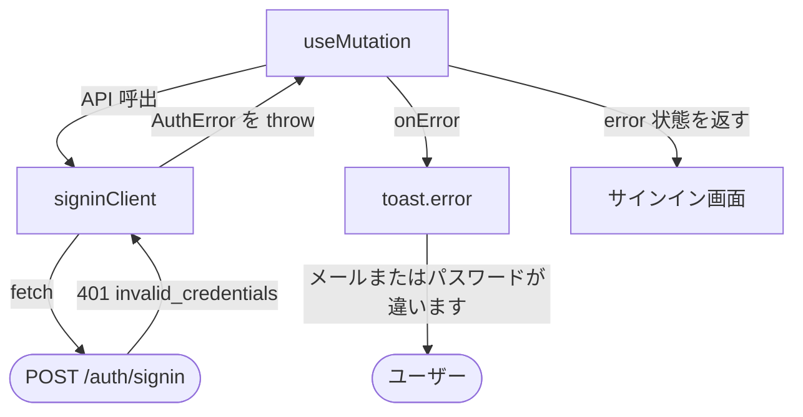

# ai-monitor テンプレート: 結合

**バックエンド結合 / フロントエンド結合** どちらの結合テストにも使う共通テンプレ。
**結合テスト 1 ファイル = 1 操作（API エンドポイント or 画面操作）= 本ドキュメント 1 ファイル**（1:1 対応）。

## 対象別の差分

両者でテンプレ構造は同じ。違うのは起点 / 終点・Mock 対象・配置先・担当モニターのみ。

| No | 観点 | バックエンド結合 | フロントエンド結合 |
| --- | --- | --- | --- |
| 1 | 起点 / 終点ノード | `([クライアント])` × 2 | `([ユーザー])` × 2 |
| 2 | 担当モニター | pr-arch | pr-ui |
| 3 | Mock 対象 | 外部 DB / 外部 API | バックエンド API |
| 4 | 図のシェイプ | `[(DB)]` / `([API])` | `([API])` のみ |
| 5 | 配置フォルダ | `設計図/バックエンド結合/` | `設計図/フロントエンド結合/` |
| 6 | ファイル名例 | `サインイン.md`（POST /auth/signin） | `サインイン.md`（画面操作） |
| 7 | 対応テストファイル | `tests/integration/api/...` | `tests/integration/screens/...` |
| 8 | 関連実装の種類 | route / service / repository | コンポーネント / フック / API クライアント |

外部依存（DB / 外部 API / バックエンド API）は **Mock 前提**。実通信は外部疎通テストで別途。

## ファイル構成

`docs/wiki/設計図/{バックエンド結合 or フロントエンド結合}/` 配下に **操作単位の .md をフラットに並べる**（サブフォルダは原則なし）。
README.md でカテゴリー別に分類して索引。

| No | ファイル | 役割 |
| --- | --- | --- |
| 1 | `README.md` | カテゴリー別の索引 |
| 2 | `{論理名}.md` | 1 操作の全フロー（メイン + 条件分岐 + 異常系） |

ファイル名は **日本語の論理名**（例: `サインイン.md` / `タスク作成.md` / `ユーザー詳細取得.md`）。業務的な名前で。

配置例（バックエンド結合）:
```
docs/wiki/設計図/バックエンド結合/
├── README.md
├── サインイン.md
├── サインアウト.md
└── ユーザー詳細取得.md
```

配置例（フロントエンド結合）:
```
docs/wiki/設計図/フロントエンド結合/
├── README.md
├── サインイン.md
├── タスク作成.md
└── タスク一覧表示.md
```

ファイル数が多くなったらドメイン別サブフォルダ（例: `認証/` `タスク/`）に分けても可（必須ではない、運用者判断）。

## 担当セクション一覧

| No | 対象ファイル | セクション | サブセクション | 必須or条件 | 担当 | 補足 |
| --- | --- | --- | --- | --- | --- | --- |
| 1 | インデックス | 冒頭リード | - | 必須 | pr-arch / pr-ui | カテゴリー別索引の説明 |
| 2 | インデックス | `## {カテゴリ名}` | - | 必須 | 〃 | カテゴリーごとの操作一覧 |
| 3 | 詳細 | 冒頭リード | - | 必須 | 〃 | 操作概要 + テスト対応 + 関連実装 |
| 4 | 詳細 | `## フロー一覧` | - | 必須 | 〃 | ファイル内の全フローを分類別に索引 |
| 5 | 詳細 | `## メインフロー` | `### 図` | 必須 | 〃 | 正常系の主シナリオ |
| 6 | 詳細 | `## 条件分岐` | `### {条件名}` × N（中に `#### 図`） | 条件分岐あり時 | 〃 | 正常系の派生フロー |
| 7 | 詳細 | `## 異常系` | `### {エラー名}` × N（中に `#### 図`） | 例外あり時 | 〃 | エラー系（API エラー / バリデーション 等） |

## `冒頭リード`（インデックスファイル）

### 記述例

```markdown
# バックエンド結合

バックエンド内 1 エンドポイントごとの処理フロー集。
1 ファイル = 1 エンドポイント = 結合テスト 1 ファイル。
```

### 補足

- 1 行目は `# バックエンド結合` or `# フロントエンド結合`
- カテゴリーは業務ドメイン軸（`認証` / `ユーザー` / `タスク` 等）

## `## {カテゴリ名}`（インデックスファイル）

### 記述例（バックエンド結合）

```markdown
## 認証

| No | エンドポイント | リンク | 概要 | 補足 |
| --- | --- | --- | --- | --- |
| 1 | POST /auth/signin | [サインイン](./サインイン.md) | サインイン | - |
| 2 | GET /auth/session | [セッション取得](./セッション取得.md) | セッション取得 | - |
| 3 | POST /auth/signout | [サインアウト](./サインアウト.md) | サインアウト | - |
```

### 記述例（フロントエンド結合）

```markdown
## 認証

| No | 操作 | リンク | 概要 | 補足 |
| --- | --- | --- | --- | --- |
| 1 | サインイン | [サインイン](./サインイン.md) | フォーム送信 → サインイン | - |
| 2 | サインアウト | [サインアウト](./サインアウト.md) | ヘッダーメニュー → サインアウト | - |
```

### 補足

**カテゴリ列（H2 見出し）:**
- 業務ドメイン軸（`認証` / `ユーザー` / `タスク` / `通知` 等）
- 実装パターン軸（CRUD / フォーム 等）の分類は禁止

**エンドポイント / 操作列:**
- バックエンド: `{METHOD} {パス}` 形式
- フロントエンド: 日本語の業務名

**リンク列:**
- `[表示](./{ファイル名}.md)` 形式

**概要列:**
- 1 行で操作の中身を要約

**補足:**
- カテゴリ内は依存の上流から下流の順
- 新規操作追加時は **必ずこの索引にも 1 行追加**（手動更新）

## `冒頭リード`（詳細ファイル）

### 記述例（バックエンド結合）

```markdown
# サインイン

エンドポイント: POST /auth/signin

メール + パスワードでサインインし、セッション Cookie を発行する。

対応テストファイル: `tests/integration/auth/signin.spec.ts`
関連実装: `auth/route.ts` / `auth/service.ts` / `users/repository.ts`
```

### 記述例（フロントエンド結合）

```markdown
# サインイン

画面: `app/(auth)/signin/page.tsx`
呼び出し API: POST `/auth/signin`（Mock）

サインインフォームでメール / パスワードを入力 → API 呼出 → セッション Cookie 取得 → ダッシュボードへ遷移する操作。

対応テストファイル: `tests/integration/screens/signin.spec.tsx`
関連実装: `app/(auth)/signin/SigninScreen.tsx` / `app/(auth)/signin/useSigninForm.ts` / `shared/api/auth.ts`
```

### 補足

- 1 行目は **日本語の論理名**（ファイル名と一致）
- メタ情報（バック: `エンドポイント:` / フロント: `画面:` + `呼び出し API:`）を 2 行目以降に併記
- 対応する結合テストファイルへの相対参照を必ず書く（1:1 対応の証跡）
- 関連実装ファイル（モジュール構成と整合）

## `## フロー一覧`（詳細ファイル）

ファイル内の全フローを分類別に索引化。冒頭リードの直後に置く。

### 記述例

```markdown
## フロー一覧

| No | 分類 | フロー名 | 概要 | 補足 |
| --- | --- | --- | --- | --- |
| 1 | 正常 | メイン | 成功時のサインイン処理 | - |
| 2 | 正常 | Remember Me 有効時 | 365 日 cookie に切り替え | メインフローの `signIn` から分岐 |
| 3 | 異常 | パスワード不一致（401） | bcrypt 照合失敗 → 401 返却 | - |
| 4 | 異常 | DB 書き込み失敗（500） | セッション作成失敗 → 500 返却 | 監視対象 |
```

### 補足

**分類列:**
- `正常` / `異常` の 2 種類のみ
- メインフローは正常分類で **1 つだけ**（成功シナリオの基本）

**フロー名列:**
- メインフローは `メイン` 固定
- 正常分類の派生フロー（条件分岐）は **条件名そのものをフロー名に**（例: `Remember Me 有効時` / `初回ログイン時`）
- 異常分類は `{原因}（{ステータスコード or 種別}）` 形式が望ましい
- 後段の `### {条件名}` `### {エラー名}` と完全一致させる

**概要列:**
- 1 行でフローの中身を要約

**補足:**
- 順序は `正常（メイン → 条件分岐）→ 異常` のカテゴリ順
- 結合テストの 1 ケース = 1 フロー（1 行）に対応
- ファイル内のフロー数が一目で分かるため、テストカバレッジの俯瞰用にも使える

## `## メインフロー`（詳細ファイル）

成功シナリオ。**1 操作 = 1 メインフロー** が原則。

### 記述例（バックエンド結合）

````markdown
## メインフロー

### 図



### 補足（任意）

- セッション TTL = 30 日（Remember Me 有効時は別フロー: [#remember-me-有効時]）
- Cookie は HttpOnly / Secure / SameSite=Lax
- パスワード照合は bcrypt
- 異常系の詳細: [#パスワード不一致401] / [#バリデーション失敗400] / [#db-書き込み失敗500]
````

### 記述例（フロントエンド結合）

````markdown
## メインフロー

### 図



### 補足（任意）

- API は MSW で Mock 化（200 OK + User オブジェクト返却）
- `useMutation` の `onSuccess` で `router.push` と `toast.success` を呼ぶ
- セッション Cookie はサーバが Set-Cookie ヘッダーで返す（クライアント側は意識しない）
- Remember Me 有効時は別フロー: [#remember-me-有効時]
````

### 補足

**`### 図`:**
- **Mermaid `flowchart TD` で縦一本線スタイル**（上から下に流れる）
- 起点 / 終点ノードは **上下に 2 つ** 置く（上: 入口 / 下: 出口）
  - バックエンド: `([クライアント])` / フロントエンド: `([ユーザー])`
- 中間ノードは **戻り値の枝分かれを書かず、データが下流に流れるように一本線で繋ぐ**
- リクエスト / レスポンス / 操作 / 表示の内容は **矢印ラベル** で表現
- Mock 対象は **シェイプで区別**
  - バックエンド DB: `[(DB)]`
  - 外部 API（バック/フロント共通）: `([API])`
- ブラウザ API（router / toast / localStorage 等）も明示する（テストで spy/stub するため）
- フロント特例: **画面コンポーネントは日本語論理名で書く**（例: `サインイン画面` / `ユーザー編集画面` / `タスク一覧画面`）。フック / 関数 / API クライアントは実名のまま
- **条件分岐 / 異常系 は両方ともメインフロー図内に分岐点として明示する**
  - 条件分岐: `{条件?}` 菱形 → 通常パス + 参照ノード `([条件分岐:<br/>{条件名}])`
  - 異常系: `{チェック OK?}` 菱形 → OK 側で通常パス + NG 側で参照ノード `([異常系:<br/>{エラー名}])`
  - 参照ノードはターミナル化（その先を書かない）→ 詳細は `## 条件分岐` / `## 異常系` セクションに任せる
  - 補足にもリンク注記を入れる（例: `異常系の詳細: [#パスワード不一致401] / [#db-書き込み失敗500]`）

- **ネスト構造（条件分岐の中にさらに分岐がある場合）は 1 段ずつ展開**
  - メインフロー → 条件分岐 A の存在のみ示す（参照ノードで止める）
  - 条件分岐 A の詳細図 → その中で条件分岐 B / 異常系の存在を示す（参照ノードで止める）
  - 条件分岐 B の詳細図 → さらに分岐があれば同様
  - **各セクションでは「自分の階層 + 1 段下の分岐の存在」だけ書く**（孫以下は書かない）
- 矢印ラベルは **要所要所** に日本語で「何をするか」を書く（全矢印には付けない）

**`### 補足`（任意）:**
- 図に書ききれない注意事項（TTL / Cookie 属性 / Mock の振る舞い / 副作用 等）を箇条書きで
- 不要なら本文に「なし」と記載する（セクション自体は残す）

**結合テストとの対応:**
- 図の入口（上のノード）= リクエスト送信 or ユーザー操作シミュレート
- 図の出口（下のノード）= レスポンス検証 or 表示更新確認（DOM アサート + router/toast の spy 検証）
- Mock 対象ノードはテストで MSW / fetch stub / DB stub に置換

## `## 条件分岐`（詳細ファイル）

パラメータやデータ状態によって **処理経路が変わる** ケース（正常系の派生）。条件ごとに `### {条件名}`。

### 記述例

````markdown
## 条件分岐

### Remember Me 有効時

メインフローの `signIn` で `rememberMe: true` がリクエストに含まれている場合。

#### 図



以降はメインフローと同じ（Set-Cookie の `Max-Age` だけ異なる）。
````

### 補足

**分岐名の付け方:**
- 業務的な分岐条件を日本語で（`Remember Me 有効時` / `初回ログイン時` 等）

**繋ぎ方:**
- 冒頭で「メインフローの `{ノード名}` で〜の場合」を明記
- 合流するなら末尾に「以降はメインフローと同じ」を書く

**結合テストとの対応:**
- 各条件分岐 = 結合テストの 1 ケース

## `## 異常系`（詳細ファイル）

例外発生時のフロー（バリデーション / 認証失敗 / API エラー / ネットワーク 等）。エラーごとに `### {エラー名}`。

### 記述例（バックエンド結合）

````markdown
## 異常系

### パスワード不一致（401）

#### 図


````

### 記述例（フロントエンド結合）

````markdown
## 異常系

### サインイン失敗（API 401）

#### 図


````

### 補足

**エラー名の付け方:**
- バックエンド: 例外名 + ステータスコード（`パスワード不一致（401）` / `DB 書き込み失敗（500）`）
- フロントエンド: 業務 + 種別（`サインイン失敗（API 401）` / `入力エラー（バリデーション）` / `ネットワークエラー`）

**書くべき内容:**
- どこで例外が発生するか
- どう上位へ伝搬するか（throw / wrap / catch / error 状態）
- 出口に何が出るか（バック: ステータス + ボディ / フロント: toast / インラインエラー / リダイレクト）

**結合テストとの対応:**
- 各異常系 = 結合テストの 1 ケース

**補足:**
- フロント: ネットワークエラー（fetch reject）も別 `### {エラー名}` で記述
- リトライ / リダイレクト等の副作用は必ず図に含める
