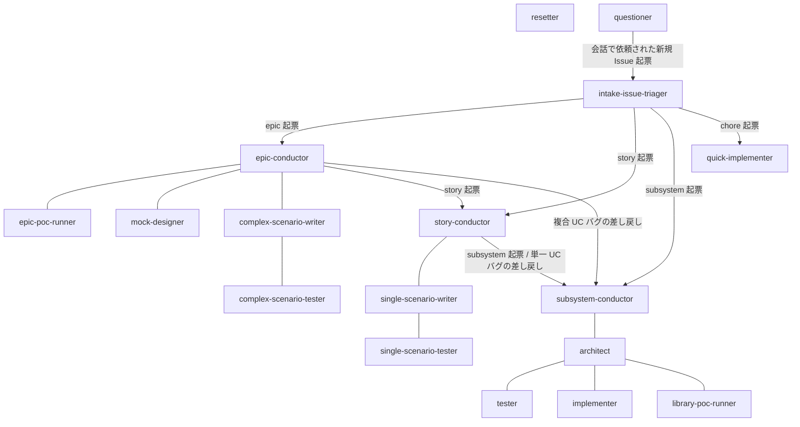

# エージェント組織図

エージェント間の指揮系統と連絡網（誰が誰を認知して `確認:{宛先}` + `@{宛先}` 宛コメントを送れるか）の SoT。
指揮系統は再帰構造で、**各エージェントは自分の親と子とだけやり取りする**（上位 → 下位は指示・タスク割り当て、下位 → 上位は完了報告・差し戻し報告）。
レイヤーを跨ぐ連絡（バグ差し戻し・エスカレーション）は conductor 同士で行い、worker はレイヤーを跨がない。
エスカレーションは指揮系統を 1 段ずつ遡り、中継する指揮役は要約 + 元コメントへのリンクを添えて上位へ渡す。
ユーザーは全 Issue / PR の応答ループで任意のエージェントと会話できるため、図と表からは省略する。

## 組織図

実線 = 指揮系統（指示 ⇄ 報告）。
矢印 = 子 Issue の起票（作成のみで以降の会話なし）。

## 連絡先一覧

| エージェント | 連絡できる相手 | 連絡の内容 |
| --- | --- | --- |
| intake-issue-triager | epic / story / subsystem-conductor・quick-implementer | サブ Issue 起票 + 確認ラベル付与（以降の会話なし） |
| epic-conductor | epic-poc-runner / mock-designer / complex-scenario-writer / story-conductor（起票） / subsystem-conductor（起票） | 各子への指示・タスク割り当て（PoC 再検証 / モック / シナリオ設計 / 統合テストの委任）・子 story 起票・複合 UC バグの subsystem への差し戻し・epic → master マージの実行 |
| story-conductor | single-scenario-writer / subsystem-conductor（起票） / epic-conductor | 各子への指示・タスク割り当て（シナリオ設計 / 統合テストの委任）・子 subsystem の直列起票・単一 UC バグの subsystem への差し戻し・story → epic マージの実行・上位への完了報告・エスカレーションの中継 |
| subsystem-conductor | architect / story-conductor | architect への一式委任（設計〜実装レビュー）・マージ起動 + subsystem → story マージの実行・上位への完了報告・インターフェース確定報告 / エスカレーションの中継 |
| epic-poc-runner | epic-conductor | 完了報告 |
| mock-designer | epic-conductor | 完了報告 |
| complex-scenario-writer | epic-conductor・complex-scenario-tester | 完了報告（シナリオ設計 / 全 pass）・失敗報告（トリアージ後）・配下テスターへのタスク割り当て（実装 / 実行 / 指摘対応） |
| complex-scenario-tester | complex-scenario-writer | 完了報告（テスト実装 / 全 pass）・失敗報告 |
| single-scenario-writer | story-conductor・single-scenario-tester | 完了報告（シナリオ設計 / 全 pass）・失敗報告（トリアージ後）・配下テスターへのタスク割り当て（実装 / 実行 / 指摘対応） |
| single-scenario-tester | single-scenario-writer | 完了報告（テスト実装 / 全 pass）・失敗報告 |
| architect | subsystem-conductor・tester・implementer・library-poc-runner | 一式完了報告・インターフェース確定報告・エスカレーション・配下 worker へのタスク割り当て（テスト作成 / 実装 / 指摘対応 / 設計修正後の再開）・PoC 検証の発注 / 再発注 |
| library-poc-runner | architect | 検証の完了報告（発注元 = 検証指示コメントの送信者） |
| tester | architect | 完了報告・差し戻し報告（設計の見直し）・質問 |
| implementer | architect | 完了報告・差し戻し報告（設計レベルの判断）・質問 |
| resetter | - | なし（巻き戻しの確認はユーザーとのみ） |
| quick-implementer | - | なし（自己完結） |
| questioner | intake-issue-triager（起票） | 会話中に依頼された新規 Issue の起票 + 確認ラベル付与（作成のみで以降の会話なし） |
