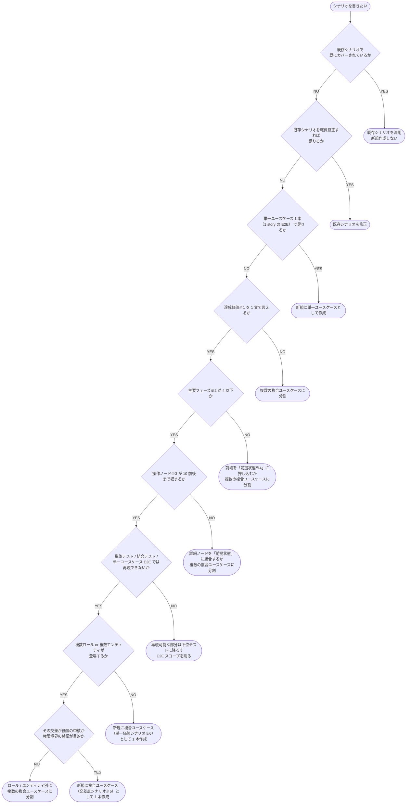

# シナリオ判定フローチャート

- **※1 達成価値**: シナリオが実現するユーザー体験の結果を 1 文で言える単位。例: シナリオ「新規ユーザー登録から初回タスク作成」→ 達成価値=「新規ユーザーがサインアップ・ログインを終えて自分のタスクを 1 件作成できる」。「登録して」「編集して」「削除して」など動詞を複数繋げないと表せない場合は複数価値になっている
- **※2 主要フェーズ**: シナリオを構成する大きな段階。Mermaid の `subgraph` 単位、または論理的なブロック単位。例: 「ユーザー A がタスク作成」「ユーザー B が編集」「ユーザー A が結果確認」の 3 フェーズ。「サインアップ画面 → API 呼び出し → 結果画面」のような細かな UI 遷移は 1 フェーズ内の操作ノードにまとめる
- **※3 操作ノード**: Mermaid `flowchart` 内の 1 個の丸 / 角丸ボックス。ユーザーの 1 操作、または結合ドキュメント 1 件に対応する粒度。「サインアップ画面へ」「フォーム送信」「登録成功」等の 1 ステップ = 1 ノード
- **※4 前提状態**: シナリオ開始時点で既に成立していると仮定する状態。例:「ユーザー A が既にログイン済み」「タスクが 1 件既に存在する」。フローの前段をこれに押し込むと、シナリオ本体をコンパクトに保てる
- **※5 交差点シナリオ**: 複数ロール / 複数エンティティが「交わること自体」が価値になるシナリオ。例: ユーザー A のタスクをユーザー B が編集できるかの権限境界
- **※6 単一価値シナリオ**: 1 ロール 1 エンティティで完結する、シンプルな業務体験
