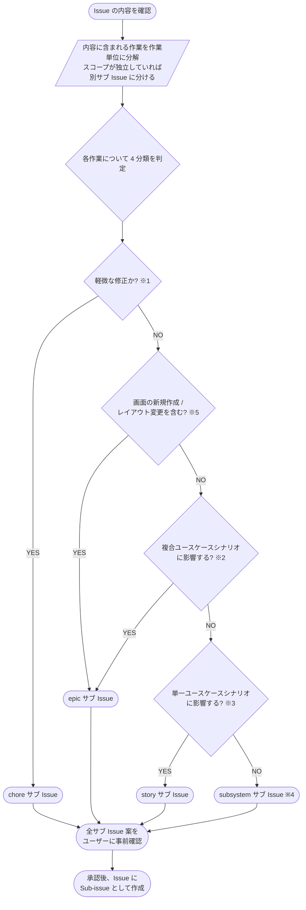

# レイヤー判定フローチャート

※1 軽微: typo・コメント・ログレベル変更・コードフォーマット・依存の軽微バージョン更新 など、シナリオも設計も触らないもの
※2 複合: ユースケース間の連鎖 / 複数 UC を跨ぐ振る舞い / 認証フロー刷新 のような **`設計図/シナリオ/複合ユースケース/*.md` を新規 / 更新** する変更
※3 単一: 1 ユースケース内の要件追加 / UC 単位のバグ修正 / 単一 UC の挙動変更 のような **`設計図/シナリオ/単一ユースケース/*.md` を新規 / 更新** する変更
※4 実装のみ: 内部リファクタ / パフォーマンス改善 / 実装バグ修正 / ログ追加 など、**シナリオ不変で実装だけ変更** するもの
※5 画面変更: 新規画面の追加 / 既存画面のレイアウト・配置変更（サイドバー追加 等）。
画面デザインは複数 UC に波及しやすく、モックで方向性を先にユーザーと合意するため epic に集約する（色・文言の微調整は ※1 の軽微側）
