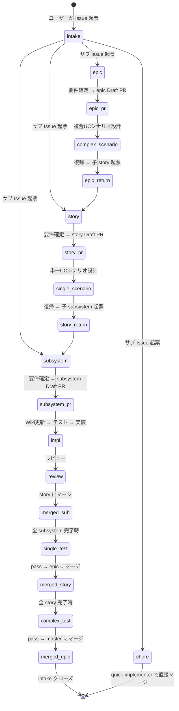

# ai-monitor 状態遷移

ai-monitor のワークフローを Issue / PR のラベル状態遷移で表現したページ群。

## 目次

| No | ページ | 対象 |
| --- | --- | --- |
| 1 | [intake-issue](./intake-issue.md) | 集約元 Issue のライフサイクル |
| 2 | [epic-issue](./epic-issue.md) | epic Issue（2 段階呼び出し: 要件確定 + 子 story 起票） |
| 3 | story-issue（未作成） | story Issue（2 段階呼び出し: 要件確定 + 子 subsystem 起票） |
| 4 | subsystem-issue（未作成） | subsystem Issue |
| 5 | epic-pr / story-pr / subsystem-pr（未作成） | 各レイヤーの Draft PR |

## 全体俯瞰

