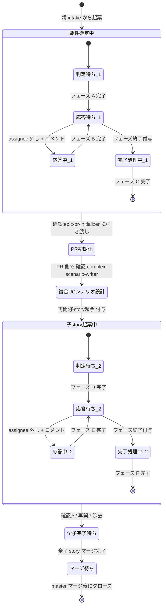

# 状態遷移: epic-issue

epic Issue（`layer:epic`）のライフサイクル。
`epic-issue-triager` が 2 段階（要件確定 → 子 story 起票）で担当し、間に `epic-pr-initializer` / `complex-scenario-writer` が挟まる。

## 状態一覧

| No | 状態名 | ラベル | assignee |
| --- | --- | --- | --- |
| 1 | 起票直後 | `layer:epic` + `確認:epic-issue-triager` | - |
| 2 | 要件確定 応答待ち | 〃 | ユーザー |
| 3 | 要件確定 応答中 | 〃 | - |
| 4 | 要件確定 完了処理中 | 〃 + `フェーズ終了` | - |
| 5 | PR 初期化待ち | `layer:epic` + `確認:epic-pr-initializer` | - |
| 6 | 複合UCシナリオ設計中 | `layer:epic`（Issue 側は待機、PR 側で進行） | - |
| 7 | 復帰(子story起票 開始) | `layer:epic` + `確認:epic-issue-triager` + `再開:子story起票` | - |
| 8 | 子story起票 応答待ち | 〃 | ユーザー |
| 9 | 子story起票 応答中 | 〃 | - |
| 10 | 子story起票 完了処理中 | 〃 + `フェーズ終了` | - |
| 11 | 全子完了待ち | `layer:epic`（`確認:*` / `再開:*` すべてなし） | - |
| 12 | マージ待ち | `layer:epic` + `確認:merger` | - |
| 13 | クローズ済 | closed | - |

## 状態遷移図

