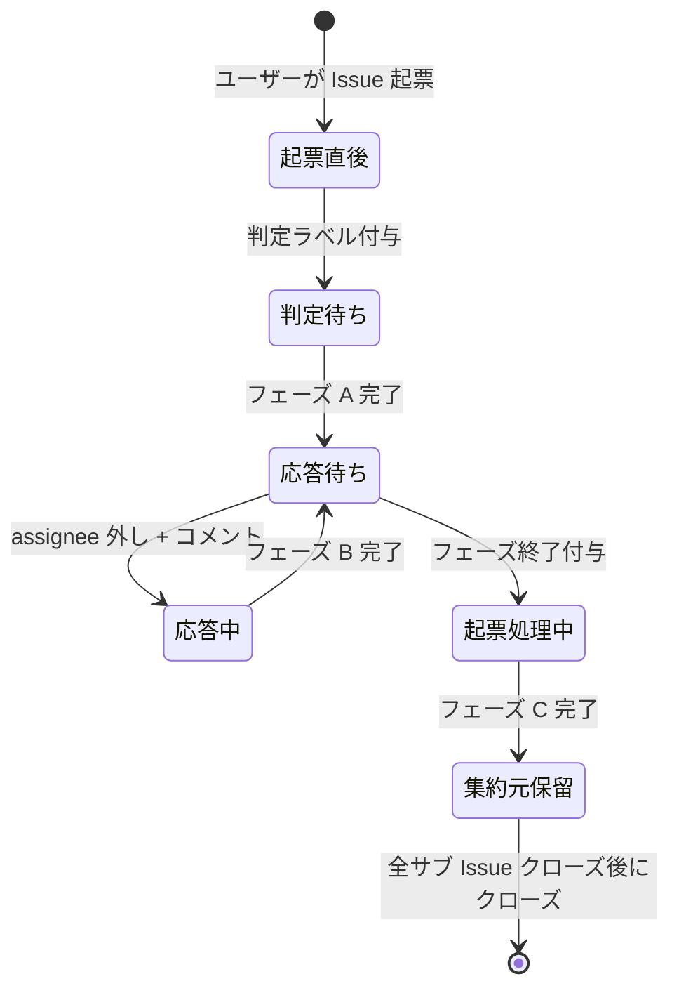

# 状態遷移: intake-issue

ユーザーが最初に起票する **集約元 Issue**（`layer:intake`）のライフサイクル。

## 状態一覧

| No | 状態名 | ラベル | assignee |
| --- | --- | --- | --- |
| 1 | 起票直後 | - | - |
| 2 | 判定待ち | `layer:intake` + `type:*` + `確認:intake-issue-triager` | - |
| 3 | 応答待ち | 〃 | ユーザー |
| 4 | 応答中 | 〃 | - |
| 5 | 起票処理中 | 〃 + `フェーズ終了` | - |
| 6 | 集約元保留 | `layer:intake` + `type:*`（`確認:*` なし） | - |
| 7 | クローズ済 | -（closed） | - |

## 状態遷移図

