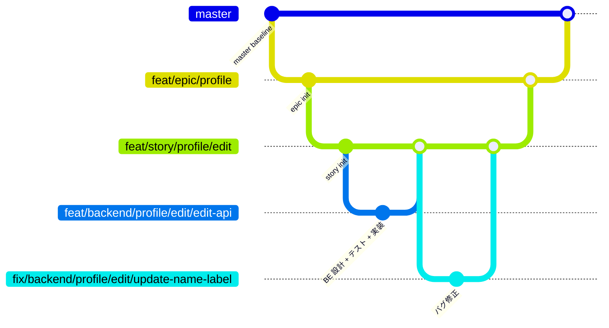

# 規約: ブランチ戦略

ブランチの命名・base・ライフサイクルの規約。

## 命名形式

```
{githubのtype}/{名前}/{分類}/{変更内容}
```

| スロット | 値 | 例 |
| --- | --- | --- |
| githubのtype | `feat` / `fix` / `refactor` / `docs` / `chore` / `poc`（Issue の `type:*` ラベルに対応） | `feat` |
| 名前 | レイヤーまたは対象システム（`epic` / `story` / `backend` / `frontend` 等） | `backend` |
| 分類 | ドメイン名。epic では 1 段、story 以下では `{ドメイン}/{UC名}` の 2 段 | `profile` / `profile/edit` |
| 変更内容 | 何をするかの要約（kebab-case） | `update-name-label` / `delete-test-button` |

## ブランチ一覧

| 種類 | 形式 | 例 | base | 削除タイミング |
| --- | --- | --- | --- | --- |
| epic | `{type}/epic/{ドメイン}` | `feat/epic/profile` | `master` | epic → master マージ後 |
| story | `{type}/story/{ドメイン}/{UC名}` | `feat/story/profile/edit` | epic ブランチ | story → epic マージ後 |
| subsystem | `{type}/{scope}/{ドメイン}/{UC名}/{変更内容}` | `feat/backend/profile/edit/edit-api` | story ブランチ | subsystem → story マージ後 |
| バグ修正 | `fix/{scope}/{ドメイン}/{UC名}/{変更内容}` | `fix/backend/profile/edit/update-name-label` | story ブランチ | 修正 PR → story マージ後 |
| 実現可能性 PoC | `poc/epic/{ドメイン}/{テーマ}` | `poc/epic/profile/realtime-sync` | `master` | マージせず PR close 後 |
| ライブラリ PoC | `poc/{scope}/{ドメイン}/{UC名}/{lib名}` | `poc/backend/profile/edit/langchain` | `master` | マージせず PR close 後 |
| chore | `chore/{分類}/{変更内容}` | `chore/readme/fix-typo` | `master` | master マージ後 |

- 全スロット英小文字 + 数字 + ハイフンの kebab-case（命名は起票側 / ブランチ作成側の conductor が行う）
- 分類は epic ではドメイン名 1 段、story 以下では `{ドメイン}/{UC名}` の 2 段（UC 名は単一 UC の「{対象}を{動詞}する」の動詞部分に対応する短い語）
- epic / story は機能全体・UC 全体が対象のため変更内容スロットを省略する（分類までで一意）
- 同じ修正内容で 2 回目の差し戻しが発生した場合は変更内容の末尾に `-2` 以降の連番を付ける
- chore は対象システムを持たないため名前スロットを省略する

## ツリーと base の対応



## ライフサイクル

- 全ブランチが **squash マージ + 削除**の短命運用。
  恒久記録は closed / merged PR の diff
- PoC ブランチはマージせず、PR close 時にローカル / リモートとも削除する（closed PR の diff が恒久記録）
