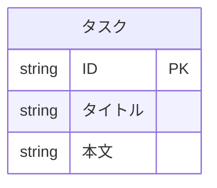

# ER 図

プロジェクトのデータストア構造の索引ページ。
詳細は各分類別ファイルへ。

論理名（業務語彙）はドキュメント・口頭で、物理名（snake_case）は実装で使う。
両者の対応は本ページと各分類別ファイルでのみ正規化して管理する。

## 概要

主データストア:

- インメモリストア（プロセス内の辞書）: タスク ドメイン

プロセスが終了すると内容は失われる。
論理名は日本語、物理名は `snake_case` で統一。
作成日時 / 更新日時の共通カラムは持たない。

## 全体図

## テーブル一覧

| 分類 | データストア | 論理名 | 物理名 | 概要 | 主キー | レコード規模 | 補足 |
| --- | --- | --- | --- | --- | --- | --- | --- |
| タスク | インメモリ | タスク | `tasks` | 編集対象のタスク | `id` | ～1000 | 呼び出し元が保持する辞書 |

## 目次

| 分類名 | ページ | 概要 | 補足 |
| --- | --- | --- | --- |
| タスク | [タスク](./タスク.md) | タスク本体 | - |
