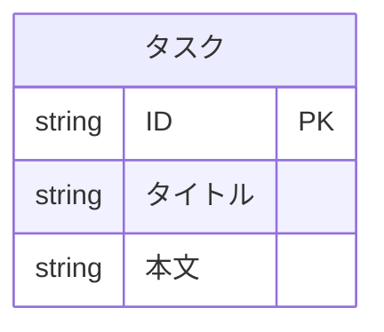

# ER 図

プロジェクトのデータストア構造の索引ページ。
詳細は各分類別ファイルへ。

論理名（業務語彙）はドキュメント・口頭で、物理名（識別子）は実装で使う。
両者の対応は本ページと各分類別ファイルでのみ正規化して管理する。

## 概要

主データストア:
- インメモリストア（`dict[str, Task]`）: タスク ドメイン

プロセス内の辞書だけでデータを保持し、永続化層を持たない。
論理名は日本語、物理名は `snake_case` で統一する。
辞書のキーがそのままレコードの主キーになるため、採番用の共通カラム（`created_at` / `updated_at` 等）は持たない。

## 全体図

## テーブル一覧

| 分類 | データストア | 論理名 | 物理名 | 概要 | 主キー | レコード規模 | 補足 |
| --- | --- | --- | --- | --- | --- | --- | --- |
| タスク | インメモリ | タスク | `Task` | ユーザーが管理するタスク | `id` | ～1000 | `dict[str, Task]` の値 |

## 目次

| 分類名 | ページ | 概要 | 補足 |
| --- | --- | --- | --- |
| タスク | [タスク](./タスク.md) | タスク本体 | - |
