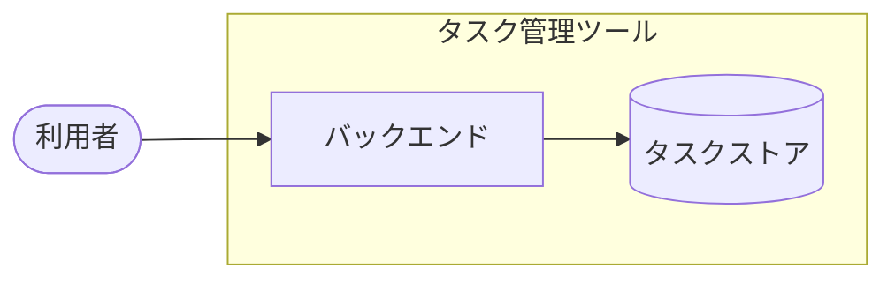

# アーキテクチャ図

タスク管理ツールのシステム全体の輪郭。
サブシステムの分割単位と、外部システムとの境界を扱う。

サブシステム内部の構造は `設計図/モジュール構成/` が持つ。

## システム全体図

- 利用者からバックエンドへの呼び出し手段（CLI / HTTP）は未確定。
  画面は本フェーズの対象外で、次フェーズで追加する
- タスクストアの実体は現状プロセス内の辞書で、永続化の方式は未確定。
  方式が決まった時点で図と `設計図/非機能要件.md` を更新する

## リポジトリ構成

| 項目 | 内容 | 補足 |
| --- | --- | --- |
| 方式 | モノレポ | サブシステムが 1 つのため分割の利点がない |
| リポジトリ | `shuhei1101/ai-monitor-e2e` | - |
| 配置 | `src/` / `tests/` | `docs/wiki/` に設計ドキュメントを置く |

## サブシステム一覧

| サブシステム | scope | 役割 | 言語・ランタイム | 補足 |
| --- | --- | --- | --- | --- |
| バックエンド | `scope:backend` | タスクの登録・編集・一覧の業務ロジックと永続化 | Python 3.12 | 標準ライブラリのみで構成する |

## 外部システム連携

なし
