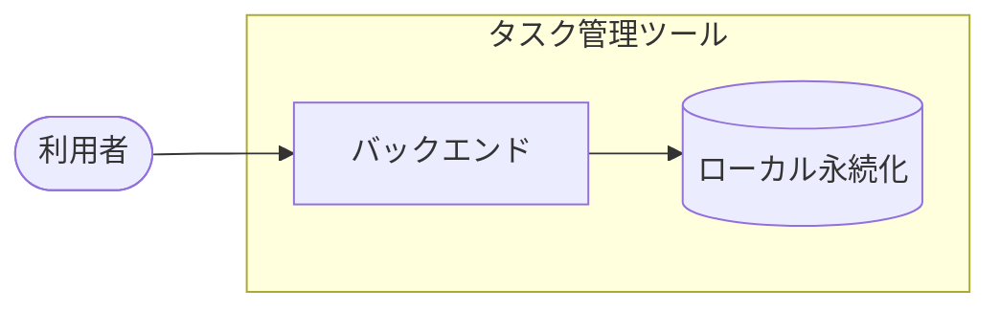

# アーキテクチャ図

タスク管理ツール全体の輪郭。
サブシステムの分割単位と、外部システムとの境界を扱う。

## システム全体図

利用者はバックエンドを直接操作する。
画面は次フェーズのため、本図には登場しない。

永続化はローカルに閉じており、プロセス境界を越える通信先を持たない。

## リポジトリ構成

| 項目 | 内容 | 補足 |
| --- | --- | --- |
| 方式 | モノレポ | サブシステムをトップレベルディレクトリで分ける |
| リポジトリ | `shuhei1101/ai-monitor-e2e` | - |
| 配置 | `backend/` | `docs/wiki/` は共通 |

## サブシステム一覧

| サブシステム | scope | 役割 | 言語・ランタイム | 補足 |
| --- | --- | --- | --- | --- |
| バックエンド | `scope:backend` | タスクの登録・編集・一覧と永続化 | Python 3.12 | 標準ライブラリのみで完結する |

## 外部システム連携

なし。

構成要件で外部システムへの依存を作らないことが決まっており、プロセス境界を越える通信先を持たない。
