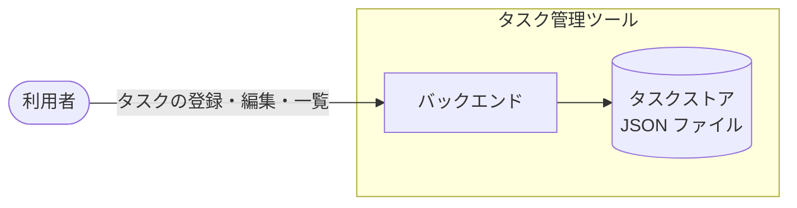

# アーキテクチャ図

タスク管理ツールの全体構成。
サブシステムの分割単位と、境界を越えて通信する相手を定義する。

## システム全体図

## リポジトリ構成

| 項目 | 内容 | 補足 |
| --- | --- | --- |
| 方式 | モノレポ | サブシステムをトップレベルディレクトリで分ける |
| リポジトリ | `shuhei1101/ai-monitor-e2e` | - |
| 配置 | `backend/` | `docs/wiki/` は共通 |

## サブシステム一覧

| サブシステム | scope | 役割 | 言語・ランタイム | 補足 |
| --- | --- | --- | --- | --- |
| バックエンド | `scope:backend` | タスクの登録・編集・一覧の業務ロジックと永続化 | Python 3.12 | 画面は次フェーズで別サブシステムとして追加する |

## 外部システム連携

なし。

外部サービスへの依存を作らない方針のため、境界を越えて通信する相手を持たない。
