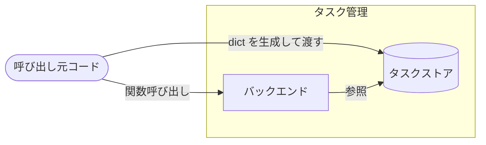

# アーキテクチャ図

## システム全体図

タスクストアは `dict[str, Task]` で、バックエンドが保持せず呼び出し元が生成して引数で渡す。
呼び出し元にあたる実装は `tests/` 配下のテストコードだけで、画面・API などユーザーが直接触る入り口は実装されていない。

## リポジトリ構成

| 項目 | 内容 | 補足 |
| --- | --- | --- |
| 方式 | モノレポ | サブシステムをトップレベルディレクトリで分ける |
| リポジトリ | `shuhei1101/ai-monitor-e2e` | - |
| 配置 | `src/` / `tests/` / `docs/` | 実装は `src/tasks/`、テストは `tests/`、ドキュメントとモックは `docs/`。`docs/wiki/` は共通 |

## サブシステム一覧

| サブシステム | scope | 役割 | 言語・ランタイム | 補足 |
| --- | --- | --- | --- | --- |
| バックエンド | `scope:backend` | タスクの取得（`get_task`） | Python 3.12 | 画面・API・永続化層は未実装 |

`docs/` は Jekyll 設定（`docs/_config.yml`）を持ち GitHub Pages で配信されるが、業務ロジックを持たないためサブシステムには数えていない。

## 外部システム連携

なし

`src/tasks/` は標準ライブラリだけで動き、プロセス境界を越える通信を行わない。
