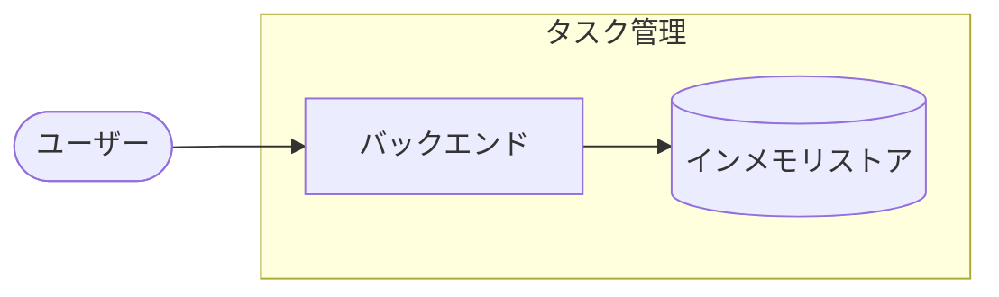

# アーキテクチャ図

## システム全体図

## リポジトリ構成

| 項目 | 内容 | 補足 |
| --- | --- | --- |
| 方式 | モノレポ | サブシステムをトップレベルディレクトリで分ける |
| リポジトリ | `shuhei1101/ai-monitor-e2e` | - |
| 配置 | `src/tasks/` | `docs/wiki/` は共通 |

## サブシステム一覧

| サブシステム | scope | 役割 | 言語・ランタイム | 補足 |
| --- | --- | --- | --- | --- |
| バックエンド | `scope:backend` | タスクの取得・更新・一覧 | Python 3.12 | 画面は未実装 |

## 外部システム連携

なし
