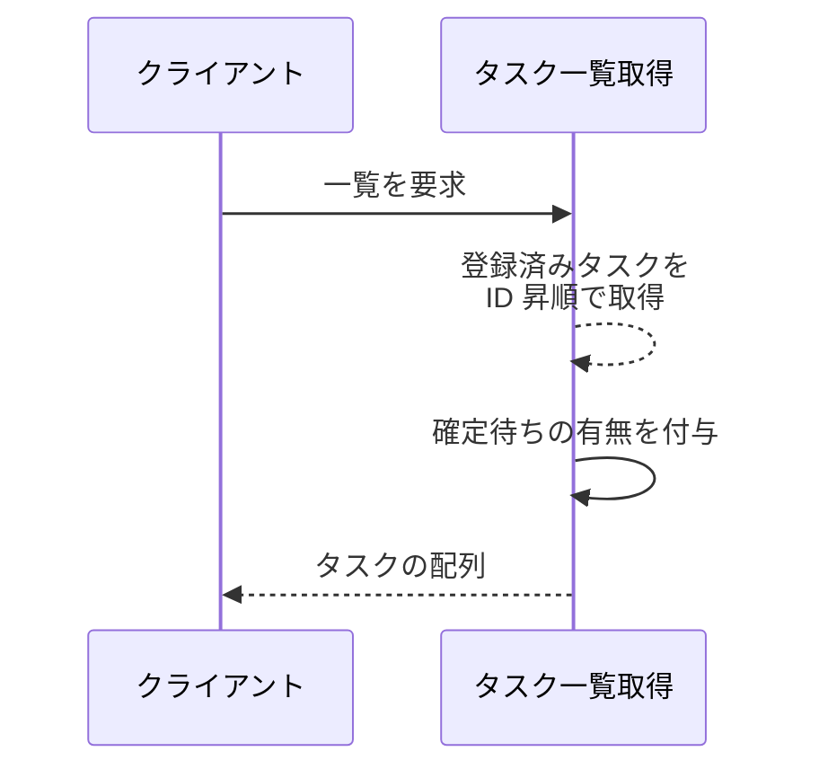
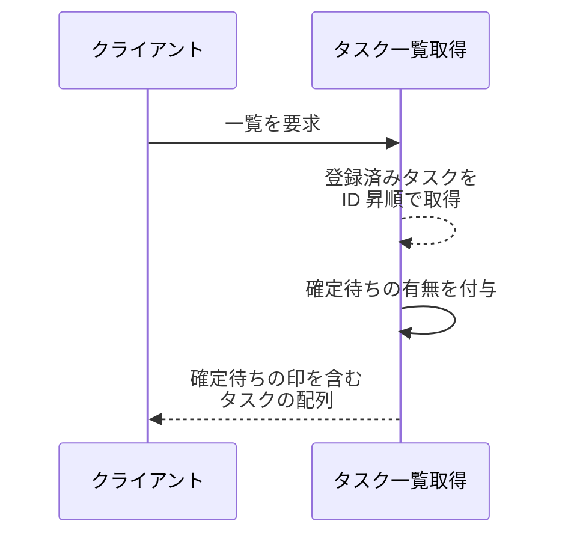

# タスク一覧取得

操作: タスク一覧取得

登録済みのタスクを ID 順に並べて返す。
確定待ちの更新を持つタスクには確定待ちである旨を添える。

- 対応テストファイル: `tests/integration/tasks/test_タスク一覧取得.py`

## インターフェース

### リクエスト

パラメータなし。

リクエスト例:

```json
{}
```

### レスポンス

| フィールド | 型 | 説明 | 制限 | 補足 |
| --- | --- | --- | --- | --- |
| `tasks` | `object[]` | タスクの配列 | - | 子フィールドは下の行で展開 |
| `tasks[].id` | `str` | タスク ID | - | - |
| `tasks[].title` | `str` | 確定済みのタイトル | - | 確定待ちの内容は含めない |
| `tasks[].content` | `str` | 確定済みの本文 | - | 確定待ちの内容は含めない |
| `tasks[].awaiting_confirmation` | `bool` | 確定待ちの更新を持つか | - | 表示の出し分けはフロントエンド担当 |

レスポンス例:

```json
{
  "tasks": [
    { "id": "t1", "title": "旧タイトル", "content": "旧本文", "awaiting_confirmation": true },
    { "id": "t2", "title": "買い物", "content": "", "awaiting_confirmation": false }
  ]
}
```

**補足:**

- 確定待ちのタスクも一覧から外さない。
  確定するまでは確定済みの内容を返し、`awaiting_confirmation` だけが `true` になる

## 制約

| 項目 | 制約 | 補足 |
| --- | --- | --- |
| 認可 | 制限なし | 本プロジェクトに認証機構がない |
| 並び順 | タスク ID の昇順 | 既存の一覧取得の並びを引き継ぐ |
| 件数上限 | 制限なし | 全件を返す |
| 確定待ちの内容の開示 | 確定待ちのタイトルと本文は返さない | 開示するのは確定待ちであることのみ |

## フロー一覧

| 分類 | フロー名 | 概要 | 補足 |
| --- | --- | --- | --- |
| 正常 | 正常系 | 確定待ちのないタスクを一覧で返す | - |
| 正常 | 正常系（確定待ちのタスクがある） | 確定待ちのタスクに確定待ちの印を付けて返す | 単一 UC シナリオの受付直後の一覧に対応 |
| 異常 | 異常系 | なし | - |

## 正常系

### セットアップ

| セットアップ | 説明 | 補足 |
| --- | --- | --- |
| Mock | なし | 承認基盤を呼ばない操作 |
| タスク | `t2` と `t1` の順で 2 件を登録済み | 並び順の確認のため登録順を ID 順と入れ替える |

### フロー



### 期待値

- タスクが `t1`、`t2` の順で返る
- 全タスクの `awaiting_confirmation` が `false` になっている

## 正常系（確定待ちのタスクがある）

### セットアップ

| セットアップ | 説明 | 補足 |
| --- | --- | --- |
| Mock | なし | 承認基盤を呼ばない操作 |
| タスク | `t1` を「旧タイトル / 旧本文」で登録済み | - |
| タスク | `t1` が「新タイトル / 新本文」の確定待ちを持つ | 確定待ちの表示を決定的に誘発 |

### フロー



### 期待値

- `t1` の `awaiting_confirmation` が `true` になっている
- `t1` のタイトルと本文は「旧タイトル / 旧本文」のまま返る

## 異常系

なし。
