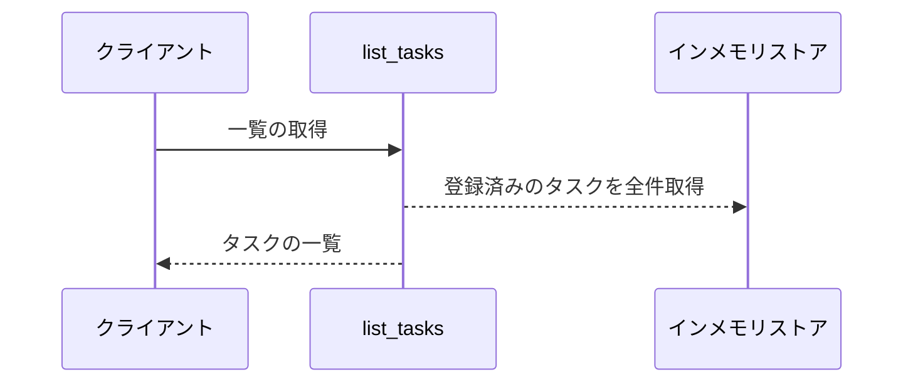
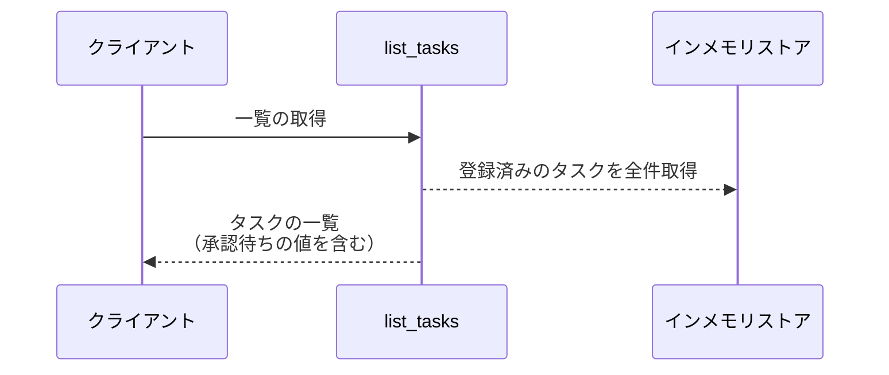
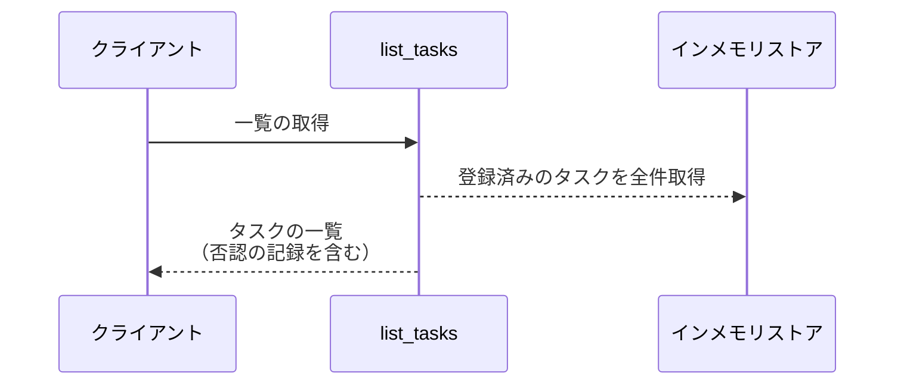

# タスク一覧取得

操作: `list_tasks`（サービス層の公開関数）

登録済みのタスクを、確定値に承認待ち状態と否認の記録を添えて一覧で返す。

- 対応テストファイル: 未定（テストレビュー完了時に記入）

## インターフェース

### リクエスト

パラメータなし。

### レスポンス

| フィールド | 型 | 説明 | 制限 | 補足 |
| --- | --- | --- | --- | --- |
| `tasks` | `object[]` | タスクの一覧 | - | 登録順 |
| `tasks[].id` | `str` | タスク ID | - | - |
| `tasks[].title` | `str` | 確定済みのタイトル | - | 承認待ちの間も編集前の値を返す |
| `tasks[].content` | `str` | 確定済みの本文 | - | 承認待ちの間も編集前の値を返す |
| `tasks[].approval_state` | `"none"` \| `"pending"` \| `"rejected"` | 承認の進行状態 | - | `pending` が承認待ち、`rejected` が否認の記録 |
| `tasks[].pending_title` | `str \| None` | 承認待ちのタイトル | - | 承認状態が `pending` 以外は `None` |
| `tasks[].pending_content` | `str \| None` | 承認待ちの本文 | - | 承認状態が `pending` 以外は `None` |

レスポンス例:

```json
{
  "tasks": [
    {
      "id": "t1",
      "title": "旧タイトル",
      "content": "旧本文",
      "approval_state": "pending",
      "pending_title": "新タイトル",
      "pending_content": "新本文"
    }
  ]
}
```

### 例外

| 例外 | 発生条件 | 補足 |
| --- | --- | --- |
| なし（正常終了） | 一覧の取得成功 | 戻り値は レスポンス表のとおり |

## 制約

| 項目 | 制約 | 補足 |
| --- | --- | --- |
| 件数 | 制限なし | 全件を返す（ページングを持たない） |
| 認可 | 制限なし | 利用者を識別する仕組みを持たない |
| 絞り込み | 制限なし | 承認状態による絞り込みを行わず全件返す |

## フロー一覧

| 分類 | フロー名 | 概要 | 補足 |
| --- | --- | --- | --- |
| 正常 | 正常系 | 確定値だけを持つタスクを返す | - |
| 正常 | 正常系（承認待ちのタスクを含む） | 承認待ち状態と承認待ちの値を添えて返す | - |
| 正常 | 正常系（否認されたタスクを含む） | 否認の記録を添えて確定値を返す | - |
| 異常 | 異常系 | なし | - |

## 正常系

### セットアップ

| セットアップ | 説明 | 補足 |
| --- | --- | --- |
| Mock | なし | 外部依存を持たない |
| タスク | 承認状態が `none` のタスクを 1 件登録済み | - |

### フロー



### 期待値

- 登録済みのタスクが全件返る
- 各要素の承認状態が `none` で、承認待ちのタイトル / 本文が `None` になっている

## 正常系（承認待ちのタスクを含む）

### セットアップ

| セットアップ | 説明 | 補足 |
| --- | --- | --- |
| Mock | なし | 外部依存を持たない |
| タスク | 承認状態が `pending` のタスクを 1 件登録済み | 承認待ちの値を保持 |

### フロー



### 期待値

- 該当タスクの承認状態が `pending` で返る
- 該当タスクのタイトル / 本文が編集前の値で返る
- 該当タスクの承認待ちのタイトル / 本文に編集後の値が入っている

## 正常系（否認されたタスクを含む）

### セットアップ

| セットアップ | 説明 | 補足 |
| --- | --- | --- |
| Mock | なし | 外部依存を持たない |
| タスク | 承認状態が `rejected` のタスクを 1 件登録済み | 承認待ちの値は破棄済み |

### フロー



### 期待値

- 該当タスクの承認状態が `rejected` で返る
- 該当タスクのタイトル / 本文が編集前の値で返る
- 該当タスクの承認待ちのタイトル / 本文が `None` になっている

## 異常系

なし
