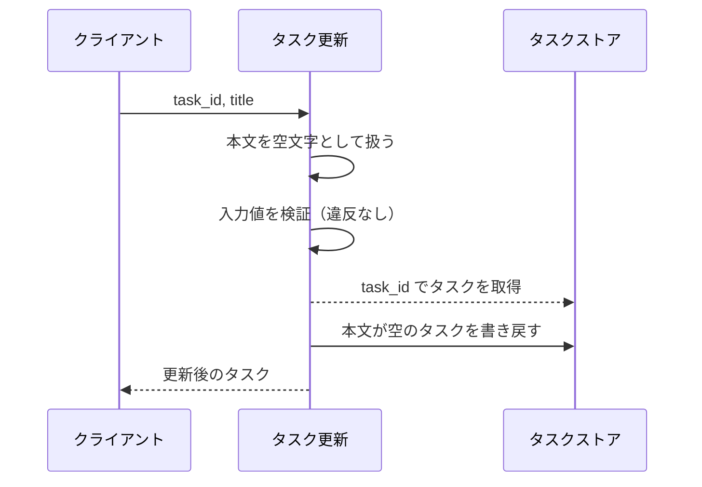
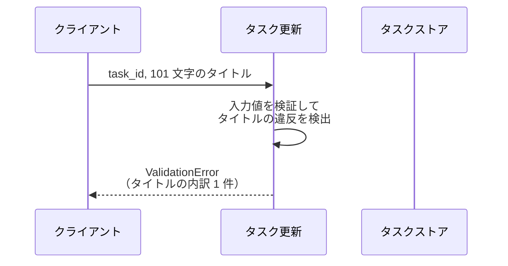
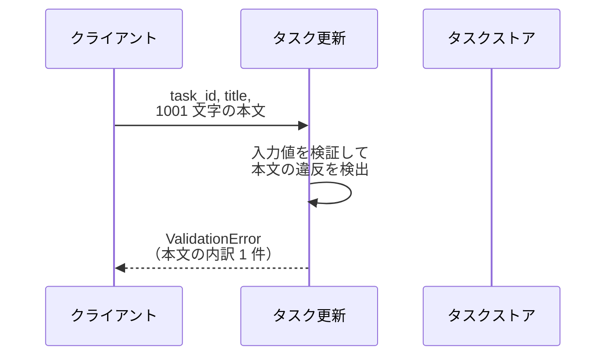
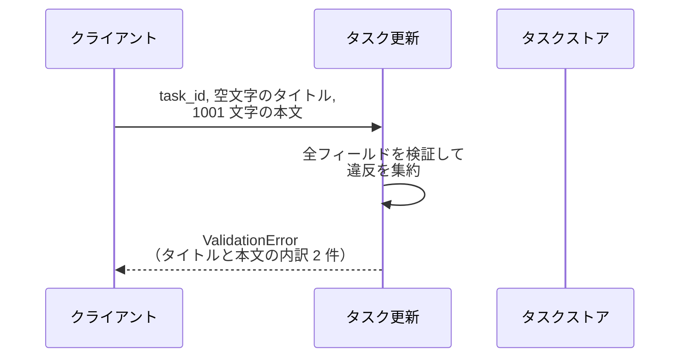
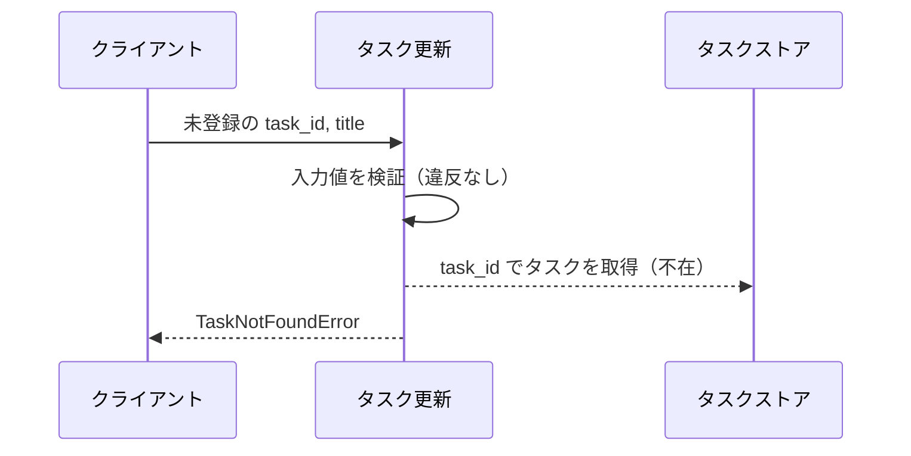

# タスク更新

操作: `update_task`（サービス層の公開関数）

登録済みタスクのタイトルと本文を検証し、ストアの内容を差し替えて更新後のタスクを返す。

- 対応テストファイル: `tests/e2e/単一ユースケース/test_タスク編集.py`

## インターフェース

### リクエスト

| パラメータ | 型 | 必須 | デフォルト | 説明 | 制限 | 補足 |
| --- | --- | --- | --- | --- | --- | --- |
| `task_id` | `str` | ✅ | - | 更新対象のタスク ID | - | 採番済みの既存 ID のみ |
| `title` | `str` | ✅ | - | タスク名 | 1 文字以上 100 文字以内 | 空文字は不可 |
| `content` | `str` | - | `""` | タスク本文 | 1000 文字以内 | 省略時は本文を空にする |

リクエスト例:

```python
update_task(store, task_id="t1", title="新タイトル", content="新本文")
```

### レスポンス

| フィールド | 型 | 説明 | 制限 | 補足 |
| --- | --- | --- | --- | --- |
| `task` | `Task` | 更新後のタスク | - | ストアに書き戻したものと同一の値 |
| `task.id` | `str` | タスク ID | - | 更新前後で変わらない |
| `task.title` | `str` | 更新後のタスク名 | 1 文字以上 100 文字以内 | リクエストの `title` がそのまま入る |
| `task.content` | `str` | 更新後の本文 | 1000 文字以内 | リクエストの `content` がそのまま入る |

レスポンス例:

```python
Task(id="t1", title="新タイトル", content="新本文")
```

**補足:**

- 同じ入力で 2 回呼んでも結果は同じになる（冪等）
- 更新対象以外のタスクはストア上で変化しない

### エラー

| エラー | 発生条件 | 補足 |
| --- | --- | --- |
| なし（正常終了） | 更新成功 | 戻り値はレスポンス表のとおり |
| `ValidationError` | `title` / `content` が制限を満たさない | 違反した全フィールドの内訳を保持する |
| `TaskNotFoundError` | `task_id` が未登録 | 入力検証を通過した後に判定する |

## 制約

| 項目 | 制約 | 補足 |
| --- | --- | --- |
| 応答時間 | 1 呼び出しあたり 1 秒以内 | ストアはインメモリのため外部待ちが発生しない |
| 認可 | 制限なし | 呼び出し元の権限は問わない |
| 検証エラーの返し方 | 違反した全フィールドをまとめて返す | 先頭 1 件で打ち切らない |
| 検証と存在確認の順序 | 入力検証 → 対象タスクの存在確認 | 未登録 ID かつ入力不正の場合は入力不正が先に出る |
| 部分更新 | 対応しない | `title` / `content` は毎回全量で受け取る |
| 更新の副作用 | 検証に失敗した場合はストアを変更しない | 対象が未登録の場合も変更しない |

## フロー一覧

| 分類 | フロー名 | 概要 | 補足 |
| --- | --- | --- | --- |
| 正常 | 正常系 | タイトルと本文を差し替えて更新後のタスクを返す | - |
| 正常 | 正常系（本文省略時） | 本文を空文字で上書きする | - |
| 異常 | 異常系（タイトル空・ValidationError） | 空文字のタイトルを弾く | - |
| 異常 | 異常系（タイトル超過・ValidationError） | 101 文字以上のタイトルを弾く | - |
| 異常 | 異常系（本文超過・ValidationError） | 1001 文字以上の本文を弾く | - |
| 異常 | 異常系（タイトルと本文の同時違反・ValidationError） | 2 フィールド分の内訳をまとめて返す | フィールド単位のエラー返却の要 |
| 異常 | 異常系（タスク未登録・TaskNotFoundError） | 未登録の ID を弾く | - |

## 正常系

### セットアップ

| セットアップ | 説明 | 補足 |
| --- | --- | --- |
| Mock | なし（呼び出し元が渡す辞書をそのままストアとして使う） | 外部依存を持たない |
| タスク | `t1` のタスクを登録済み | タイトル・本文とも更新前の値が入っている |

### フロー


### 期待値

- 更新後のタイトルと本文を持つタスクが返る
- ストアの `t1` が更新後の値に置き換わっている
- タスク ID は更新前と同じ

## 正常系（本文省略時）

### セットアップ

| セットアップ | 説明 | 補足 |
| --- | --- | --- |
| Mock | なし（呼び出し元が渡す辞書をそのままストアとして使う） | - |
| タスク | `t1` のタスクを本文入りで登録済み | 省略時の上書きを観測できる状態にする |
| 入力 | `content` を渡さずに呼び出す | デフォルト値の適用を決定的に誘発 |

### フロー



### 期待値

- 返るタスクの本文が空文字になっている
- ストアの `t1` の本文も空文字に置き換わっている

## 異常系（タイトル空・ValidationError）

### セットアップ

| セットアップ | 説明 | 補足 |
| --- | --- | --- |
| Mock | なし（呼び出し元が渡す辞書をそのままストアとして使う） | - |
| タスク | `t1` のタスクを登録済み | - |
| 入力 | `title` に空文字を渡す | 検証失敗を決定的に誘発 |

### フロー


### 期待値

- `ValidationError` が送出される
- 内訳はタイトルの 1 件だけで、対象フィールドが特定できる
- ストアの `t1` は更新前のまま変わっていない

## 異常系（タイトル超過・ValidationError）

### セットアップ

| セットアップ | 説明 | 補足 |
| --- | --- | --- |
| Mock | なし（呼び出し元が渡す辞書をそのままストアとして使う） | - |
| タスク | `t1` のタスクを登録済み | - |
| 入力 | `title` に 101 文字を渡す | 上限超過を決定的に誘発 |

### フロー



### 期待値

- `ValidationError` が送出される
- 内訳はタイトルの 1 件だけになっている
- ストアの `t1` は更新前のまま変わっていない

## 異常系（本文超過・ValidationError）

### セットアップ

| セットアップ | 説明 | 補足 |
| --- | --- | --- |
| Mock | なし（呼び出し元が渡す辞書をそのままストアとして使う） | - |
| タスク | `t1` のタスクを登録済み | - |
| 入力 | `title` は適正・`content` に 1001 文字を渡す | 本文だけの違反を決定的に誘発 |

### フロー



### 期待値

- `ValidationError` が送出される
- 内訳は本文の 1 件だけになっている
- ストアの `t1` は更新前のまま変わっていない

## 異常系（タイトルと本文の同時違反・ValidationError）

### セットアップ

| セットアップ | 説明 | 補足 |
| --- | --- | --- |
| Mock | なし（呼び出し元が渡す辞書をそのままストアとして使う） | - |
| タスク | `t1` のタスクを登録済み | - |
| 入力 | `title` に空文字・`content` に 1001 文字を渡す | 2 フィールド同時違反を決定的に誘発 |

### フロー



### 期待値

- `ValidationError` が送出される
- 内訳がタイトルと本文の 2 件になっている
- 内訳の順序が入力の並び（タイトル → 本文）と一致している
- ストアの `t1` は更新前のまま変わっていない

## 異常系（タスク未登録・TaskNotFoundError）

### セットアップ

| セットアップ | 説明 | 補足 |
| --- | --- | --- |
| Mock | なし（呼び出し元が渡す辞書をそのままストアとして使う） | - |
| タスク | `t1` のタスクだけを登録済み | - |
| 入力 | 未登録の `task_id` を渡す | 存在確認の失敗を決定的に誘発 |

### フロー



### 期待値

- `TaskNotFoundError` が送出される
- ストアには新しいタスクが増えていない
- ストアの `t1` は更新前のまま変わっていない
