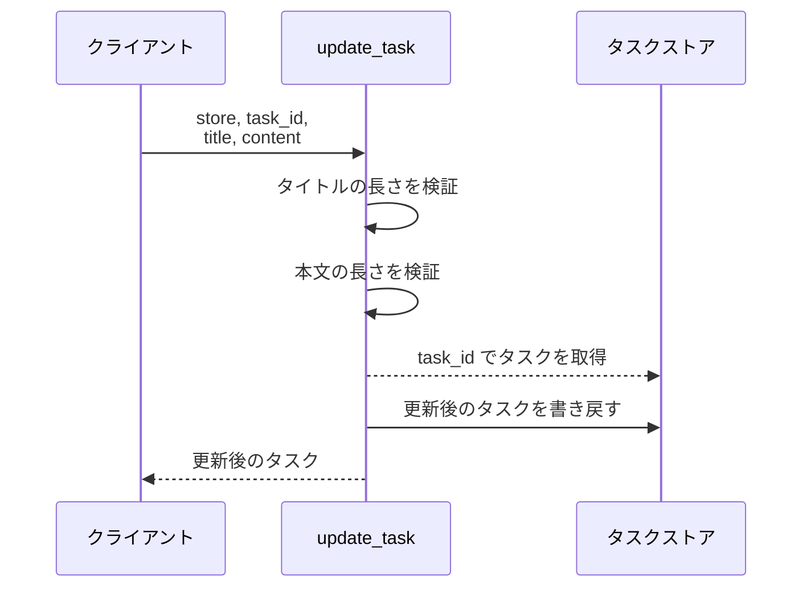
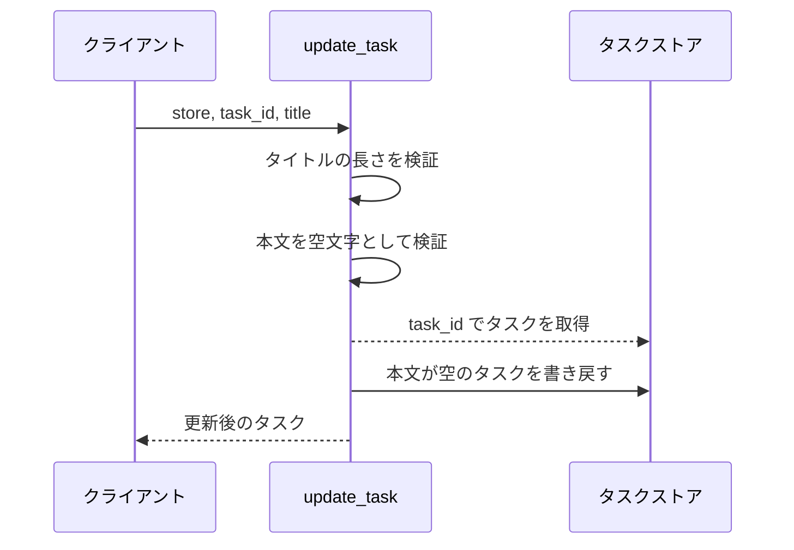
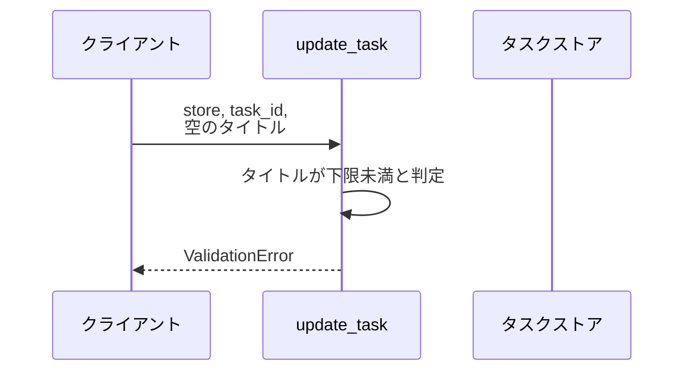
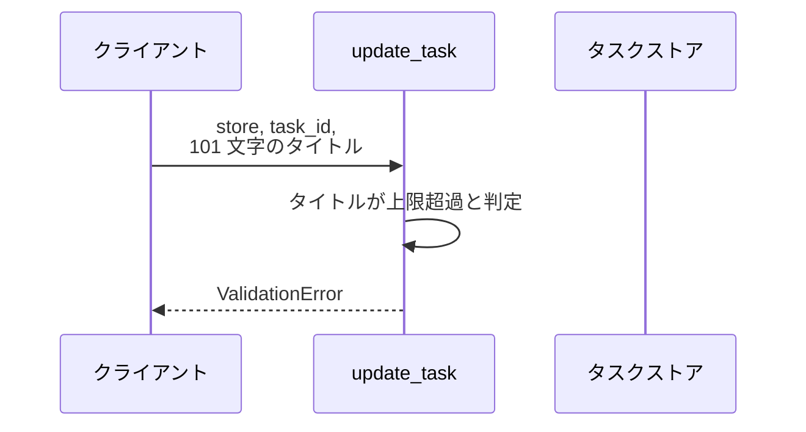
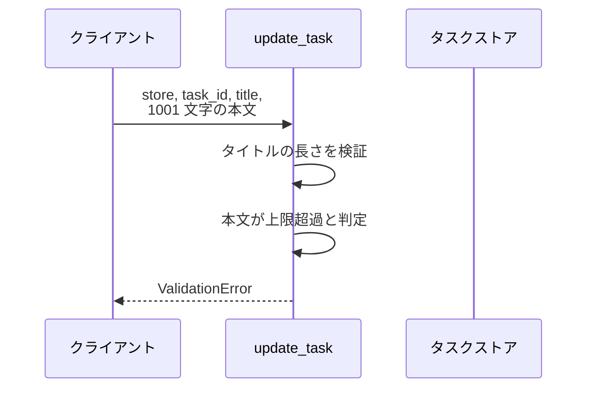
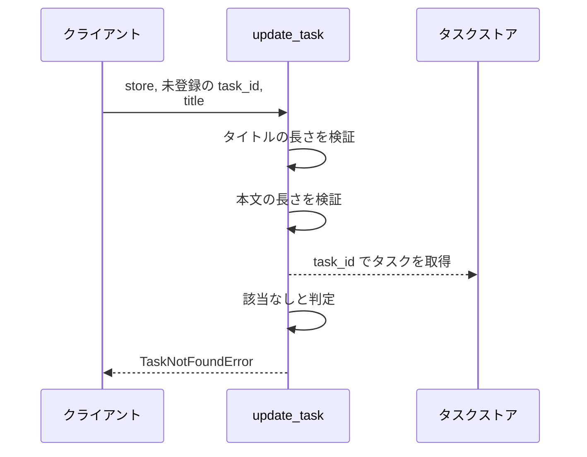

# タスク更新

操作: `update_task`（サービス層の公開関数）

登録済みタスクのタイトルと本文を検証したうえで書き換え、更新後のタスクを返す。

- 対応テストファイル: -

## インターフェース

### リクエスト

| パラメータ | 型 | 必須 | デフォルト | 説明 | 制限 | 補足 |
| --- | --- | --- | --- | --- | --- | --- |
| `store` | `dict[str, Task]` | ✅ | - | タスクの保管先 | - | キーはタスク ID |
| `task_id` | `str` | ✅ | - | 更新対象のタスク ID | - | - |
| `title` | `str` | ✅ | - | 更新後のタイトル | 1 文字以上 100 文字以内 | - |
| `content` | `str` | - | `""`（本文を空にする） | 更新後の本文 | 1000 文字以内 | 省略すると既存の本文が空になる |

リクエスト例:

```python
update_task(store, "t1", "新タイトル", "新本文")
```

### レスポンス

| フィールド | 型 | 説明 | 制限 | 補足 |
| --- | --- | --- | --- | --- |
| `id` | `str` | タスク ID | - | 更新前と同じ値 |
| `title` | `str` | 更新後のタイトル | - | 引数の `title` と同じ値 |
| `content` | `str` | 更新後の本文 | - | 引数の `content` と同じ値 |

レスポンス例:

```python
Task(id="t1", title="新タイトル", content="新本文")
```

### エラー

| エラー | 発生条件 | 補足 |
| --- | --- | --- |
| なし（正常終了） | 更新成功 | 戻り値はレスポンス表のとおり |
| `ValidationError` | タイトルが 1 文字未満または 100 文字を超える | 保管先は書き換えない |
| `ValidationError` | 本文が 1000 文字を超える | 保管先は書き換えない |
| `TaskNotFoundError` | `task_id` が `store` に無い | 保管先は書き換えない |

## 制約

| 項目 | 制約 | 補足 |
| --- | --- | --- |
| タイムアウト | 制限なし | 外部 I/O を持たない |
| 認可 | 制限なし | 呼び出し元を限定しない |
| 検証の順序 | タイトルの長さ、本文の長さ、対象タスクの存在 の順で確かめる | 複数の違反があるときは先に評価したものが送出される |
| 更新の粒度 | タイトルと本文を毎回まとめて置き換える | フィールド単位の部分更新は受け付けない |

## フロー一覧

| 分類 | フロー名 | 概要 | 補足 |
| --- | --- | --- | --- |
| 正常 | 正常系 | タイトルと本文を書き換えて更新後のタスクを返す | - |
| 正常 | 正常系（本文の省略） | 本文を省略して既存の本文を空にする | - |
| 異常 | 異常系（タイトルが空・ValidationError） | 長さ検証で弾いて更新しない | - |
| 異常 | 異常系（タイトル超過・ValidationError） | 101 文字以上を弾いて更新しない | - |
| 異常 | 異常系（本文超過・ValidationError） | 1001 文字以上を弾いて更新しない | - |
| 異常 | 異常系（タスク未登録・TaskNotFoundError） | 対象が無いので更新しない | - |

## 正常系

### セットアップ

| セットアップ | 説明 | 補足 |
| --- | --- | --- |
| Mock | なし（`store` に dict を直接渡す） | 外部依存を持たない |
| タスク | `t1` のタスクを登録済み | タイトルと本文の両方が入っている |

### フロー



### 期待値

- 引数のタイトルと本文を持つタスクが返る
- `store[task_id]` が返り値と同じタスクに置き換わっている
- 返り値の `id` が更新前と同じ値になっている

## 正常系（本文の省略）

### セットアップ

| セットアップ | 説明 | 補足 |
| --- | --- | --- |
| Mock | なし（`store` に dict を直接渡す） | 外部依存を持たない |
| タスク | `t1` のタスクを登録済み | 本文に文字列が入っている |
| 入力 | `content` を渡さずに呼び出す | デフォルト値の適用を決定的に誘発 |

### フロー



### 期待値

- 返り値の本文が空文字になっている
- `store[task_id]` の本文も空文字に置き換わっている

## 異常系（タイトルが空・ValidationError）

### セットアップ

| セットアップ | 説明 | 補足 |
| --- | --- | --- |
| Mock | なし（`store` に dict を直接渡す） | 外部依存を持たない |
| タスク | `t1` のタスクを登録済み | - |
| 入力 | `title` に空文字を渡す | 下限違反を決定的に誘発 |

### フロー



### 期待値

- `ValidationError` が送出される
- `store[task_id]` が更新前のタイトルと本文のまま変わっていない

## 異常系（タイトル超過・ValidationError）

### セットアップ

| セットアップ | 説明 | 補足 |
| --- | --- | --- |
| Mock | なし（`store` に dict を直接渡す） | 外部依存を持たない |
| タスク | `t1` のタスクを登録済み | - |
| 入力 | `title` に 101 文字を渡す | 上限違反を決定的に誘発 |

### フロー



### 期待値

- `ValidationError` が送出される
- `store[task_id]` が更新前のタイトルと本文のまま変わっていない

## 異常系（本文超過・ValidationError）

### セットアップ

| セットアップ | 説明 | 補足 |
| --- | --- | --- |
| Mock | なし（`store` に dict を直接渡す） | 外部依存を持たない |
| タスク | `t1` のタスクを登録済み | - |
| 入力 | `title` は妥当な値、`content` に 1001 文字を渡す | 本文の上限違反だけを決定的に誘発 |

### フロー



### 期待値

- `ValidationError` が送出される
- `store[task_id]` が更新前のタイトルと本文のまま変わっていない

## 異常系（タスク未登録・TaskNotFoundError）

### セットアップ

| セットアップ | 説明 | 補足 |
| --- | --- | --- |
| Mock | なし（`store` に dict を直接渡す） | 外部依存を持たない |
| タスク | `t1` のタスクを登録済み | - |
| 入力 | `task_id` に登録の無い ID を渡す | 未検出を決定的に誘発 |

### フロー



### 期待値

- `TaskNotFoundError` が送出される
- 既存の `t1` が更新前のタイトルと本文のまま変わっていない
