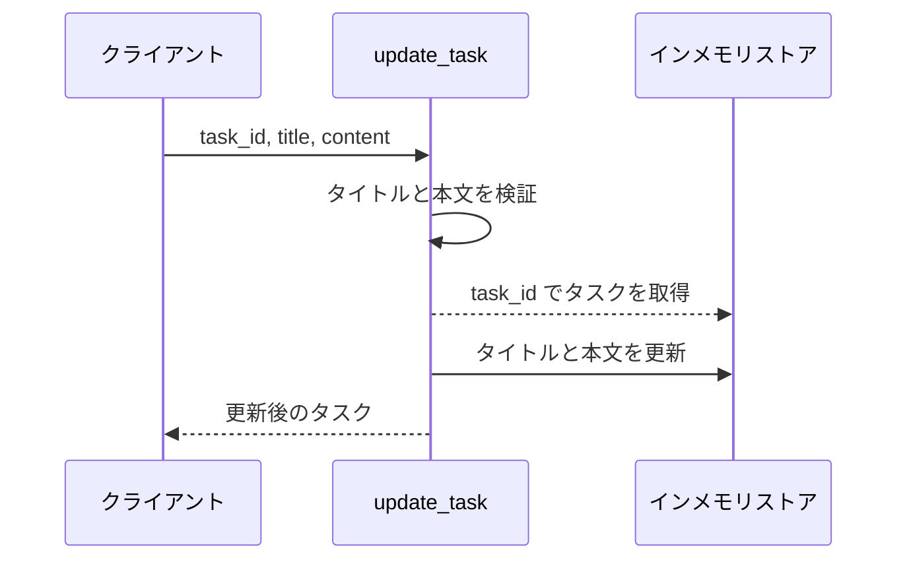
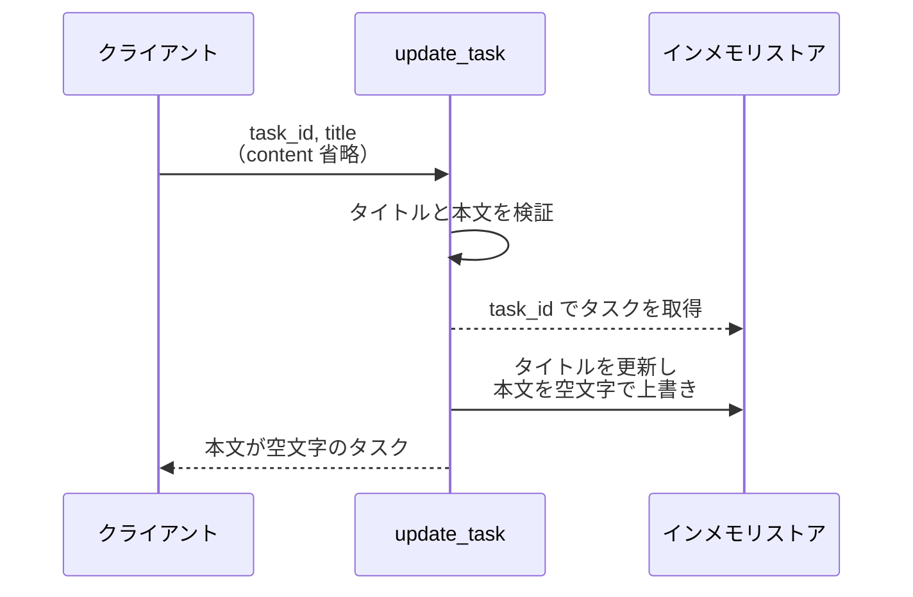
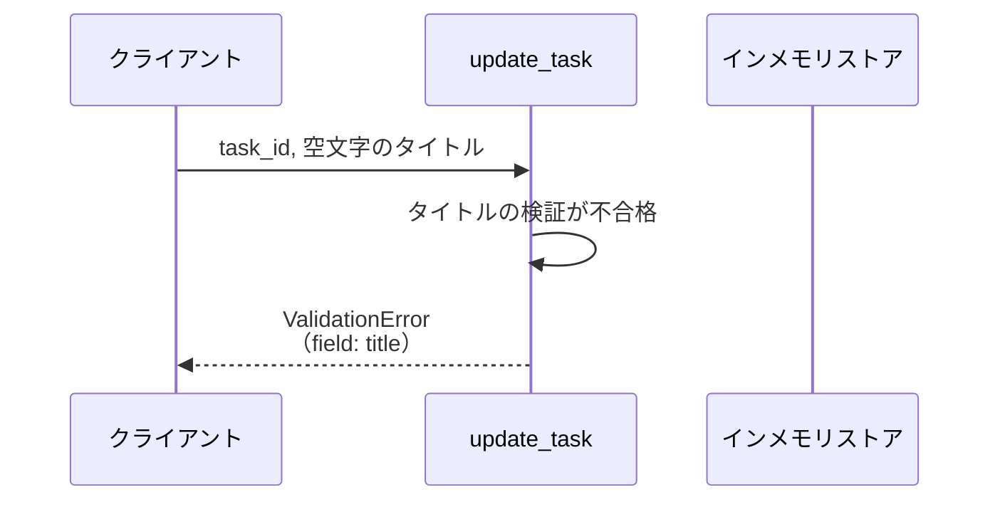
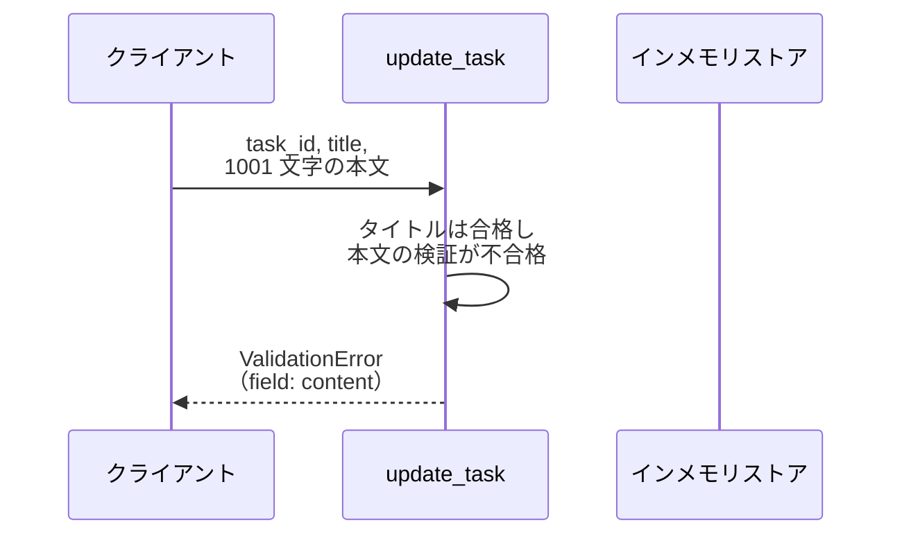
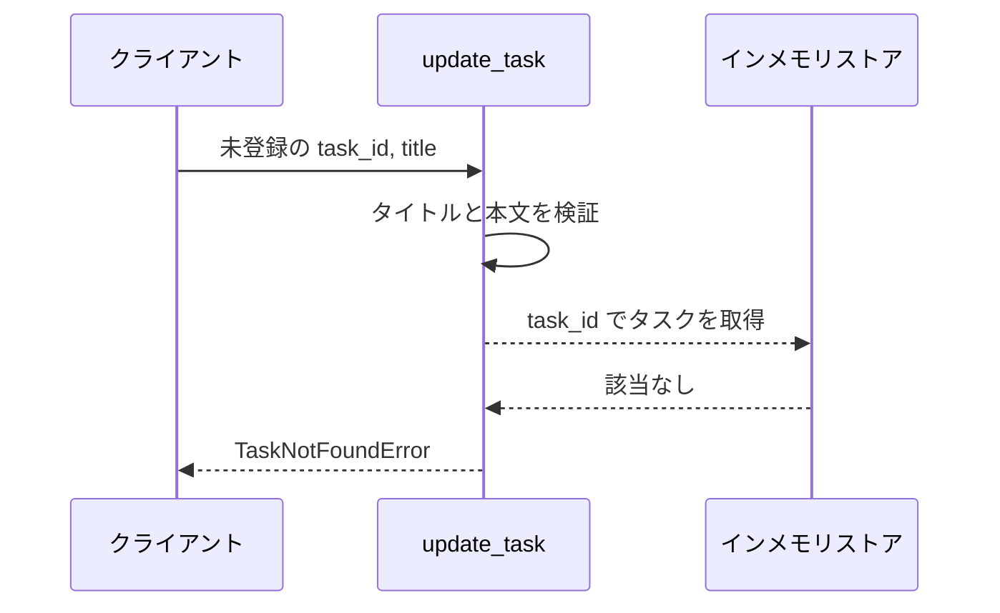

# タスク更新

操作: `update_task`（サービス層の公開関数）

タスクのタイトルと本文を検証したうえでストア上のタスクを更新し、更新後のタスクを返す。

- 対応テストファイル: `tests/integration/tasks/test_タスク更新.py`

## インターフェース

### リクエスト

| パラメータ | 型 | 必須 | デフォルト | 説明 | 制限 | 補足 |
| --- | --- | --- | --- | --- | --- | --- |
| `task_id` | `str` | ✅ | - | 更新対象のタスク ID | - | ストアに登録済みの ID |
| `title` | `str` | ✅ | - | タスク名 | 1 文字以上 100 文字以内 | 空文字は不可 |
| `content` | `str` | - | `""` | 本文 | 1000 文字以内 | 省略すると空文字で上書きする |

リクエスト例:

```python
update_task(store, "t1", "新タイトル", "新本文")
```

### レスポンス

| フィールド | 型 | 説明 | 制限 | 補足 |
| --- | --- | --- | --- | --- |
| `id` | `str` | タスク ID | - | リクエストの `task_id` と同じ |
| `title` | `str` | 更新後のタスク名 | - | - |
| `content` | `str` | 更新後の本文 | - | - |

レスポンス例:

```python
Task(id="t1", title="新タイトル", content="新本文")
```

補足:

- 戻り値はストアに格納した更新後のタスクと同じ値を持つ（呼び出し元がストアを引き直さずに済むようにする）

### 例外

| 例外 | 発生条件 | 補足 |
| --- | --- | --- |
| なし（正常終了） | 更新成功 | 戻り値は レスポンス表のとおり |
| `ValidationError` | `title` が空文字 | 不合格のフィールド名 `title` を保持する |
| `ValidationError` | `title` が 100 文字を超える | 不合格のフィールド名 `title` を保持する |
| `ValidationError` | `content` が 1000 文字を超える | 不合格のフィールド名 `content` を保持する |
| `TaskNotFoundError` | `task_id` がストアに未登録 | ストアは変更しない |

## 制約

| 項目 | 制約 | 補足 |
| --- | --- | --- |
| タイムアウト | 制限なし | インメモリのみで外部への待ちが発生しない |
| 認可 | 制限なし | 認証機構が未導入のため呼び出し元を問わない |
| 応答時間 | 1 秒以内 | 親 subsystem PR の非機能要件 |
| 一括更新 | 1 回の呼び出しで 1 件のみ | 複数件の更新は呼び出し側で繰り返す |

## フロー一覧

| 分類 | フロー名 | 概要 | 補足 |
| --- | --- | --- | --- |
| 正常 | 正常系 | タイトルと本文を更新して更新後のタスクを返す | - |
| 正常 | 正常系（本文を省略） | 本文を空文字で上書きする | - |
| 異常 | 異常系（タイトルが空・ValidationError） | タイトルの検証で不合格 | - |
| 異常 | 異常系（タイトル超過・ValidationError） | タイトルが 101 文字で不合格 | - |
| 異常 | 異常系（本文超過・ValidationError） | 本文が 1001 文字で不合格 | - |
| 異常 | 異常系（タスク未登録・TaskNotFoundError） | 検証は通るが対象が存在しない | - |

## 正常系

### セットアップ

| セットアップ | 説明 | 補足 |
| --- | --- | --- |
| Mock | なし（インメモリストアの dict をそのまま使う） | 外部依存がないため差し替える対象がない |
| タスク | `t1` のタスクを登録済み | タイトル `旧タイトル` / 本文 `旧本文` |

### フロー



### 期待値

- 更新後のタスクが返る（タイトルと本文がリクエストの値になっている）
- ストアの `t1` もリクエストの値に更新されている

## 正常系（本文を省略）

### セットアップ

| セットアップ | 説明 | 補足 |
| --- | --- | --- |
| Mock | なし（インメモリストアの dict をそのまま使う） | 外部依存がないため差し替える対象がない |
| タスク | `t1` のタスクを登録済み | 本文に `旧本文` が入っている |
| 入力 | `content` を渡さずに呼び出す | 省略時の分岐を決定的に誘発 |

### フロー



### 期待値

- 返るタスクの本文が空文字になっている
- ストアの `t1` の本文も空文字になっている

## 異常系（タイトルが空・ValidationError）

### セットアップ

| セットアップ | 説明 | 補足 |
| --- | --- | --- |
| Mock | なし（インメモリストアの dict をそのまま使う） | 外部依存がないため差し替える対象がない |
| タスク | `t1` のタスクを登録済み | タイトル `旧タイトル` |
| 入力 | `title` に空文字を渡す | 検証失敗を決定的に誘発 |

### フロー



### 期待値

- `ValidationError` が送出され、不合格のフィールド名が `title` になっている
- ストアの `t1` はタイトル・本文とも更新前のまま

## 異常系（タイトル超過・ValidationError）

### セットアップ

| セットアップ | 説明 | 補足 |
| --- | --- | --- |
| Mock | なし（インメモリストアの dict をそのまま使う） | 外部依存がないため差し替える対象がない |
| タスク | `t1` のタスクを登録済み | タイトル `旧タイトル` |
| 入力 | `title` に 101 文字の文字列を渡す | 上限超過を決定的に誘発 |

### フロー


### 期待値

- `ValidationError` が送出され、不合格のフィールド名が `title` になっている
- ストアの `t1` はタイトル・本文とも更新前のまま

## 異常系（本文超過・ValidationError）

### セットアップ

| セットアップ | 説明 | 補足 |
| --- | --- | --- |
| Mock | なし（インメモリストアの dict をそのまま使う） | 外部依存がないため差し替える対象がない |
| タスク | `t1` のタスクを登録済み | 本文 `旧本文` |
| 入力 | `title` は有効値・`content` に 1001 文字の文字列を渡す | 本文だけの不合格を切り分ける |

### フロー



### 期待値

- `ValidationError` が送出され、不合格のフィールド名が `content` になっている
- ストアの `t1` はタイトル・本文とも更新前のまま

## 異常系（タスク未登録・TaskNotFoundError）

### セットアップ

| セットアップ | 説明 | 補足 |
| --- | --- | --- |
| Mock | なし（インメモリストアの dict をそのまま使う） | 外部依存がないため差し替える対象がない |
| タスク | `t1` のタスクだけを登録済み | - |
| 入力 | `task_id` に未登録の ID を渡す | 取得失敗を決定的に誘発 |

### フロー



### 期待値

- `TaskNotFoundError` が送出される
- ストアの `t1` は更新前のまま
