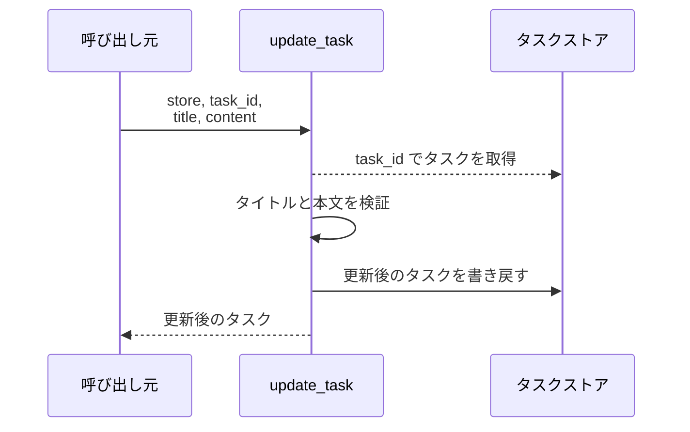
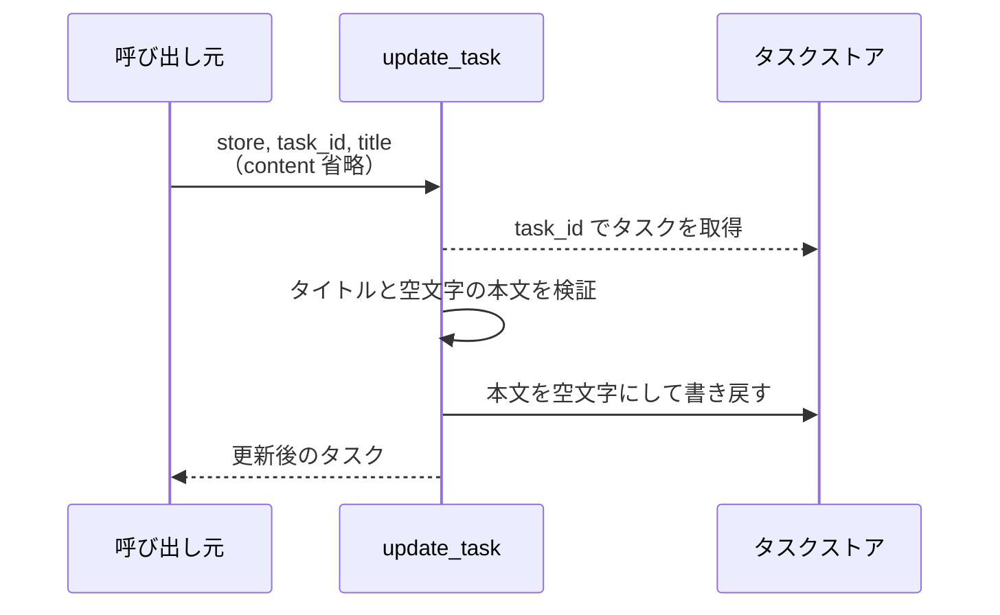
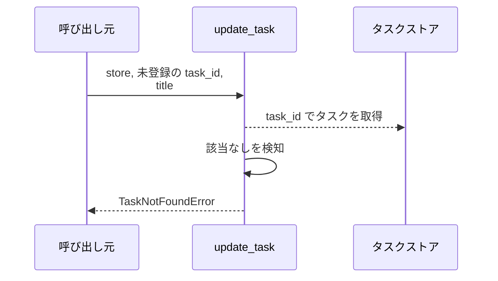
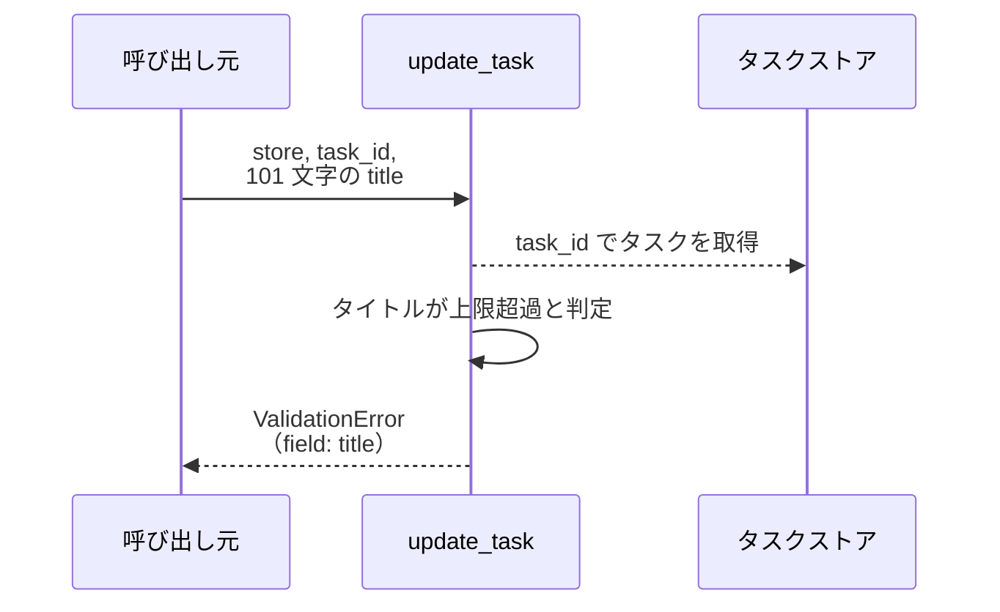
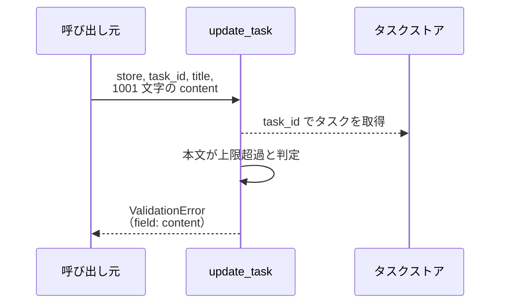

# タスク更新

操作: `update_task`（サービス層の公開関数）

タスクのタイトルと本文を検証したうえで更新し、更新後のタスクを返す。

- 対応テストファイル: `tests/unit/tasks/test_service.py`

## インターフェース

### リクエスト

| パラメータ | 型 | 必須 | デフォルト | 説明 | 制限 | 補足 |
| --- | --- | --- | --- | --- | --- | --- |
| `store` | `TaskStore` | ✅ | - | 更新対象のタスクストア | - | 呼び出し元が保持する辞書をそのまま渡す |
| `task_id` | `str` | ✅ | - | 更新するタスクの ID | - | - |
| `title` | `str` | ✅ | - | 更新後のタイトル | 1〜100 文字 | 空文字は不可 |
| `content` | `str` | - | `""` | 更新後の本文 | 1000 文字以内 | 省略時は空文字で上書きする |

リクエスト例:

```python
update_task(store, "t1", "新タイトル", "新本文")
```

### レスポンス

| フィールド | 型 | 説明 | 制限 | 補足 |
| --- | --- | --- | --- | --- |
| 戻り値 | `Task` | 更新後のタスク | - | ストアに入れ替えたインスタンスと同一 |
| 戻り値`.id` | `str` | タスク ID | - | 引数の `task_id` と一致する |
| 戻り値`.title` | `str` | 更新後のタイトル | 1〜100 文字 | - |
| 戻り値`.content` | `str` | 更新後の本文 | 1000 文字以内 | - |

レスポンス例:

```python
Task(id="t1", title="新タイトル", content="新本文")
```

**補足:**
- 同じ引数で再実行しても結果は変わらない（冪等）
- 更新は引数で受け取った辞書を直接書き換える（新しい辞書は返さない）

### 例外

| 例外 | 発生条件 | 補足 |
| --- | --- | --- |
| なし（正常終了） | 更新成功 | 戻り値は レスポンス表のとおり |
| `TaskNotFoundError` | `task_id` がストアに存在しない | ストアは変更されない |
| `ValidationError` | `title` が空文字 | `field` に `title` が入る |
| `ValidationError` | `title` が 100 文字を超える | `field` に `title` が入る |
| `ValidationError` | `content` が 1000 文字を超える | `field` に `content` が入る |

## 制約

| 項目 | 制約 | 補足 |
| --- | --- | --- |
| タイムアウト | 制限なし | 辞書操作のみで待ちが発生しない |
| 認可 | 制限なし | 呼び出し元を限定しない |
| 応答時間 | 1 秒以内 | 親 PR のシステム要件（非機能要件） |
| 同時更新 | 制限なし | 単一プロセス内の同期処理のため競合しない |

## フロー一覧

| 分類 | フロー名 | 概要 | 補足 |
| --- | --- | --- | --- |
| 正常 | 正常系 | タイトルと本文を更新して更新後タスクを返す | - |
| 正常 | 正常系（本文省略時） | 本文を空文字で上書きして更新する | - |
| 異常 | 異常系（タスク未登録・TaskNotFoundError） | 存在しない ID の更新を拒否する | - |
| 異常 | 異常系（タイトルが空・ValidationError） | 空のタイトルを弾く | - |
| 異常 | 異常系（タイトル超過・ValidationError） | 100 文字を超えるタイトルを弾く | - |
| 異常 | 異常系（本文超過・ValidationError） | 1000 文字を超える本文を弾く | - |

## 正常系

### セットアップ

| セットアップ | 説明 | 補足 |
| --- | --- | --- |
| Mock | なし（インメモリのタスクストアを実物で使う） | - |
| タスク | `t1` のタスクを 1 件登録済み | タイトル `旧タイトル` / 本文 `旧本文` |

### フロー



### 期待値

- 更新後の `Task` が返り、タイトルと本文が引数の値になっている
- ストアの `t1` が更新後のタイトルと本文になっている

## 正常系（本文省略時）

### セットアップ

| セットアップ | 説明 | 補足 |
| --- | --- | --- |
| Mock | なし（インメモリのタスクストアを実物で使う） | - |
| タスク | `t1` のタスクを 1 件登録済み | 本文 `旧本文` が入っている |
| 入力 | `content` を渡さずに呼び出す | 省略時の分岐を決定的に誘発 |

### フロー



### 期待値

- 返る `Task` の本文が空文字になっている
- ストアの `t1` の本文が空文字になっている

## 異常系（タスク未登録・TaskNotFoundError）

### セットアップ

| セットアップ | 説明 | 補足 |
| --- | --- | --- |
| Mock | なし（インメモリのタスクストアを実物で使う） | - |
| タスク | `t1` のタスクを 1 件登録済み | - |
| 入力 | 未登録の `task_id` を渡す | 取得失敗を決定的に誘発 |

### フロー



### 期待値

- `TaskNotFoundError` が送出される
- ストアの `t1` は更新前のままになっている

## 異常系（タイトルが空・ValidationError）

### セットアップ

| セットアップ | 説明 | 補足 |
| --- | --- | --- |
| Mock | なし（インメモリのタスクストアを実物で使う） | - |
| タスク | `t1` のタスクを 1 件登録済み | - |
| 入力 | `title` に空文字を渡す | 検証失敗を決定的に誘発 |

### フロー


### 期待値

- `ValidationError` が送出され、`field` が `title` になっている
- ストアの `t1` は更新前のままになっている

## 異常系（タイトル超過・ValidationError）

### セットアップ

| セットアップ | 説明 | 補足 |
| --- | --- | --- |
| Mock | なし（インメモリのタスクストアを実物で使う） | - |
| タスク | `t1` のタスクを 1 件登録済み | - |
| 入力 | `title` に 101 文字を渡す | 上限超過を決定的に誘発 |

### フロー



### 期待値

- `ValidationError` が送出され、`field` が `title` になっている
- ストアの `t1` は更新前のままになっている

## 異常系（本文超過・ValidationError）

### セットアップ

| セットアップ | 説明 | 補足 |
| --- | --- | --- |
| Mock | なし（インメモリのタスクストアを実物で使う） | - |
| タスク | `t1` のタスクを 1 件登録済み | - |
| 入力 | `content` に 1001 文字を渡す | 上限超過を決定的に誘発 |

### フロー



### 期待値

- `ValidationError` が送出され、`field` が `content` になっている
- ストアの `t1` は更新前のままになっている
