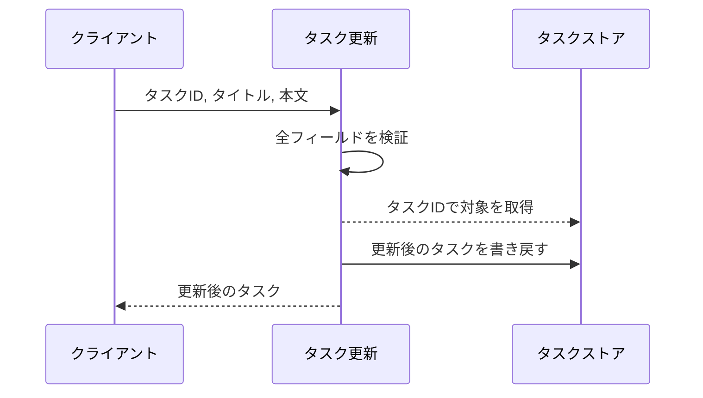
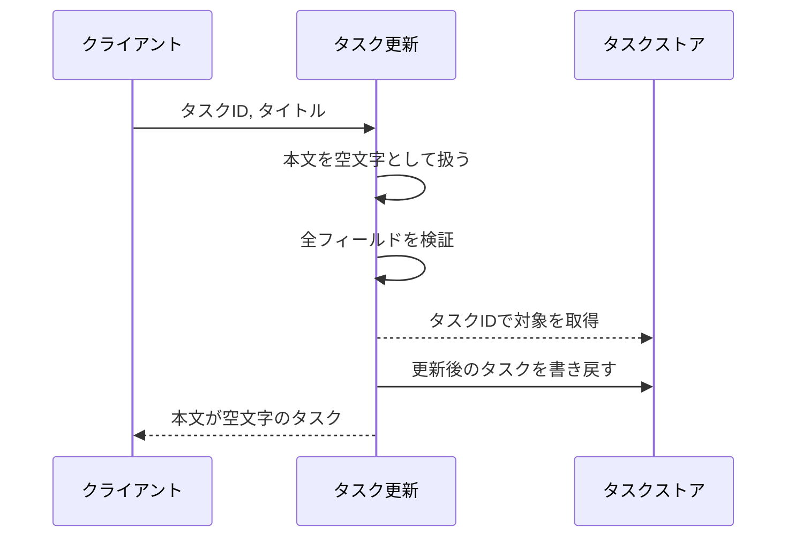
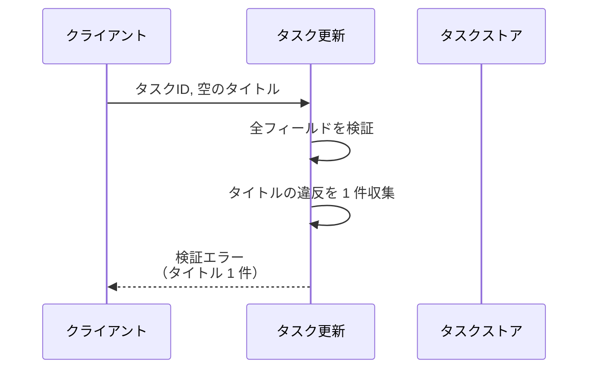
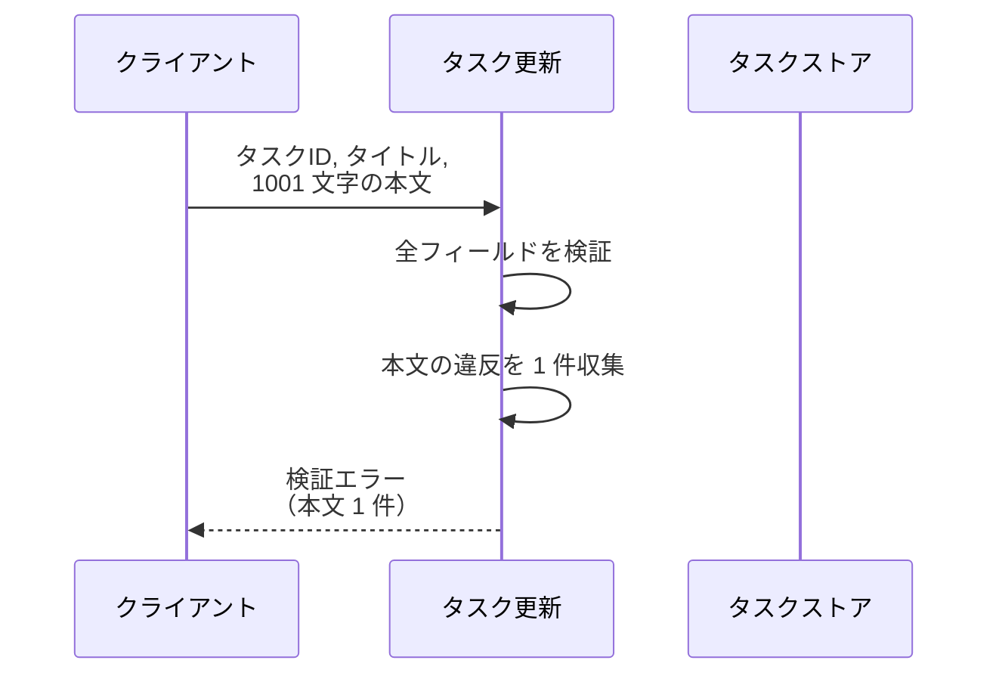
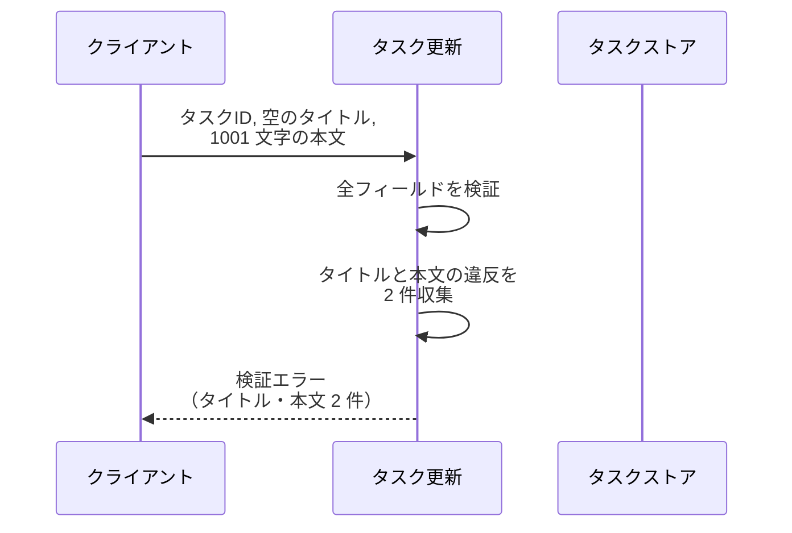
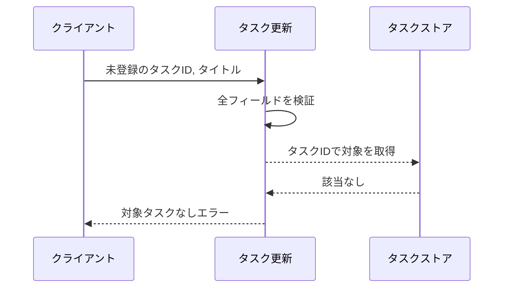

# タスク更新

操作: `update_task`（サービス層の公開関数）

登録済みタスクのタイトルと本文を検証して更新し、更新後のタスクを返す。
検証に失敗した場合はフィールド単位のエラー内容を添えて送出する。

- 対応テストファイル: `tests/integration/tasks/test_タスク更新.py`

## インターフェース

### リクエスト

| パラメータ | 型 | 必須 | デフォルト | 説明 | 制限 | 補足 |
| --- | --- | --- | --- | --- | --- | --- |
| `store` | `dict[str, Task]` | ✅ | - | タスクの保管先 | - | 呼び出し側が保持する |
| `task_id` | `str` | ✅ | - | 更新対象のタスク ID | - | - |
| `title` | `str` | ✅ | - | タスク名 | 1 文字以上 100 文字以内 | - |
| `content` | `str` | - | `""` | 本文 | 1000 文字以内 | 省略時は空文字で上書きする |

リクエスト例:

```python
update_task(store, "t1", "新タイトル", "新本文")
```

### レスポンス

| フィールド | 型 | 説明 | 制限 | 補足 |
| --- | --- | --- | --- | --- |
| `id` | `str` | タスク ID | - | 更新前後で変わらない |
| `title` | `str` | 更新後のタスク名 | 1 文字以上 100 文字以内 | - |
| `content` | `str` | 更新後の本文 | 1000 文字以内 | - |

レスポンス例:

```python
Task(id="t1", title="新タイトル", content="新本文")
```

補足:

- 戻り値と同じインスタンスが `store[task_id]` にも書き戻される
- 同じ値で繰り返し呼んでも結果は変わらない（冪等）

### エラー

| エラー | 発生条件 | 補足 |
| --- | --- | --- |
| なし（正常終了） | 更新成功 | 戻り値はレスポンス表のとおり |
| `ValidationError` | `title` が空 or 100 文字超 | `errors` に `field="title"` の 1 件が入る |
| `ValidationError` | `content` が 1000 文字超 | `errors` に `field="content"` の 1 件が入る |
| `ValidationError` | `title` と `content` の両方が不正 | `errors` に 2 件が `title` → `content` の順で入る |
| `TaskNotFoundError` | `task_id` が `store` に無い | 入力検証を通過した後に判定する |

## 制約

| 項目 | 制約 | 補足 |
| --- | --- | --- |
| 応答時間 | 1 秒以内 | 親 subsystem PR のシステム要件（非機能要件） |
| 認可 | 制限なし | 認可は本サブシステムのスコープ外 |
| 検証の打ち切り | 打ち切らない | 全フィールドを検証してから 1 度だけ送出する |
| 検証と存在確認の順序 | 入力検証 → 対象タスクの存在確認 | 両方が不正なときは検証エラーを返す |
| 排他制御 | 制限なし | 同一タスクへの同時更新は後勝ちにする |

## フロー一覧

| 分類 | フロー名 | 概要 | 補足 |
| --- | --- | --- | --- |
| 正常 | 正常系 | タイトルと本文を更新して更新後のタスクを返す | - |
| 正常 | 正常系（本文の省略時） | 本文を省略すると空文字で上書きする | - |
| 異常 | 異常系（タイトル不正・ValidationError） | タイトルの文字数制限違反を 1 件のエラーで返す | 空文字と 100 文字超が該当 |
| 異常 | 異常系（本文超過・ValidationError） | 本文の文字数制限違反を 1 件のエラーで返す | - |
| 異常 | 異常系（複数フィールド不正・ValidationError） | タイトルと本文の違反を 2 件まとめて返す | インライン表示を同時に出すため |
| 異常 | 異常系（対象タスクなし・TaskNotFoundError） | 未登録の ID を指定した場合 | 更新は行われない |

## 正常系

### セットアップ

| セットアップ | 説明 | 補足 |
| --- | --- | --- |
| Mock | なし | 呼び出し側が渡すインメモリの `dict` をそのまま使う |
| タスク | `t1` を `旧タイトル` / `旧本文` で登録済み | - |

### フロー



### 期待値

- 更新後のタイトルと本文を持つタスクが返る
- ストアの `t1` が更新後のタスクに差し替わっている

## 正常系（本文の省略時）

### セットアップ

| セットアップ | 説明 | 補足 |
| --- | --- | --- |
| Mock | なし | 呼び出し側が渡すインメモリの `dict` をそのまま使う |
| タスク | `t1` を `旧タイトル` / `旧本文` で登録済み | - |
| 入力 | 本文を渡さずに呼び出す | デフォルト値の適用を決定的に誘発 |

### フロー



### 期待値

- 返るタスクの本文が空文字になっている
- ストアの `t1` の本文も空文字に差し替わっている

## 異常系（タイトル不正・ValidationError）

### セットアップ

| セットアップ | 説明 | 補足 |
| --- | --- | --- |
| Mock | なし | 呼び出し側が渡すインメモリの `dict` をそのまま使う |
| タスク | `t1` を `旧タイトル` / `旧本文` で登録済み | - |
| 入力 | タイトルを空文字にして呼び出す | 検証失敗を決定的に誘発 |

### フロー



### 期待値

- `ValidationError` が送出され、`errors` が `field="title"` の 1 件だけを持つ
- ストアの `t1` が更新前のまま変わっていない

## 異常系（本文超過・ValidationError）

### セットアップ

| セットアップ | 説明 | 補足 |
| --- | --- | --- |
| Mock | なし | 呼び出し側が渡すインメモリの `dict` をそのまま使う |
| タスク | `t1` を `旧タイトル` / `旧本文` で登録済み | - |
| 入力 | 有効なタイトル + 1001 文字の本文で呼び出す | 検証失敗を決定的に誘発 |

### フロー



### 期待値

- `ValidationError` が送出され、`errors` が `field="content"` の 1 件だけを持つ
- ストアの `t1` が更新前のまま変わっていない

## 異常系（複数フィールド不正・ValidationError）

### セットアップ

| セットアップ | 説明 | 補足 |
| --- | --- | --- |
| Mock | なし | 呼び出し側が渡すインメモリの `dict` をそのまま使う |
| タスク | `t1` を `旧タイトル` / `旧本文` で登録済み | - |
| 入力 | 空のタイトル + 1001 文字の本文で呼び出す | 2 フィールド同時の検証失敗を決定的に誘発 |

### フロー



### 期待値

- `ValidationError` が送出され、`errors` が `title` → `content` の順で 2 件を持つ
- ストアの `t1` が更新前のまま変わっていない

## 異常系（対象タスクなし・TaskNotFoundError）

### セットアップ

| セットアップ | 説明 | 補足 |
| --- | --- | --- |
| Mock | なし | 呼び出し側が渡すインメモリの `dict` をそのまま使う |
| タスク | `t1` を `旧タイトル` / `旧本文` で登録済み | - |
| 入力 | 未登録の ID と有効なタイトルで呼び出す | 存在確認の失敗を決定的に誘発 |

### フロー



### 期待値

- `TaskNotFoundError` が送出される
- ストアの `t1` が更新前のまま変わっていない
