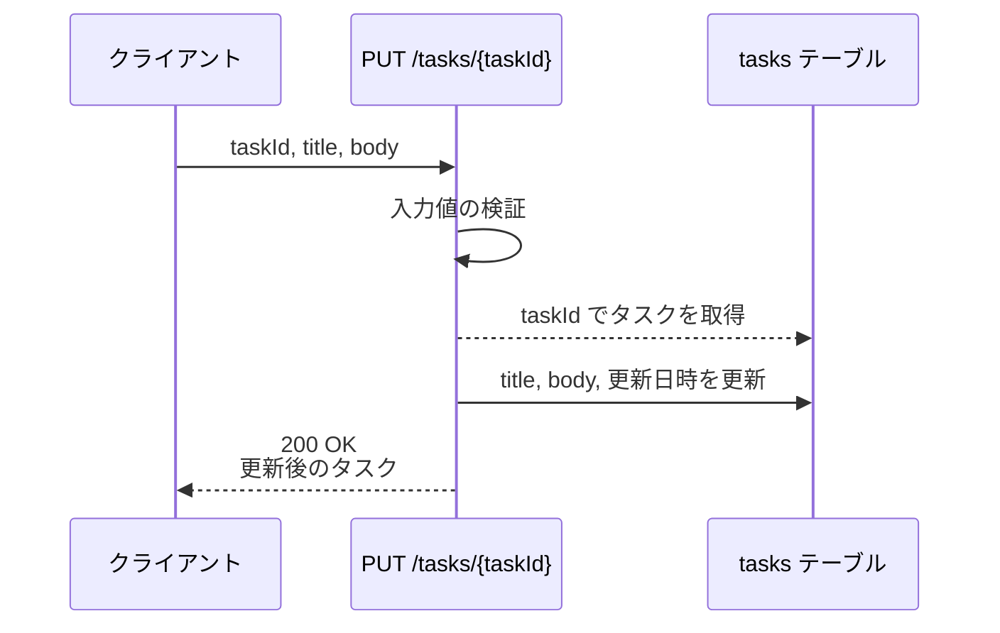
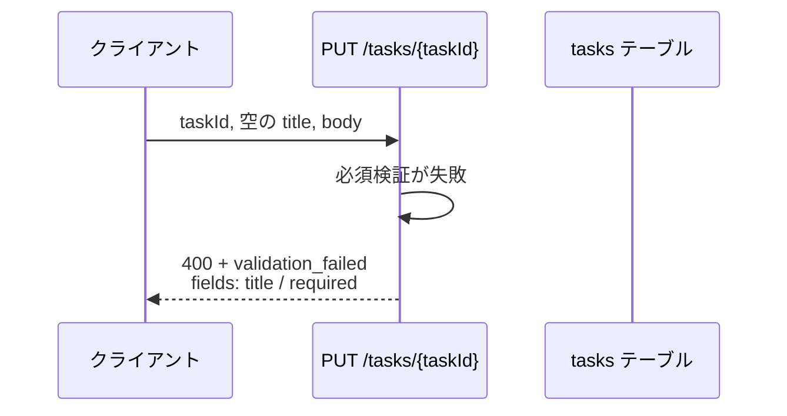
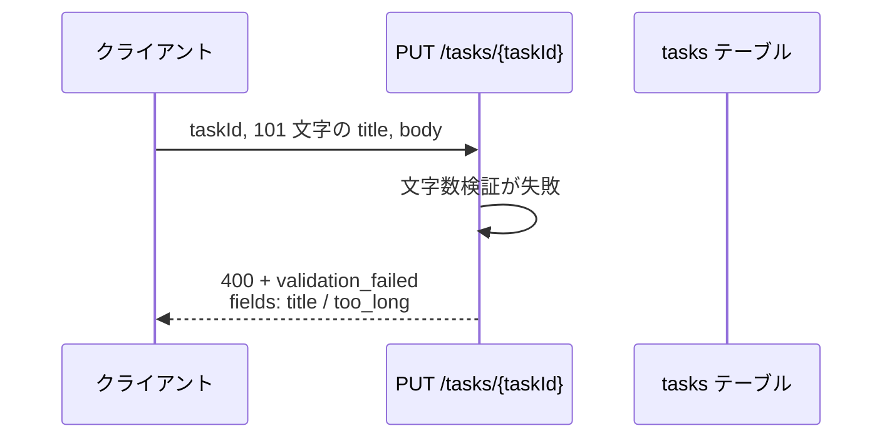
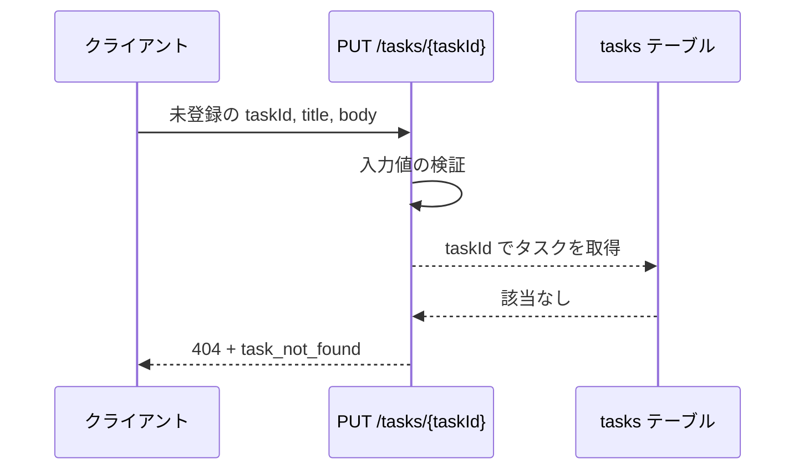
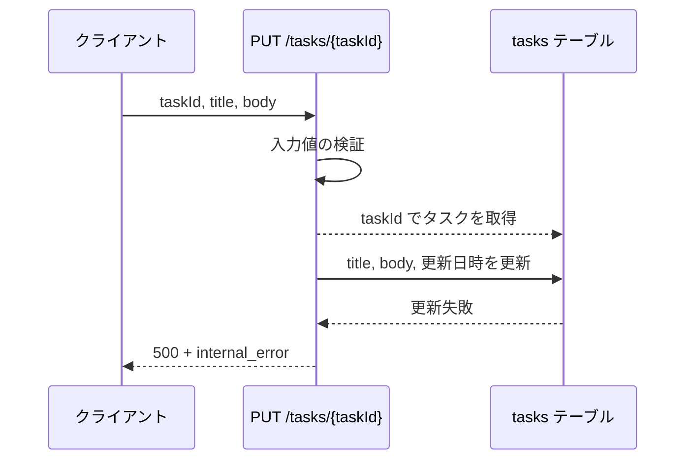

# タスク更新

エンドポイント: PUT /tasks/{taskId}

一覧から選択したタスクのタイトルと本文を更新する。
更新前にフィールド単位で入力値を検証し、失敗した項目をまとめて返す。

- 対応テストファイル: `tests/integration/api/test_task_update.py`

## インターフェース

### リクエスト

| パラメータ | 型 | 必須 | デフォルト | 説明 | 制限 | 補足 |
| --- | --- | --- | --- | --- | --- | --- |
| `taskId` | string | ✅ | - | 更新対象のタスク ID | - | パスパラメータ |
| `title` | string | ✅ | - | タスク名 | 1 文字以上 100 文字以内 | 前後の空白を除去してから検証する |
| `body` | string | - | `""`（本文なしで上書き） | タスクの本文 | 2000 文字以内 | - |

リクエスト例:

```json
{
  "title": "決算資料の作成",
  "body": "四半期分の売上を集計してレビュー依頼まで行う"
}
```

### レスポンス

| フィールド | 型 | 説明 | 制限 | 補足 |
| --- | --- | --- | --- | --- |
| `task` | object | 更新後のタスク | - | 更新成功時のみ返る |
| `task.id` | string | タスク ID | - | リクエストの `taskId` と一致する |
| `task.title` | string | 更新後のタスク名 | - | - |
| `task.body` | string | 更新後の本文 | - | 本文なしの場合は `""` |
| `task.updatedAt` | string | 更新日時（ISO 8601・UTC） | - | - |
| `error` | object | エラー内容 | - | 異常時のみ返る |
| `error.code` | string | エラー種別 | - | `validation_failed` \| `task_not_found` \| `internal_error` |
| `error.message` | string | 表示用メッセージ | - | - |
| `error.fields` | object[] | フィールド単位の検証エラー | - | `validation_failed` のときのみ返る |
| `error.fields[].field` | string | 検証に失敗したフィールド名 | - | `title` \| `body` |
| `error.fields[].code` | string | 違反した検証ルール | - | `required` \| `too_long` |
| `error.fields[].message` | string | 表示用メッセージ | - | 画面のインラインエラーに表示する文言 |

レスポンス例（更新成功時）:

```json
{
  "task": {
    "id": "3f2b1c88-0f3e-4f7a-9a2b-5f1c2d3e4a5b",
    "title": "決算資料の作成",
    "body": "四半期分の売上を集計してレビュー依頼まで行う",
    "updatedAt": "2026-07-31T04:12:33+00:00"
  }
}
```

レスポンス例（検証失敗時）:

```json
{
  "error": {
    "code": "validation_failed",
    "message": "入力内容に誤りがあります",
    "fields": [
      { "field": "title", "code": "required", "message": "タスク名を入力してください" }
    ]
  }
}
```

### ステータスコード

| ステータスコード | 発生条件 | 補足 |
| --- | --- | --- |
| `200` | 更新成功 | - |
| `400` | 入力値の検証に失敗 | `error.fields` に失敗した項目を全件詰める |
| `404` | 指定 ID のタスクが存在しない | - |
| `500` | タスクの更新に失敗 | - |

## 制約

| 項目 | 制約 | 補足 |
| --- | --- | --- |
| タイムアウト | 1 秒以内に応答する | 超過時は 500 |
| 認可 | 制限なし | 認証機構が未導入のため呼び出し元を限定しない |
| レート制限 | 制限なし | - |
| 同時更新の排他 | 制限なし（後勝ち） | 楽観ロック用のバージョン列を持たない |
| 検証の打ち切り | 打ち切らない | 全フィールドを検証してから 400 を返す |

## フロー一覧

| 分類 | フロー名 | 概要 | 補足 |
| --- | --- | --- | --- |
| 正常 | 正常系 | タイトルと本文を更新して更新後のタスクを返す | - |
| 異常 | 異常系（タスク名が空・400） | 必須検証に失敗して更新しない | 単一 UC シナリオの異常シナリオに対応 |
| 異常 | 異常系（タスク名が 100 文字超過・400） | 文字数検証に失敗して更新しない | - |
| 異常 | 異常系（対象タスクが存在しない・404） | 取得結果が空で更新しない | - |
| 異常 | 異常系（更新失敗・500） | 更新時の例外を 500 に変換する | - |

## 正常系

### セットアップ

| セットアップ | 説明 | 補足 |
| --- | --- | --- |
| Mock | `tasks テーブル` を DB stub に差し替え | - |
| タスク | 更新対象のタスクを 1 件登録済み | 単一 UC シナリオの正常シナリオと同じ前提 |

### フロー



### 期待値

- `200 OK` + 更新後の `task` が返る
- tasks テーブルの該当行の title / body が送信値に更新されている
- `task.updatedAt` が更新前の値より後になっている

## 異常系（タスク名が空・400）

### セットアップ

| セットアップ | 説明 | 補足 |
| --- | --- | --- |
| Mock | `tasks テーブル` を DB stub に差し替え | - |
| タスク | 更新対象のタスクを 1 件登録済み | - |
| 入力 | `title` を空文字にして送信 | 必須検証の失敗を決定的に誘発 |

### フロー



### 期待値

- `400` + `error.code: "validation_failed"` が返る
- `error.fields` に `field: "title"` / `code: "required"` の 1 件が含まれる
- tasks テーブルの該当行は更新されていない

## 異常系（タスク名が 100 文字超過・400）

### セットアップ

| セットアップ | 説明 | 補足 |
| --- | --- | --- |
| Mock | `tasks テーブル` を DB stub に差し替え | - |
| タスク | 更新対象のタスクを 1 件登録済み | - |
| 入力 | 101 文字の `title` で送信 | 文字数検証の失敗を決定的に誘発 |

### フロー



### 期待値

- `400` + `error.code: "validation_failed"` が返る
- `error.fields` に `field: "title"` / `code: "too_long"` の 1 件が含まれる
- tasks テーブルの該当行は更新されていない

## 異常系（対象タスクが存在しない・404）

### セットアップ

| セットアップ | 説明 | 補足 |
| --- | --- | --- |
| Mock | `tasks テーブル` を DB stub に差し替え | - |
| 入力 | 登録されていない `taskId` で送信 | 取得結果が空になる状態を決定的に誘発 |

### フロー



### 期待値

- `404` + `error.code: "task_not_found"` が返る
- tasks テーブルは更新されていない

## 異常系（更新失敗・500）

### セットアップ

| セットアップ | 説明 | 補足 |
| --- | --- | --- |
| Mock | `tasks テーブル` を、更新時に例外を送出する DB stub に差し替え | 更新失敗を決定的に誘発 |
| タスク | 更新対象のタスクを 1 件登録済み | - |

### フロー



### 期待値

- `500` + `error.code: "internal_error"` が返る
- tasks テーブルの該当行は更新されていない
