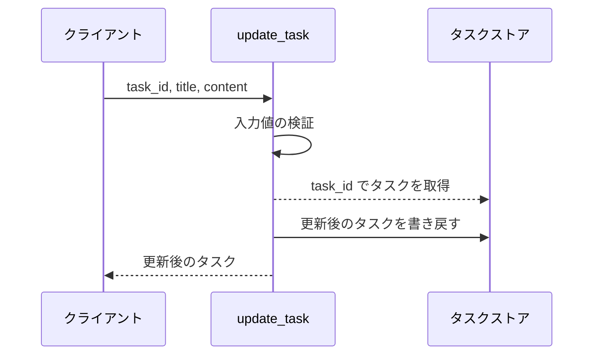
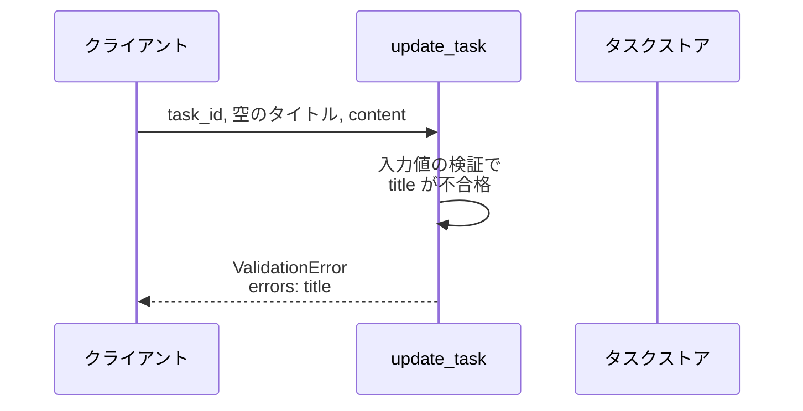
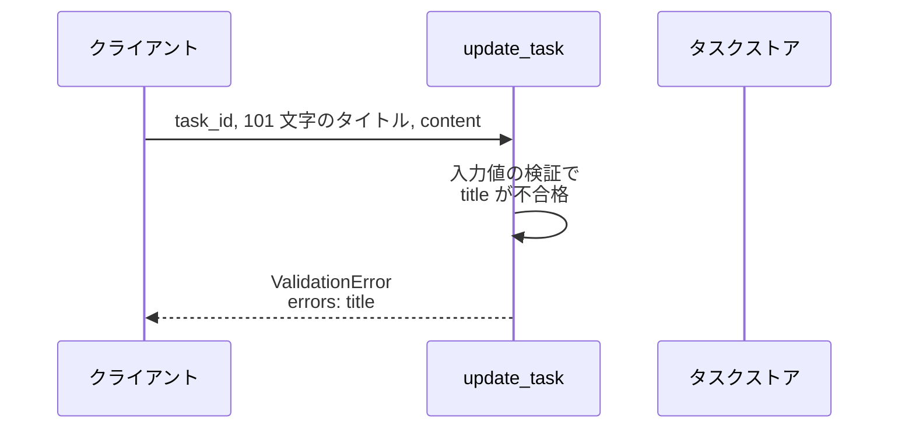
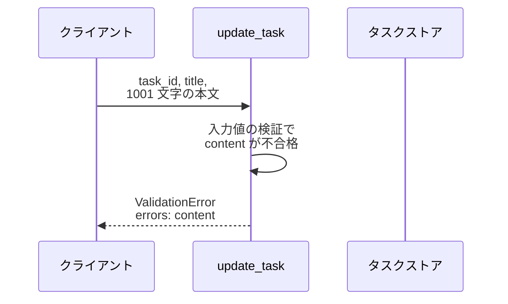
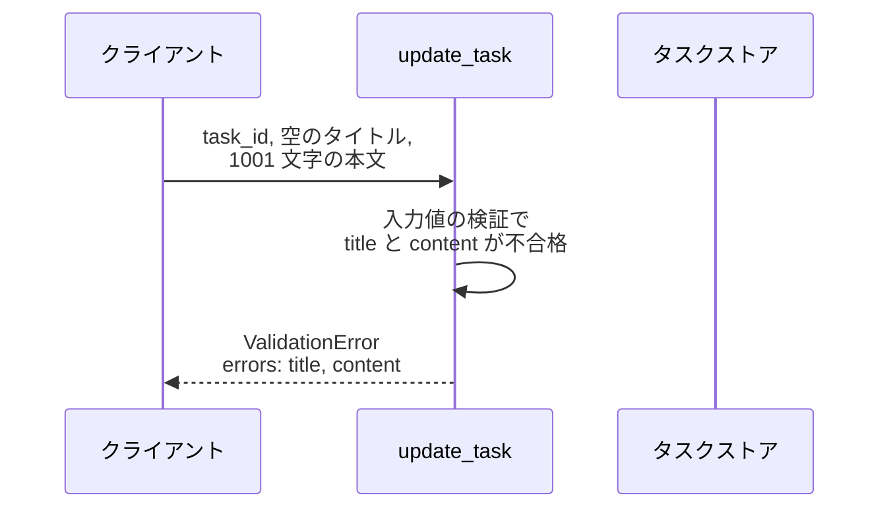
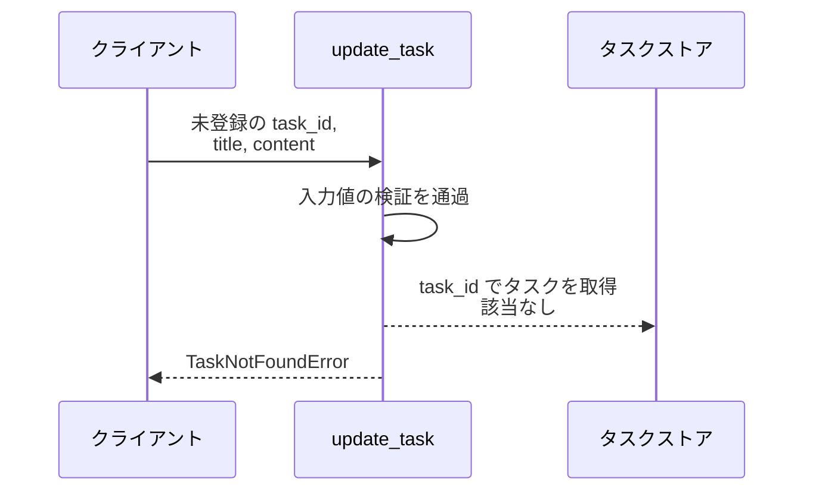

# タスク更新

操作: `update_task`（サービス層の公開関数）

登録済みタスクのタイトルと本文を受け取って検証し、更新後のタスクを返す。

- 対応テストファイル: -

## インターフェース

### リクエスト

| パラメータ | 型 | 必須 | デフォルト | 説明 | 制限 | 補足 |
| --- | --- | --- | --- | --- | --- | --- |
| `task_id` | `str` | ✅ | - | 更新対象のタスク ID | - | ストアのキーと一致すること |
| `title` | `str` | ✅ | - | 更新後のタイトル | 1〜100 文字 | 空文字は不可 |
| `content` | `str` | - | `""`（本文を空にする） | 更新後の本文 | 1000 文字以内 | 空文字は可 |

リクエスト例:

```json
{
  "task_id": "t1",
  "title": "週次レポート作成",
  "content": "今週の進捗をまとめる"
}
```

### レスポンス

| フィールド | 型 | 説明 | 制限 | 補足 |
| --- | --- | --- | --- | --- |
| `task` | object | 更新後のタスク | - | - |
| `task.id` | `str` | タスク ID | - | リクエストの `task_id` と同値 |
| `task.title` | `str` | 更新後のタイトル | - | リクエストの `title` と同値 |
| `task.content` | `str` | 更新後の本文 | - | リクエストの `content` と同値 |

レスポンス例:

```json
{
  "task": {
    "id": "t1",
    "title": "週次レポート作成",
    "content": "今週の進捗をまとめる"
  }
}
```

**補足:**
- 同じリクエストを繰り返しても結果は変わらない（更新は全置換で冪等）

### 例外

| 例外 | 発生条件 | 補足 |
| --- | --- | --- |
| なし（正常終了） | 更新成功 | 戻り値は レスポンス表のとおり |
| `ValidationError` | `title` / `content` がリクエスト表の制限を満たさない | 失敗したフィールドを `errors` に持つ |
| `TaskNotFoundError` | `task_id` のタスクがストアに存在しない | ストアは変更されない |

`ValidationError` が持つフィールド単位のエラー内容:

| フィールド | 型 | 説明 | 補足 |
| --- | --- | --- | --- |
| `errors` | `list[FieldError]` | 検証に失敗したフィールドの一覧 | 失敗したフィールドの数だけ要素を持つ |
| `errors[].field` | `"title"` \| `"content"` | 失敗したフィールド名 | 呼び出し元が入力欄と対応付けるキー |
| `errors[].message` | `str` | 失敗の内容を示す表示用メッセージ | 呼び出し元はそのまま画面に表示する |

## 制約

| 項目 | 制約 | 補足 |
| --- | --- | --- |
| 応答時間 | 1 秒以内 | 非機能要件 |
| タイムアウト | 制限なし | インメモリ操作のみで待ち合わせが発生しない |
| 認可 | 制限なし | 利用者の区別を持たない |
| 更新範囲 | `title` と `content` を渡された値で全置換する | 一部のフィールドだけを更新する呼び方は受け付けない |
| 検証の打ち切り | 打ち切らない | `title` と `content` を両方検証してから例外を送出する |
| 検証と取得の順序 | 検証を先に行う | 未登録 ID と入力不正が同時に起きた場合は `ValidationError` になる |

## フロー一覧

| 分類 | フロー名 | 概要 | 補足 |
| --- | --- | --- | --- |
| 正常 | 正常系 | 検証を通過して更新後のタスクを返す | - |
| 異常 | 異常系（タイトル空・ValidationError） | 空タイトルを検証で弾く | - |
| 異常 | 異常系（タイトル超過・ValidationError） | 101 文字のタイトルを検証で弾く | - |
| 異常 | 異常系（本文超過・ValidationError） | 1001 文字の本文を検証で弾く | - |
| 異常 | 異常系（複数フィールド不正・ValidationError） | タイトルと本文の両方を 1 回で返す | - |
| 異常 | 異常系（タスク未登録・TaskNotFoundError） | 未登録 ID を取得時に弾く | - |

## 正常系

### セットアップ

| セットアップ | 説明 | 補足 |
| --- | --- | --- |
| Mock | なし（インメモリストアをそのまま使う） | 外部依存を持たない |
| タスク | `t1` のタスクを登録済み | タイトル・本文とも更新前の値 |

### フロー



### 期待値

- 更新後のタスクが返り、`title` / `content` がリクエストの値になっている
- ストアの `t1` が更新後のタスクに置き換わっている

## 異常系（タイトル空・ValidationError）

### セットアップ

| セットアップ | 説明 | 補足 |
| --- | --- | --- |
| Mock | なし（インメモリストアをそのまま使う） | - |
| タスク | `t1` のタスクを登録済み | - |
| 入力 | `title` を空文字にして呼び出す | 検証失敗を決定的に誘発 |

### フロー



### 期待値

- `ValidationError` が送出され、`errors` が `title` の 1 件だけになっている
- ストアの `t1` は更新前のままになっている

## 異常系（タイトル超過・ValidationError）

### セットアップ

| セットアップ | 説明 | 補足 |
| --- | --- | --- |
| Mock | なし（インメモリストアをそのまま使う） | - |
| タスク | `t1` のタスクを登録済み | - |
| 入力 | `title` を 101 文字にして呼び出す | 上限超過を決定的に誘発 |

### フロー



### 期待値

- `ValidationError` が送出され、`errors` が `title` の 1 件だけになっている
- ストアの `t1` は更新前のままになっている

## 異常系（本文超過・ValidationError）

### セットアップ

| セットアップ | 説明 | 補足 |
| --- | --- | --- |
| Mock | なし（インメモリストアをそのまま使う） | - |
| タスク | `t1` のタスクを登録済み | - |
| 入力 | `content` を 1001 文字にして呼び出す | 上限超過を決定的に誘発 |

### フロー



### 期待値

- `ValidationError` が送出され、`errors` が `content` の 1 件だけになっている
- ストアの `t1` は更新前のままになっている

## 異常系（複数フィールド不正・ValidationError）

### セットアップ

| セットアップ | 説明 | 補足 |
| --- | --- | --- |
| Mock | なし（インメモリストアをそのまま使う） | - |
| タスク | `t1` のタスクを登録済み | - |
| 入力 | `title` を空文字・`content` を 1001 文字にして呼び出す | 2 フィールド同時の失敗を誘発 |

### フロー



### 期待値

- `ValidationError` が送出され、`errors` に `title` と `content` の 2 件が含まれている
- ストアの `t1` は更新前のままになっている

## 異常系（タスク未登録・TaskNotFoundError）

### セットアップ

| セットアップ | 説明 | 補足 |
| --- | --- | --- |
| Mock | なし（インメモリストアをそのまま使う） | - |
| タスク | `t1` のタスクを登録済み | - |
| 入力 | ストアに無い `task_id` で呼び出す | 取得失敗を決定的に誘発 |

### フロー



### 期待値

- `TaskNotFoundError` が送出される
- ストアにエントリが追加されず、`t1` も更新前のままになっている
