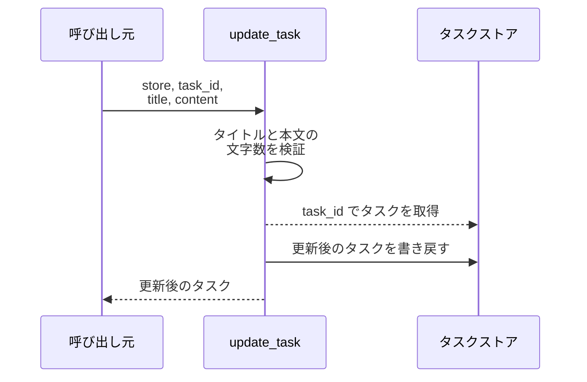
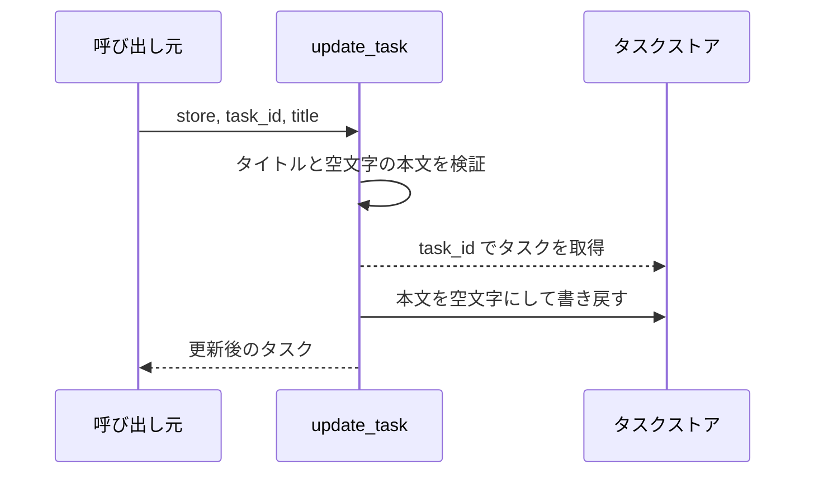
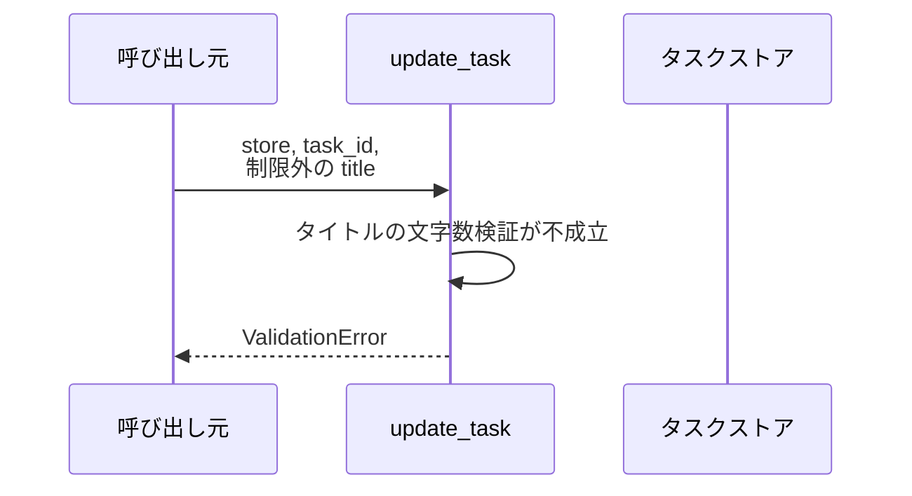
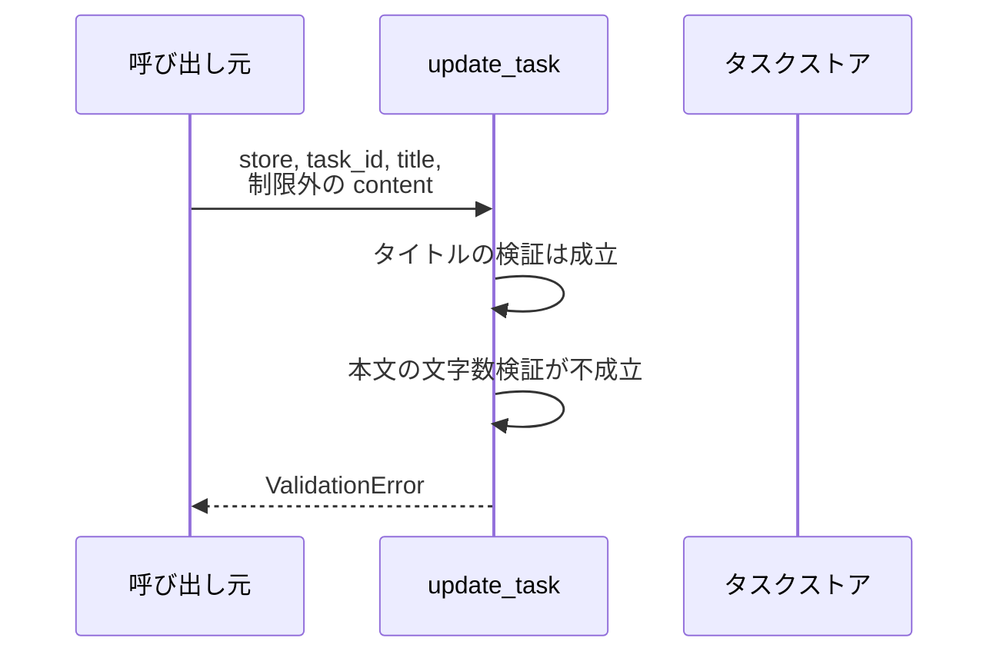
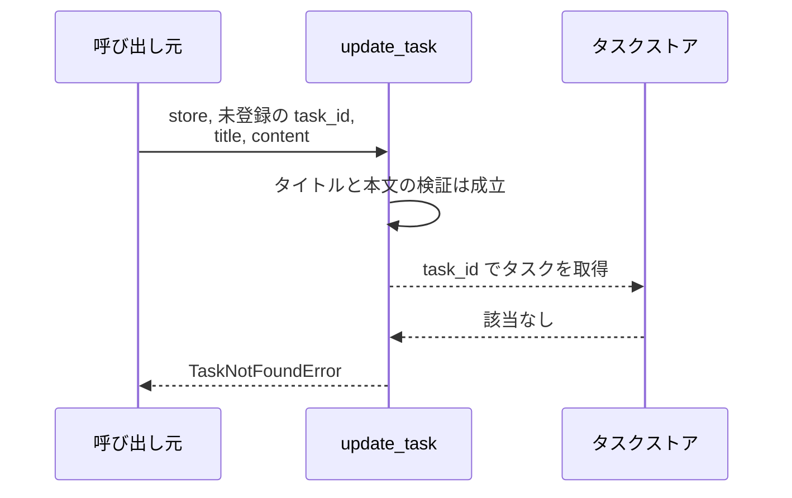

# タスク更新

操作: `update_task`（サービス層の公開関数）

登録済みタスクのタイトルと本文を検証したうえで書き換え、更新後のタスクを返す。

- 対応テストファイル: 未定（`テスト/テスト実行方法.md` の「結合テスト（バック）」が「なし」のため）

## インターフェース

### リクエスト

| パラメータ | 型 | 必須 | デフォルト | 説明 | 制限 | 補足 |
| --- | --- | --- | --- | --- | --- | --- |
| `store` | `dict[str, Task]` | ✅ | - | タスクの保管先 | - | 呼び出し側が保持するインメモリの辞書 |
| `task_id` | `str` | ✅ | - | 更新対象のタスク ID | - | `store` のキーと一致すること |
| `title` | `str` | ✅ | - | 更新後のタスク名 | 1 文字以上 100 文字以内 | 空文字は不可 |
| `content` | `str` | - | `""` | 更新後の本文 | 1000 文字以内 | 省略時は空文字で上書きする |

リクエスト例:

```python
update_task(store, "t1", "新タイトル", "新本文")
```

### レスポンス

| フィールド | 型 | 説明 | 制限 | 補足 |
| --- | --- | --- | --- | --- |
| 戻り値 | `Task` | 更新後のタスク | - | `store` に書き戻した実体と同じ値 |
| 戻り値`.id` | `str` | タスク ID | - | 更新前と同じ値を保つ |
| 戻り値`.title` | `str` | 更新後のタスク名 | 1 文字以上 100 文字以内 | - |
| 戻り値`.content` | `str` | 更新後の本文 | 1000 文字以内 | - |

レスポンス例:

```python
Task(id="t1", title="新タイトル", content="新本文")
```

補足:

- 同じ引数で複数回呼び出しても結果は変わらない（冪等）

### エラー

| エラー | 発生条件 | 補足 |
| --- | --- | --- |
| なし（正常終了） | 更新成功 | 戻り値はレスポンス表のとおり |
| `ValidationError` | `title` が 0 文字 or 100 文字を超える | 異常系（タイトル長エラー・ValidationError） |
| `ValidationError` | `content` が 1000 文字を超える | 異常系（本文長エラー・ValidationError） |
| `TaskNotFoundError` | `task_id` が `store` に存在しない | 異常系（対象タスク不在・TaskNotFoundError） |

## 制約

| 項目 | 制約 | 補足 |
| --- | --- | --- |
| 応答時間 | 1 秒以内 | SA 非機能要件「更新は 1 秒以内に応答する」 |
| タイムアウト | 制限なし | 外部 I/O を持たずインメモリで完結するため |
| 認可 | 制限なし | 認可は本サブシステムのスコープ外 |
| 更新対象フィールド | `title` と `content` のみ | `id` は不変。SA スコープ外の DB スキーマ変更を伴わない |
| 検証と取得の順序 | 入力値の検証を先に行い、その後に対象タスクを取得する | 検証で弾かれた場合は取得を行わない |

## フロー一覧

| 分類 | フロー名 | 概要 | 補足 |
| --- | --- | --- | --- |
| 正常 | 正常系 | タイトルと本文を更新して更新後のタスクを返す | - |
| 正常 | 正常系（本文省略時） | 本文を省略すると空文字で上書きする | - |
| 異常 | 異常系（タイトル長エラー・ValidationError） | 検証で弾き、保管内容を変えない | 0 文字と 101 文字が該当 |
| 異常 | 異常系（本文長エラー・ValidationError） | 検証で弾き、保管内容を変えない | 1001 文字が該当 |
| 異常 | 異常系（対象タスク不在・TaskNotFoundError） | 取得で弾き、保管内容を変えない | - |

## 正常系

### セットアップ

| セットアップ | 説明 | 補足 |
| --- | --- | --- |
| Mock | なし | 外部依存を持たないためすべて実物で動かす |
| タスク | `t1` のタスクを `store` に登録済み | タイトル・本文とも更新前の値が入っている |

### フロー



### 期待値

- 更新後の `title` と `content` を持つタスクが返る
- `store[task_id]` が返り値と同じ値に置き換わっている
- 返り値の `id` が更新前と同じ値になっている

## 正常系（本文省略時）

### セットアップ

| セットアップ | 説明 | 補足 |
| --- | --- | --- |
| Mock | なし | 外部依存を持たないためすべて実物で動かす |
| タスク | `t1` のタスクを `store` に登録済み | 本文に更新前の値が入っている |
| 入力 | `content` を省略して呼び出す | デフォルト値の適用を決定的に誘発 |

### フロー



### 期待値

- 返り値の `content` が空文字になっている
- `store[task_id].content` が空文字になっている

## 異常系（タイトル長エラー・ValidationError）

### セットアップ

| セットアップ | 説明 | 補足 |
| --- | --- | --- |
| Mock | なし | 外部依存を持たないためすべて実物で動かす |
| タスク | `t1` のタスクを `store` に登録済み | 更新前の値を保持していることの確認に使う |
| 入力 | `title` に空文字 または 101 文字の文字列を渡す | 検証失敗を決定的に誘発 |

### フロー



### 期待値

- `ValidationError` が送出される
- `store[task_id]` が更新前の値のまま変わっていない

## 異常系（本文長エラー・ValidationError）

### セットアップ

| セットアップ | 説明 | 補足 |
| --- | --- | --- |
| Mock | なし | 外部依存を持たないためすべて実物で動かす |
| タスク | `t1` のタスクを `store` に登録済み | 更新前の値を保持していることの確認に使う |
| 入力 | `title` は制限内、`content` に 1001 文字の文字列を渡す | 本文側の検証失敗を決定的に誘発 |

### フロー



### 期待値

- `ValidationError` が送出される
- `store[task_id]` が更新前の値のまま変わっていない

## 異常系（対象タスク不在・TaskNotFoundError）

### セットアップ

| セットアップ | 説明 | 補足 |
| --- | --- | --- |
| Mock | なし | 外部依存を持たないためすべて実物で動かす |
| タスク | `t1` のタスクを `store` に登録済み | 他のタスクが巻き添えで変わらないことの確認に使う |
| 入力 | `store` に無い `task_id` を渡す | 取得失敗を決定的に誘発 |

### フロー



### 期待値

- `TaskNotFoundError` が送出される
- `store` に新しいキーが追加されていない
- 既存の `store["t1"]` が更新前の値のまま変わっていない
