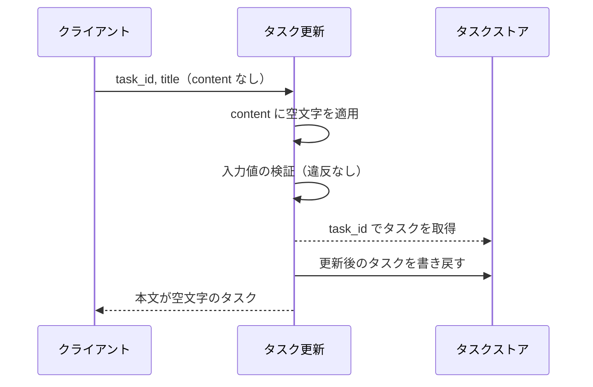
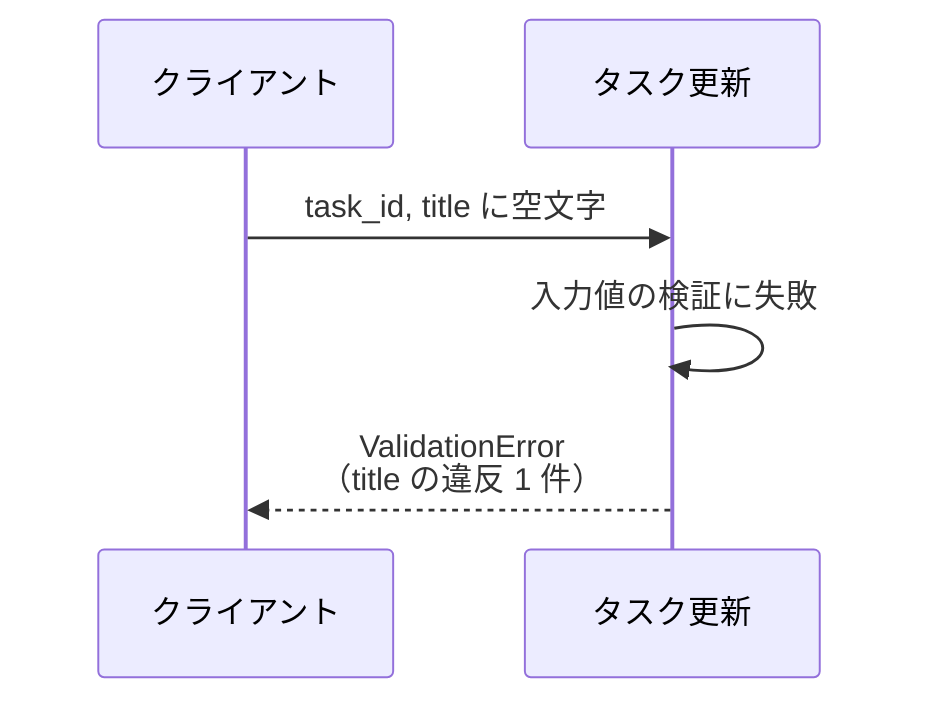
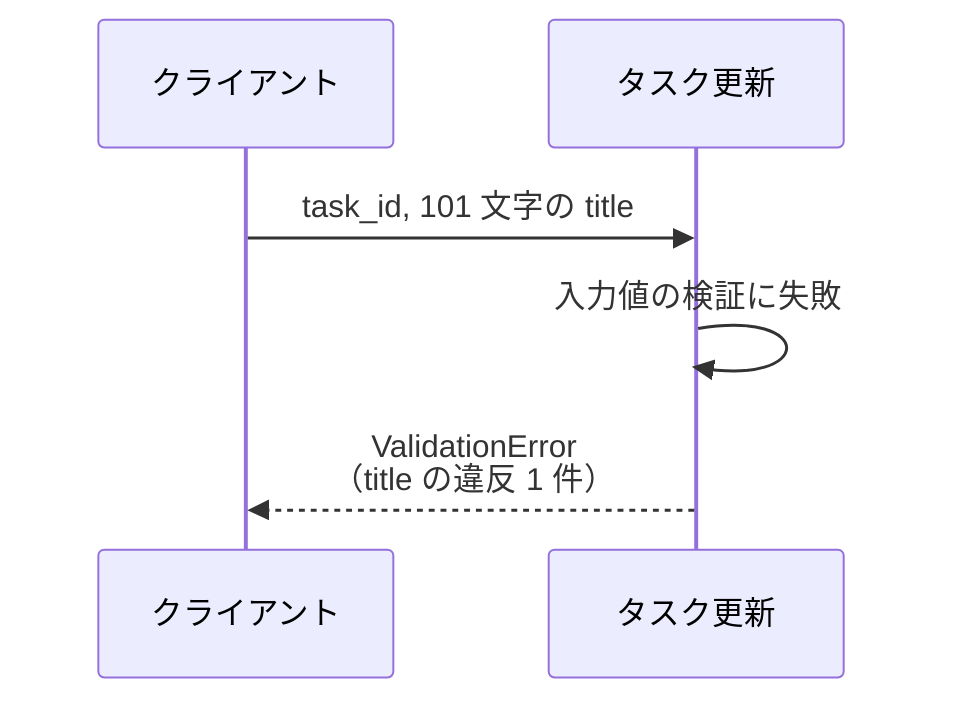
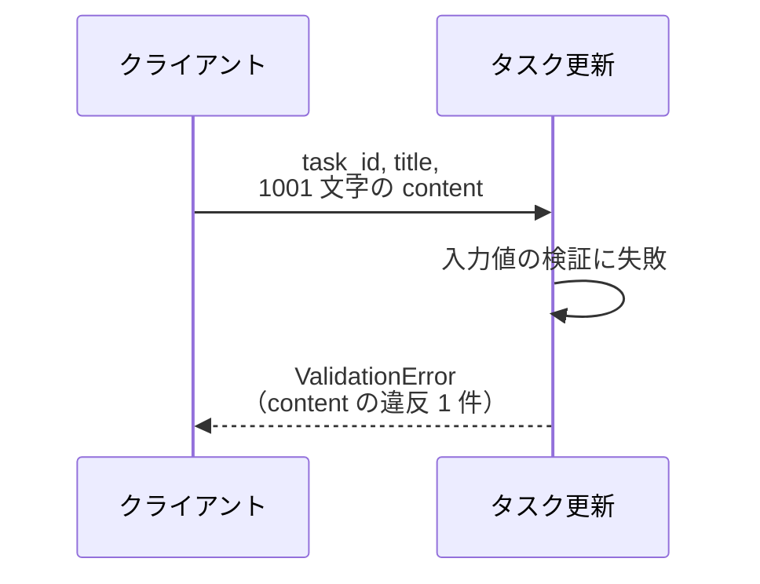
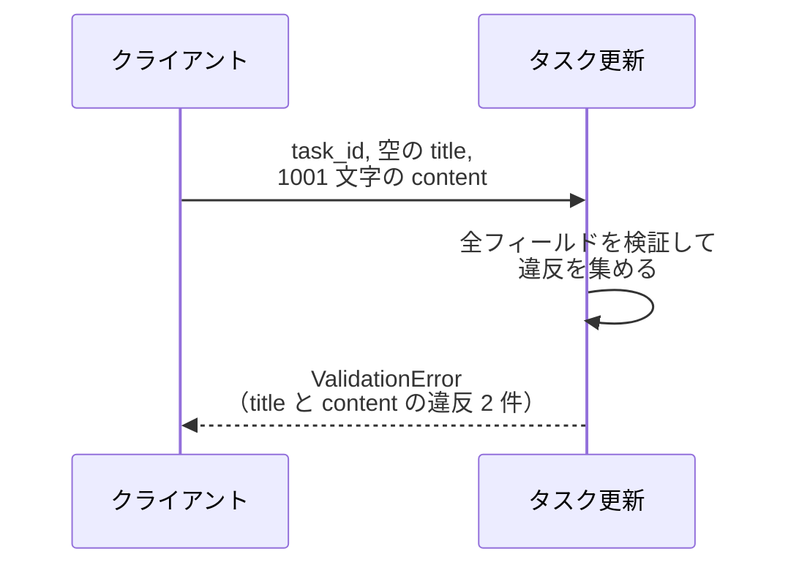
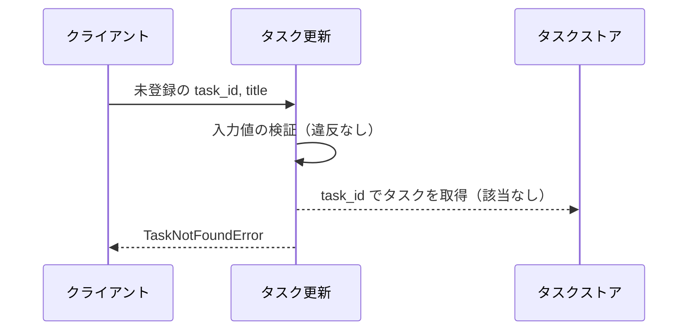

# タスク更新

操作: サービス層の公開関数 `update_task`（`src/tasks/service.py`）

登録済みタスクのタイトルと本文を検証して更新する。

- 対応テストファイル: なし（本プロジェクトはバックエンドの結合テストを持たない。フローの通し検証は `tests/e2e/単一ユースケース/test_タスク編集.py` が担う）

## インターフェース

### リクエスト

| パラメータ | 型 | 必須 | デフォルト | 説明 | 制限 | 補足 |
| --- | --- | --- | --- | --- | --- | --- |
| `store` | `dict[str, Task]` | ✅ | - | 更新対象のタスクストア | - | 呼び出し側が保持するインメモリのストア |
| `task_id` | `str` | ✅ | - | 更新対象のタスク ID | - | ストアのキー |
| `title` | `str` | ✅ | - | タスクのタイトル | 1 文字以上 100 文字以内 | - |
| `content` | `str` | - | `""` | タスクの本文 | 1000 文字以内 | 省略時は空文字で上書きする |

リクエスト例:

```python
update_task(store, "t1", "決算資料の作成", "売上集計を先に済ませる")
```

### レスポンス

| フィールド | 型 | 説明 | 制限 | 補足 |
| --- | --- | --- | --- | --- |
| `id` | `str` | タスク ID | - | 入力の `task_id` と一致する |
| `title` | `str` | 更新後のタイトル | - | - |
| `content` | `str` | 更新後の本文 | - | - |

レスポンス例:

```python
Task(id="t1", title="決算資料の作成", content="売上集計を先に済ませる")
```

補足:

- 同じ入力で繰り返し呼んでも結果は変わらない（冪等）
- 戻り値はストアに格納したものと同一のインスタンス

## 制約

| 項目 | 制約 | 補足 |
| --- | --- | --- |
| タイムアウト | 制限なし | インメモリ操作のみで待ちが発生しない |
| 認可 | なし | 利用者の概念を持たない sandbox 用の最小実装 |
| 部分更新 | 不可 | `title` / `content` の全項目を毎回受け取って置き換える |
| 検証エラーの返し方 | 検証に失敗した全フィールドを 1 つの `ValidationError` にまとめて送出する | フィールド単位のインライン表示に使う |
| 検証と存在確認の順序 | 入力値の検証を先に行い、検証を通ったときだけ対象タスクを取得する | 存在しない ID でも検証エラーが優先される |

## フロー一覧

| 分類 | フロー名 | 概要 | 補足 |
| --- | --- | --- | --- |
| 正常 | 正常系 | タイトルと本文を更新して返す | - |
| 正常 | 正常系（本文の省略） | 本文を省略して空文字で上書きする | - |
| 異常 | 異常系（タイトルが空・検証エラー） | タイトルが 0 文字 | - |
| 異常 | 異常系（タイトルが長すぎる・検証エラー） | タイトルが 101 文字以上 | - |
| 異常 | 異常系（本文が長すぎる・検証エラー） | 本文が 1001 文字以上 | - |
| 異常 | 異常系（複数フィールドの検証失敗・検証エラー） | タイトルと本文が同時に不正 | フィールド単位の返却を確認する |
| 異常 | 異常系（タスク不明・検索失敗） | 未登録の ID を指定 | - |

## 正常系

### セットアップ

| セットアップ | 説明 | 補足 |
| --- | --- | --- |
| Mock | なし（インメモリのストアを実物のまま使う） | - |
| タスク | `t1` のタスクを登録済み | タイトル `旧タイトル` / 本文 `旧本文` |
| 入力 | `title` に 1〜100 文字・`content` に 1000 文字以内を指定 | - |

### フロー


### 期待値

- 更新後のタイトルと本文を持つタスクが返る
- ストアの `t1` が更新後の値になっている

## 正常系（本文の省略）

### セットアップ

| セットアップ | 説明 | 補足 |
| --- | --- | --- |
| Mock | なし（インメモリのストアを実物のまま使う） | - |
| タスク | `t1` のタスクを登録済み | 本文に `旧本文` が入っている |
| 入力 | `content` を省略して呼び出す | デフォルト値の適用を決定的に誘発 |

### フロー



### 期待値

- 返るタスクの本文が空文字になっている
- ストアの `t1` の本文が空文字に置き換わっている

## 異常系（タイトルが空・検証エラー）

### セットアップ

| セットアップ | 説明 | 補足 |
| --- | --- | --- |
| Mock | なし（インメモリのストアを実物のまま使う） | - |
| タスク | `t1` のタスクを登録済み | - |
| 入力 | `title` に空文字を指定 | 検証失敗を決定的に誘発 |

### フロー



### 期待値

- `ValidationError` が送出される
- 保持する違反が `title` の 1 件だけになっている
- ストアの `t1` が変更されていない

## 異常系（タイトルが長すぎる・検証エラー）

### セットアップ

| セットアップ | 説明 | 補足 |
| --- | --- | --- |
| Mock | なし（インメモリのストアを実物のまま使う） | - |
| タスク | `t1` のタスクを登録済み | - |
| 入力 | `title` に 101 文字を指定 | 検証失敗を決定的に誘発 |

### フロー



### 期待値

- `ValidationError` が送出される
- 保持する違反が `title` の 1 件だけになっている
- ストアの `t1` が変更されていない

## 異常系（本文が長すぎる・検証エラー）

### セットアップ

| セットアップ | 説明 | 補足 |
| --- | --- | --- |
| Mock | なし（インメモリのストアを実物のまま使う） | - |
| タスク | `t1` のタスクを登録済み | - |
| 入力 | `title` は有効・`content` に 1001 文字を指定 | 検証失敗を決定的に誘発 |

### フロー



### 期待値

- `ValidationError` が送出される
- 保持する違反が `content` の 1 件だけになっている
- ストアの `t1` が変更されていない

## 異常系（複数フィールドの検証失敗・検証エラー）

### セットアップ

| セットアップ | 説明 | 補足 |
| --- | --- | --- |
| Mock | なし（インメモリのストアを実物のまま使う） | - |
| タスク | `t1` のタスクを登録済み | - |
| 入力 | `title` に空文字・`content` に 1001 文字を同時に指定 | 複数フィールドの違反を決定的に誘発 |

### フロー



### 期待値

- `ValidationError` が送出される
- 保持する違反が `title` と `content` の 2 件になっている
- 違反の順序が `title` → `content` になっている
- ストアの `t1` が変更されていない

## 異常系（タスク不明・検索失敗）

### セットアップ

| セットアップ | 説明 | 補足 |
| --- | --- | --- |
| Mock | なし（インメモリのストアを実物のまま使う） | - |
| タスク | `t1` のタスクを登録済み | - |
| 入力 | ストアに無い `task_id` を指定（`title` / `content` は有効） | 検索失敗を決定的に誘発 |

### フロー



### 期待値

- `TaskNotFoundError` が送出される
- ストアに新しいキーが増えていない
