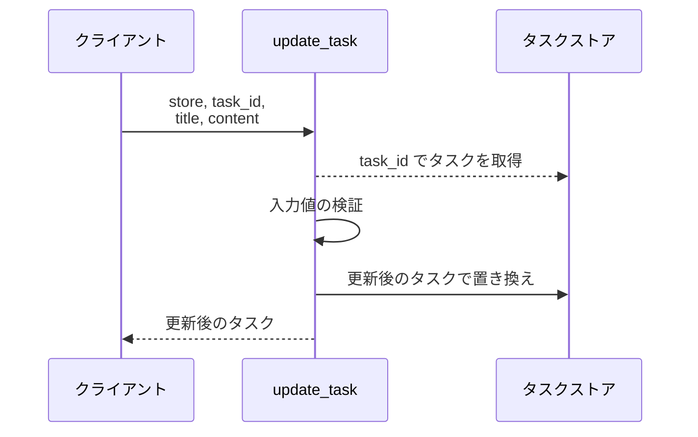
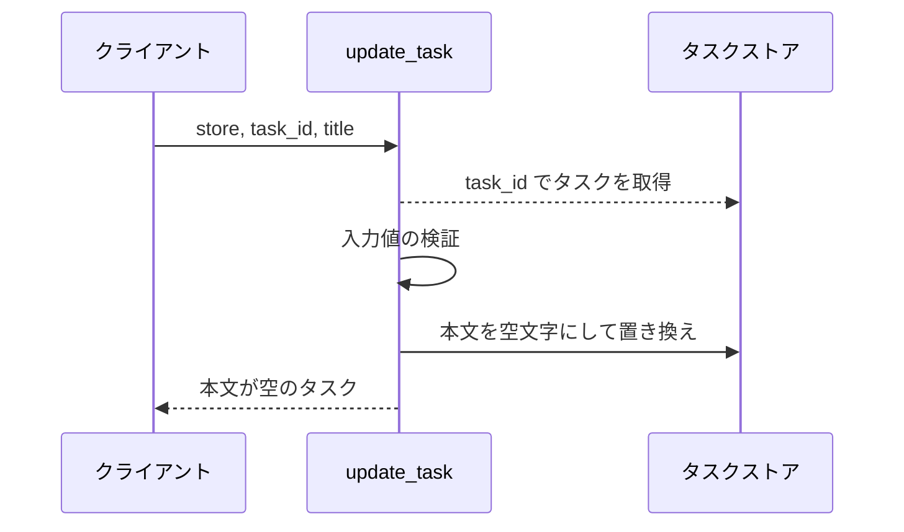
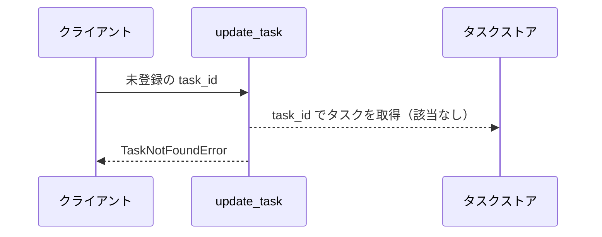
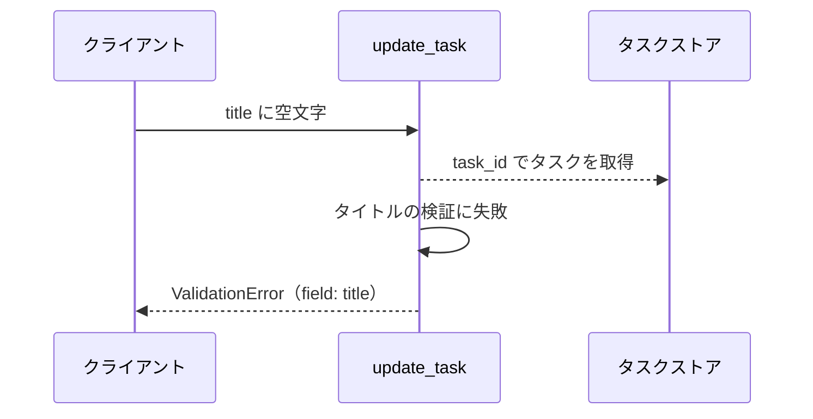
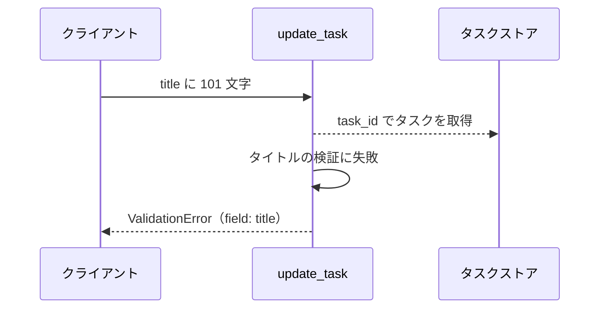
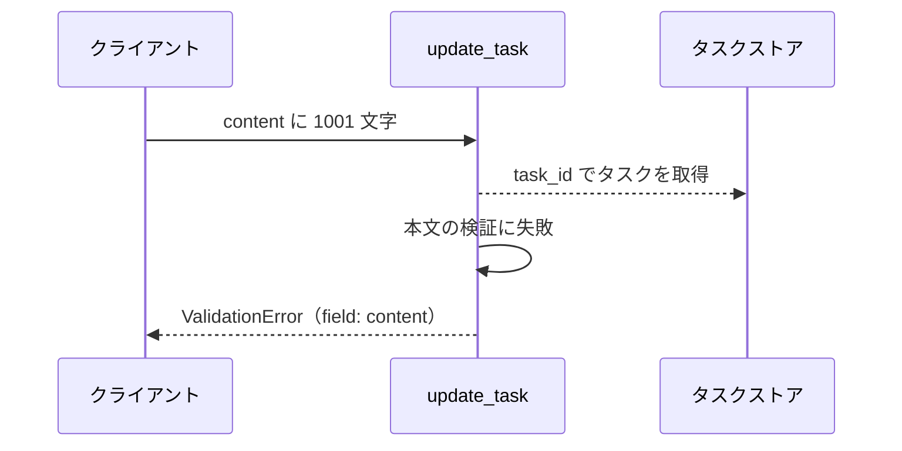

# タスク更新

操作: `update_task`（サービス層の公開関数）

登録済みタスクのタイトルと本文を更新して、更新後のタスクを返す。

- 対応テストファイル: -

## インターフェース

### リクエスト

| パラメータ | 型 | 必須 | デフォルト | 説明 | 制限 | 補足 |
| --- | --- | --- | --- | --- | --- | --- |
| `store` | `dict[str, Task]` | ✅ | - | 更新対象を保持するタスクストア | - | インメモリ。呼び出し側が生成して渡す |
| `task_id` | `str` | ✅ | - | 更新対象のタスク ID | - | `store` のキーと照合する |
| `title` | `str` | ✅ | - | 更新後のタスク名 | 1 文字以上 100 文字以内 | - |
| `content` | `str` | - | `""` | 更新後の本文 | 1000 文字以内 | 省略時は既存の本文を空文字で上書きする |

リクエスト例:

```python
update_task(store, "t1", "新タイトル", "新本文")
```

### レスポンス

| フィールド | 型 | 説明 | 制限 | 補足 |
| --- | --- | --- | --- | --- |
| `id` | `str` | タスク ID | - | 入力の `task_id` と一致する |
| `title` | `str` | 更新後のタスク名 | - | - |
| `content` | `str` | 更新後の本文 | - | - |

レスポンス例:

```python
Task(id="t1", title="新タイトル", content="新本文")
```

**補足:**

- 同じ引数で複数回呼んでもストアの状態と戻り値は変わらない（冪等）
- 戻り値はストアに格納したものと同一のインスタンス

### 例外

| 例外 | 発生条件 | 補足 |
| --- | --- | --- |
| なし（正常終了） | 更新成功 | 戻り値はレスポンス表のとおり |
| `TaskNotFoundError` | `task_id` がストアに存在しない | ストアは変更しない |
| `ValidationError` | `title` が空文字 | `field` に `title` を載せる |
| `ValidationError` | `title` が 100 文字を超える | `field` に `title` を載せる |
| `ValidationError` | `content` が 1000 文字を超える | `field` に `content` を載せる |

## 制約

| 項目 | 制約 | 補足 |
| --- | --- | --- |
| タイムアウト | 制限なし | インメモリのストアだけを触るため |
| 認可 | なし | 呼び出し元が同一プロセス内に限られるため |
| 更新の粒度 | 全項目置換 | 省略した項目はデフォルト値で上書きする |
| 応答時間 | 1 秒以内 | SA の非機能要件 |
| 検証の順序 | 存在確認 → 入力検証 | どちらも失敗する入力では `TaskNotFoundError` が出る |

## フロー一覧

| 分類 | フロー名 | 概要 | 補足 |
| --- | --- | --- | --- |
| 正常 | 正常系 | 対象タスクのタイトルと本文を更新して返す | - |
| 正常 | 正常系（本文の省略） | 本文を省略して呼び、既存の本文を空にする | - |
| 異常 | 異常系（タスク不明・TaskNotFoundError） | 未登録の ID を指定 | - |
| 異常 | 異常系（タイトルが空・ValidationError） | タイトルの空文字検証に失敗 | - |
| 異常 | 異常系（タイトル超過・ValidationError） | タイトルの文字数検証に失敗 | - |
| 異常 | 異常系（本文超過・ValidationError） | 本文の文字数検証に失敗 | - |

## 正常系

### セットアップ

| セットアップ | 説明 | 補足 |
| --- | --- | --- |
| Mock | なし（インメモリのストアを実物のまま使う） | - |
| タスク | `t1` のタスクをストアに登録済み | タイトルと本文は更新前の値 |

### フロー



### 期待値

- 更新後のタイトルと本文を持つタスクが返る
- ストアの該当タスクが更新後の値になっている

## 正常系（本文の省略）

### セットアップ

| セットアップ | 説明 | 補足 |
| --- | --- | --- |
| Mock | なし（インメモリのストアを実物のまま使う） | - |
| タスク | `t1` のタスクをストアに登録済み | 本文に更新前の値が入っている |
| 入力 | `content` を渡さずに呼び出す | 省略時の分岐を決定的に誘発 |

### フロー



### 期待値

- 返るタスクの本文が空文字になっている
- ストアの該当タスクの本文も空文字になっている

## 異常系（タスク不明・TaskNotFoundError）

### セットアップ

| セットアップ | 説明 | 補足 |
| --- | --- | --- |
| Mock | なし（インメモリのストアを実物のまま使う） | - |
| タスク | `t1` のタスクをストアに登録済み | - |
| 入力 | 未登録の `task_id` を指定 | 検索失敗を決定的に誘発 |

### フロー



### 期待値

- `TaskNotFoundError` が送出される
- ストアの既存タスクが変更されていない

## 異常系（タイトルが空・ValidationError）

### セットアップ

| セットアップ | 説明 | 補足 |
| --- | --- | --- |
| Mock | なし（インメモリのストアを実物のまま使う） | - |
| タスク | `t1` のタスクをストアに登録済み | - |
| 入力 | `title` に空文字を指定 | 検証失敗を決定的に誘発 |

### フロー



### 期待値

- `ValidationError` が送出され、`field` が `title` になっている
- ストアの既存タスクが変更されていない

## 異常系（タイトル超過・ValidationError）

### セットアップ

| セットアップ | 説明 | 補足 |
| --- | --- | --- |
| Mock | なし（インメモリのストアを実物のまま使う） | - |
| タスク | `t1` のタスクをストアに登録済み | - |
| 入力 | `title` に 101 文字を指定 | 上限超過を決定的に誘発 |

### フロー



### 期待値

- `ValidationError` が送出され、`field` が `title` になっている
- ストアの既存タスクが変更されていない

## 異常系（本文超過・ValidationError）

### セットアップ

| セットアップ | 説明 | 補足 |
| --- | --- | --- |
| Mock | なし（インメモリのストアを実物のまま使う） | - |
| タスク | `t1` のタスクをストアに登録済み | - |
| 入力 | `content` に 1001 文字を指定 | 上限超過を決定的に誘発 |

### フロー



### 期待値

- `ValidationError` が送出され、`field` が `content` になっている
- ストアの既存タスクが変更されていない
