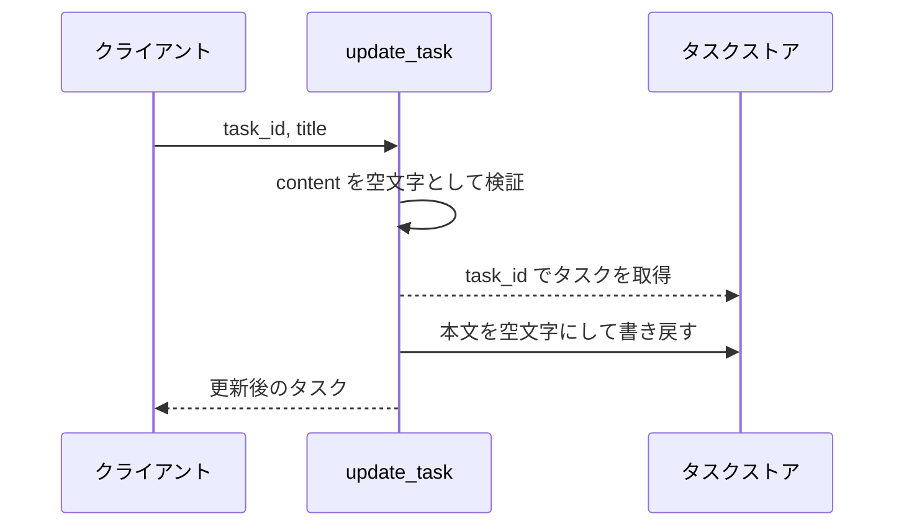
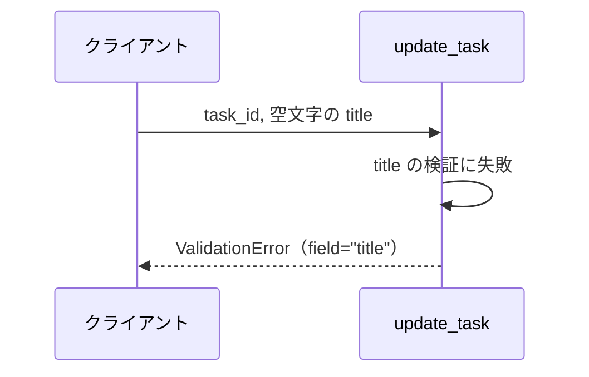
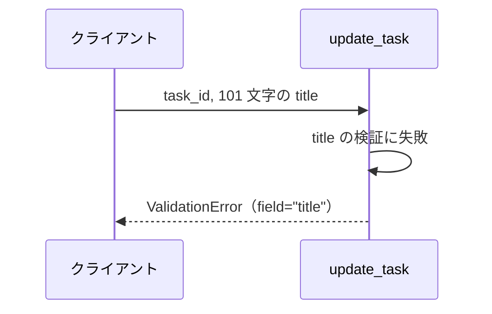
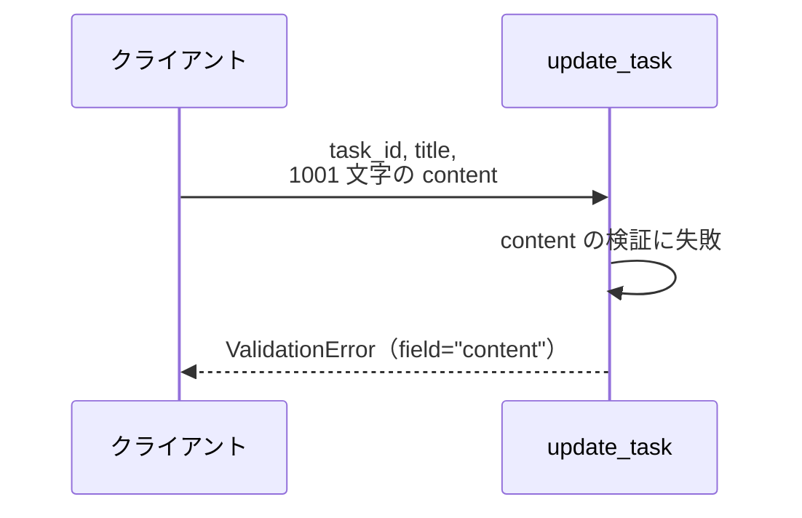
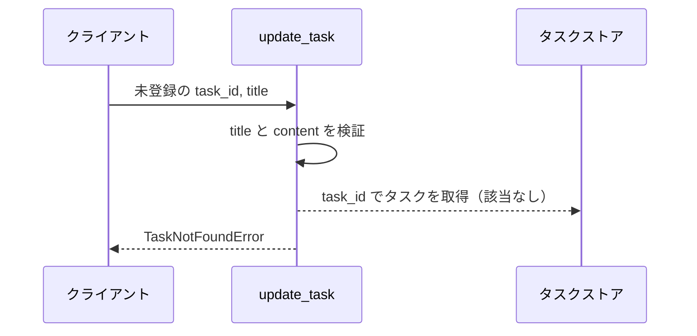

# タスク更新

操作: `update_task`（サービス層の公開関数）

登録済みタスクのタイトルと本文を検証して書き換え、更新後のタスクを返す。

- 対応テストファイル: `tests/integration/バックエンド/test_タスク更新.py`

## インターフェース

### リクエスト

| パラメータ | 型 | 必須 | デフォルト | 説明 | 制限 | 補足 |
| --- | --- | --- | --- | --- | --- | --- |
| `store` | `dict[str, Task]` | ✅ | - | タスクを保持するインメモリストア | - | 呼び出し元が保持する |
| `task_id` | `str` | ✅ | - | 更新対象のタスク ID | - | - |
| `title` | `str` | ✅ | - | 更新後のタスク名 | 1 文字以上 100 文字以内 | 空文字は不可 |
| `content` | `str` | - | `""` | 更新後の本文 | 1000 文字以内 | 省略すると空文字で上書きする |

リクエスト例:

```json
{
  "task_id": "t1",
  "title": "新タイトル",
  "content": "新本文"
}
```

### レスポンス

| フィールド | 型 | 説明 | 制限 | 補足 |
| --- | --- | --- | --- | --- |
| `id` | `str` | タスク ID | - | リクエストの `task_id` と同じ |
| `title` | `str` | 更新後のタスク名 | - | - |
| `content` | `str` | 更新後の本文 | - | - |

レスポンス例:

```json
{
  "id": "t1",
  "title": "新タイトル",
  "content": "新本文"
}
```

### 例外

| 例外 | 発生条件 | 補足 |
| --- | --- | --- |
| なし（正常終了） | 検証を通過し、対象タスクが存在する | 戻り値はレスポンス表のとおり |
| `ValidationError` | `title` が 1 文字未満 or 100 文字超 | `field="title"` を持つ |
| `ValidationError` | `content` が 1000 文字超 | `field="content"` を持つ |
| `TaskNotFoundError` | `task_id` が `store` に存在しない | `field` は持たない |

## 制約

| 項目 | 制約 | 補足 |
| --- | --- | --- |
| 応答時間 | 1 秒以内 | 親 PR #6473 の非機能要件 |
| タイムアウト | 制限なし | 外部通信を行わない |
| 認可 | なし | 呼び出し元を識別しない |
| 同時更新の排他 | 制限なし | 単一プロセスのインメモリストアのみを扱う |
| 検証の順序 | 入力値の検証を全て通してから対象タスクを検索する | 未登録の ID と不正な入力が同時に来た場合は `ValidationError` が先に出る |
| 検証エラーの粒度 | 制約を満たさない入力を 1 件見つけた時点で送出する | 複数フィールドの違反をまとめて返さない |

## フロー一覧

| 分類 | フロー名 | 概要 | 補足 |
| --- | --- | --- | --- |
| 正常 | 正常系 | タイトルと本文を指定して更新する | - |
| 正常 | 正常系（本文を省略） | 本文を省略して更新する | 本文は空文字になる |
| 異常 | 異常系（タイトルが空・ValidationError） | タイトルの下限違反 | - |
| 異常 | 異常系（タイトル超過・ValidationError） | タイトルの上限違反 | - |
| 異常 | 異常系（本文超過・ValidationError） | 本文の上限違反 | - |
| 異常 | 異常系（タスク不明・TaskNotFoundError） | 未登録の ID を指定 | - |

## 正常系

### セットアップ

| セットアップ | 説明 | 補足 |
| --- | --- | --- |
| Mock | なし（インメモリのストアを実物のまま使う） | - |
| タスク | `t1` のタスクを登録済み | タイトル・本文とも値が入っている |
| 入力 | `title` と `content` の両方を指定 | - |

### フロー


### 期待値

- 指定したタイトルと本文を持つタスクが返る
- ストアの該当タスクが更新後の値になっている

## 正常系（本文を省略）

### セットアップ

| セットアップ | 説明 | 補足 |
| --- | --- | --- |
| Mock | なし（インメモリのストアを実物のまま使う） | - |
| タスク | `t1` のタスクを本文入りで登録済み | 上書きされることを観測するため |
| 入力 | `content` を省略して送信 | 分岐を決定的に誘発 |

### フロー



### 期待値

- 返るタスクの本文が空文字になっている
- ストアの該当タスクの本文も空文字になっている

## 異常系（タイトルが空・ValidationError）

### セットアップ

| セットアップ | 説明 | 補足 |
| --- | --- | --- |
| Mock | なし（インメモリのストアを実物のまま使う） | - |
| タスク | `t1` のタスクを登録済み | - |
| 入力 | `title` に空文字を指定 | 検証失敗を決定的に誘発 |

### フロー



### 期待値

- `ValidationError` が送出され、`field` が `title` になっている
- ストアの該当タスクが変更されていない

## 異常系（タイトル超過・ValidationError）

### セットアップ

| セットアップ | 説明 | 補足 |
| --- | --- | --- |
| Mock | なし（インメモリのストアを実物のまま使う） | - |
| タスク | `t1` のタスクを登録済み | - |
| 入力 | `title` に 101 文字を指定 | 上限違反を決定的に誘発 |

### フロー



### 期待値

- `ValidationError` が送出され、`field` が `title` になっている
- ストアの該当タスクが変更されていない

## 異常系（本文超過・ValidationError）

### セットアップ

| セットアップ | 説明 | 補足 |
| --- | --- | --- |
| Mock | なし（インメモリのストアを実物のまま使う） | - |
| タスク | `t1` のタスクを登録済み | - |
| 入力 | `title` は正常値、`content` に 1001 文字を指定 | 上限違反を決定的に誘発 |

### フロー



### 期待値

- `ValidationError` が送出され、`field` が `content` になっている
- ストアの該当タスクが変更されていない

## 異常系（タスク不明・TaskNotFoundError）

### セットアップ

| セットアップ | 説明 | 補足 |
| --- | --- | --- |
| Mock | なし（インメモリのストアを実物のまま使う） | - |
| タスク | `t1` のタスクを登録済み | - |
| 入力 | 未登録の `task_id` を正常な `title` とともに指定 | 検索失敗を決定的に誘発 |

### フロー



### 期待値

- `TaskNotFoundError` が送出される
- ストアの内容が変更されていない
