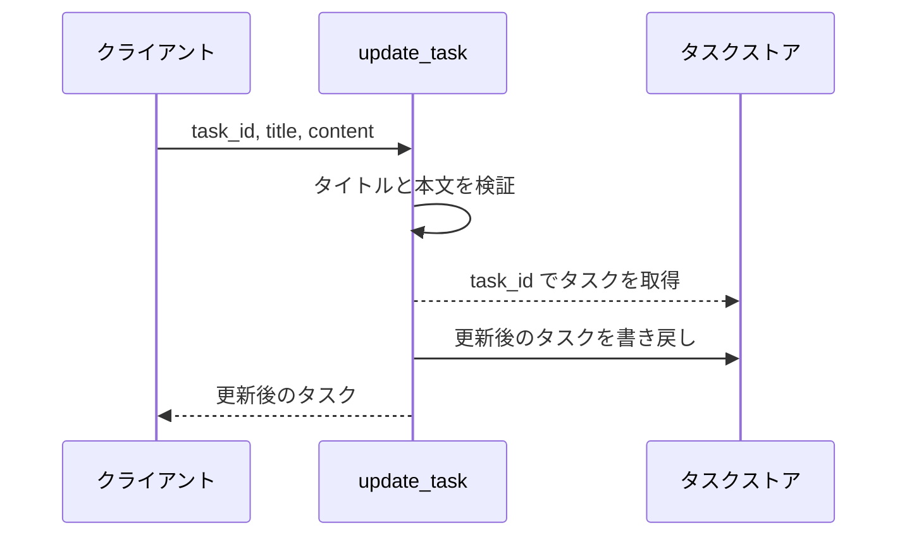
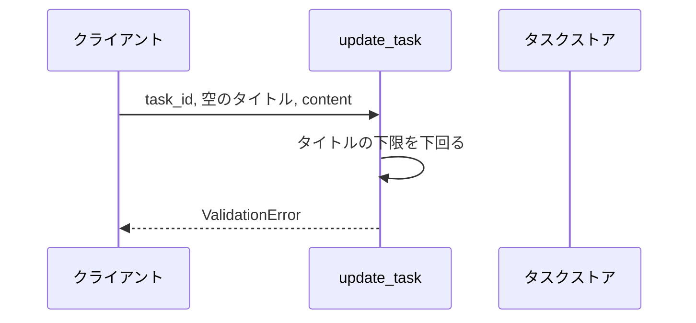
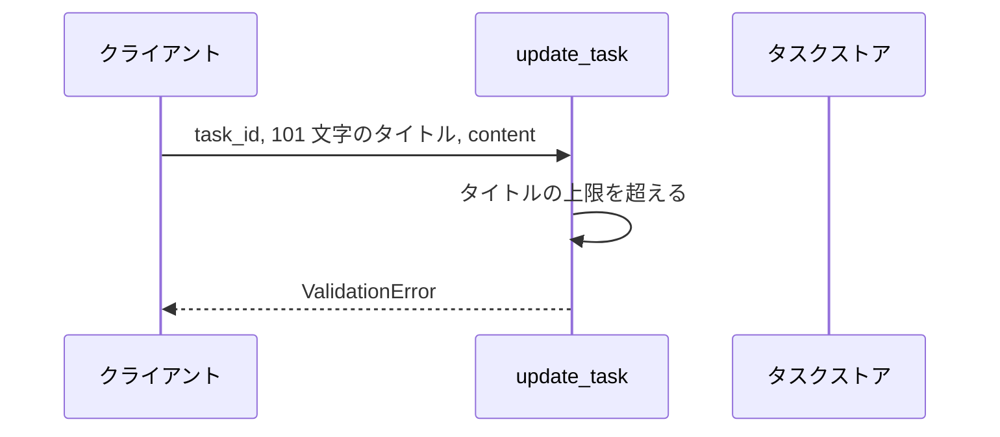
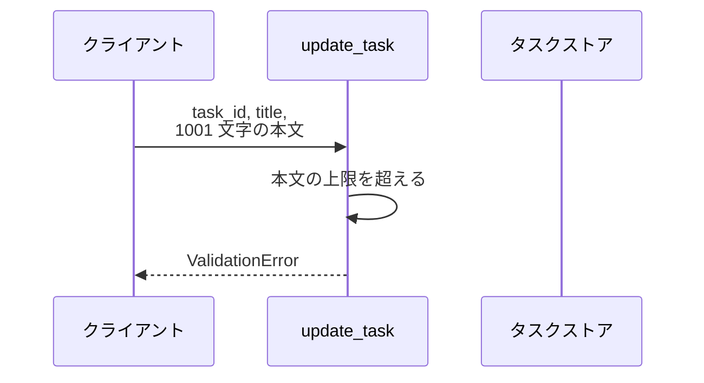
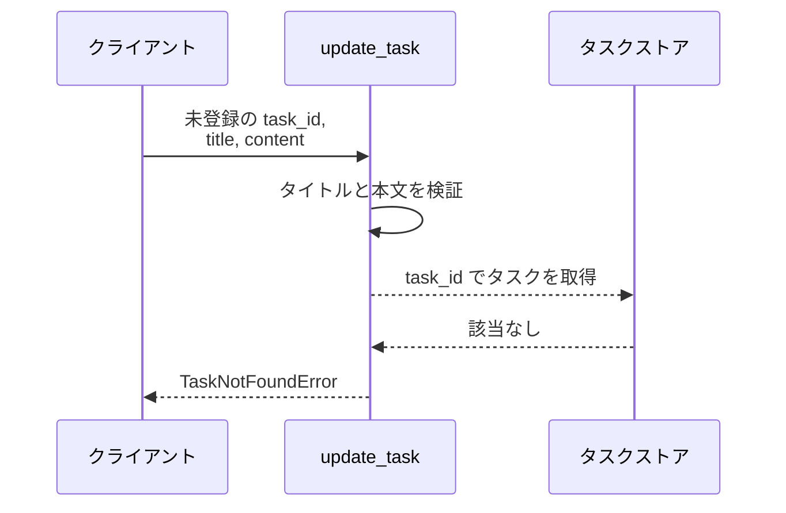

# タスク更新

操作: `update_task`（サービス層の公開関数）

登録済みタスクのタイトルと本文を差し替えて、更新後のタスクを返す。

- 対応テストファイル: `tests/integration/tasks/test_タスク更新.py`

## インターフェース

### リクエスト

| パラメータ | 型 | 必須 | デフォルト | 説明 | 制限 | 補足 |
| --- | --- | --- | --- | --- | --- | --- |
| `task_id` | str | ✅ | - | 更新対象のタスク ID | - | - |
| `title` | str | ✅ | - | 更新後のタイトル | 1 文字以上 100 文字以内 | 空文字は拒否 |
| `content` | str | ✅ | - | 更新後の本文 | 1000 文字以内 | 空文字は許可 |

リクエスト例:

```json
{
  "task_id": "task_01",
  "title": "決算資料の作成",
  "content": "四半期分の売上をまとめる"
}
```

### レスポンス

| フィールド | 型 | 説明 | 制限 | 補足 |
| --- | --- | --- | --- | --- |
| `id` | str | タスク ID | - | 入力の `task_id` と同じ値 |
| `title` | str | 更新後のタイトル | - | 入力の `title` と同じ値 |
| `content` | str | 更新後の本文 | - | 入力の `content` と同じ値 |

レスポンス例:

```json
{
  "id": "task_01",
  "title": "決算資料の作成",
  "content": "四半期分の売上をまとめる"
}
```

補足:

- 同じ入力での再実行は同じ結果になる（更新は全置換で、呼び出し回数に依存しない）

### エラー

| エラー | 発生条件 | 補足 |
| --- | --- | --- |
| なし（正常終了） | 更新成功 | 戻り値はレスポンス表のとおり |
| `ValidationError` | `title` が 0 文字、または 100 文字を超える | 空文字の拒否を含む |
| `ValidationError` | `content` が 1000 文字を超える | - |
| `TaskNotFoundError` | `task_id` のタスクが未登録 | - |

## 制約

| 項目 | 制約 | 補足 |
| --- | --- | --- |
| タイムアウト | 制限なし | インメモリ操作のみで外部通信が発生しない |
| 認可 | 制限なし | 本プロジェクトに認証・認可の機構がない |
| 検証順序 | 入力値の検証をタスクの存在確認より先に行う | 未登録 ID と不正な入力値が同時に来た場合は `ValidationError` が出る |
| 更新範囲 | `title` と `content` の両方を差し替える | 片方だけの部分更新は受け付けない |

## フロー一覧

| 分類 | フロー名 | 概要 | 補足 |
| --- | --- | --- | --- |
| 正常 | 正常系 | タイトルと本文を差し替えて更新後のタスクを返す | - |
| 異常 | 異常系（タイトルが空・ValidationError） | 空文字のタイトルで検証に失敗する | シナリオ「異常シナリオ（タイトルが空）」に対応 |
| 異常 | 異常系（タイトル超過・ValidationError） | 101 文字のタイトルで検証に失敗する | - |
| 異常 | 異常系（本文超過・ValidationError） | 1001 文字の本文で検証に失敗する | - |
| 異常 | 異常系（タスク未登録・TaskNotFoundError） | 未登録の ID で取得に失敗する | - |

## 正常系

### セットアップ

| セットアップ | 説明 | 補足 |
| --- | --- | --- |
| Mock | なし（タスクストアは引数で受け取るインメモリの辞書） | - |
| タスク | `task_01` のタスクを登録済み | - |

### フロー



### 期待値

- 更新後のタイトルと本文を持つタスクが返る
- タスクストアの `task_01` が更新後の値に置き換わっている

## 異常系（タイトルが空・ValidationError）

### セットアップ

| セットアップ | 説明 | 補足 |
| --- | --- | --- |
| Mock | なし（タスクストアは引数で受け取るインメモリの辞書） | - |
| タスク | `task_01` のタスクを登録済み | - |
| 入力 | `title` を空文字にして呼び出す | 検証失敗を決定的に誘発 |

### フロー



### 期待値

- `ValidationError` が送出される
- タスクストアの `task_01` は更新前の値のまま

## 異常系（タイトル超過・ValidationError）

### セットアップ

| セットアップ | 説明 | 補足 |
| --- | --- | --- |
| Mock | なし（タスクストアは引数で受け取るインメモリの辞書） | - |
| タスク | `task_01` のタスクを登録済み | - |
| 入力 | `title` を 101 文字にして呼び出す | 検証失敗を決定的に誘発 |

### フロー



### 期待値

- `ValidationError` が送出される
- タスクストアの `task_01` は更新前の値のまま

## 異常系（本文超過・ValidationError）

### セットアップ

| セットアップ | 説明 | 補足 |
| --- | --- | --- |
| Mock | なし（タスクストアは引数で受け取るインメモリの辞書） | - |
| タスク | `task_01` のタスクを登録済み | - |
| 入力 | `content` を 1001 文字にして呼び出す | 検証失敗を決定的に誘発 |

### フロー



### 期待値

- `ValidationError` が送出される
- タスクストアの `task_01` は更新前の値のまま

## 異常系（タスク未登録・TaskNotFoundError）

### セットアップ

| セットアップ | 説明 | 補足 |
| --- | --- | --- |
| Mock | なし（タスクストアは引数で受け取るインメモリの辞書） | - |
| タスク | 登録なし（空のタスクストア） | 取得失敗を決定的に誘発 |
| 入力 | 未登録の `task_id` を指定して呼び出す | - |

### フロー



### 期待値

- `TaskNotFoundError` が送出される
- タスクストアには新しいタスクが作成されていない
