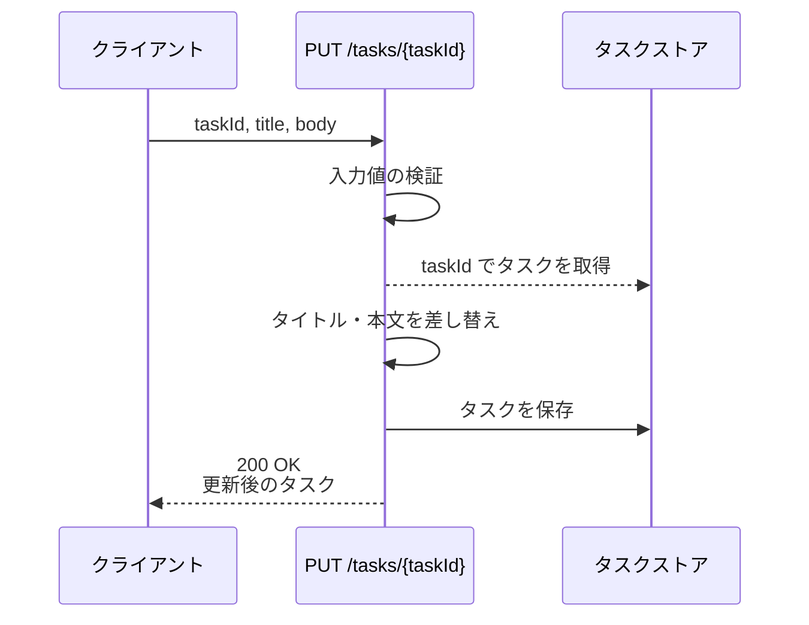
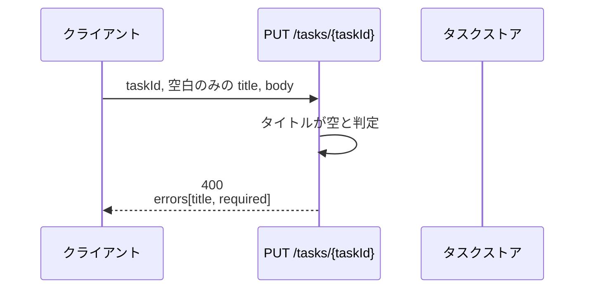
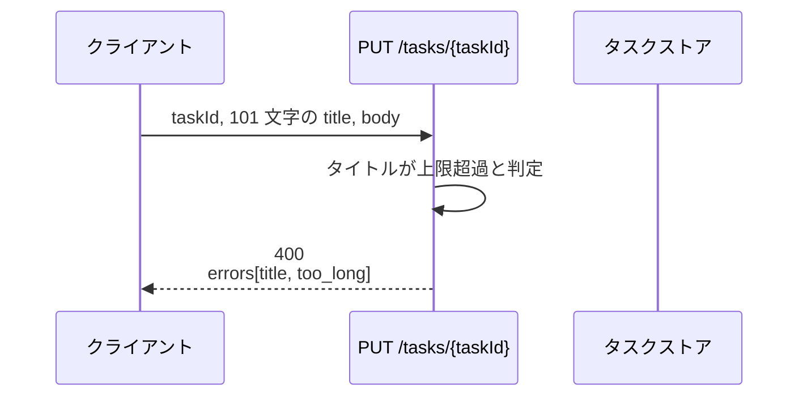
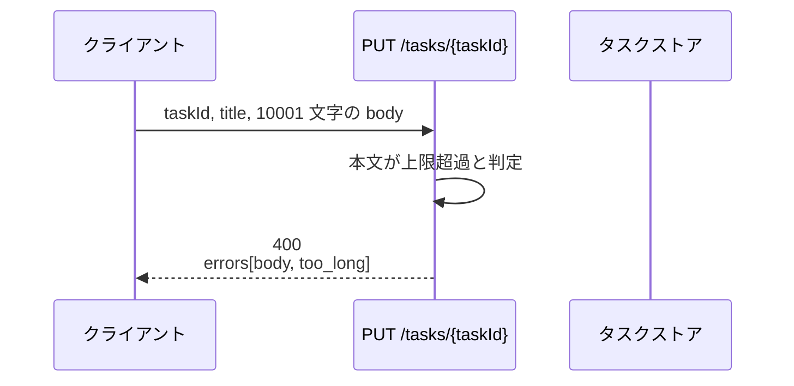
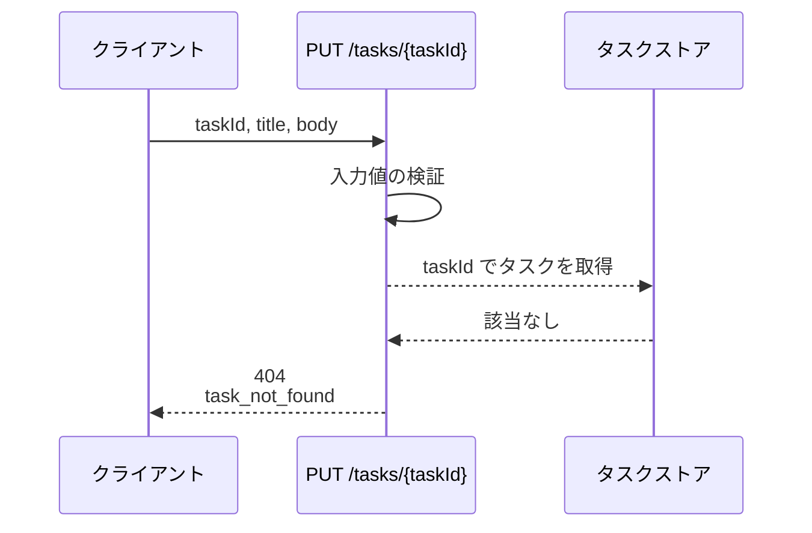
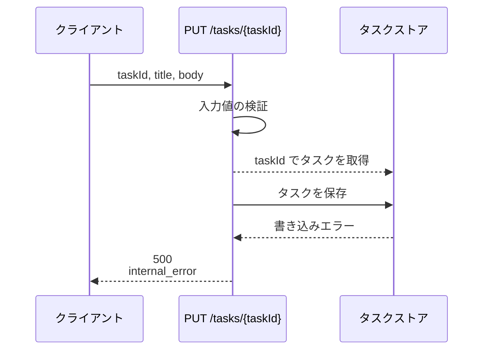

# タスク更新

エンドポイント: PUT /tasks/{taskId}

タスクのタイトル・本文を更新し、更新後のタスクを返す。
更新前に入力値を検証し、失敗した場合はフィールド単位のエラー内容を返す。

- 対応テストファイル: 未記入（テストレビュー完了時に記入）

## インターフェース

### リクエスト

| パラメータ | 型 | 必須 | デフォルト | 説明 | 制限 | 補足 |
| --- | --- | --- | --- | --- | --- | --- |
| `taskId` | `str` | ✅ | - | 更新対象のタスク ID | - | パスパラメータ |
| `title` | `str` | ✅ | - | タスクのタイトル | 1 文字以上 100 文字以内 | 前後の空白を除去した後の長さで判定 |
| `body` | `str` | ✅ | - | タスクの本文 | 10000 文字以内 | 空文字は許可（本文なしを表す） |

リクエスト例:

```json
{
  "title": "決算資料の作成",
  "body": "四半期の売上を集計してレビュー依頼まで行う"
}
```

### レスポンス

| フィールド | 型 | 説明 | 制限 | 補足 |
| --- | --- | --- | --- | --- |
| `task` | `object` | 更新後のタスク | - | - |
| `task.id` | `str` | タスク ID | - | リクエストの `taskId` と一致 |
| `task.title` | `str` | 更新後のタイトル | - | 前後の空白を除去した値 |
| `task.body` | `str` | 更新後の本文 | - | - |
| `task.updatedAt` | `str` | 更新日時 | - | ISO 8601・UTC |

レスポンス例:

```json
{
  "task": {
    "id": "3f2b1c88-9a10-4c3e-9f0b-2d5c7e11a840",
    "title": "決算資料の作成",
    "body": "四半期の売上を集計してレビュー依頼まで行う",
    "updatedAt": "2026-08-01T12:40:00+00:00"
  }
}
```

エラーレスポンス（`400`）は検証に失敗したフィールドを `errors` 配列で返す。

| フィールド | 型 | 説明 | 制限 | 補足 |
| --- | --- | --- | --- | --- |
| `errors` | `object[]` | 検証に失敗したフィールドの一覧 | - | 失敗した全フィールドを返す（先頭で打ち切らない） |
| `errors[].field` | `"title"` \| `"body"` | 失敗したフィールド名 | - | リクエストのパラメータ名と一致 |
| `errors[].code` | `"required"` \| `"too_long"` | 失敗の種別 | - | `required`=必須違反 / `too_long`=文字数超過 |
| `errors[].message` | `str` | 画面表示用のメッセージ | - | 日本語 |

エラーレスポンス例:

```json
{
  "errors": [
    { "field": "title", "code": "required", "message": "タイトルを入力してください" }
  ]
}
```

### ステータスコード

| ステータスコード | 発生条件 | 補足 |
| --- | --- | --- |
| `200` | 更新成功 | - |
| `400` | リクエストのバリデーション失敗 | フィールド単位のエラーを返す |
| `404` | 対象タスクが存在しない | - |
| `500` | タスクストアへの書き込み失敗 | - |

## 制約

| 項目 | 制約 | 補足 |
| --- | --- | --- |
| タイムアウト | 1 秒以内に応答する | 親 Issue の非機能要件 |
| 認可 | 制限なし | 本 subsystem では認証を扱わない |
| レート制限 | 制限なし | - |
| 更新対象の項目 | `title` / `body` のみ | 状態・期限などの他項目は本エンドポイントでは更新しない |
| 部分更新 | 認めない（両フィールドとも必須） | 送られた値でタイトル・本文を置き換える |

## フロー一覧

| 分類 | フロー名 | 概要 | 補足 |
| --- | --- | --- | --- |
| 正常 | 正常系 | 検証を通過してタスクを更新し、更新後のタスクを返す | - |
| 異常 | 異常系（タイトルが空・400） | タイトル未入力を検知して 400 を返す | - |
| 異常 | 異常系（タイトルが 100 文字超・400） | タイトルの文字数超過を検知して 400 を返す | - |
| 異常 | 異常系（本文が 10000 文字超・400） | 本文の文字数超過を検知して 400 を返す | - |
| 異常 | 異常系（タスクが存在しない・404） | 更新対象が見つからず 404 を返す | - |
| 異常 | 異常系（書き込み失敗・500） | タスクストアの書き込み失敗で 500 を返す | 監視対象 |

## 正常系

### セットアップ

| セットアップ | 説明 | 補足 |
| --- | --- | --- |
| Mock | タスクストアを stub に差し替え | 取得・保存とも stub |
| タスク | `taskId` に対応するタスクを登録済み | タイトル・本文は更新前の値 |
| 入力 | 100 文字以内のタイトルと本文を送信 | - |

### フロー



### 期待値

- `200` + `task.title` / `task.body` がリクエストの値になっている
- `task.updatedAt` が更新前より新しい値になっている
- タスクストアに更新後のタイトル・本文が保存されている

## 異常系（タイトルが空・400）

### セットアップ

| セットアップ | 説明 | 補足 |
| --- | --- | --- |
| Mock | タスクストアを stub に差し替え | 取得・保存とも stub |
| タスク | `taskId` に対応するタスクを登録済み | - |
| 入力 | `title` に空白のみの文字列を送信 | 必須違反を決定的に誘発 |

### フロー



### 期待値

- `400` + `errors` に `field=title` / `code=required` の 1 件が含まれる
- タスクストアへの取得・保存が呼ばれていない
- タスクの内容が更新されていない

## 異常系（タイトルが 100 文字超・400）

### セットアップ

| セットアップ | 説明 | 補足 |
| --- | --- | --- |
| Mock | タスクストアを stub に差し替え | 取得・保存とも stub |
| タスク | `taskId` に対応するタスクを登録済み | - |
| 入力 | `title` に 101 文字の文字列を送信 | 文字数超過を決定的に誘発 |

### フロー



### 期待値

- `400` + `errors` に `field=title` / `code=too_long` の 1 件が含まれる
- タスクストアへの取得・保存が呼ばれていない
- タスクの内容が更新されていない

## 異常系（本文が 10000 文字超・400）

### セットアップ

| セットアップ | 説明 | 補足 |
| --- | --- | --- |
| Mock | タスクストアを stub に差し替え | 取得・保存とも stub |
| タスク | `taskId` に対応するタスクを登録済み | - |
| 入力 | `body` に 10001 文字の文字列を送信 | 文字数超過を決定的に誘発 |

### フロー



### 期待値

- `400` + `errors` に `field=body` / `code=too_long` の 1 件が含まれる
- タスクストアへの取得・保存が呼ばれていない
- タスクの内容が更新されていない

## 異常系（タスクが存在しない・404）

### セットアップ

| セットアップ | 説明 | 補足 |
| --- | --- | --- |
| Mock | タスクストアを stub に差し替え | 取得は `None` を返す |
| タスク | `taskId` に対応するタスクを登録していない | 未検出を決定的に誘発 |
| 入力 | 検証を通過する `title` / `body` を送信 | - |

### フロー



### 期待値

- `404` + `task_not_found` が返る
- タスクストアへの保存が呼ばれていない

## 異常系（書き込み失敗・500）

### セットアップ

| セットアップ | 説明 | 補足 |
| --- | --- | --- |
| Mock | タスクストアを stub に差し替え | 保存で書き込みエラーを送出 |
| タスク | `taskId` に対応するタスクを登録済み | - |
| 入力 | 検証を通過する `title` / `body` を送信 | 書き込み失敗を決定的に誘発 |

### フロー



### 期待値

- `500` + `internal_error` が返る
- レスポンスに例外の詳細（スタックトレース・SQL 文）が含まれていない
