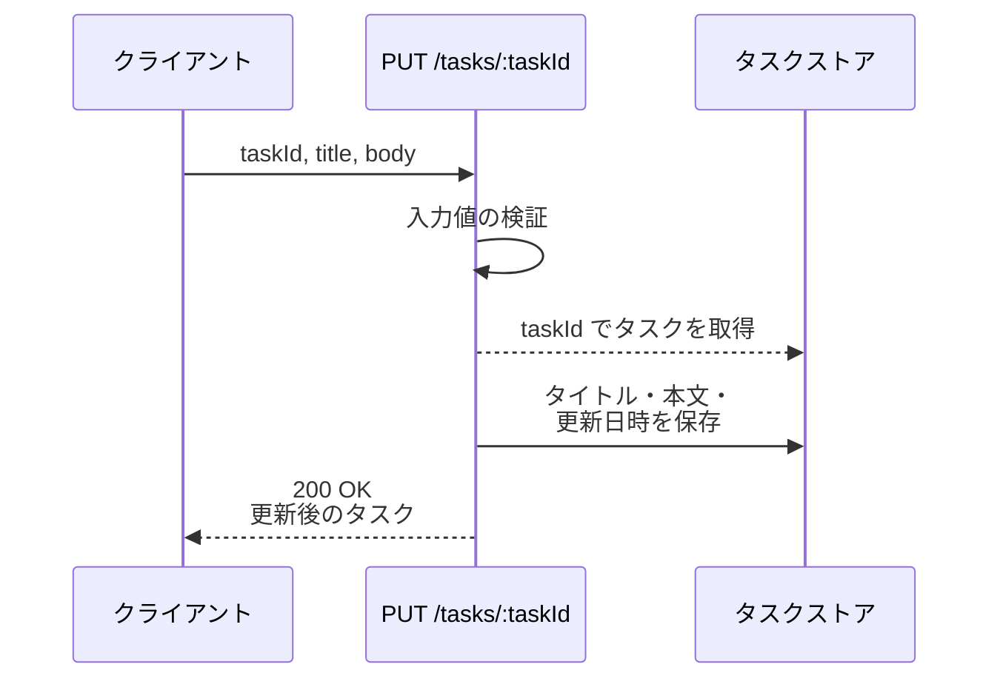
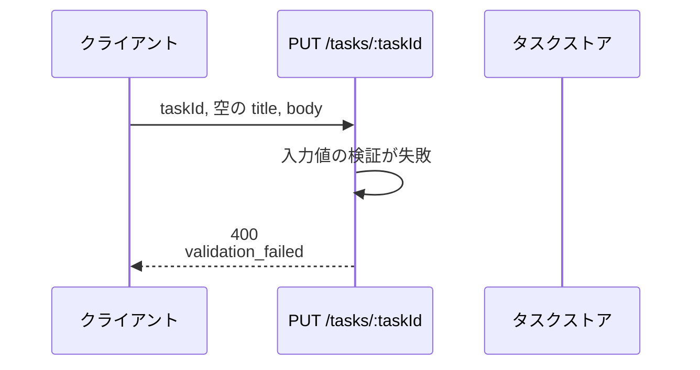
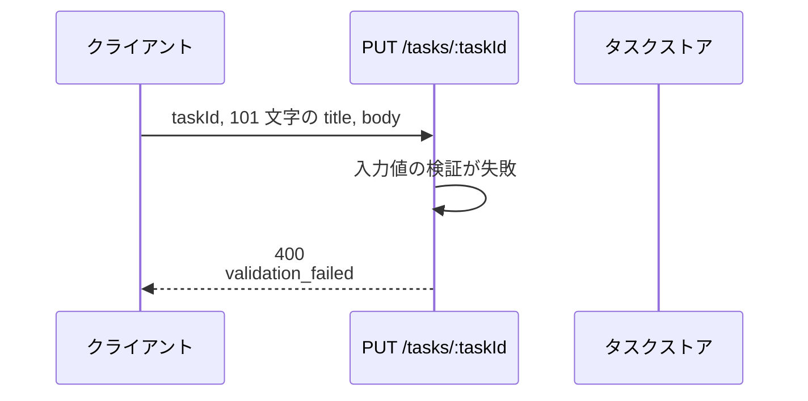
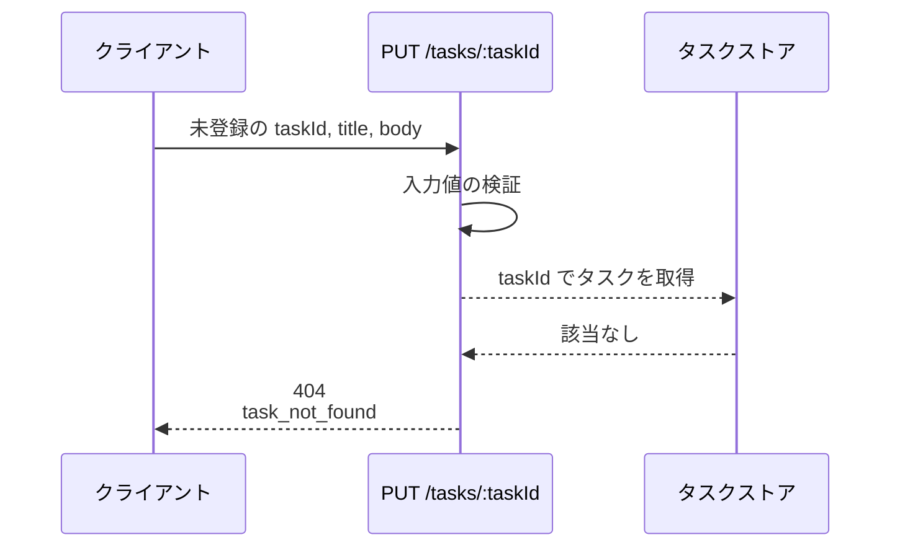
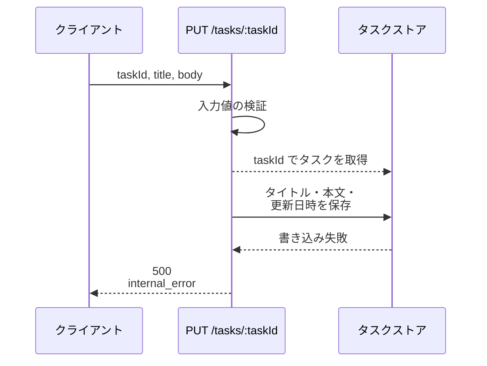

# タスク更新

エンドポイント: PUT /tasks/:taskId

既存タスクのタイトルと本文を更新する。

- 対応テストファイル: 未記入

## インターフェース

### リクエスト

| パラメータ | 型 | 必須 | デフォルト | 説明 | 制限 | 補足 |
| --- | --- | --- | --- | --- | --- | --- |
| `taskId` | `str` | ✅ | - | 更新対象のタスク ID | - | パスパラメータ |
| `title` | `str` | ✅ | - | タスク名 | 1 文字以上 100 文字以内 | 前後の空白を除いて空になる値は不可 |
| `body` | `str` | ✅ | - | タスク本文 | 制限なし | 空文字は許容 |

リクエスト例:

```json
{
  "title": "決算資料の作成",
  "body": "四半期の売上をまとめる"
}
```

### レスポンス

| フィールド | 型 | 説明 | 制限 | 補足 |
| --- | --- | --- | --- | --- |
| `task` | `object` | 更新後のタスク | - | - |
| `task.id` | `str` | タスク ID | - | リクエストの `taskId` と一致する |
| `task.title` | `str` | 更新後のタスク名 | - | - |
| `task.body` | `str` | 更新後のタスク本文 | - | - |
| `task.updatedAt` | `str` | 更新日時（ISO 8601） | - | UTC で保持する |

レスポンス例:

```json
{
  "task": {
    "id": "3f2b1c88-...",
    "title": "決算資料の作成",
    "body": "四半期の売上をまとめる",
    "updatedAt": "2026-08-06T04:30:00+00:00"
  }
}
```

検証失敗時のレスポンス:

| フィールド | 型 | 説明 | 制限 | 補足 |
| --- | --- | --- | --- | --- |
| `error` | `str` | エラーコード | - | `validation_failed` 固定 |
| `fields` | `object[]` | 検証に失敗したフィールドの一覧 | - | 失敗した項目だけを並べる |
| `fields[].field` | `str` | 失敗したフィールド名 | - | リクエストのパラメータ名と一致する |
| `fields[].message` | `str` | 表示用のエラー文言 | - | クライアントがインライン表示にそのまま使う |

検証失敗時のレスポンス例:

```json
{
  "error": "validation_failed",
  "fields": [
    { "field": "title", "message": "タスク名を入力してください" }
  ]
}
```

現時点で検証対象は `title` のみのため `fields` は常に 1 件になるが、配列で返す。
検証項目が増えたときに、クライアントが 1 度の保存操作で全てのインラインエラーを表示できるようにするため。

### ステータスコード

| ステータスコード | 発生条件 | 補足 |
| --- | --- | --- |
| `200` | 更新成功 | - |
| `400` | リクエストのバリデーション失敗 | - |
| `404` | 対象のタスクが存在しない | - |
| `500` | タスクストアの読み書き失敗 | - |

## 制約

| 項目 | 制約 | 補足 |
| --- | --- | --- |
| タイムアウト | 1 秒以内に応答する | 非機能要件の応答時間 |
| 認可 | 制限なし | 誰でも任意のタスクを更新できる |
| レート制限 | 制限なし | - |
| 同時更新 | 制限なし | 後から到着した更新で上書きする |

## フロー一覧

| 分類 | フロー名 | 概要 | 補足 |
| --- | --- | --- | --- |
| 正常 | 正常系 | タイトルと本文を更新して更新後のタスクを返す | - |
| 異常 | 異常系（タスク名が空・400） | 検証で弾いてフィールド単位のエラーを返す | 単一 UC シナリオの異常シナリオに対応 |
| 異常 | 異常系（タスク名が 100 文字超・400） | 検証で弾いてフィールド単位のエラーを返す | - |
| 異常 | 異常系（タスクが存在しない・404） | 取得できず更新せずに終える | - |
| 異常 | 異常系（タスクストア書き込み失敗・500） | 保存に失敗して 500 を返す | - |

## 正常系

### セットアップ

| セットアップ | 説明 | 補足 |
| --- | --- | --- |
| Mock | タスクストアを stub に差し替え | - |
| タスク | 更新対象のタスクを 1 件登録済み | `title` / `body` は更新前の値 |

### フロー



### 期待値

- `200` + 更新後の `task` が返る
- タスクストアの当該タスクの `title` / `body` が送信値になっている
- タスクストアの当該タスクの `updatedAt` が更新前より後の時刻になっている

## 異常系（タスク名が空・400）

### セットアップ

| セットアップ | 説明 | 補足 |
| --- | --- | --- |
| Mock | タスクストアを stub に差し替え | - |
| タスク | 更新対象のタスクを 1 件登録済み | - |
| 入力 | `title` に空文字を指定して送信 | 検証失敗を決定的に誘発 |

### フロー



### 期待値

- `400` + `validation_failed` が返る
- `fields` に `field` が `title` の要素が 1 件含まれる
- タスクストアの当該タスクは更新されていない

## 異常系（タスク名が 100 文字超・400）

### セットアップ

| セットアップ | 説明 | 補足 |
| --- | --- | --- |
| Mock | タスクストアを stub に差し替え | - |
| タスク | 更新対象のタスクを 1 件登録済み | - |
| 入力 | `title` に 101 文字を指定して送信 | 検証失敗を決定的に誘発 |

### フロー



### 期待値

- `400` + `validation_failed` が返る
- `fields` に `field` が `title` の要素が 1 件含まれる
- タスクストアの当該タスクは更新されていない

## 異常系（タスクが存在しない・404）

### セットアップ

| セットアップ | 説明 | 補足 |
| --- | --- | --- |
| Mock | タスクストアを stub に差し替え | 取得が該当なしを返す |
| 入力 | 登録されていない `taskId` を指定して送信 | 取得失敗を決定的に誘発 |

### フロー



### 期待値

- `404` + `task_not_found` が返る
- タスクストアへの保存は行われていない

## 異常系（タスクストア書き込み失敗・500）

### セットアップ

| セットアップ | 説明 | 補足 |
| --- | --- | --- |
| Mock | タスクストアの保存が例外を送出する stub に差し替え | 書き込み失敗を決定的に誘発 |
| タスク | 更新対象のタスクを 1 件登録済み | - |

### フロー



### 期待値

- `500` + `internal_error` が返る
- タスクストアの当該タスクは更新されていない
