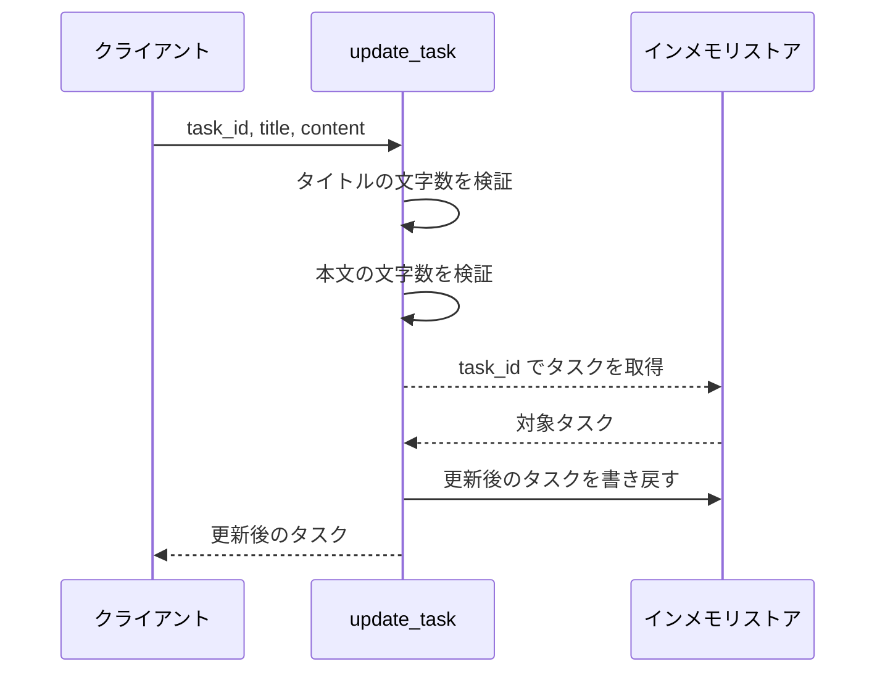
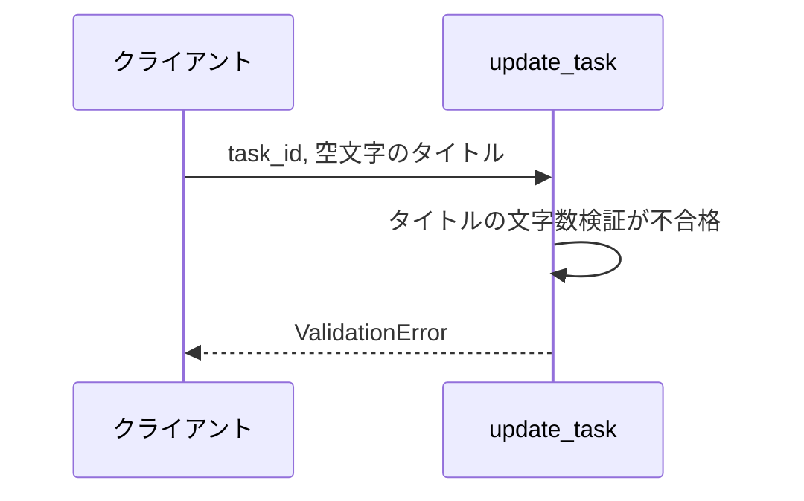
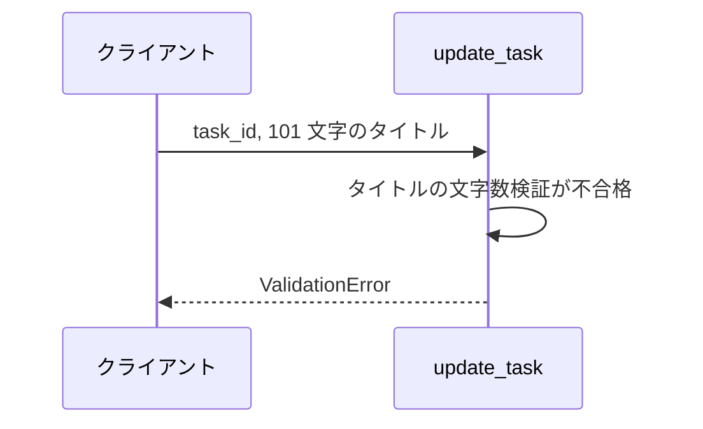
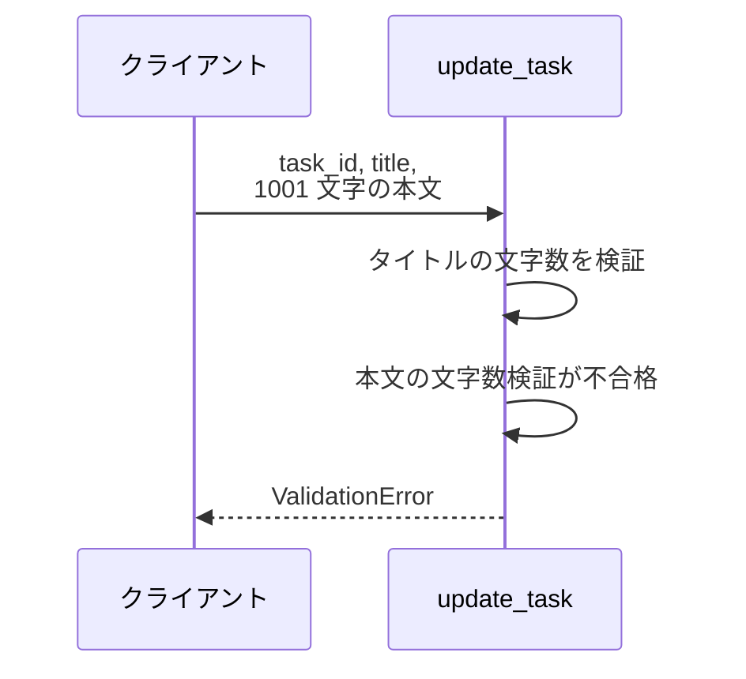
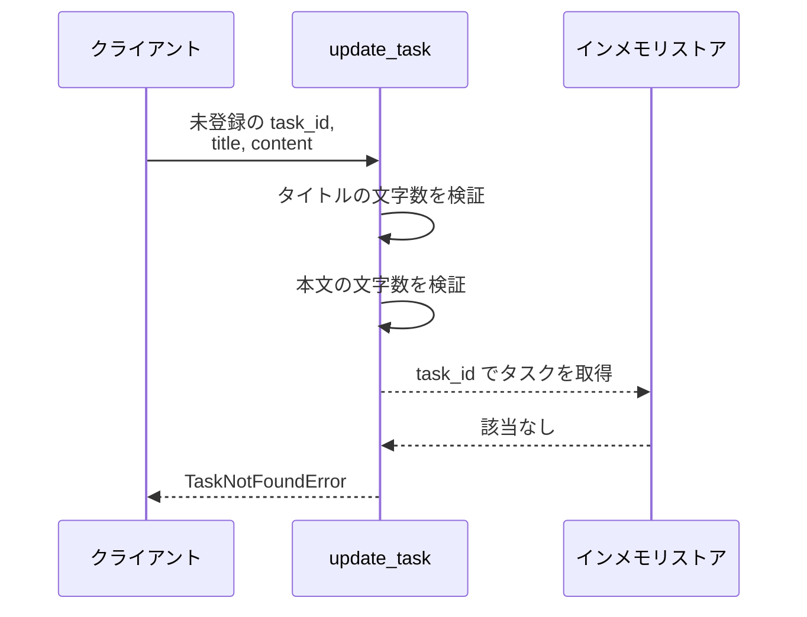

# タスク更新

操作: `update_task`（サービス層の公開関数）

登録済みタスクのタイトルと本文を更新し、更新後のタスクを返す。

- 対応テストファイル: `-`

## インターフェース

### リクエスト

| パラメータ | 型 | 必須 | デフォルト | 説明 | 制限 | 補足 |
| --- | --- | --- | --- | --- | --- | --- |
| `task_id` | `str` | ✅ | - | 更新対象のタスク ID | - | - |
| `title` | `str` | ✅ | - | 更新後のタイトル | 1 文字以上 100 文字以内 | - |
| `content` | `str` | - | `""`（本文を空にする） | 更新後の本文 | 1000 文字以内 | - |

リクエスト例:

```json
{
  "task_id": "t1",
  "title": "新タイトル",
  "content": "新本文"
}
```

### レスポンス

| フィールド | 型 | 説明 | 制限 | 補足 |
| --- | --- | --- | --- | --- |
| `task` | `Task` | 更新後のタスク | - | 戻り値そのもの |
| `task.id` | `str` | タスク ID | - | リクエストの `task_id` と同じ値 |
| `task.title` | `str` | 更新後のタイトル | 1 文字以上 100 文字以内 | - |
| `task.content` | `str` | 更新後の本文 | 1000 文字以内 | - |

レスポンス例:

```json
{
  "task": {
    "id": "t1",
    "title": "新タイトル",
    "content": "新本文"
  }
}
```

補足:

- 更新はリクエストの値での全置換。
  更新前の値を引き継ぐ項目はない
- 同じリクエストを繰り返しても結果は変わらない（冪等）

### 例外

| 例外 | 発生条件 | 補足 |
| --- | --- | --- |
| なし（正常終了） | 更新成功 | 戻り値は レスポンス表のとおり |
| `ValidationError` | タイトルが空文字 | - |
| `ValidationError` | タイトルが 100 文字を超える | - |
| `ValidationError` | 本文が 1000 文字を超える | - |
| `TaskNotFoundError` | 指定 ID のタスクがストアに無い | - |

## 制約

| 項目 | 制約 | 補足 |
| --- | --- | --- |
| 認可 | 制限なし | 呼び出し元を識別する仕組みを持たない |
| タイムアウト | 制限なし | インメモリ操作のみで待ちが発生しない |
| 更新できる項目 | タイトルと本文の 2 項目 | ID は更新対象に含めない |

## フロー一覧

| 分類 | フロー名 | 概要 | 補足 |
| --- | --- | --- | --- |
| 正常 | 正常系 | タイトルと本文を更新して更新後のタスクを返す | - |
| 異常 | 異常系（タイトルが空・ValidationError） | タイトル検証が不合格 → 更新せず送出 | - |
| 異常 | 異常系（タイトル 100 文字超・ValidationError） | タイトル検証が不合格 → 更新せず送出 | - |
| 異常 | 異常系（本文 1000 文字超・ValidationError） | 本文検証が不合格 → 更新せず送出 | - |
| 異常 | 異常系（未登録 ID・TaskNotFoundError） | 対象タスクが取得できず送出 | - |

## 正常系

### セットアップ

| セットアップ | 説明 | 補足 |
| --- | --- | --- |
| Mock | なし | インメモリストアを実物のまま使う |
| タスク | `task_id` のタスクを 1 件登録済み | - |

### フロー



### 期待値

- 戻り値の `title` / `content` がリクエストの値になっている
- 戻り値の `id` がリクエストの `task_id` と一致する
- ストアの `task_id` のエントリが戻り値と同じタスクに置き換わっている

## 異常系（タイトルが空・ValidationError）

### セットアップ

| セットアップ | 説明 | 補足 |
| --- | --- | --- |
| Mock | なし | インメモリストアを実物のまま使う |
| タスク | `task_id` のタスクを 1 件登録済み | - |
| 入力 | タイトルに空文字を渡す | 検証失敗を決定的に誘発 |

### フロー



### 期待値

- `ValidationError` が送出される
- ストアの `task_id` のタスクは更新前のまま

## 異常系（タイトル 100 文字超・ValidationError）

### セットアップ

| セットアップ | 説明 | 補足 |
| --- | --- | --- |
| Mock | なし | インメモリストアを実物のまま使う |
| タスク | `task_id` のタスクを 1 件登録済み | - |
| 入力 | 101 文字のタイトルを渡す | 検証失敗を決定的に誘発 |

### フロー



### 期待値

- `ValidationError` が送出される
- ストアの `task_id` のタスクは更新前のまま

## 異常系（本文 1000 文字超・ValidationError）

### セットアップ

| セットアップ | 説明 | 補足 |
| --- | --- | --- |
| Mock | なし | インメモリストアを実物のまま使う |
| タスク | `task_id` のタスクを 1 件登録済み | - |
| 入力 | 制約内のタイトルと 1001 文字の本文を渡す | 本文の検証失敗だけを決定的に誘発 |

### フロー



### 期待値

- `ValidationError` が送出される
- ストアの `task_id` のタスクは更新前のまま

## 異常系（未登録 ID・TaskNotFoundError）

### セットアップ

| セットアップ | 説明 | 補足 |
| --- | --- | --- |
| Mock | なし | インメモリストアを実物のまま使う |
| タスク | ストアを空にする | - |
| 入力 | 制約内のタイトルと本文、未登録の ID を渡す | 取得失敗だけを決定的に誘発 |

### フロー



### 期待値

- `TaskNotFoundError` が送出される
- ストアに新しいエントリは作られていない
