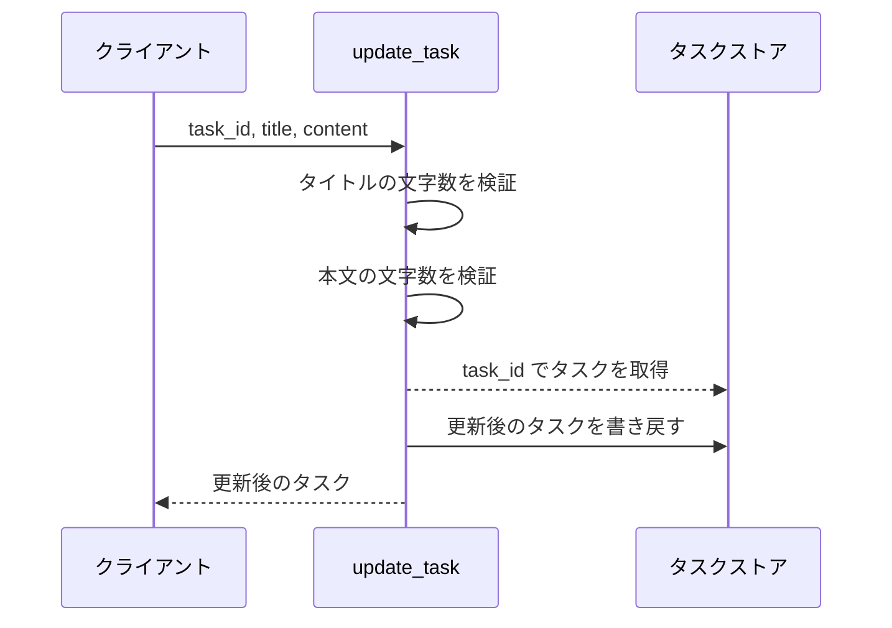
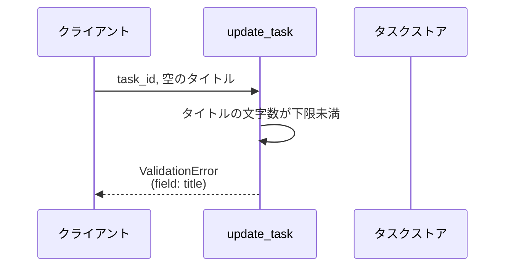
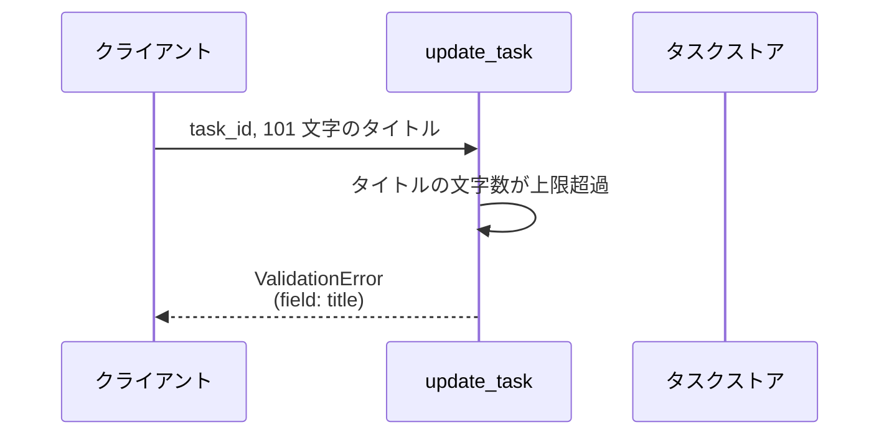
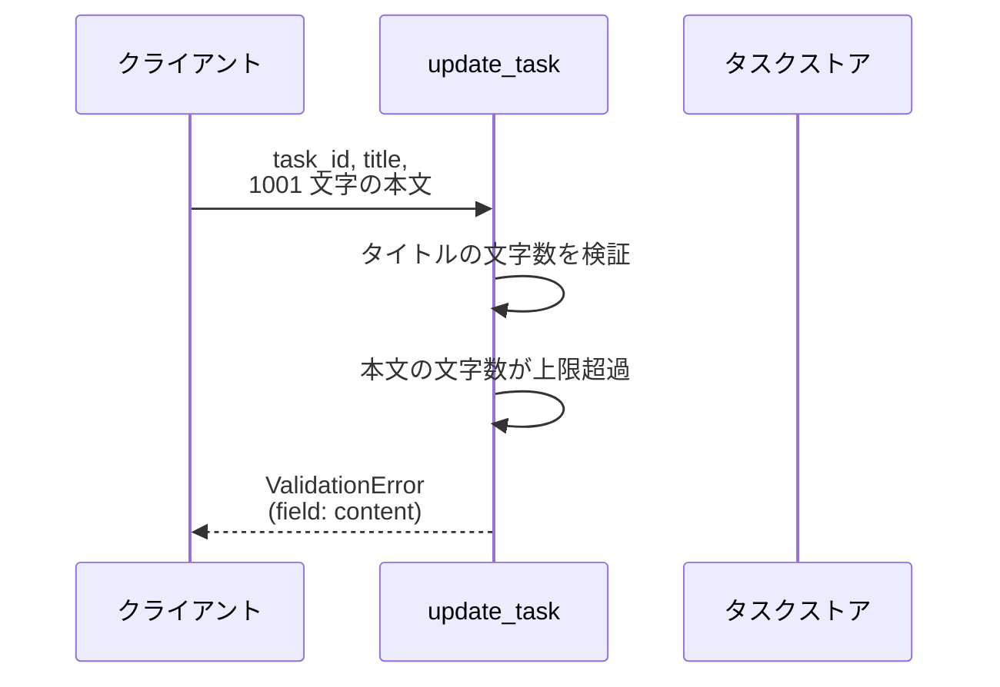
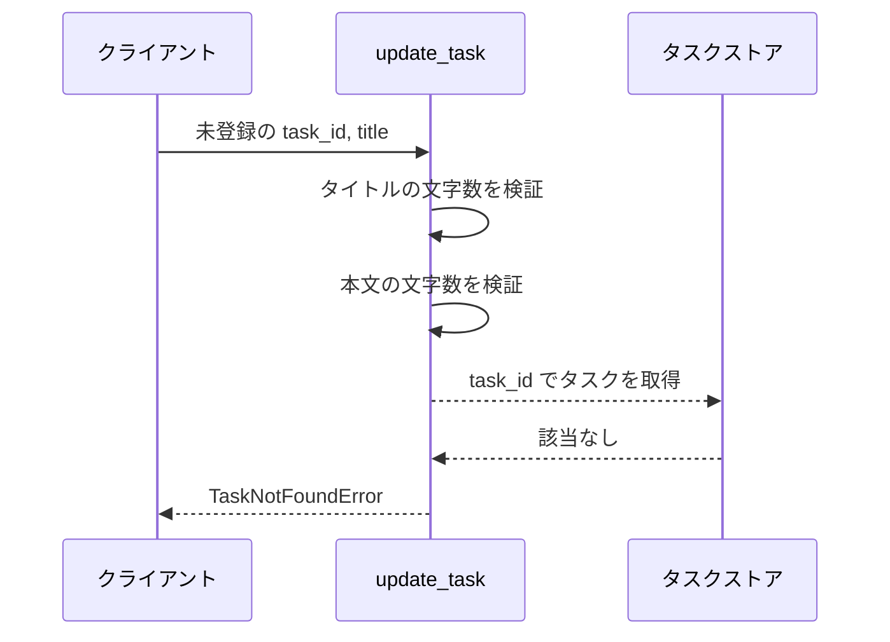

# タスク更新

操作: `update_task`（サービス層の公開関数）

登録済みタスクのタイトルと本文を検証したうえで更新し、更新後のタスクを返す。

- 対応テストファイル: `tests/integration/tasks/test_タスク更新.py`

## インターフェース

### リクエスト

| パラメータ | 型 | 必須 | デフォルト | 説明 | 制限 | 補足 |
| --- | --- | --- | --- | --- | --- | --- |
| `store` | `dict[str, Task]` | ✅ | - | 更新対象のタスクストア | - | 呼び出し側が保持する辞書 |
| `task_id` | `str` | ✅ | - | 更新するタスクの識別子 | - | ストアのキーと照合する |
| `title` | `str` | ✅ | - | 更新後のタイトル | 1〜100 文字 | 空文字は不可 |
| `content` | `str` | - | `""` | 更新後の本文 | 1000 文字以内 | 省略時は空文字で上書きする |

リクエスト例:

```python
update_task(store, "t1", "新タイトル", "新本文")
```

### レスポンス

| フィールド | 型 | 説明 | 制限 | 補足 |
| --- | --- | --- | --- | --- |
| `id` | `str` | タスクの識別子 | - | 引数の `task_id` と同じ値 |
| `title` | `str` | 更新後のタイトル | 1〜100 文字 | - |
| `content` | `str` | 更新後の本文 | 1000 文字以内 | - |

レスポンス例:

```python
Task(id="t1", title="新タイトル", content="新本文")
```

補足:

- 同じ引数で複数回呼んでも結果は変わらない（更新は差し替えのため冪等）

### エラー

| エラー | 発生条件 | 補足 |
| --- | --- | --- |
| なし（正常終了） | 更新成功 | 戻り値は レスポンス表のとおり |
| `ValidationError` | タイトルが空文字 | `field` に `title` が入る |
| `ValidationError` | タイトルが 100 文字を超える | `field` に `title` が入る |
| `ValidationError` | 本文が 1000 文字を超える | `field` に `content` が入る |
| `TaskNotFoundError` | `task_id` のタスクがストアに無い | - |

## 制約

| 項目 | 制約 | 補足 |
| --- | --- | --- |
| 応答時間 | 1 秒以内 | 親 subsystem の非機能要件 |
| 認可 | 制限なし | 呼び出し元の権限判定は行わない |
| タイムアウト | 制限なし | プロセス内の同期処理のみで外部通信がない |
| 同時実行 | 制限なし | 単一プロセスの辞書操作のみで排他制御を持たない |

## フロー一覧

| 分類 | フロー名 | 概要 | 補足 |
| --- | --- | --- | --- |
| 正常 | 正常系 | タイトルと本文を更新して返す | - |
| 異常 | 異常系（タイトルが空・ValidationError） | タイトルの検証に失敗して更新しない | 単一UC シナリオの異常シナリオに対応 |
| 異常 | 異常系（タイトル超過・ValidationError） | タイトルが 100 文字を超えて更新しない | - |
| 異常 | 異常系（本文超過・ValidationError） | 本文が 1000 文字を超えて更新しない | - |
| 異常 | 異常系（タスク不在・TaskNotFoundError） | 更新対象がストアに無い | - |

## 正常系

### セットアップ

| セットアップ | 説明 | 補足 |
| --- | --- | --- |
| Mock | なし | 外部依存を持たない |
| タスク | `t1` のタスクをストアに登録済み | タイトル `旧タイトル` / 本文 `旧本文` |

### フロー



### 期待値

- 更新後のタイトルと本文を持つタスクが返る
- ストアの `t1` が更新後のタスクに置き換わっている

## 異常系（タイトルが空・ValidationError）

### セットアップ

| セットアップ | 説明 | 補足 |
| --- | --- | --- |
| Mock | なし | 外部依存を持たない |
| タスク | `t1` のタスクをストアに登録済み | - |
| 入力 | タイトルを空文字で送信 | 検証失敗を決定的に誘発 |

### フロー



### 期待値

- `ValidationError` が送出され、`field` が `title` になっている
- ストアの `t1` は編集前のタイトル・本文のまま変わっていない

## 異常系（タイトル超過・ValidationError）

### セットアップ

| セットアップ | 説明 | 補足 |
| --- | --- | --- |
| Mock | なし | 外部依存を持たない |
| タスク | `t1` のタスクをストアに登録済み | - |
| 入力 | 101 文字のタイトルで送信 | 検証失敗を決定的に誘発 |

### フロー



### 期待値

- `ValidationError` が送出され、`field` が `title` になっている
- ストアの `t1` は編集前のタイトル・本文のまま変わっていない

## 異常系（本文超過・ValidationError）

### セットアップ

| セットアップ | 説明 | 補足 |
| --- | --- | --- |
| Mock | なし | 外部依存を持たない |
| タスク | `t1` のタスクをストアに登録済み | - |
| 入力 | 1001 文字の本文で送信 | 検証失敗を決定的に誘発 |

### フロー



### 期待値

- `ValidationError` が送出され、`field` が `content` になっている
- ストアの `t1` は編集前のタイトル・本文のまま変わっていない

## 異常系（タスク不在・TaskNotFoundError）

### セットアップ

| セットアップ | 説明 | 補足 |
| --- | --- | --- |
| Mock | なし | 外部依存を持たない |
| タスク | `t1` のタスクをストアに登録済み | - |
| 入力 | 未登録の `task_id` で送信 | 取得失敗を決定的に誘発 |

### フロー



### 期待値

- `TaskNotFoundError` が送出される
- ストアに新しいタスクは追加されず、`t1` も変わっていない
