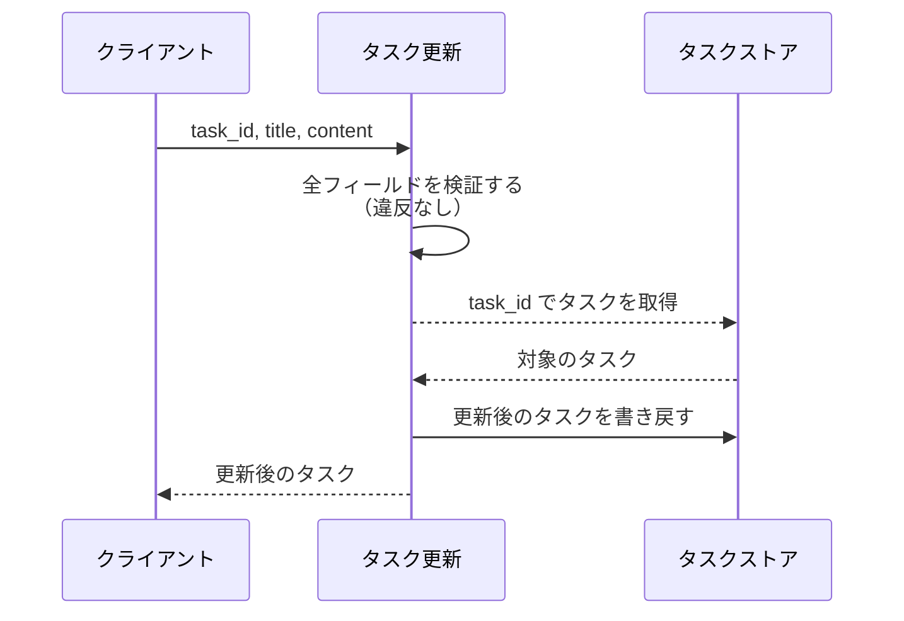
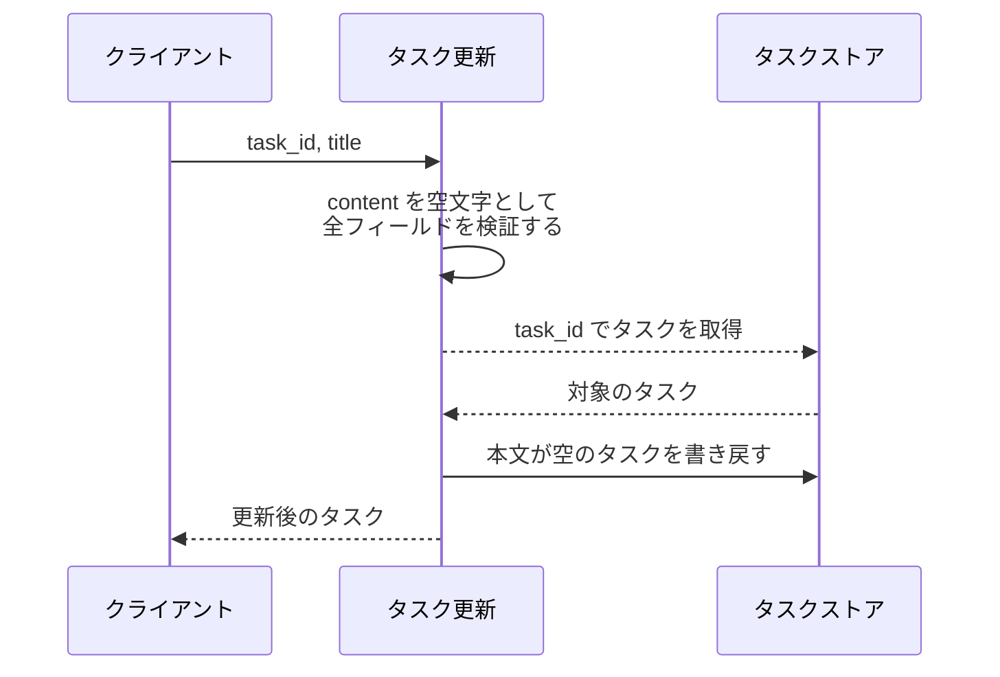
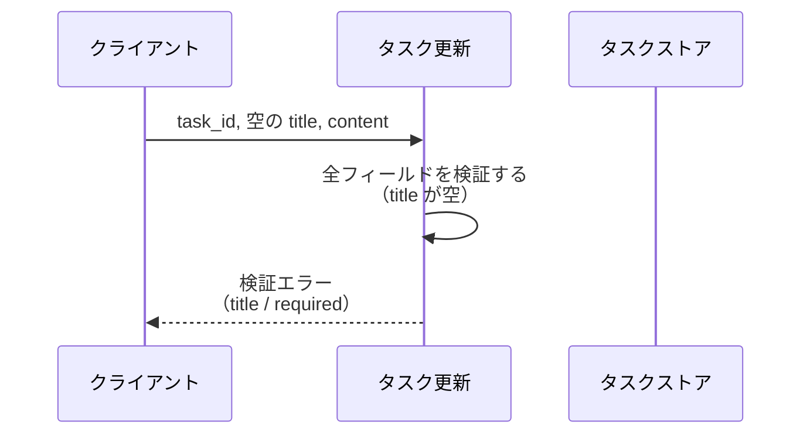
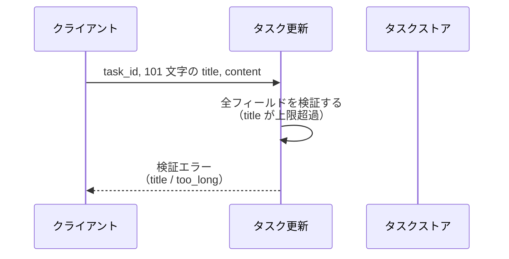
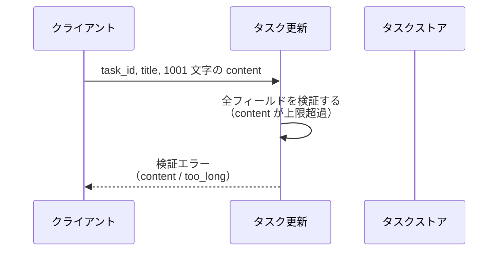
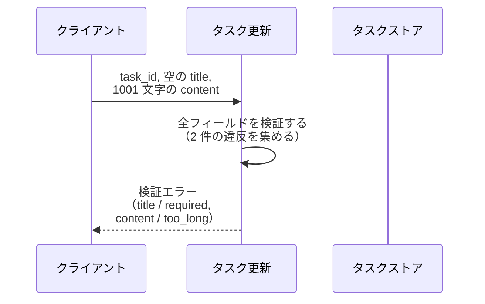
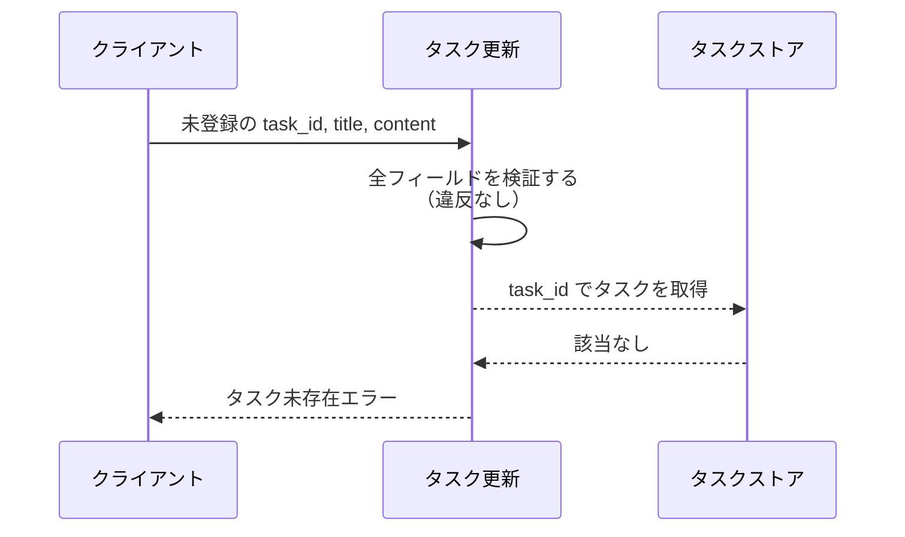

# タスク更新

呼び出し口: `tasks.service.update_task`

登録済みタスクのタイトルと本文を更新する。
入力値の検証に失敗した場合は、違反したフィールドごとのエラーを返す。

- 対応テストファイル: `tests/integration/tasks/test_タスク更新.py`

## インターフェース

### リクエスト

| パラメータ | 型 | 必須 | デフォルト | 説明 | 制限 | 補足 |
| --- | --- | --- | --- | --- | --- | --- |
| `task_id` | `str` | ✅ | - | 更新対象のタスク ID | - | 未登録の値は 異常系（タスク未存在） |
| `title` | `str` | ✅ | - | タスクのタイトル | 1 文字以上 100 文字以内 | - |
| `content` | `str` | - | `""`（本文を空にする） | タスクの本文 | 1000 文字以内 | - |

リクエスト例:

```json
{
  "task_id": "t1",
  "title": "決算資料の作成",
  "content": "四半期分をまとめる"
}
```

### レスポンス

| フィールド | 型 | 説明 | 制限 | 補足 |
| --- | --- | --- | --- | --- |
| `id` | `str` | 更新したタスクの ID | - | リクエストの `task_id` と同じ値 |
| `title` | `str` | 更新後のタイトル | - | - |
| `content` | `str` | 更新後の本文 | - | リクエストで省略した場合は空文字 |

レスポンス例:

```json
{
  "id": "t1",
  "title": "決算資料の作成",
  "content": "四半期分をまとめる"
}
```

**補足:**
- 同じリクエストを繰り返しても結果は変わらない（冪等）
- 検証エラー時の返却内容は各 `## 異常系（{条件}）` の期待値が定義する

## 制約

| 項目 | 制約 | 補足 |
| --- | --- | --- |
| 応答時間 | 1 秒以内 | SA 非機能要件 |
| タイムアウト | 制限なし | インメモリのタスクストアだけを触るため |
| 認可 | 制限なし | 本サブシステムは認証・権限の概念を持たない |
| 検証エラーコードの許可値 | `required` / `too_long` | `required` = 必須項目が空 / `too_long` = 文字数上限の超過 |
| 部分更新 | 不可（`title` と `content` の両方を毎回受け取る） | 省略した `content` は空文字で上書きされる |

## フロー一覧

| 分類 | フロー名 | 概要 | 補足 |
| --- | --- | --- | --- |
| 正常 | 正常系 | タイトルと本文を更新して更新後のタスクを返す | - |
| 正常 | 正常系（本文省略時） | 本文を空文字にして更新する | - |
| 異常 | 異常系（タイトル空・検証エラー） | `title` が空 → `required` のフィールドエラーを返す | - |
| 異常 | 異常系（タイトル超過・検証エラー） | `title` が 101 文字 → `too_long` のフィールドエラーを返す | - |
| 異常 | 異常系（本文超過・検証エラー） | `content` が 1001 文字 → `too_long` のフィールドエラーを返す | - |
| 異常 | 異常系（複数フィールド違反・検証エラー） | 2 フィールドが同時に違反 → 2 件のフィールドエラーを返す | 全フィールドを検証してから返すことの確認 |
| 異常 | 異常系（タスク未存在） | 未登録の `task_id` → タスク未存在エラーを返す | - |

## 正常系

### セットアップ

| セットアップ | 説明 | 補足 |
| --- | --- | --- |
| Mock | なし（インメモリのタスクストアを実物のまま使う） | 外部 DB / 外部 API を持たない |
| タスク | `t1` のタスクを登録済み | タイトル `旧タイトル` / 本文 `旧本文` |

### フロー



### 期待値

- 更新後のタスク（`id` / `title` / `content`）が返る
- タスクストアの `t1` がリクエストの値になっている

## 正常系（本文省略時）

### セットアップ

| セットアップ | 説明 | 補足 |
| --- | --- | --- |
| Mock | なし（インメモリのタスクストアを実物のまま使う） | 外部 DB / 外部 API を持たない |
| タスク | `t1` のタスクを登録済み | タイトル `旧タイトル` / 本文 `旧本文` |
| 入力 | `content` を省略して呼ぶ | 省略時の分岐を決定的に誘発 |

### フロー



### 期待値

- 返るタスクの `content` が空文字になっている
- タスクストアの `t1` の本文が空文字になっている

## 異常系（タイトル空・検証エラー）

### セットアップ

| セットアップ | 説明 | 補足 |
| --- | --- | --- |
| Mock | なし（インメモリのタスクストアを実物のまま使う） | 外部 DB / 外部 API を持たない |
| タスク | `t1` のタスクを登録済み | タイトル `旧タイトル` / 本文 `旧本文` |
| 入力 | `title` に空文字を渡す | 検証失敗を決定的に誘発 |

### フロー



### 期待値

- `title` のフィールドエラー 1 件（コード `required`）を持つ検証エラーが返る
- タスクストアの `t1` は更新前のまま変化していない

## 異常系（タイトル超過・検証エラー）

### セットアップ

| セットアップ | 説明 | 補足 |
| --- | --- | --- |
| Mock | なし（インメモリのタスクストアを実物のまま使う） | 外部 DB / 外部 API を持たない |
| タスク | `t1` のタスクを登録済み | タイトル `旧タイトル` / 本文 `旧本文` |
| 入力 | `title` に 101 文字を渡す | 上限超過を決定的に誘発 |

### フロー



### 期待値

- `title` のフィールドエラー 1 件（コード `too_long`）を持つ検証エラーが返る
- タスクストアの `t1` は更新前のまま変化していない

## 異常系（本文超過・検証エラー）

### セットアップ

| セットアップ | 説明 | 補足 |
| --- | --- | --- |
| Mock | なし（インメモリのタスクストアを実物のまま使う） | 外部 DB / 外部 API を持たない |
| タスク | `t1` のタスクを登録済み | タイトル `旧タイトル` / 本文 `旧本文` |
| 入力 | `content` に 1001 文字を渡す | 上限超過を決定的に誘発 |

### フロー



### 期待値

- `content` のフィールドエラー 1 件（コード `too_long`）を持つ検証エラーが返る
- タスクストアの `t1` は更新前のまま変化していない

## 異常系（複数フィールド違反・検証エラー）

### セットアップ

| セットアップ | 説明 | 補足 |
| --- | --- | --- |
| Mock | なし（インメモリのタスクストアを実物のまま使う） | 外部 DB / 外部 API を持たない |
| タスク | `t1` のタスクを登録済み | タイトル `旧タイトル` / 本文 `旧本文` |
| 入力 | `title` に空文字・`content` に 1001 文字を渡す | 2 フィールド同時違反を決定的に誘発 |

### フロー



### 期待値

- フィールドエラー 2 件（`title` の `required` と `content` の `too_long`）を持つ検証エラーが返る
- フィールドエラーは `title` / `content` のリクエスト順で並んでいる
- タスクストアの `t1` は更新前のまま変化していない

## 異常系（タスク未存在）

### セットアップ

| セットアップ | 説明 | 補足 |
| --- | --- | --- |
| Mock | なし（インメモリのタスクストアを実物のまま使う） | 外部 DB / 外部 API を持たない |
| タスク | `t1` のタスクを登録済み | タイトル `旧タイトル` / 本文 `旧本文` |
| 入力 | 未登録の `task_id` と、制限を満たす `title` を渡す | 検証を通過させてから未存在を誘発 |

### フロー



### 期待値

- タスク未存在エラーが返る
- タスクストアに新しいタスクは追加されていない
- タスクストアの `t1` は更新前のまま変化していない
