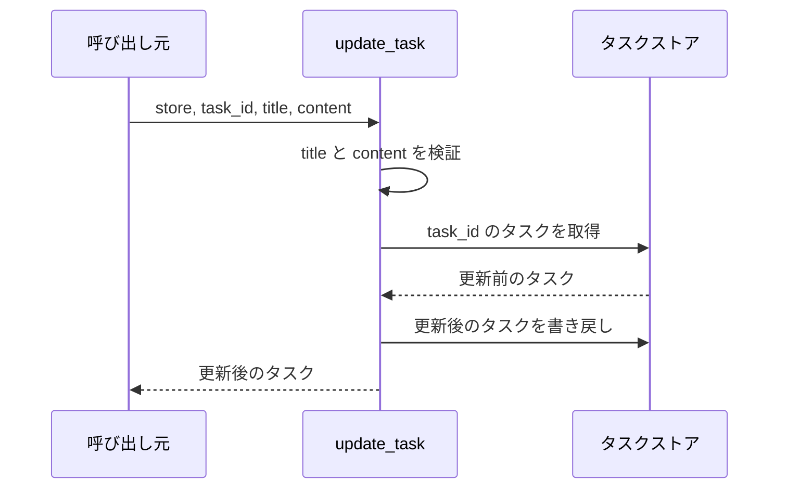
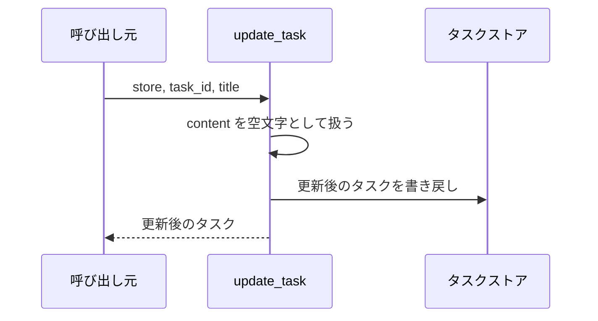
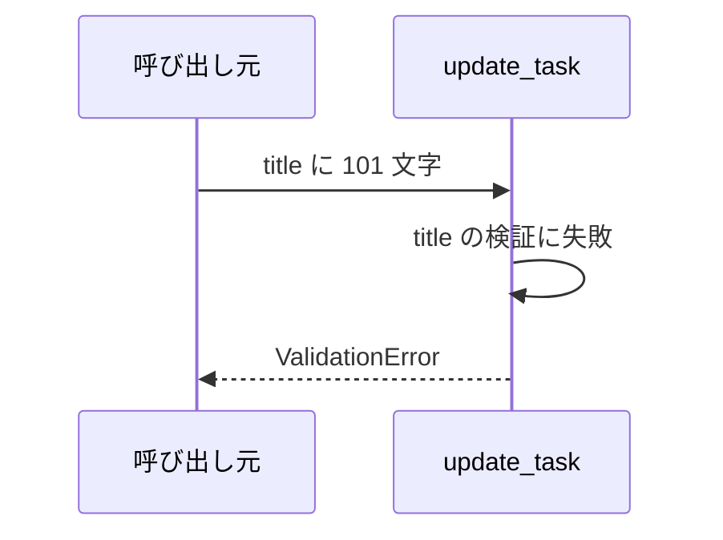
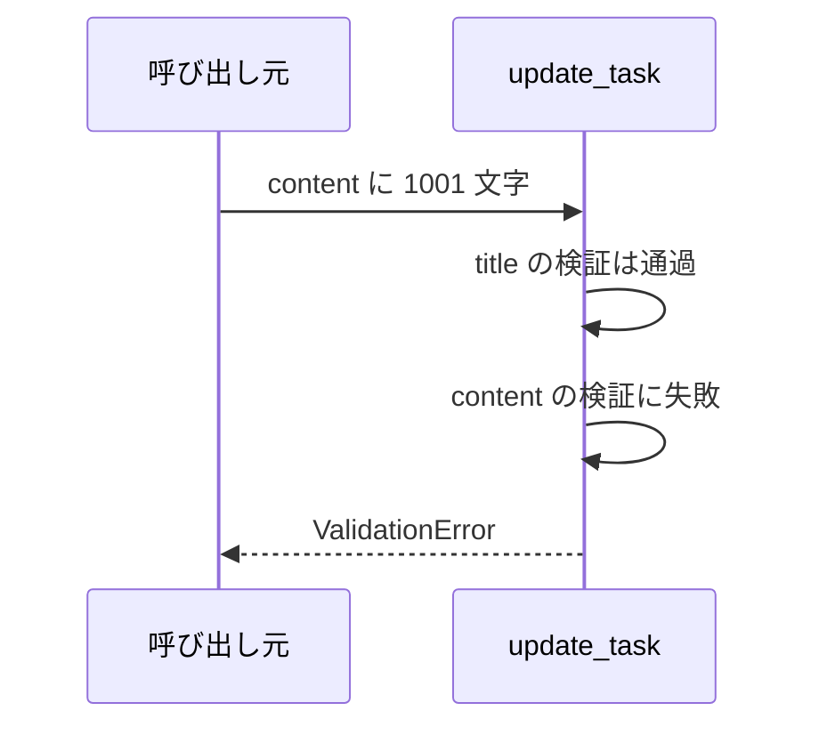
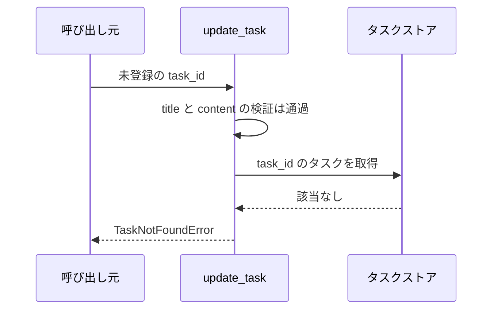

# タスク更新

境界: `src/tasks/service.py` の `update_task`
対応テストファイル: 未記入（テストレビュー時に記入）

登録済みタスクのタイトルと本文を全置換で更新する。
画面と HTTP サーバーが未実装のため、本サブシステムの外部境界はサービス層の公開関数呼び出しになる。

## インターフェース

### リクエスト

| パラメータ | 型 | 必須 | デフォルト | 説明 | 制限 | 補足 |
| --- | --- | --- | --- | --- | --- | --- |
| `store` | `dict[str, Task]` | ✅ | - | タスク ID をキーにしたインメモリストア | - | 呼び出し元が保持する。破壊的に更新される |
| `task_id` | `str` | ✅ | - | 更新対象のタスク ID | `store` に登録済みであること | - |
| `title` | `str` | ✅ | - | 更新後のタスク名 | 1 文字以上 100 文字以内 | - |
| `content` | `str` | - | `""` | 更新後の本文 | 1000 文字以内 | 省略時は空文字で上書きする |

### レスポンス

| フィールド | 型 | 説明 | 制限 | 補足 |
| --- | --- | --- | --- | --- |
| `id` | `str` | タスク ID | - | 更新前と同じ値 |
| `title` | `str` | 更新後のタスク名 | - | - |
| `content` | `str` | 更新後の本文 | - | - |

### エラー

| 例外 | 発生条件 | 補足 |
| --- | --- | --- |
| `ValidationError` | `title` が 0 文字 or 101 文字以上 | 3 つの検証のうち最初に評価する |
| `ValidationError` | `content` が 1001 文字以上 | `title` の検証を通過した後に評価する |
| `TaskNotFoundError` | `task_id` が `store` に無い | 2 つの入力検証を通過した後に評価する |

## 制約

| 項目 | 制約 | 補足 |
| --- | --- | --- |
| 認証・認可 | なし | SA の非機能要件に指定なし |
| 同時実行 | 考慮しない | 単一プロセスのインメモリストアを前提にする |
| 永続化 | なし | プロセス終了で内容は失われる |
| 部分更新 | 不可 | `title` と `content` を毎回まとめて置き換える |

## フロー一覧

| 分類 | フロー名 | 概要 | 補足 |
| --- | --- | --- | --- |
| 正常 | 正常系 | タイトルと本文を更新して更新後のタスクを返す | - |
| 正常 | 正常系（本文の省略） | `content` を渡さずに更新する | 本文が空文字になる |
| 異常 | 異常系（タイトルが空） | `title` に空文字を指定する | - |
| 異常 | 異常系（タイトルが長すぎる） | `title` に 101 文字を指定する | - |
| 異常 | 異常系（本文が長すぎる） | `content` に 1001 文字を指定する | - |
| 異常 | 異常系（タスク不明） | 未登録の `task_id` を指定する | - |

## 正常系

### セットアップ

| セットアップ | 説明 | 補足 |
| --- | --- | --- |
| Mock | なし（インメモリストアを実物のまま使う） | - |
| タスク | `t1` のタスクを登録済み | `title="旧タイトル"` / `content="旧本文"` |

### フロー

### 期待値

- 更新後の `title` と `content` を持つタスクが返る
- `id` は更新前と同じ値になっている
- `store[task_id]` が更新後のタスクに置き換わっている

## 正常系（本文の省略）

### セットアップ

| セットアップ | 説明 | 補足 |
| --- | --- | --- |
| Mock | なし（インメモリストアを実物のまま使う） | - |
| 入力 | `content` を渡さずに `title` だけ指定する | デフォルト値の分岐を通す |

### フロー

### 期待値

- 返るタスクの `content` が空文字になっている
- 更新前の本文は残っていない

## 異常系（タイトルが空）

### セットアップ

| セットアップ | 説明 | 補足 |
| --- | --- | --- |
| Mock | なし（インメモリストアを実物のまま使う） | - |
| 入力 | `title` に空文字を指定する | 検証失敗を決定的に誘発する |

### フロー

### 期待値

- `ValidationError` が送出される
- ストアが変更されていない

## 異常系（タイトルが長すぎる）

### セットアップ

| セットアップ | 説明 | 補足 |
| --- | --- | --- |
| Mock | なし（インメモリストアを実物のまま使う） | - |
| 入力 | `title` に 101 文字を指定する | 上限の境界を 1 文字超える |

### フロー

### 期待値

- `ValidationError` が送出される
- ストアが変更されていない

## 異常系（本文が長すぎる）

### セットアップ

| セットアップ | 説明 | 補足 |
| --- | --- | --- |
| Mock | なし（インメモリストアを実物のまま使う） | - |
| 入力 | `title` は正常値、`content` に 1001 文字を指定する | 本文側の検証だけを失敗させる |

### フロー

### 期待値

- `ValidationError` が送出される
- ストアが変更されていない

## 異常系（タスク不明）

### セットアップ

| セットアップ | 説明 | 補足 |
| --- | --- | --- |
| Mock | なし（インメモリストアを実物のまま使う） | - |
| 入力 | 未登録の `task_id` を指定する | 検索失敗を決定的に誘発する |

### フロー

### 期待値

- `TaskNotFoundError` が送出される
- ストアが変更されていない
