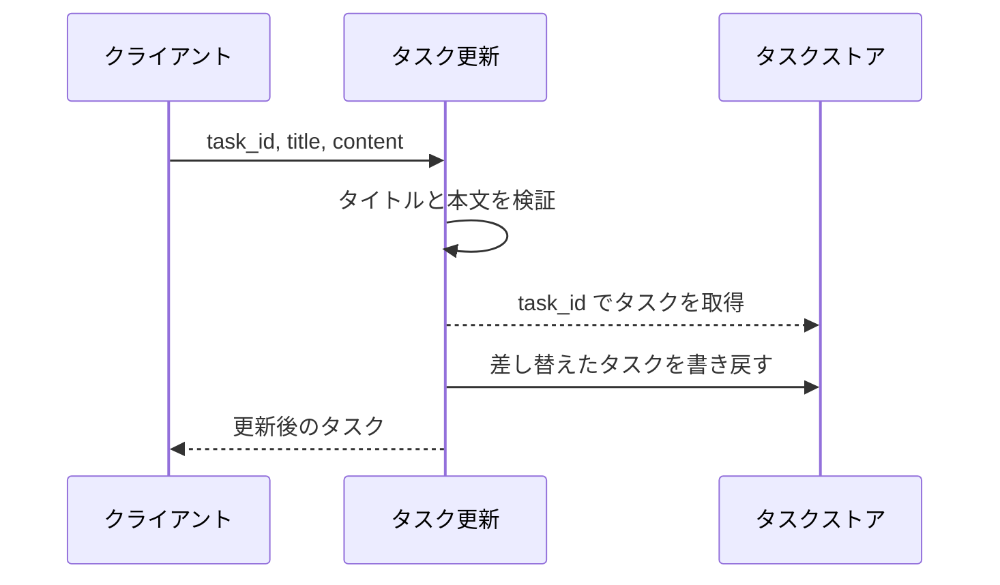
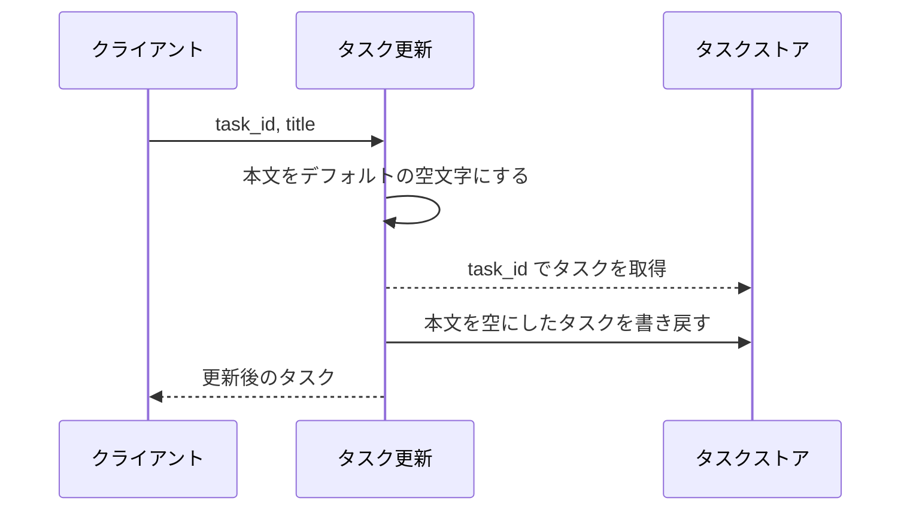
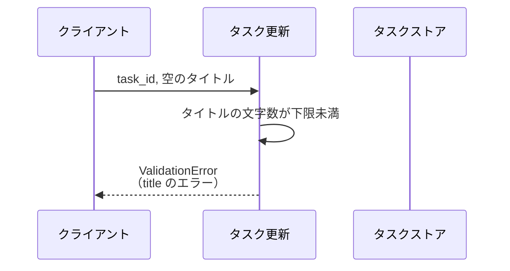
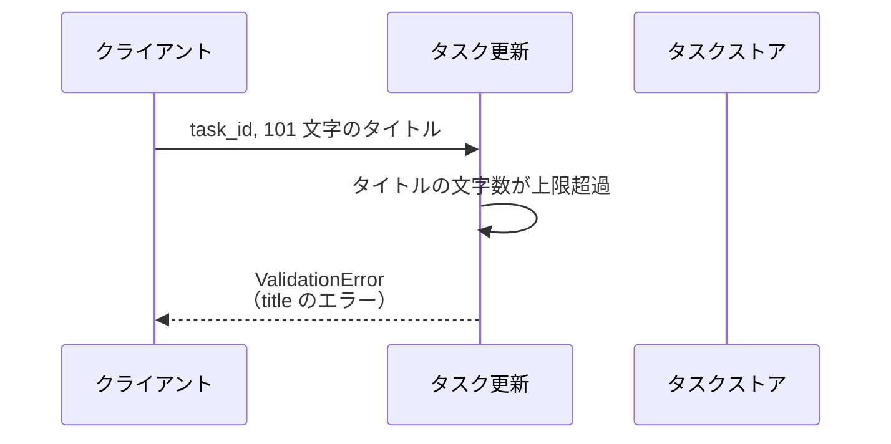
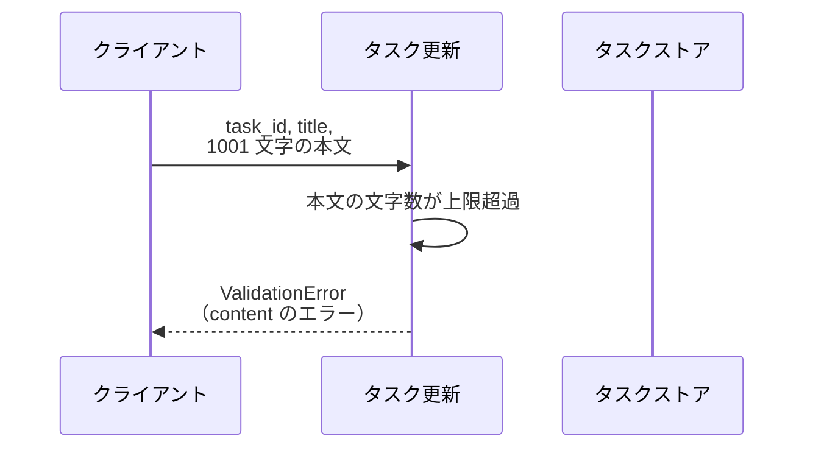
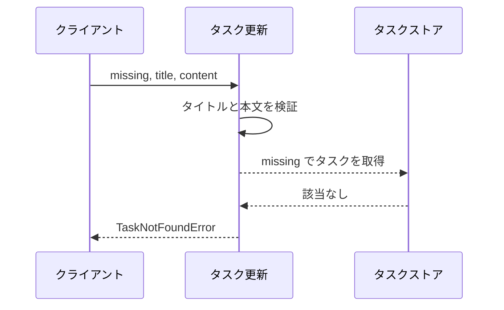

# タスク更新

操作: `update_task`（サービス層の公開関数）

登録済みタスクのタイトルと本文を差し替えて、更新後のタスクを返す。

- 対応テストファイル: `tests/integration/tasks/test_タスク更新.py`

## インターフェース

### リクエスト

| パラメータ | 型 | 必須 | デフォルト | 説明 | 制限 | 補足 |
| --- | --- | --- | --- | --- | --- | --- |
| `task_id` | `str` | ✅ | - | 更新対象のタスク ID | - | - |
| `title` | `str` | ✅ | - | 更新後のタイトル | 1 文字以上 100 文字以内 | - |
| `content` | `str` | - | `""` | 更新後の本文 | 1000 文字以内 | 省略すると本文を空にする |

リクエスト例:

```json
{
  "task_id": "t1",
  "title": "新タイトル",
  "content": "新本文"
}
```

### レスポンス

| フィールド | 型 | 説明 | 制限 | 補足 |
| --- | --- | --- | --- | --- |
| `id` | `str` | 更新したタスクの ID | - | リクエストの `task_id` と一致する |
| `title` | `str` | 更新後のタイトル | - | - |
| `content` | `str` | 更新後の本文 | - | - |

レスポンス例:

```json
{
  "id": "t1",
  "title": "新タイトル",
  "content": "新本文"
}
```

補足:

- 同じリクエストを 2 回送っても結果は変わらない（差し替えのみで加算的な更新をしない）。

### エラー

| エラー | 発生条件 | 補足 |
| --- | --- | --- |
| なし（正常終了） | 更新成功 | 戻り値は レスポンス表のとおり |
| `ValidationError` | タイトルが空 | フィールド別エラーに `title` が入る |
| `ValidationError` | タイトルが 100 文字を超える | フィールド別エラーに `title` が入る |
| `ValidationError` | 本文が 1000 文字を超える | フィールド別エラーに `content` が入る |
| `TaskNotFoundError` | `task_id` のタスクがストアに存在しない | - |

## 制約

| 項目 | 制約 | 補足 |
| --- | --- | --- |
| 応答時間 | 1 秒以内 | 非機能要件 |
| 認可 | 制限なし | 認証・認可の機構を持たない |
| 同時更新 | 制限なし | 楽観ロック・排他制御を行わない |
| 一括更新 | 1 呼び出しにつき 1 タスク | 複数タスクをまとめて更新する経路は設けない |

## フロー一覧

| 分類 | フロー名 | 概要 | 補足 |
| --- | --- | --- | --- |
| 正常 | 正常系 | タイトルと本文を差し替えて更新後のタスクを返す | - |
| 正常 | 正常系（本文の省略） | 本文を省略すると空文字で上書きする | - |
| 異常 | 異常系（タイトルが空・ValidationError） | 検証で弾いてストアを更新しない | - |
| 異常 | 異常系（タイトル超過・ValidationError） | 検証で弾いてストアを更新しない | - |
| 異常 | 異常系（本文超過・ValidationError） | 検証で弾いてストアを更新しない | - |
| 異常 | 異常系（対象タスクなし・TaskNotFoundError） | 検証は通るが対象が無く更新しない | - |

## 正常系

### セットアップ

| セットアップ | 説明 | 補足 |
| --- | --- | --- |
| Mock | なし（タスクストアはテスト用の辞書を実物として渡す） | プロセス外の依存を持たない |
| タスク | `t1` のタスクを 1 件登録済み | タイトル `旧タイトル` / 本文 `旧本文` |

### フロー



### 期待値

- 更新後のタイトルと本文を持つタスクが返る
- タスクストアの `t1` が更新後の内容に差し替わっている

## 正常系（本文の省略）

### セットアップ

| セットアップ | 説明 | 補足 |
| --- | --- | --- |
| Mock | なし（タスクストアはテスト用の辞書を実物として渡す） | - |
| タスク | `t1` のタスクを 1 件登録済み | 本文に `旧本文` が入っている |
| 入力 | 本文を渡さずに送信 | デフォルト値の適用を決定的に誘発 |

### フロー



### 期待値

- 返るタスクの本文が空文字になっている
- タスクストアの `t1` の本文も空文字に差し替わっている

## 異常系（タイトルが空・ValidationError）

### セットアップ

| セットアップ | 説明 | 補足 |
| --- | --- | --- |
| Mock | なし（タスクストアはテスト用の辞書を実物として渡す） | - |
| タスク | `t1` のタスクを 1 件登録済み | - |
| 入力 | タイトルを空文字にして送信 | 検証失敗を決定的に誘発 |

### フロー



### 期待値

- `ValidationError` が送出され、フィールド別エラーに `title` の行がある
- タスクストアの `t1` は更新前の内容のまま変わっていない

## 異常系（タイトル超過・ValidationError）

### セットアップ

| セットアップ | 説明 | 補足 |
| --- | --- | --- |
| Mock | なし（タスクストアはテスト用の辞書を実物として渡す） | - |
| タスク | `t1` のタスクを 1 件登録済み | - |
| 入力 | 101 文字のタイトルで送信 | 上限超過を決定的に誘発 |

### フロー



### 期待値

- `ValidationError` が送出され、フィールド別エラーに `title` の行がある
- タスクストアの `t1` は更新前の内容のまま変わっていない

## 異常系（本文超過・ValidationError）

### セットアップ

| セットアップ | 説明 | 補足 |
| --- | --- | --- |
| Mock | なし（タスクストアはテスト用の辞書を実物として渡す） | - |
| タスク | `t1` のタスクを 1 件登録済み | - |
| 入力 | 1001 文字の本文で送信 | 上限超過を決定的に誘発 |

### フロー



### 期待値

- `ValidationError` が送出され、フィールド別エラーに `content` の行がある
- タスクストアの `t1` は更新前の内容のまま変わっていない

## 異常系（対象タスクなし・TaskNotFoundError）

### セットアップ

| セットアップ | 説明 | 補足 |
| --- | --- | --- |
| Mock | なし（タスクストアはテスト用の辞書を実物として渡す） | - |
| タスク | `t1` のタスクを 1 件登録済み | - |
| 入力 | 未登録の `missing` を対象 ID にして送信 | 取得失敗を決定的に誘発 |

### フロー



### 期待値

- `TaskNotFoundError` が送出される
- タスクストアに `missing` が追加されておらず、`t1` も変わっていない
