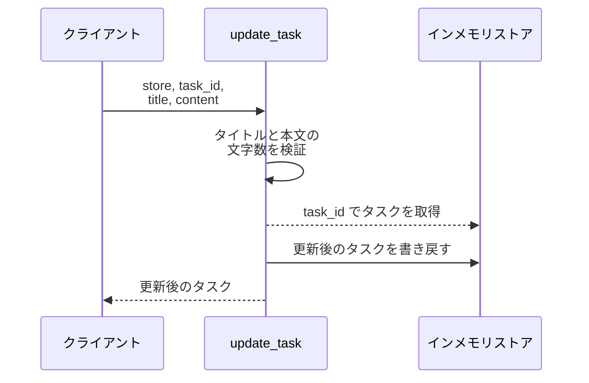
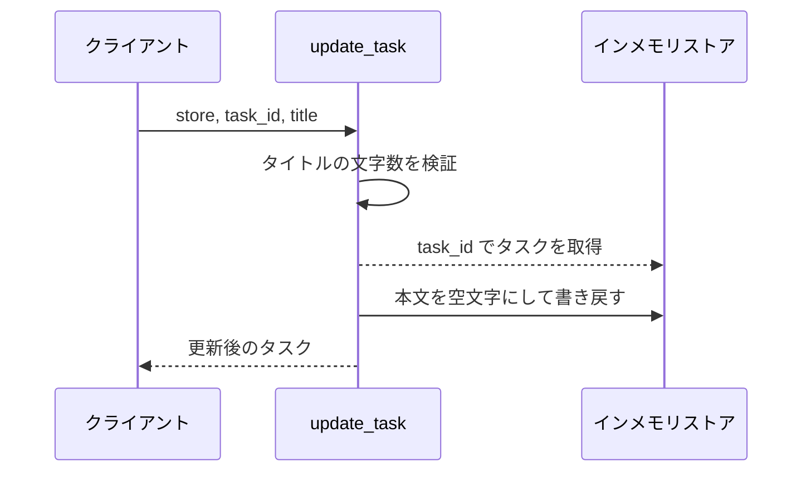
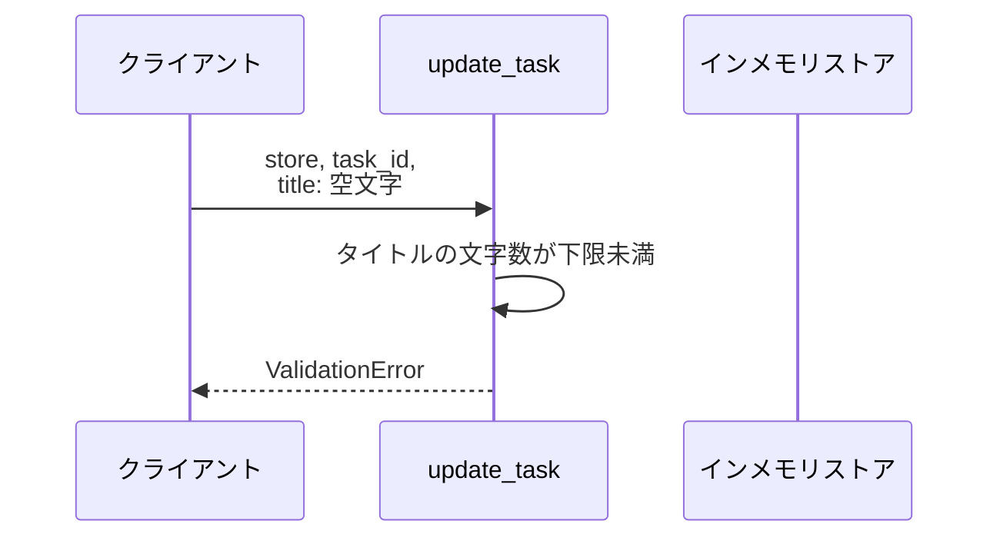
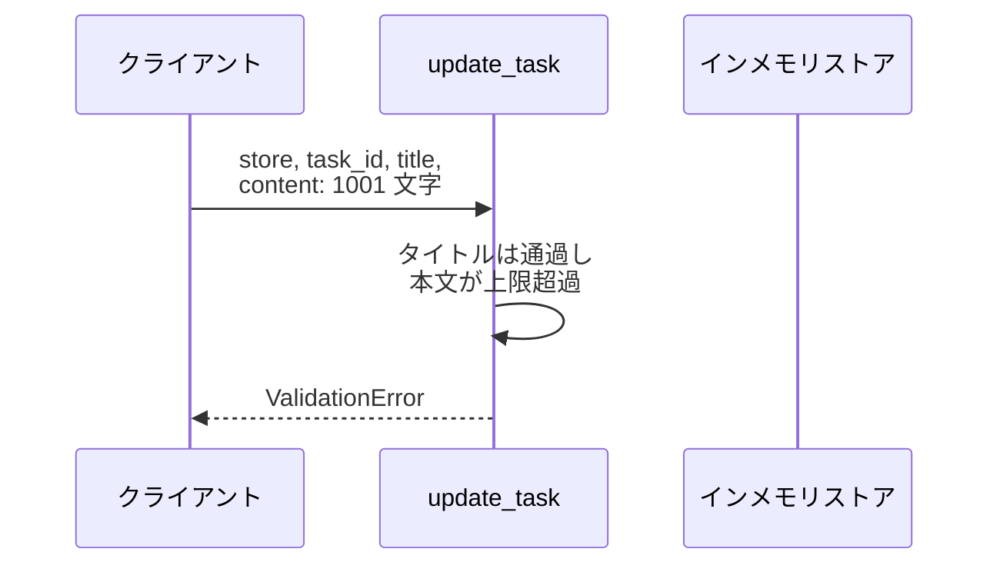
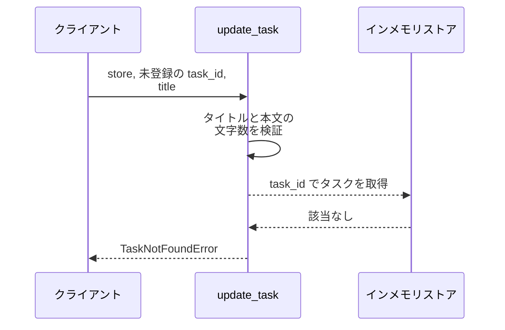

# タスク更新

操作: `update_task`（サービス層の公開関数）

登録済みタスクのタイトルと本文を検証したうえで書き換え、更新後のタスクを返す。

- 対応テストファイル: `tests/integration/バックエンド/test_タスク更新.py`

## インターフェース

### リクエスト

| パラメータ | 型 | 必須 | デフォルト | 説明 | 制限 | 補足 |
| --- | --- | --- | --- | --- | --- | --- |
| `store` | `dict[str, Task]` | ✅ | - | 更新対象のタスクストア | - | 呼び出し元が保持する辞書 |
| `task_id` | `str` | ✅ | - | 更新対象のタスク ID | - | `tasks` の主キー |
| `title` | `str` | ✅ | - | 更新後のタイトル | 1〜100 文字 | - |
| `content` | `str` | - | `""` | 更新後の本文 | 1000 文字以内 | 省略時は空文字で上書き |

リクエスト例:

```json
{
  "store": { "t1": { "id": "t1", "title": "旧タイトル", "content": "旧本文" } },
  "task_id": "t1",
  "title": "新タイトル",
  "content": "新本文"
}
```

### レスポンス

| フィールド | 型 | 説明 | 制限 | 補足 |
| --- | --- | --- | --- | --- |
| `id` | `str` | タスク ID | - | 入力の `task_id` と同値 |
| `title` | `str` | 更新後のタイトル | - | - |
| `content` | `str` | 更新後の本文 | - | 省略時は空文字 |

レスポンス例:

```json
{
  "id": "t1",
  "title": "新タイトル",
  "content": "新本文"
}
```

**補足:**

- 同じ入力で繰り返し呼んでも結果は変わらない（冪等）
- 戻り値は新しく作り直したタスクで、更新前のインスタンスは書き換えない

### 例外

| 例外 | 発生条件 | 補足 |
| --- | --- | --- |
| なし（正常終了） | 更新成功 | 戻り値はレスポンス表のとおり |
| `ValidationError` | `title` が 0 文字 | ストアは変更しない |
| `ValidationError` | `title` が 100 文字を超える | ストアは変更しない |
| `ValidationError` | `content` が 1000 文字を超える | ストアは変更しない |
| `TaskNotFoundError` | `task_id` が `tasks` に存在しない | ストアは変更しない |

## 制約

| 項目 | 制約 | 補足 |
| --- | --- | --- |
| 応答時間 | 1 秒以内 | 親 PR のシステム要件（非機能要件） |
| タイムアウト | 制限なし | 外部 I/O を持たない |
| 認可 | 制限なし | 利用者の概念を持たない |
| レート制限 | 制限なし | - |
| 同時実行 | 単一スレッドからの呼び出しのみを想定 | 排他制御は行わない |

## フロー一覧

| 分類 | フロー名 | 概要 | 補足 |
| --- | --- | --- | --- |
| 正常 | 正常系 | タイトルと本文を書き換えて返す | - |
| 正常 | 正常系（本文を省略） | 本文を空文字で上書きする | - |
| 異常 | 異常系（タイトルが空・ValidationError） | 文字数下限に触れて更新しない | - |
| 異常 | 異常系（タイトル超過・ValidationError） | 文字数上限に触れて更新しない | - |
| 異常 | 異常系（本文超過・ValidationError） | 本文の上限に触れて更新しない | - |
| 異常 | 異常系（タスク未登録・TaskNotFoundError） | 対象が無く更新しない | - |

## 正常系

### セットアップ

| セットアップ | 説明 | 補足 |
| --- | --- | --- |
| Mock | なし（インメモリストアをそのまま使う） | 外部依存を持たない |
| タスク | `t1` のタスクを登録済み | タイトル `旧タイトル` / 本文 `旧本文` |

### フロー



### 期待値

- 更新後のタイトルと本文を持つタスクが返る
- ストアの `t1` が更新後の内容に置き換わっている

## 正常系（本文を省略）

### セットアップ

| セットアップ | 説明 | 補足 |
| --- | --- | --- |
| Mock | なし（インメモリストアをそのまま使う） | 外部依存を持たない |
| タスク | `t1` のタスクを登録済み | 本文 `旧本文` が入っている |
| 入力 | `content` を渡さずに呼び出す | 既定値の適用を決定的に誘発 |

### フロー



### 期待値

- 返ったタスクの本文が空文字になっている
- ストアの `t1` の本文も空文字に置き換わっている

## 異常系（タイトルが空・ValidationError）

### セットアップ

| セットアップ | 説明 | 補足 |
| --- | --- | --- |
| Mock | なし（インメモリストアをそのまま使う） | 外部依存を持たない |
| タスク | `t1` のタスクを登録済み | - |
| 入力 | `title` に空文字を渡す | 検証失敗を決定的に誘発 |

### フロー



### 期待値

- `ValidationError` が送出される
- ストアの `t1` が更新前の内容のまま変わっていない

## 異常系（タイトル超過・ValidationError）

### セットアップ

| セットアップ | 説明 | 補足 |
| --- | --- | --- |
| Mock | なし（インメモリストアをそのまま使う） | 外部依存を持たない |
| タスク | `t1` のタスクを登録済み | - |
| 入力 | `title` に 101 文字を渡す | 検証失敗を決定的に誘発 |

### フロー


### 期待値

- `ValidationError` が送出される
- ストアの `t1` が更新前の内容のまま変わっていない

## 異常系（本文超過・ValidationError）

### セットアップ

| セットアップ | 説明 | 補足 |
| --- | --- | --- |
| Mock | なし（インメモリストアをそのまま使う） | 外部依存を持たない |
| タスク | `t1` のタスクを登録済み | - |
| 入力 | `content` に 1001 文字を渡す | 検証失敗を決定的に誘発 |

### フロー



### 期待値

- `ValidationError` が送出される
- ストアの `t1` が更新前の内容のまま変わっていない

## 異常系（タスク未登録・TaskNotFoundError）

### セットアップ

| セットアップ | 説明 | 補足 |
| --- | --- | --- |
| Mock | なし（インメモリストアをそのまま使う） | 外部依存を持たない |
| タスク | `t1` のタスクを登録済み | - |
| 入力 | 未登録の `task_id` を渡す | 取得失敗を決定的に誘発 |

### フロー



### 期待値

- `TaskNotFoundError` が送出される
- ストアの `t1` が更新前の内容のまま変わっていない
