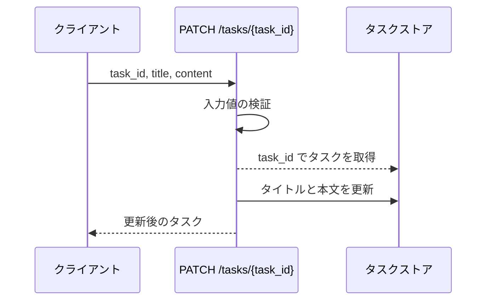
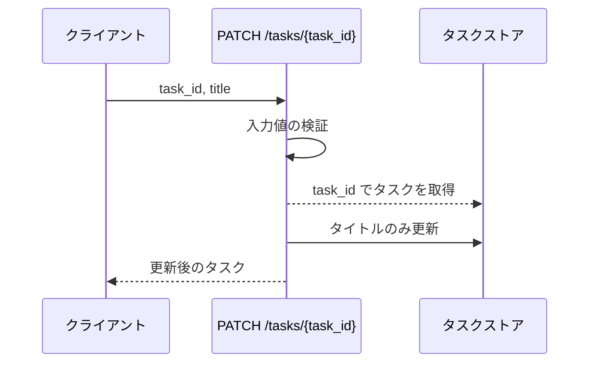
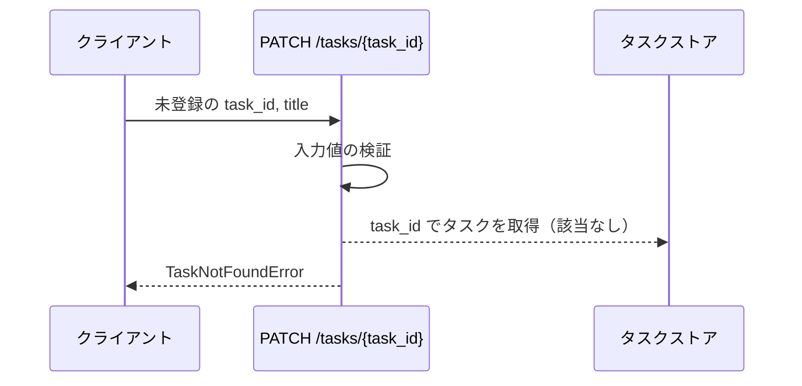
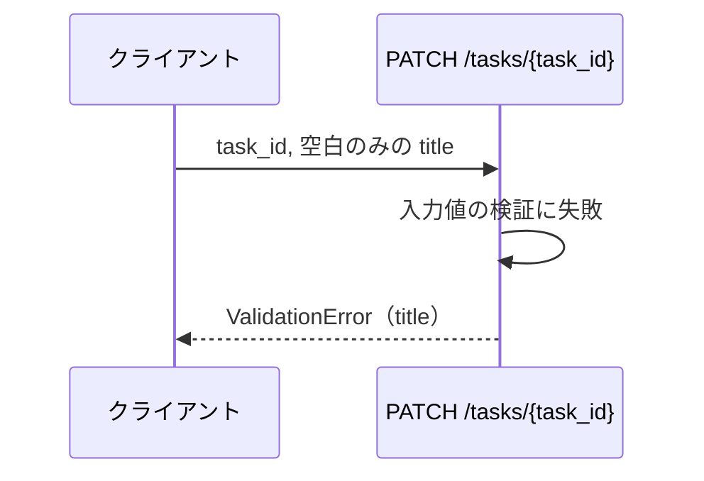
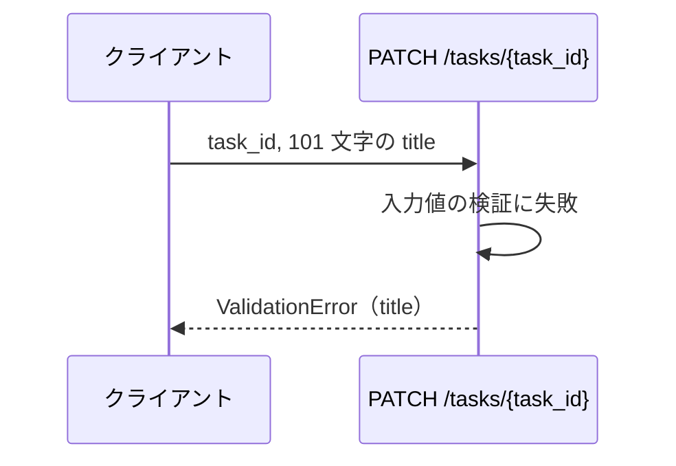
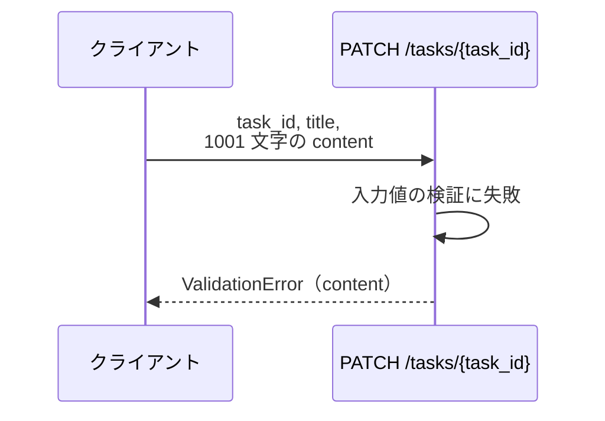

# タスク更新

エンドポイント: PATCH /tasks/{task_id}

登録済みタスクのタイトルと本文を更新して、更新後のタスクを返す。
sandbox には HTTP フレームワークを載せないため、境界の実体はタスクサービスの公開関数で、エンドポイント表記は論理的な対応付け。
検証はストアへ書き込む前に実行し、失敗したフィールドの一覧をまとめて返す。

- 対応テストファイル: 未記入（テストレビュー時に記入）

## インターフェース

### リクエスト

| パラメータ | 型 | 必須 | デフォルト | 説明 | 制限 | 補足 |
| --- | --- | --- | --- | --- | --- | --- |
| `task_id` | str | ✅ | - | 更新対象のタスク ID | - | パスパラメータ |
| `title` | str | ✅ | - | タスク名 | 前後の空白を除いて 1 文字以上 100 文字以内 | - |
| `content` | str | - | なし（更新前の本文を維持） | 本文 | 1000 文字以内 | - |

リクエスト例:

```json
{
  "title": "決算資料の作成",
  "content": "四半期の売上を集計する"
}
```

### レスポンス

| フィールド | 型 | 説明 | 制限 | 補足 |
| --- | --- | --- | --- | --- |
| `id` | str | タスク ID | - | 更新前後で不変 |
| `title` | str | 更新後のタスク名 | - | 前後の空白を除いた値 |
| `content` | str | 更新後の本文 | - | 省略時は更新前の値 |

レスポンス例:

```json
{
  "id": "t1",
  "title": "決算資料の作成",
  "content": "四半期の売上を集計する"
}
```

## 制約

| 項目 | 制約 | 補足 |
| --- | --- | --- |
| タイムアウト | 制限なし | インメモリのストアのみを触るため下流に待ちが無い |
| 応答時間 | 1 秒以内 | 非機能要件。計測は単一 UC シナリオテストで行う |
| 認可 | なし（誰でも更新できる） | SA に認証・認可の要件が無いため |
| 更新できる項目 | `title` / `content` のみ | `id` は変更不可 |
| 同時更新 | 制御しない（後勝ち） | 楽観ロック用の版番号は持たない |
| 検証の実行順 | 全フィールドを検証してから書き込む | 失敗時にストアを変更しないため |

## フロー一覧

| 分類 | フロー名 | 概要 | 補足 |
| --- | --- | --- | --- |
| 正常 | 正常系 | タイトルと本文を更新して更新後のタスクを返す | - |
| 正常 | 正常系（本文の省略） | タイトルだけ更新し、本文は更新前の値を維持する | - |
| 異常 | 異常系（タスクが未登録） | 未登録の `task_id` を指定 | - |
| 異常 | 異常系（タイトルが空） | 空文字・空白のみのタイトルを指定 | - |
| 異常 | 異常系（タイトルが上限超過） | 101 文字のタイトルを指定 | - |
| 異常 | 異常系（本文が上限超過） | 1001 文字の本文を指定 | - |

## 正常系

### セットアップ

| セットアップ | 説明 | 補足 |
| --- | --- | --- |
| Mock | なし（インメモリのタスクストアを実物のまま使う） | - |
| タスク | `t1` のタスクを登録済み | タイトル・本文とも更新前の値が入っている |

### フロー



### 期待値

- 更新後のタイトルと本文を持つタスクが返る
- ストアの `t1` が更新後の値になっている

## 正常系（本文の省略）

### セットアップ

| セットアップ | 説明 | 補足 |
| --- | --- | --- |
| Mock | なし（インメモリのタスクストアを実物のまま使う） | - |
| タスク | `t1` のタスクを本文付きで登録済み | - |
| 入力 | `content` を指定せずに送信 | 本文の維持を決定的に誘発 |

### フロー



### 期待値

- 返るタスクのタイトルが更新後の値になっている
- 返るタスクの本文が更新前の値のままになっている

## 異常系（タスクが未登録）

### セットアップ

| セットアップ | 説明 | 補足 |
| --- | --- | --- |
| Mock | なし（インメモリのタスクストアを実物のまま使う） | - |
| タスク | `t1` のタスクを登録済み | - |
| 入力 | 未登録の `task_id` を指定 | 取得失敗を決定的に誘発 |

### フロー



### 期待値

- `TaskNotFoundError` が送出される
- ストアの `t1` が更新前の値のままになっている

## 異常系（タイトルが空）

### セットアップ

| セットアップ | 説明 | 補足 |
| --- | --- | --- |
| Mock | なし（インメモリのタスクストアを実物のまま使う） | - |
| タスク | `t1` のタスクを登録済み | - |
| 入力 | `title` に空白のみの文字列を指定 | 検証失敗を決定的に誘発 |

### フロー



### 期待値

- `ValidationError` が送出され、失敗フィールドとして `title` が含まれている
- ストアの `t1` が更新前の値のままになっている

## 異常系（タイトルが上限超過）

### セットアップ

| セットアップ | 説明 | 補足 |
| --- | --- | --- |
| Mock | なし（インメモリのタスクストアを実物のまま使う） | - |
| タスク | `t1` のタスクを登録済み | - |
| 入力 | 101 文字の `title` を指定 | 検証失敗を決定的に誘発 |

### フロー



### 期待値

- `ValidationError` が送出され、失敗フィールドとして `title` が含まれている
- ストアの `t1` が更新前の値のままになっている

## 異常系（本文が上限超過）

### セットアップ

| セットアップ | 説明 | 補足 |
| --- | --- | --- |
| Mock | なし（インメモリのタスクストアを実物のまま使う） | - |
| タスク | `t1` のタスクを登録済み | - |
| 入力 | 1001 文字の `content` を指定 | 検証失敗を決定的に誘発 |

### フロー



### 期待値

- `ValidationError` が送出され、失敗フィールドとして `content` が含まれている
- ストアの `t1` が更新前の値のままになっている
